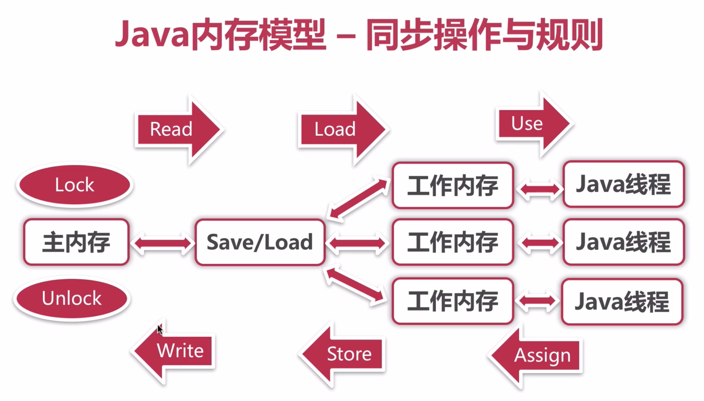
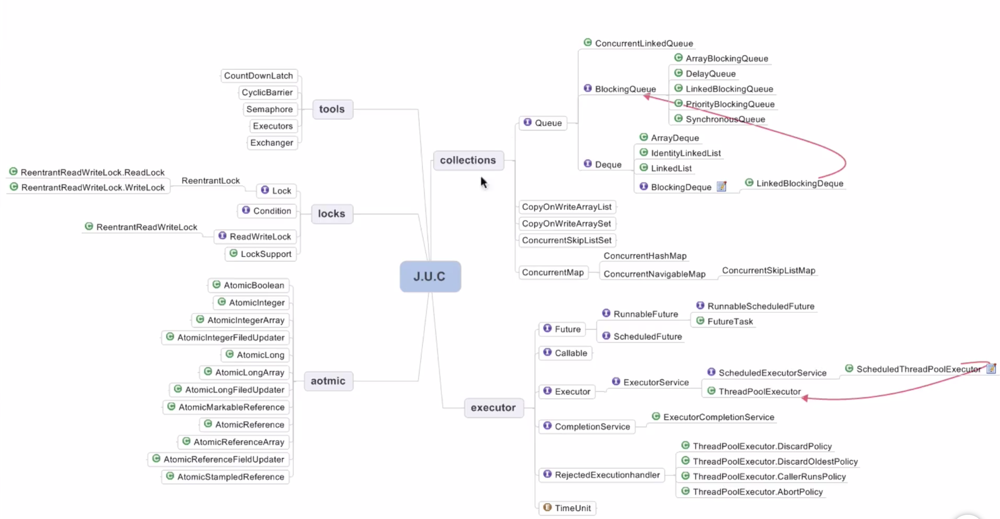
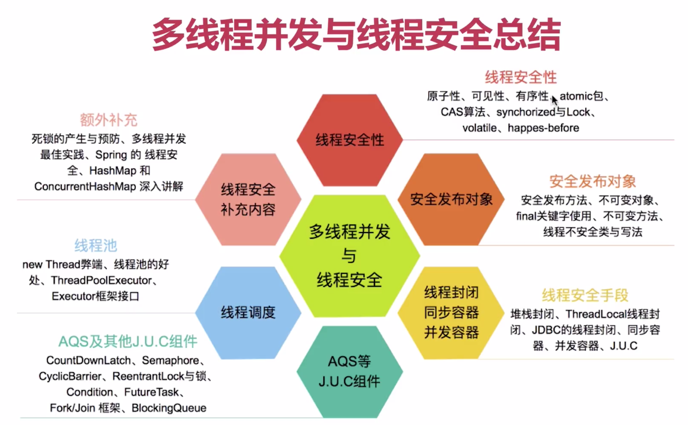
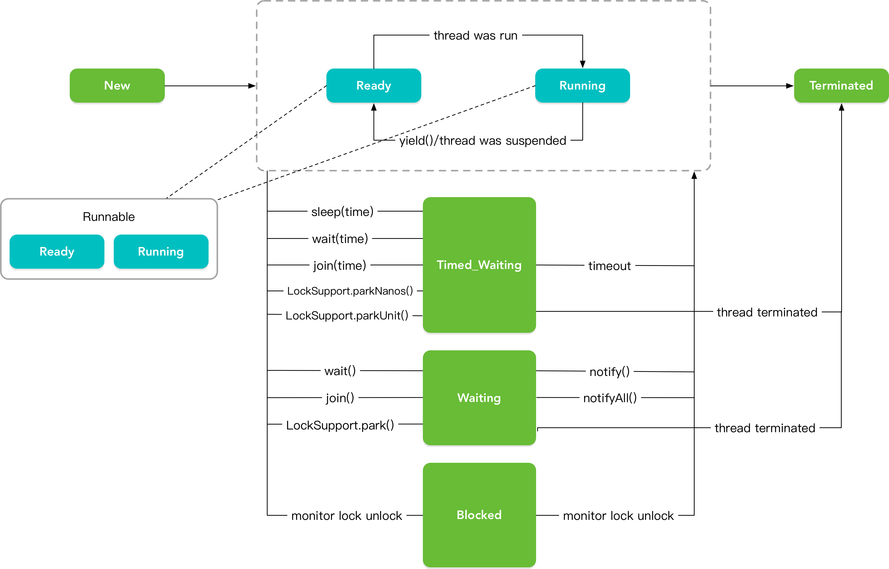

 

# JAVA并发编程

## 1. JAVA内存模型

 [Java并发编程：volatile关键字解析](https://www.cnblogs.com/dolphin0520/p/3920373.html)



- Java内存模型概念
- 缓存一致性协议：最出名的就是Intel 的MESI协议，MESI协议保证了每个缓存中使用的共享变量的副本是一致的。它核心的思想是：当CPU写数据时，如果发现操作的变量是共享变量，即在其他CPU中也存在该变量的副本，会发出信号通知其他CPU将该变量的缓存行置为无效状态，因此当其他CPU需要读取这个变量时，发现自己缓存中缓存该变量的缓存行是无效的，那么它就会从内存重新读取。

## 2. 线程安全性

### 2.1 原子性

- Atomic包
    - **LongAdder** [《Java并发计数器探秘》](https://www.cnkirito.moe/java-concurrent-counter/) 

    - **AtomicIntegerFieldUpdater** ：修改某一个类的对象的某一个字段，要求是非static, volatile 的字段。

    - **AtomicXXX**的CAS如何保证原子性？[《浅谈CAS(Compare and Swap) 原理》](https://www.cnblogs.com/Leo_wl/p/6899716.html)

    - **AtomicStampedReference**：解决ABA问题

- 锁
    - Synchronized：依赖JVM
    - Lock: JDK提供的接口，依赖特殊的CPU指令，比如可重入锁
    
### 2.2 可见性

- Volatile  [Java并发编程：volatile关键字解析](https://www.cnblogs.com/dolphin0520/p/3920373.html)
- 用作状态标识量，双重检测（例如单例模式）
- 内存屏障功能，防止指令重排序

面试题：

- 举例说明指令重排序在多线程下可能导致错误
- **volatile 变量和 atomic 变量有什么不同？**
- **volatile 能使得一个非原子操作变成原子操作吗?**
  - 用 `volatile` 修饰 `long` 和 `double` 变量，使其能按原子类型来读写。`double` 和 `long` 都是64位宽，因此对这两种类型的读是分为两部分的，第一次读取第一个 32 位，然后再读剩下的 32 位，这个过程不是原子的，但 Java 中 `volatile` 型的 `long` 或 `double` 变量的读写是原子的。
- **为什么代码会重排序？**

### 2.3 有序性

- 8条happens-before原则： [【死磕Java并发】-----Java内存模型之happens-before](https://www.cnblogs.com/chenssy/p/6393321.html)
  - 1. 如果一个操作 happens-before 另一个操作，那么第一个操作的执行结果，将对第二个操作可见，而且第一个操作的执行顺序，排在第二个操作之前。
  - 2. 两个操作之间存在 happens-before 关系，并不意味着一定要按照 happens-before 原则制定的顺序来执行。如果重排序之后的执行结果与按照 happens-before 关系来执行的结果一致，那么这种重排序并不非法。

## 3. 安全发布对象

- 发布对象：使一个对象能够被当前范围之外的代码使用。

  - 用枚举类实现单例模式

    ```java
    public class SingletonExample7 {
    
        // 私有构造函数
        private SingletonExample7() {
    
        }
    
        public static SingletonExample7 getInstance() {
            return Singleton.INSTANCE.getInstance();
        }
    
        private enum Singleton {
            INSTANCE;
    
            private SingletonExample7 singleton;
    
            // JVM保证这个方法绝对只调用一次
            Singleton() {
                singleton = new SingletonExample7();
            }
    
            public SingletonExample7 getInstance() {
                return singleton;
            }
        }
    }
    ```

    - 原理[为什么我墙裂建议大家使用枚举来实现单例。](https://blog.csdn.net/moakun/article/details/80688851)
    - 是一种懒汉模式
    - 对于枚举类实现的单例来说，我有可能只调用枚举类的外部类的其他方法，而不去获取实例，这样内部枚举类不会被初始化。对于饿汉模式来说，不管你或不获取实例，实例都会在初始化阶段被创建。
    - 防止序列化对单例的破坏，双重检测的懒汉单例，可能会被序列化破坏单例。

- 对象逸出：一种错误发布，当一个对象还没有构造完成，就被别的线程看见。

## 4. 线程安全策略

### 4.1 不可变对象

- final 关键字，类，方法，变量
- Collections.unmodiiableXXX: Collection, List, Set, Map
- Guava: ImmutableXXX: Collection, List, Set, Map

### 4.2 线程封闭

- TheadLocal [Java并发编程：深入剖析ThreadLocal](https://www.cnblogs.com/dolphin0520/p/3920407.html)

> - ThreadLocalMap键值为当前ThreadLocal变量，value为变量副本
> - 实际的通过ThreadLocal创建的副本是存储在每个线程自己的threadLocals中的；
> - 为何threadLocals的类型ThreadLocalMap的键值为ThreadLocal对象，因为每个线程中可有多个threadLocal变量。
> - 在进行get之前，必须先set，否则会报空指针异常；

- **什么是 InheritableThreadLocal ？**
  - InheritableThreadLocal 类，是 ThreadLocal 类的子类。ThreadLocal 中每个线程拥有它自己的值，与 ThreadLocal 不同的是，**InheritableThreadLocal 允许一个线程以及该线程创建的所有子线程都可以访问它保存的值**。
  - 实现：在new MyThread()的时候，jdk是自己判断当前线程有没有InheritableThreadLocals，有就会赋值给创建的子线程。

### 4.3 线程安全/不安全类

- StringBuilder -> StringBuffer
- SimpleDateFormat -> JodaTime
- ArrayList, HashSet, HashMap等Collections

### 4.4 同步容器

- HashMap -> HashTable
- ArrayList -> Vector, Stack
- Collections.synchronizedXXX()

### 4.5 并发容器 J.U.C

- ArrayList -> CopyOnWriteArrayList

  add()操作如下：

  ```java
  public boolean add(E e) {
      final ReentrantLock lock = this.lock;
      lock.lock();
      try {
          Object[] elements = getArray();
          int len = elements.length;
          Object[] newElements = Arrays.copyOf(elements, len + 1);
          newElements[len] = e;
          setArray(newElements);
          return true;
      } finally {
          lock.unlock();
      }
  }
  ```

- HashSet, TreeSet -> CopyOnWriteArraySet, ConcurrentSkipListSet
- HashMap, TreeMap -> ConcurrentHashMap, ConcurrentSkipListMap

J.U.C整体如下图



## 5. AQS

> [【死磕Java并发】—–J.U.C之AQS：AQS简介](http://cmsblogs.com/?p=2174)
>
> [【死磕 Java 并发】—– J.U.C 之 AQS：CLH 同步队列](http://www.iocoder.cn/JUC/sike/aqs-1-clh?vip)
>
> [【死磕 Java 并发】—– J.U.C 之 AQS：同步状态的获取与释放](http://www.iocoder.cn/JUC/sike/aqs-2?vip)
>
>  [【死磕 Java 并发】—– J.U.C 之 AQS：阻塞和唤醒线程](http://www.iocoder.cn/JUC/sike/aqs-3/)

### 5.1 CountDownLatch

继承了AQS, CountDown()时，使用CAS对计数器减一，await()时，循环等待计数器为0，但是使用了LockSupport.park(this)来阻塞线程，并非一直执行for循环。

 [CountDownLatch实现原理](<https://blog.csdn.net/u014653197/article/details/78217571>)

 [LockSupport的park和unpark](https://www.cnblogs.com/moonandstar08/p/5132012.html)

### 5.2 Semaphore

 [【JUC】JDK1.8源码分析之Semaphore（六）](https://www.cnblogs.com/leesf456/p/5414778.html)

### 5.3 CyclicBarrier

 [[死磕Java并发]-----J.U.C之并发工具类：CyclicBarrier](<https://blog.csdn.net/chenssy/article/details/70160595>)

### 5.4 ReentrantLock与锁

 [【死磕Java并发】—–J.U.C之重入锁：ReentrantLock](http://cmsblogs.com/?p=2210)

 [【死磕Java并发】—–J.U.C之读写锁：ReentrantReadWriteLock](http://cmsblogs.com/?p=2213)

[JDK8新增锁StampedLock详解](<http://blog.sina.com.cn/s/blog_6f5e71b30102xfsb.html>)

 [【死磕Java并发】—–J.U.C之Condition](http://cmsblogs.com/?p=2222)

## 6. J.U.C组件拓展

### 6.1 FutureTask

```java
    public static void main(String[] args) throws Exception {
        FutureTask<String> futureTask = new FutureTask<String>(new Callable<String>() {
            @Override
            public String call() throws Exception {
                log.info("do something in callable");
                Thread.sleep(5000);
                return "Done";
            }
        });

        new Thread(futureTask).start();
        log.info("do something in main");
        Thread.sleep(1000);
        String result = futureTask.get();
        log.info("result：{}", result);
    }
```

### 6.2 Fork/Join

其场景为：如果一个应用程序能够被分解成多个子任务，而且结合多个子任务的结果就能够得到最终的答案，那么它就适合使用FORK/JOIN模式来实现。[JAVA并行框架学习之ForkJoin](https://www.cnblogs.com/jiyuqi/p/4547082.html)

```java
public class ForkJoinTaskExample extends RecursiveTask<Integer> {

    public static final int threshold = 2;
    private int start;
    private int end;

    public ForkJoinTaskExample(int start, int end) {
        this.start = start;
        this.end = end;
    }

    @Override
    protected Integer compute() {
        int sum = 0;

        //如果任务足够小就计算任务
        boolean canCompute = (end - start) <= threshold;
        if (canCompute) {
            for (int i = start; i <= end; i++) {
                sum += i;
            }
        } else {
            // 如果任务大于阈值，就分裂成两个子任务计算
            int middle = (start + end) / 2;
            ForkJoinTaskExample leftTask = new ForkJoinTaskExample(start, middle);
            ForkJoinTaskExample rightTask = new ForkJoinTaskExample(middle + 1, end);

            // 执行子任务
            leftTask.fork();
            rightTask.fork(); 

            // 等待任务执行结束合并其结果
            int leftResult = leftTask.join();
            int rightResult = rightTask.join();

            // 合并子任务
            sum = leftResult + rightResult;
        }
        return sum;
    }

    public static void main(String[] args) {
        ForkJoinPool forkjoinPool = new ForkJoinPool();

        //生成一个计算任务，计算1+2+3+4
        ForkJoinTaskExample task = new ForkJoinTaskExample(1, 100);

        //执行一个任务
        Future<Integer> result = forkjoinPool.submit(task);

        try {
            log.info("result:{}", result.get());
        } catch (Exception e) {
            log.error("exception", e);
        }
    }
}
```

### 6.3 BlockingQueue

 [BlockingQueue深入解析－BlockingQueue看这一篇就够了](https://www.cnblogs.com/WangHaiMing/p/8798709.html)

#### 6.3.1 DelayQueue

DelayQueue的泛型参数需要实现Delayed接口，Delayed接口继承了Comparable接口，DelayQueue内部使用非线程安全的优先队列（PriorityQueue），并使用Leader/Followers模式，最小化不必要的等待时间。DelayQueue不允许包含null元素。

Leader/Followers模式：

1. 有若干个线程(一般组成线程池)用来处理大量的事件
2. 有一个线程作为领导者，等待事件的发生；其他的线程作为追随者，仅仅是睡眠。
3. 假如有事件需要处理，领导者会从追随者中指定一个新的领导者，自己去处理事件。
4. 唤醒的追随者作为新的领导者等待事件的发生。
5. 处理事件的线程处理完毕以后，就会成为追随者的一员，直到被唤醒成为领导者。
6. 假如需要处理的事件太多，而线程数量不够(能够动态创建线程处理另当别论)，则有的事件可能会得不到处理。

所有线程会有三种身份中的一种：leader和follower，以及一个干活中的状态：proccesser。它的基本原则就是，永远最多只有一个leader。而所有follower都在等待成为leader。线程池启动时会自动产生一个Leader负责等待网络IO事件，当有一个事件产生时，Leader线程首先通知一个Follower线程将其提拔为新的Leader，然后自己就去干活了，去处理这个网络事件，处理完毕后加入Follower线程等待队列，等待下次成为Leader。这种方法可以增强CPU高速缓存相似性，及消除动态内存分配和线程间的数据交换。

#### 6.3.2 ArrayBlockingQueue

#### 6.3.3 LinkedBlockingQueue

## 7. 线程池

 [【死磕Java并发】—–J.U.C之线程池：ThreadPoolExecutor](http://cmsblogs.com/?p=2448)

为什么用线程池？

线程池有几个状态，怎样转换？

ThreadPoolExecutor构造函数有哪些参数，分别起什么作用？

线程池的任务处理策略?

- 小于corePoolSize时，来一个任务就新建一个线程去执行

- 当前线程数大于等于corePoolSize时，先入队列，不行，再增加线程去执行当前任务，直到maximumPoolSize,失败则执行拒绝策略。
- 如果workqueue是无长度限制的，则maximumPoolSize参数无用
- 增加的线程和之前的线程同等重要，没有区别，也就意味着，在队列满了之后，再增加任务，会把整个线程池的处理能力撑大。而且，新来的任务会被立刻执行，这有点不公平的意思，感觉就像你在超市排队付钱，突然有个新的收银台开始工作了，后来的人直接就去结账了。
- 一个线程在keepAliveTime内，没有拿到任务，就会终止退出被销毁，如果那个时候的存活线程数小于corePoolSize，新建一个线程以维持住corePoolSize个线程数量。
- 如果任务添加的速度大于处理任务的速度，则keepAliveTime参数没有用处，因为不会发生获取任务超时。

拒绝策略有几种？分别是？

- 也可自己实现

shoudown()和shotdownNow()区别？

> shutdown只是将线程池的状态设置为SHUTWDOWN状态，内部正在跑的任务和队列里等待的任务，会执行完。而shutdownNow则是将线程池的状态设置为STOP，正在执行的任务则被停止，返回没被执行任务的列表。

Executors提供的三种普通线程池分别是？它们的构造参数是？

线程池的线程什么时候销毁，什么时候增加？

## 8. 多线程并发

### 8.1 死锁

### 8.2 多线程并发最佳实践

- 使用本地变量
- 使用不可变类
- 最小化锁的范围 `S=1/(1-a+a/n)`-阿姆达尔定律
- 使用线程池创建线程，而不是new Thread
- 宁可使用同步，不使用线程的wait(),notify()，使用AQS
- 使用BlockingQueue实现生产消费者模式
- 使用并发集合，而不是加了锁的同步集合
- 使用Semaphore创建有界的访问
- 宁可使用同步代码块，不使用同步方法
- 避免使用静态变量

### 8.3 Spring与线程安全

- Spring Bean: Scope singleton, prototype
- 默认Scope为singleton，它管理的对象为无状态对象时，像service, controller之类的，所以不存在线程安全问题

### 8.4 HashMap与ConcurrentHashMap

[深入浅出ConcurrentHashMap1.8](<https://www.jianshu.com/p/c0642afe03e0>)

[深入分析ConcurrentHashMap1.8的扩容实现](https://www.jianshu.com/p/f6730d5784ad)

- HashMap在多线程下，扩容时会出现死循环
- ConcurrentHashMap
  - 1.8之前和之后的不同？
  - ForwardingNode的作用
  - 初始化时机
  - put操作，cas sync
  - 链表转红黑树
  - 什么时候扩容，扩容过程

## 9. 多线程并发总结



## 10. 面试题补充

-  **你了解守护线程吗？它和非守护线程有什么区别？**

  Java 中的线程分为两种：守护线程（Daemon）和用户线程（User）。

  - 任何线程都可以设置为守护线程和用户线程，通过方法`Thread#setDaemon(boolean on)` 设置。`true` 则把该线程设置为守护线程，反之则为用户线程。
  - `Thread#setDaemon(boolean on)` 方法，必须在`Thread#start()` 方法之前调用，否则运行时会抛出异常。

  唯一的区别是：

  > 程序运行完毕，JVM 会等待非守护线程完成后关闭，但是 JVM 不会等待守护线程。

  - 判断虚拟机(JVM)何时离开，Daemon 是为其他线程提供服务，如果全部的 User Thread 已经撤离，Daemon 没有可服务的线程，JVM 撤离。
  - 也可以理解为守护线程是 JVM 自动创建的线程（但不一定），用户线程是程序创建的线程。比如，JVM 的垃圾回收线程是一个守护线程，当所有线程已经撤离，不再产生垃圾，守护线程自然就没事可干了，当垃圾回收线程是 Java 虚拟机上仅剩的线程时，Java 虚拟机会自动离开。

  扩展：Thread Dump 打印出来的线程信息，含有 daemon 字样的线程即为守护进程。可能会有：服务守护进程、编译守护进程、Windows 下的监听 Ctrl + break 的守护进程、Finalizer 守护进程、引用处理守护进程、GC 守护进程。

  写java多线程程序时，一般比较喜欢用java自带的多线程框架，比如ExecutorService，但是java的线程池会将守护线程转换为用户线程，所以如果要使用后台线程就不能用java的线程池。

  关于守护线程的各种骚操作，可以看看 [《Java 守护线程概述》](https://blog.csdn.net/u013256816/article/details/50392298) 。​ 

- **线程的生命周期？**

Java语言中线程共有六种状态：

1. New（初始化状态）
2. Runnable（可运行）
3. Blocked（阻塞状态）
4. Waitting（无时限等待）
5. Timed_Waiting（有时限等待）
6. Terminated（终止状态）

> - 能让线程从Runnable进入Blocked状态只有synchronized关键字，调用阻塞API，例如等待读取I/O，虽然在操作系统层面，线程处于阻塞，但JVM认为是处于Runnable，因为它认为等待I/O和等待CPU一样。

整体如下图所示：

​	

- **如何结束一个阻塞的线程？**

  如果一个线程由于等待某些事件的发生而被阻塞，又该怎样停止该线程呢？这种情况经常会发生，比如当一个线程由于需要等候键盘输入而被阻塞，或者调用 `Thread#join()` 方法，或者 `Thread#sleep(...)` 方法，在网络中调用`ServerSocket#accept()` 方法，或者调用了`DatagramSocket#receive()` 方法时，都有可能导致线程阻塞，使线程处于处于不可运行状态时。即使主程序中将该线程的共享变量设置为 `true` ，但该线程此时根本无法检查循环标志，当然也就无法立即中断。

  这里我们给出的建议是，不要使用 `Thread#stop()`方法，而是使用 Thread 提供的`#interrupt()` 方法，因为该方法虽然不会中断一个正在运行的线程，但是它可以使一个被阻塞的线程抛出一个中断异常，从而使线程提前结束阻塞状态，退出堵塞代码，用户可以捕获住这个异常，并做相应的后续操作。线程也可以调用isInterrupted()去检测自己是否被外界中断。调用stop结束线程的话，会直接杀死线程，甚至来不及释放持有的锁。

- **Thread类的 sleep 方法和对象的 wait 方法都可以让线程暂停执行，它们有什么区别？**

  - sleep 方法，是线程类 Thread 的静态方法。调用此方法会让当前线程暂停执行指定的时间，将执行机会（CPU）让给其他线程，但是对象的锁依然保持，因此休眠时间结束后会自动恢复（线程回到就绪状态）
  - wait 方法，是 Object 类的方法。调用对象的 `#wait()` 方法，会导致当前线程放弃对象的锁（线程暂停执行），进入对象的等待池（wait pool），只有调用对象的 `#notify()` 方法（或`#notifyAll()`方法）时，才能唤醒等待池中的线程进入等锁池（lock pool），如果线程重新获得对象的锁就可以进入就绪状态。

- **synchronized 的原理是什么?**

  `synchronized`是 Java 内置的关键字，它提供了一种独占的加锁方式。

  - `synchronized`的获取和释放锁由JVM实现，用户不需要显示的释放锁，非常方便。
  - 然而，synchronized也有一定的局限性。
    - 当线程尝试获取锁的时候，如果获取不到锁会一直阻塞。
    - 如果获取锁的线程进入休眠或者阻塞，除非当前线程异常，否则其他线程尝试获取锁必须一直等待。

  关于原理，直接阅读 [《【死磕 Java 并发】—– 深入分析 synchronized 的实现原理》](http://www.iocoder.cn/JUC/sike/synchronized/?vip)

  - Java 对象头、Monitor
  - 锁优化
    - 自旋锁
      - 适应自旋锁
    - 锁消除
    - 锁粗化
    - 锁的升级
      - 重量级锁
      - 轻量级锁
      - 偏向锁

- **线程数怎么设置**

  对于CPU密集型，一般设置线程数=CPU核数 + 1

  对于I/O密集型，设置为 CPU核数 * (1 + I/O 时间 / CPU时间)