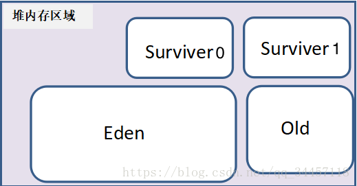

##   1.1 运行时数据区域

Java 内存结构(区别于Java内存模型)

### 1.1.1 程序计数器(PC寄存器)

- 程序计数器是当前线程所执行的字节码的行号指示器。字节解释器在解释执行字节码的时候，通过改变这个计数器的值来读取下一条需要执行的字节码指令，分支，循环，跳转，异常处理，线程恢复等功能都依赖这个计数器。

- 为了线程切换后能恢复到正确的执行位置，每条线程都需要一个独立的程序计数器，互不影响，这类的内存区域为“线程私有”内存。

- 如果线程正在执行的是java方法，则计数器记录的是正在执行的虚拟机字节码指令的地址，如果正在执行的是native方法，这个计数器值为Null。

- 这个内存区域是唯一一个在JVM规范中没有规定任何OOM的区域。

### 1.1.2 Java虚拟机栈

- 线程私有的
- 用来描述Java方法执行的内存模型，每个方法在执行的时候，创建一个栈帧，里面存储局部变量表，操作数栈，动态链接，方法出口等信息。
- 局部变量表存放了编译器可知的各种基本数据类型(boolean, byte,char)，对象引用(reference类型)和returnAddress类型。
- 64位的long和double类型会占用两个局部变量空间，其余数据类型占用一个。
- 局部变量表内存在编译期就能确定，并完成分配。

### 1.1.3 本地方法栈

- 作用和Java虚拟机栈类似，后者为虚拟机执行Java方法服务。
- 本地方法栈为虚拟机调用的Native方法服务。
- HotSpotVM中不区分VM栈和native栈，直接合二为一。

### 1.1.4 Java堆

- 被所有线程共享
- 为对象实例分配空间
- 不是所有的对象都在堆里，例如，经过逃逸分析，对象不会被别的线程使用，则分配栈上内存，这样能减轻GC压力。
- 
  - Eden:该区域是最主要的刚创建的对象的内存分配区域，绝大多数对象都会被创建到这里（除了部分大对象通过内存担保机制创建到Old区域，默认大对象都是能够存活较长时间的），该区域的对象大部分都是短时间都会死亡的，故垃圾回收器针对该部分主要采用标记整理算法了回收该区域。
  - Surviver:该区域也是属于新生代的区域，该区域是将在Eden中未被清理的对象存放到该区域中，该区域分为两块区域，采用的是复制算法，每次只使用一块，Eden与Surviver区域的比例是8:1，是根据大量的业务运行总结出来的规律。
  - Old:该区域是属于老年代，一般能够在Surviver中没有被清除出去的对象才会进入到这块区域，该区域主要是采用标记清除算法。

### 1.1.5 方法区

- 被所有线程共享
- 用于存储已被虚拟机加载的类信息，常量final，静态变量static，及时编译器JIT编译后的代码等数据。
- 1.8 以前，在HotSpotVM中，方法区又叫做永久代(Permanent Generation)，也可以说用永久代来实现的方法区，其他的虚拟机是不存在永久代的概念。
- 1.7中，部分永久代中的数据已经转移到了Java heap或者Native heap，譬如符号引用(Symbols)转移到了native heap；字面量(interned strings)转移到了java heap；类的静态变量(class statics)转移到了java heap。
- 1.8中，移除了永久代，取而代之的是元空间Metaspace，它们最大的区别是，元空间不在VM里，而是使用本地内存，因此，默认情况下，元空间的大小仅受本地内存限制，但可以通过参数来指定元空间的大小。
- 移除的原因：
  1. 字符串存在永久代中，容易出现性能问题和内存溢出。
  2. 类及方法的信息等比较难确定其大小，因此对于永久代的大小指定比较困难。
  3. 永久代会为 GC 带来不必要的复杂度，并且回收效率偏低。
  4. 为了融合HotSpot 和JRockit虚拟机，JRockit没有永久区。

### 1.1.6 运行时常量池

- 是方法区的一部分
- Class 文件中除了有类的版本，字段，方法，接口等描述信息外，还有一项信息是常量池，用于在编译期生成的各种字面量和符号引用，这部分内容将在类加载后进入方法区的运行时常量池中存放。此外，由符号引用翻译出来的直接引用也会被放到运行时常量池中。
- String.intern()方法也会将新的常量放入池中。

### 1.1.7 直接内存

- 不属于JVM
- 例如在NIO中，使用直接内存，实现0拷贝，极大提升性能
- 受限于本机总内存

## 1.2 HotSpot虚拟机对象

### 1.2.1 对象的创建过程

1. 当遇到一个new关键字时，先检查是否能在常量池中定位到一个类的符号引用，并检查这个类是否已经加载，解析和初始化过，如果没有，则执行类加载过程。
2. 分配内存，对象所需内存在类加载的时候就能完全确定。分配的方法有，指针碰撞法，空闲列表，TLAB。TLAB是为每个线程预留的一块内存，先在这块内存上为对象分配内存。
3. 将分配的内存空间初始化为零
4. 对对象头进行设置
5. 执行初始化方法

### 1.2.2 对象的内存布局

对象布局可以分为三部分，对象头，实例数据，对齐填充

1. 对象头，分为两部分，Mark Word和类型指针
   - Mark Word用于存储自身的数据，比如哈希吗，GC分代年龄，锁状态标志，线程持有的锁，偏向线程ID。
   - 类型指针表示该对象是某个类的实例。
   - 如果对象是Java数组，则对象头中还有数组的长度信息。
2. 实例数据部分存储真正的有效信息，也就是定义的各个字段的内容。分配策略会影响到字段的存储顺序，以便节省空间。
3. 对齐填充部分不是必须的，因为HotSpot VM要求对象起始地址必须是8字节的整数倍，也就是说对象大小必须是8字节的整数倍，当实例数据不满足上述条件时，通过对齐填充来补全。

### 1.2.3 对象的访问

对象的访问有两种方式

1. 通过句柄访问

   

   好处是，当对象在内存中被移动时(GC时会经常移动对象),不用改变reference的值。缺点是速度相对较慢。

2. 通过直接指针访问

   

   好处是速度更快，节省了一次指针定位的时间开销。HotSpot采用第二这一种。

## 1.3 OOM

### 1.3.1 栈溢出

如何增加可创建的线程数量？

> (MaxProcessMemory - JVMMemory - ReservedOsMemory) / (ThreadStackSize) = Number of threads

MaxProcessMemory为操作系统能分配给进程的最大内存，这个不能改。

JVMMemory为heap大小，所以应该减少heap大小。

ReservedOsMemory保留的操作系统内存。

ThreadStackSize为每个线程分到的栈容量，应该减小。

 