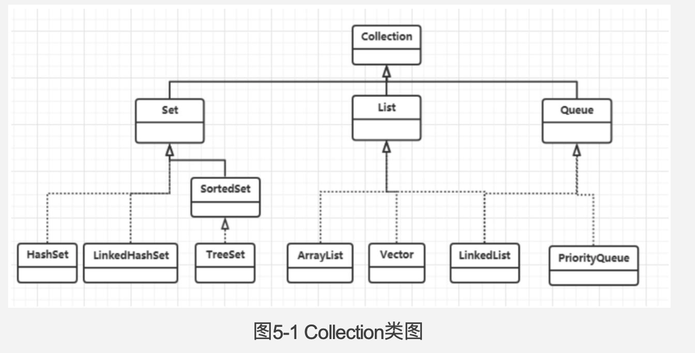

## Collection




### List

### ArrayList

- 父类：AbstractList

- 接口：List, RandomAccess, Cloneable, Serializable

- 每次扩容固定增加50%容量

- ```java
  transient Object[] elementData; // 存储元素，用transient标记，因为elementData会预留一些空间，直接序列化会浪费空间。
  ```

- ```java
  private void writeObject(java.io.ObjectOutputStream s) //实现了writeObject方法来做序列化。因为是private方法，需要使用反射的方式调用。
  ```

- ```java
  protected transient int modCount = 0; //记录结构性变化次数，如add, remove, addAll。同时用来实现fail-fast机制。
  ```

- 初始长度10

### LinkedList

- 父类：AbstractSequentialList

- 接口：Deque, List, Cloneable, Serializable

- ```java
      /**
       * Pointer to first node.
       */
      transient Node<E> first; // 头结点
  
      /**
       * Pointer to last node.
       */
      transient Node<E> last; // 尾结点，实现Deque功能，transient防止被序列化
  ```

- ```java
    // 数据存储对象，包含next和prev Node  
  	private static class Node<E> {
          E item;
          Node<E> next;
          Node<E> prev;
  
          Node(Node<E> prev, E element, Node<E> next) {
              this.item = element;
              this.next = next;
              this.prev = prev;
          }
      }
  ```

- 双向链表


### Vector

和ArrayList区别：

- Vector是线程安全的，ArrayList不是。Vector所有方法都使用了synchronized。
- 每次扩容量为capacityIncrement，如果不指定则增加一倍容量
- elementData不是transient的

### Stack

- 是Vector子类，多提供了push, pop, peek, search方法。
- 使用大量synchronized方法来实现线程安全。性能不佳，Vector和Stack被认为是过时的容器。

### Fail-Fast

- 可以使用Iterator#remove方法来避免CMException
- java.util.concurrent包下的容器都是fail-safe的

### CopyOnWriteArrayList

- CopyOnWriteArrayList的整个add操作都是在锁的保护下进行的。

## Map


### HashMap

**jdk8之前**

- 成员变量包括

```java
transient Entry<K, V>[] table;

transient int size; // 当前Entry的数量

final float loadFactor;

int threshold; //扩容阈值为table长度*loadFactor
```

Entry\<K, V>:

```java
final K key;

V value;

Entry<K,V> next; // 下一个节点引用

int hash;
```

- 常量

  初始化容量为16；最大容量为2^30；loadFactor默认0.75

  **为什么是0.75?**

  0.75乘以任何2^n都是整数  

- 根据hashCode计算槽位

  ```java
  static int indexFor(int h, int length) {
     // length 为table.length
  		return h & (length - 1);
  }
  ```

  迅速算出hashCode低位。这也是为什么length为2的幂次方的原因。

- 松散哈希

  ```java
  final int hash(Object k) {
      int h = hashSeed;
      if (0 != h && k instanceof String) {
          return sun.misc.Hashing.stringHash32((String) k);
      }
  
      h ^= k.hashCode();
      h ^= (h >>> 20) ^ (h >>> 12);
      return h ^ (h >>> 7) ^ (h >>> 4);
  }
  ```

  目的是为了减少哈希碰撞。使用useAltHashing启用松散哈希算法。做法是，将高位和低位的数据特征混合起来，使hashCode更离散。

- put时判断key是否存在

  - hash相等
  - 判断待插入key和当前Entry的key是否满足==或equals其中之一（判断==比较快）

- rehash

  - jdk7采用头插法，不保留节点元素顺序，导致了在hashmap在多线程扩容过程中死循环。

- 性能优化

  - put操作比较消耗资源的是遍历链表，扩容数组
  - get操作比较消耗资源的是遍历链表


**jdk8之后**

table数组变为了

```java
transient Node<K, V>[] table;
```

TreeNode<K,V>是Node<K,V>的子类，Java 8中的HashMap使用的是数组+树+链表的结构。


- put操作

  1. hashCode异或hashCode右移16位，来做哈希分散

     ```java
         static final int hash(Object key) {
             int h;
             return (key == null) ? 0 : (h = key.hashCode()) ^ (h >>> 16);
         }
     ```

  2. 调用putVal(hash, key, value, boolean onlyIfAbsent, boolean evict(无用))

     - 链表长度达到8时就会转化为红黑树

- resize，定义了两条链表分别完成对原链的结点分离操作。将hash&oldCap==1的Node移动到新的下标位置上，保留结点的原始顺序，避免了死循环。
- 红黑树与平衡二叉树区别
  - 红黑树放弃了完全平衡，也就是左右子树高度差可以超过1。红黑树保证任何一个节点的左右子树的高度差不会超过较矮的那棵的一倍。
  - 红黑树旋转次数最多为三，平衡二叉树旋转次数不可预知。因此平衡二叉树适合读多写少的场景。

### ConcurrentHashMap

**Jdk7**


**Jdk8**

- **属性**

  ```java
  transient volatile Node<K,V>[] table;
  /**
  * The next table to use; non-null only while resizing.
  */
  private transient volatile Node<K,V>[] nextTable;
  private transient volatile long baseCount; // 相当于HashMap的size
  /**
  * 0：默认值
  * -1：代表哈希表正在进行初始化
  * 大于0：相当于 HashMap 中的 threshold，表示阈值
  * 小于-1：代表有多个线程正在进行扩容
  */
  private transient volatile int sizeCtl;
  ```

- **put**

  1. 如果没有初始化，只允许一个线程对表进行初始化。
  2. 如果Node不是**ForwardingNode**，则对Node加锁，向链表或者红黑树更新/添加Node。
  3. 如果是**ForwardingNode**说明正在扩容，让当前线程去协助扩容
     - 首先，每个线程进来会先领取自己的任务区间，然后开始 --i 来遍历自己的任务区间，对每个桶进行处理。
     - 如果遇到桶的头结点是空的，那么使用 ForwardingNode 标识该桶已经被处理完成了。
     - 如果遇到已经处理完成的桶，直接跳过进行下一个桶的处理。
     - 如果是正常的桶，对桶首节点加锁，正常的迁移即可，迁移结束后依然会将原表的该位置标识为已经处理。

- **size**

  addCount 方法在更新 baseCount 失败的时候，会调用 fullAddCount 将这些失败的结点包装成一个 CounterCell 对象，保存在 CounterCell 数组中。实际的 size 其实是 baseCount 加上 CounterCell 数组中元素的个数。

### TreeMap

根据key排序，完全由红黑树实现，跟hash无关。

- 成员变量

  ```java
      private final Comparator<? super K> comparator;
  
      private transient Entry<K,V> root;
  
      private transient int size = 0;
  ```

- get操作：从root节点开始比较寻找。


### LinkedHashMap

**Java 8之前的LinkedHashMap**

- 成员变量

  ```java
  /**
  	* HashMap.Node subclass for normal LinkedHashMap entries.
    */
  static class Entry<K,V> extends HashMap.Node<K,V> {
    Entry<K,V> before, after;
    Entry(int hash, K key, V value, Node<K,V> next) {
      super(hash, key, value, next);
    }
  }
  
  // 表头
  private transient Entry<K,V> header;
  
  // true为顺序访问，false为逆序
  private final boolean accessOrder;
  ```

  LinkedHashMap在HashMap基础上，包含了一个额外的双向**环形**链表结构，来维护每个数据结点的插入顺序。


- LinkedHashMap重写了keySet()，values()，entrySet()，其返回值都是按照插入的先后顺序排列的。

**Java 8中的LinkedHashMap**

- 成员变量：

  ```java
  transient LinkedHashMap.Entry<K,V> head;
  
  transient LinkedHashMap.Entry<K,V> tail; //现在多了一个tail
  
  // true为顺序访问，false为逆序
  private final boolean accessOrder;
  ```

  


### HashTable

- 线程安全，用synchronized方法实现
- 不支持key为null


### WeakHashMap

Map中的key值如果没有外部强引用，那么在垃圾回收时，WeakHashMap的对应内容也会被移除。


## Set

Set是一个接口，约定其中的数据不能重复。

### HashSet

- 允许有一个null元素
- 内部通过HashMap实现
- 定义一个Object对象作为所有Key的value

### LinkedHashSet

- 内部通过LinkedHashSet实现

### TreeSet

- 底层使用TreeMap来存储数据


### 

