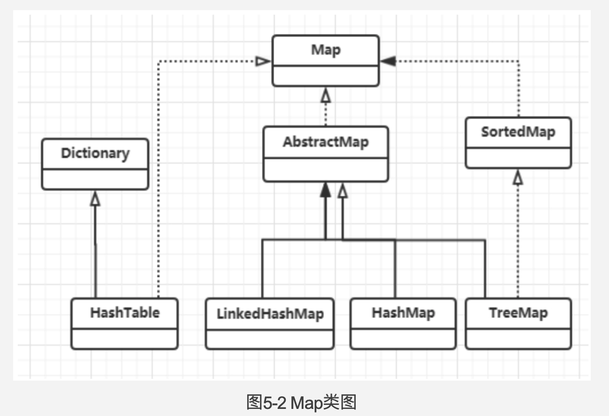
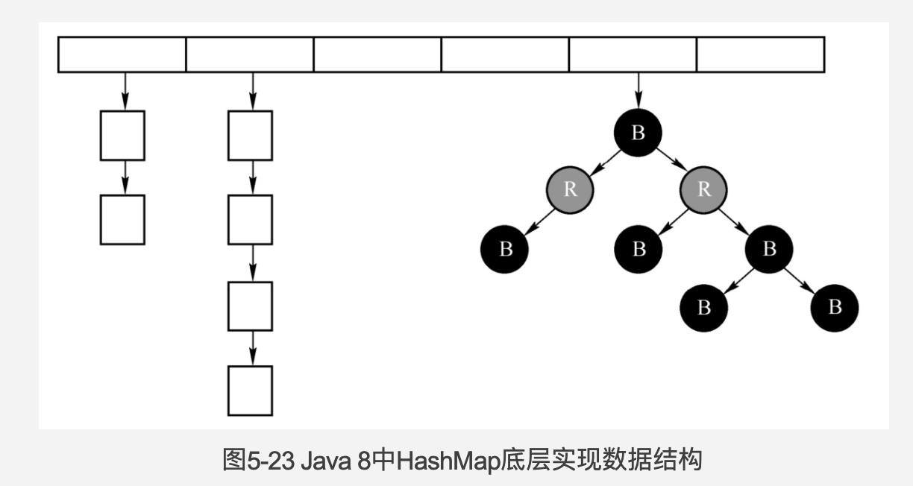
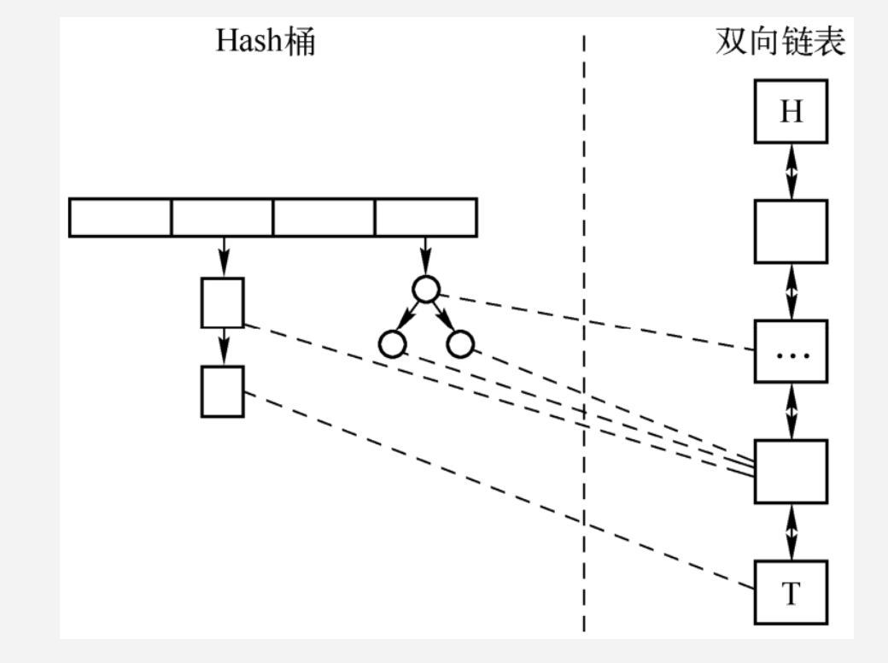

## Collection


### List

### ArrayList

- 父类：AbstractList

- 接口：List, RandomAccess, Cloneable, Serializable

- 每次扩容固定增加50%容量

- ```java
  transient Object[] elementData; // 存储元素，用transient标记，因为elementData会预留一些空间，直接序列化会浪费空间。
  ```

- ```java
  private void writeObject(java.io.ObjectOutputStream s) //实现了writeObject方法来做序列化。因为是private方法，需要使用反射的方式调用。
  ```

- ```java
  protected transient int modCount = 0; //记录结构性变化次数，如add, remove, addAll。同时用来实现fail-fast机制。
  ```

### LinkedList

- 父类：AbstractSequentialList

- 接口：Deque, List, Cloneable, Serializable

- ```java
      /**
       * Pointer to first node.
       */
      transient Node<E> first; // 头结点
  
      /**
       * Pointer to last node.
       */
      transient Node<E> last; // 尾结点，实现Deque功能，transient防止被序列化
  ```

- ```java
    // 数据存储对象，包含next和prev Node  
  	private static class Node<E> {
          E item;
          Node<E> next;
          Node<E> prev;
  
          Node(Node<E> prev, E element, Node<E> next) {
              this.item = element;
              this.next = next;
              this.prev = prev;
          }
      }
  ```


### Vector

和ArrayList区别：

- Vector是线程安全的，ArrayList不是。Vector所有方法都使用了synchronized。
- 每次扩容量为capacityIncrement，如果不指定则增加一倍容量

### Stack

- 是Vector子类，多提供了push, pop, peek, search方法。
- 使用大量synchronized方法来实现线程安全。性能不佳，Vector和Stack被认为是过时的容器。


## Map




### HashMap

**jdk8之前**

- 成员变量包括

```java
transient Entry<K, V>[] table;

transient int size; // 当前Entry的数量

final float loadFactor;

int threshold; //扩容阈值为table长度*loadFactor
```

Entry\<K, V>:

```java
final K key;

V value;

Entry<K,V> next; // 下一个节点引用

int hash;
```

- 常量

  初始化容量为16；最大容量为2^30；loadFactor默认0.75

- 根据hashCode计算槽位

  ```java
  static int indexFor(int h, int length) {
     // length 为table.length
  		return h & (length - 1);
  }
  ```

  迅速算出hashCode低位。这也是为什么length为2的幂次方的原因。

- 松散哈希

  目的是为了减少哈希碰撞。使用useAltHashing启用松散哈希算法。做法是，将高位和低位的数据特征混合起来，使hashCode更离散。

- put时判断key是否存在

  - hash相等
  - 判断待插入key和当前Entry的key是否满足==或equals其中之一（判断==比较快）

- 扩容

  - 重新计算threshold
  - 判断是否需要rehash（useAltHashing可能会变）
  - 调用transfer来重新计算所有结点到新table数组后的下标

- 性能优化

  - put操作比较消耗资源的是遍历链表，扩容数组
  - get操作比较消耗资源的是遍历链表


**jdk8之后**

table数组变为了

```java
transient Node<K, V>[] table;
```

TreeNode<K,V>是Node<K,V>的子类，Java 8中的HashMap使用的是数组+树+链表的结构。




- put操作

  1. 做哈希分散，只取key对象hashCode的高16位

  2. 调用putVal(hash, key, value, booleanonlyIfAbsent, boolean evict(无用))
     - 链表长度达到7时就会转化为红黑树

- resize，将hash&oldCap==1的Node移动到新的下标位置上


### TreeMap

根据key排序，完全由红黑树实现，跟hash无关。

- 成员变量

  ```java
      private final Comparator<? super K> comparator;
  
      private transient Entry<K,V> root;
  
      private transient int size = 0;
  ```

- get操作：从root节点开始比较寻找。


### LinkedHashMap

**Java 8之前的LinkedHashMap**

- 成员变量

  ```java
  /**
  	* HashMap.Node subclass for normal LinkedHashMap entries.
    */
  static class Entry<K,V> extends HashMap.Node<K,V> {
    Entry<K,V> before, after;
    Entry(int hash, K key, V value, Node<K,V> next) {
      super(hash, key, value, next);
    }
  }
  
  // 表头
  private transient Entry<K,V> header;
  
  // true为顺序访问，false为逆序
  private final boolean accessOrder;
  ```

  LinkedHashMap在HashMap基础上，包含了一个额外的双向**环形**链表结构，来维护每个数据结点的插入顺序。


- LinkedHashMap重写了keySet()，values()，entrySet()，其返回值都是按照插入的先后顺序排列的。

**Java 8中的LinkedHashMap**

- 成员变量：

  ```java
  transient LinkedHashMap.Entry<K,V> head;
  
  transient LinkedHashMap.Entry<K,V> tail; //现在多了一个tail
  
  // true为顺序访问，false为逆序
  private final boolean accessOrder;
  ```

  


### HashTable

- 线程安全，用synchronized方法实现
- 不支持key为null


### WeakHashMap

Map中的key值如果没有外部强引用，那么在垃圾回收时，WeakHashMap的对应内容也会被移除。


## Set

Set是一个接口，约定其中的数据不能重复。

### HashSet

- 允许有一个null元素
- 内部通过HashMap实现
- 定义一个Object对象作为所有Key的value

### LinkedHashSet

- 内部通过LinkedHashSet实现

### TreeSet

- 底层使用TreeMap来存储数据