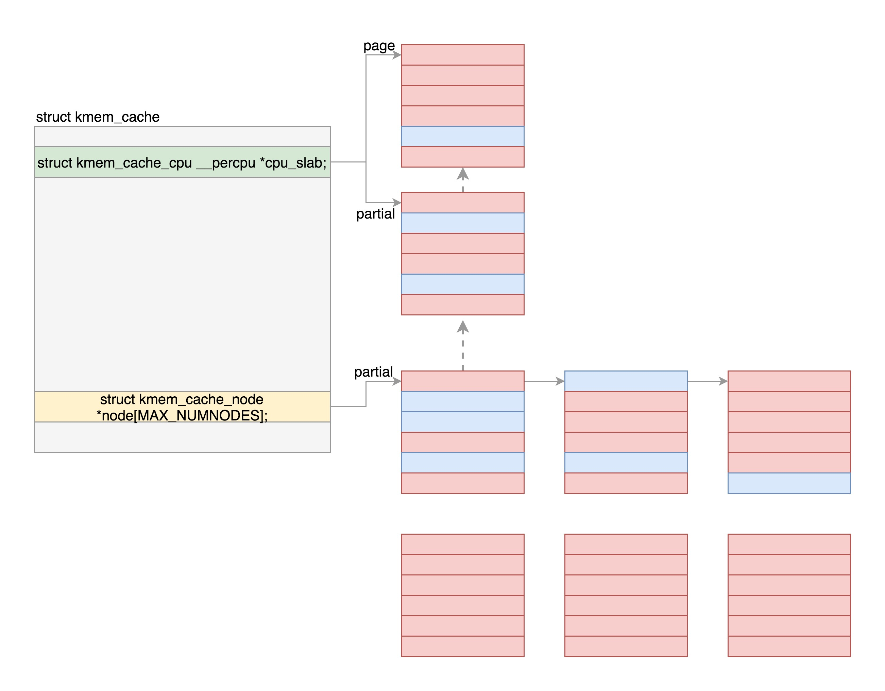
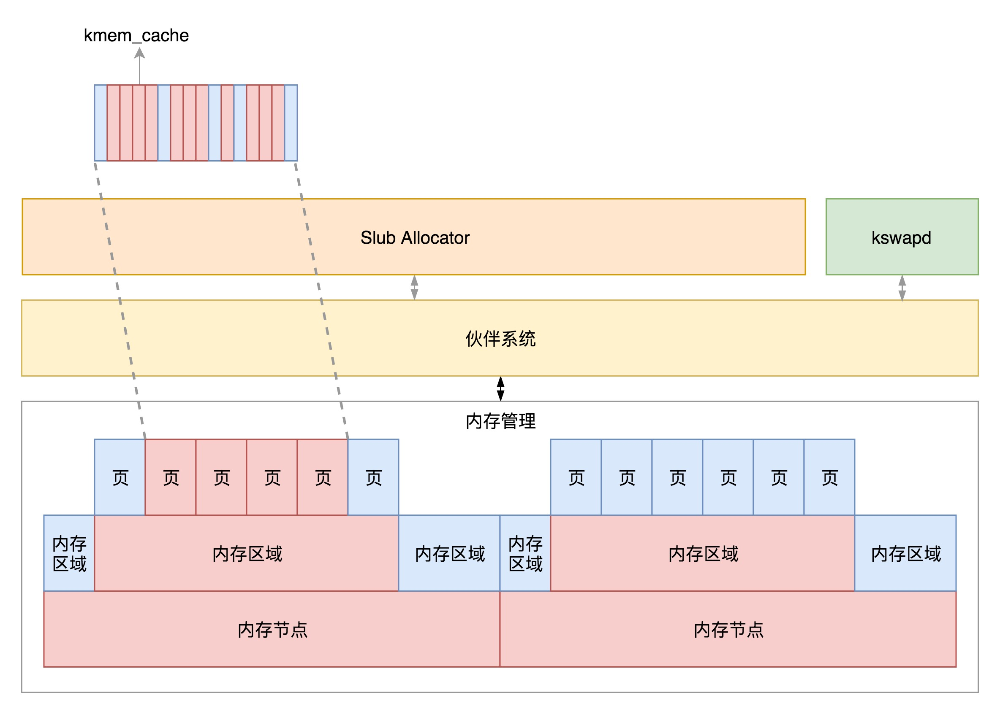
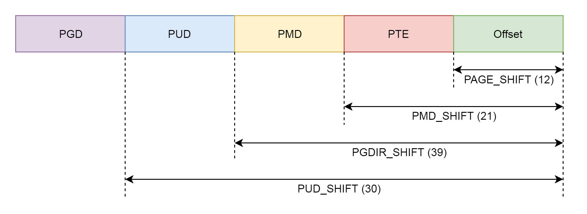

# 2. 内存管理

应用程序在运行的时候需要用到内存来存储数据， 而提供内存的硬件当然就是内存条了。应用程序必须通过操作系统来使用内存，因此内存管理是操作系统需要做的十分重要的事情。

内存管理需要做的事情主要分为以下三类：

1. 物理内存的管理
2. 虚拟内存的管理
3. 虚拟地址和物理地址如何映射

程序在运行时需要保存在内存中的数据如下：

- 用户态
  - 代码
  - 全局变量
  - 字符串常量
  - 函数栈，包含了局部变量，传入参数等
  - 堆，也就是使用malloc分配的内存
  - 涉及对glibc的调用的话，内存中要存放glibc对应的so文件

- 内核态
  - 内核代码
  - 内核全局变量
  - 每个进程对应的task_struct
  - 内核栈
  - 动态分配的内存

## 2.1 虚拟内存布局

操作系统作为应用程序和硬件沟通的桥梁，为应用程序提供的是虚拟内存地址，使用物理内存地址来描述物理内存。

**为什么分配虚拟内存地址给应用程序，而不是直接分配物理地址？**首先，对于上层的应用程序，应该屏蔽硬件的细节，这样应用程序才是可移植的，跨平台的，能够兼容各种内存硬件的。其次，为进程分配地址空间时，应当分配一段连续的内存空间，这样很容易管理。但是物理内存可能存在碎片，使用虚拟地址就可以克服这个问题，因为连续的虚拟内存可以映射到不连续的物理内存。

**虚拟内存空间的划分，可以按段划分，也可以按页划分**。

- 按段划分，虚拟地址由段和偏移量组成。通过计算得到物理内存地址。

  

  在Linux里，所有段的起始地址都是0，因此Linux并没有用到全部的分段功能，只是使用了分段的权限审核功能，例如用户态DPL是3，内核态DPL是0。当用户态进程试图访问内核态地址时，就会报错。

- 按页划分，在32位系统中，虚拟地址的范围从0x00000000到0xffffffff，由页号和页内偏移量组成。虚拟地址最终映射为物理地址。

  

  操作系统将物理内存划分为一个一个的页，通常是4KB一个页。虚拟内存中的一个页对应物理内存中的一个页。物理内存可以在内存不足时，将物理页换到硬盘上，需要用的时候又换回到内存中。下面这个图展示了虚拟内存中的页如何映射到物理内存中的页。

  

使用映射表来保存虚拟内存页和物理内存页的映射关系，表中的项称为页表项。在32位环境下，一共4G内存，一个页4K，就需要1M个页，每个页表项需要4个字节存储。那么一共需要4MB来存储映射表，每个进程需要4MB，100个进程需要400MB内存，这个开销太大了。但是每个进程并不会用到所有内存，因此不需要保留多余的页表项。于是就有了以下的寻址方式，下图是64位操作系统对虚拟地址的划分，


一个虚拟地址被分为了3个目录项，内部的实现就是一颗树，查找的时候，先查全局页目录，找到对应的上层页目录，然后找到中间页目录，最后找到页表，根据偏移量访问内存地址。这样能够极大地减少用于保存页表项的内存。

虚拟内存空间分为两部分，一部分用来存储内核的东西，称为内核空间，一部分用来存储用户的东西，称为用户空间。


如上图所示，前半部分是用户态使用的内存空间。后半部分是内核空间。

- Text Setment存放的是二进制可执行代码。
- Data Segment存放的是静态常量。
- BSS Segment存放的是静态变量。
- 堆是用来动态分配内存的区域，malloc就是在这里面分配的。
- Memory Mapping Segment用来把文件映射进内存的，就是先将虚拟内存映射到一块物理内存上，将文件写入这块物理内存中。
- 栈是在调用函数时用到的。

对于用户态进程来说，它们看到的整个虚拟空间都是它自己独占的，没有其他进程的存在。但是进入内核空间了之后，所有的进程看到的都是同一个内核空间，看到的都是同一个进程列表，虽然内核栈还是各用各的。


## 2.2 虚拟内存管理

每个进程都有自己相应的数据结构，用来管理进程的虚拟内存空间。就是task_struct结构中的mm_struct。

```c
struct mm_struct		*mm;
```

###2.2.1 用户态和内核态划分

在这个mm_struct里，有一个成员变量

```c
unsigned long task_size;		/* size of task vm space */
```

task_size用来确定用户态地址空间和内核态地址空间的分界线。在32位系统中，task_size=0xC0000000，也就是0x00000000-0xC0000000为用户态地址空间，0xC0000000-0xffffffff为内核态地址空间。

对于64位操作系统，虚拟地址只使用了其中48位，其中用户地址以0x0开头，总计128T，内核态地址以0xF开头，总计128T。


### 2.2.2 用户态布局

用户态虚拟空间有以下几类数据，如代码，全局变量，堆，栈，内存映射区等。这些区域的描述信息，保存在mm_struct以下字段中

```c
unsigned long mmap_base;	/* base of mmap area */
unsigned long total_vm;		/* Total pages mapped */
unsigned long locked_vm;	/* Pages that have PG_mlocked set */
unsigned long pinned_vm;	/* Refcount permanently increased */
unsigned long data_vm;		/* VM_WRITE & ~VM_SHARED & ~VM_STACK */
unsigned long exec_vm;		/* VM_EXEC & ~VM_WRITE & ~VM_STACK */
unsigned long stack_vm;		/* VM_STACK */
unsigned long start_code, end_code, start_data, end_data;
unsigned long start_brk, brk, start_stack;
unsigned long arg_start, arg_end, env_start, env_end;
```

- total_vm，总共映射的页数数目，这么大的虚拟内存地址不可能都有物理页与其一一对应。物理内存页在吃紧的时候，会换到硬盘上，但重要的页不能被移出，使用locked_vm来锁定不能移出的页，pinned_vm表示的页不能换出也不能移动。
- data_vm是存放数据页的数目，exec_vm是存放可执行文件的页的数目，stack_vm是栈所占页的数目。
- start_code和end_code是可执行代码的开始和结束位置，start_data和end_data表示已经初始化数据的开始位置和结束位置。
- start_brk是堆的起始位置，brk是堆当前的结束位置，使用malloc申请到内存后，移动brk的位置。
- arg_start和arg_end就是参数列表的其实位置，env_start和env_end是环境变量的位置，它们都位于栈最高的地方。
- mmap_base表示内存映射的起始位置，使用malloc分配一大块内存的时候，就是通过mmap映射一块区域到物理内存。加载so文件，也是映射一块区域到物理内存，再把so文件写入该物理内存。


上面的信息都描述的是位置信息，除了位置信息，mm_struct里面还有一个结构vm_area_struct，来描述这些区域的属性。

```c
struct vm_area_struct *mmap;		/* list of VMAs */
struct rb_root mm_rb;
```

*mmap是一个vm_area_struct链表，用于将这些区域串起来。还使用了红黑树来查找修改这些内存区域，rb_root是红黑树根节点。

vm_area_struct结构如下：

```c
struct vm_area_struct {
	/* The first cache line has the info for VMA tree walking. */
	unsigned long vm_start;		/* Our start address within vm_mm. */
	unsigned long vm_end;		/* The first byte after our end address within vm_mm. */
	/* linked list of VM areas per task, sorted by address */
	struct vm_area_struct *vm_next, *vm_prev;
	struct rb_node vm_rb;
	struct mm_struct *vm_mm;	/* The address space we belong to. */
	struct list_head anon_vma_chain; /* Serialized by mmap_sem &
					  * page_table_lock */
	struct anon_vma *anon_vma;	/* Serialized by page_table_lock */
	/* Function pointers to deal with this struct. */
	const struct vm_operations_struct *vm_ops;
	struct file * vm_file;		/* File we map to (can be NULL). */
	void * vm_private_data;		/* was vm_pte (shared mem) */
} __randomize_layout;
```

- vm_start和vm_end指定了该区域在用户空间的起始和结束位置。vm_next和vm_prev用于连接前一个和后一个区域。vm_rb将这个区域放到红黑树上，vm_ops是对这个内存区域可以做的操作。
- 虚拟内存区域可以映射到物理内存也可以映射到文件，映射到物理内存称为匿名映射，保存在anon_vma里，vm_file表示映射到文件的虚拟内存。

每块区域对应的vm_struct的创建时机，是在load_elf_binary里。也就是当执行exec运行一个二进制程序时，除了要解析ELF格式之外，还要做的另一件重要的事，就是建立内存映射，步骤如下：

```c
static int load_elf_binary(struct linux_binprm *bprm)
{
......
  setup_new_exec(bprm);
......
  retval = setup_arg_pages(bprm, randomize_stack_top(STACK_TOP),
				 executable_stack);
......
  error = elf_map(bprm->file, load_bias + vaddr, elf_ppnt,
				elf_prot, elf_flags, total_size);
......
  retval = set_brk(elf_bss, elf_brk, bss_prot);
......
  elf_entry = load_elf_interp(&loc->interp_elf_ex,
					    interpreter,
					    &interp_map_addr,
					    load_bias, interp_elf_phdata);
......
  current->mm->end_code = end_code;
  current->mm->start_code = start_code;
  current->mm->start_data = start_data;
  current->mm->end_data = end_data;
  current->mm->start_stack = bprm->p;
......
}
```

- 调用setup_new_exec，设置内存映射区mmap_base。
- 调用setup_arg_pages，设置栈的vm_area_struct。
- elf_map会将ELF文件中的代码映射到内存中来。
- set_brk设置堆的vm_area_struct。
- load_elf_interp将依赖的so映射到内存中的内存映射区域。

最终形成以下内存映射图


映射完成后，以下情况会修改内存区域

- 第一种情况是函数调用，涉及函数栈的改变，会改变栈顶指针。
- 第二种情况是通过malloc申请一个堆的空间，底层会执行brk或者mmap来分配。

brk系统调用的入口是sys_brk函数

```c
SYSCALL_DEFINE1(brk, unsigned long, brk)
{
	unsigned long retval;
	unsigned long newbrk, oldbrk;
	struct mm_struct *mm = current->mm;
	struct vm_area_struct *next;
......
	newbrk = PAGE_ALIGN(brk);
	oldbrk = PAGE_ALIGN(mm->brk);
	if (oldbrk == newbrk)
		goto set_brk;


	/* Always allow shrinking brk. */
	if (brk <= mm->brk) {
		if (!do_munmap(mm, newbrk, oldbrk-newbrk, &uf))
			goto set_brk;
		goto out;
	}


	/* Check against existing mmap mappings. */
	next = find_vma(mm, oldbrk);
	if (next && newbrk + PAGE_SIZE > vm_start_gap(next))
		goto out;


	/* Ok, looks good - let it rip. */
	if (do_brk(oldbrk, newbrk-oldbrk, &uf) < 0)
		goto out;


set_brk:
	mm->brk = brk;
......
	return brk;
out:
	retval = mm->brk;
	return retval
```

sys_brk接收的参数是新的堆顶位置，当前mm->brk是原来堆顶的位置。

如果这次增加的内存不多，不需要另外分配页，就直接跳到set_brk，设置mm->brk为新的brk就可以了。

如果新旧堆顶不在一个页里，且新堆顶小于旧堆顶，说明释放了内存，就调用do_munmap将释放的内存映射去掉。

如果要扩大内存，就调动find_vma，回去查看红黑树上原堆顶所在的vm_area_struct的下一个vm_area_struct，看能否分配一个完整的页，如果不能就直接返回，内存空间被占满了。

如果还有空间，就调用do_brk进一步分配空间。在do_brk中，调用find_vma_links找到将来的vm_area_struct在红黑树中的位置，接下来调用vm_merge，看这个新节点能否和现有树中的节点合并。如果地址是连着的，且权限是相同的，能够合并，不用创建新的vm_area_struct了。如果不能合并，则创建新的vm_area_struct，既加到anon_vma_chain链表中，也加到红黑树中。

### 2.2.3 内核态布局

64位的内存布局图如下


- 从0xffff80000000000开始是内核的部分，有8T的空档区域。
- 直接映射区有64T，虚拟地址和物理地址之间的映射大部分还是通过建立页表的方式进行映射。
- vmalloc区域占32T。
- 从__START_KERNEL_map开始的512M用于存放内核代码段，全局变量，BSS等。

64位系统的内存结构如下：


## 2.3 物理内存管理

下图描述了物理内存是怎样组织和管理的，


- 首先整个内存被分为多个节点，每个CPU对应一个节点，节点存储在pglist_data数组里。
- 每个节点里面，又分为多个ZONE(区域)，每个ZONE表示的内存区域有不同的用处。
- 每个区域里，才是物理页，物理页由伙伴系统管理。

我们从上到下讲

###2.3.1 物理内存组织方式

物理内存有两种组织方式

- 平坦内存模型，最经典简单直白的内存模型，所有的物理地址是连续的，每个页也是一样大的，所有的CPU通过总线访问内存，对于CPU来说，访问任意一块儿内存的速度是一样的，如下图

  

  

  这种结构称为对称多处理器。这样的结构最大的问题就是系统总线容易成为瓶颈，因为所有数据都要走它。

- NUMA，Non-uniform memory access，非一致内存访问。这种模式下，每个CPU都有自己的本地内存，当自己的内存不够时，才去别的节点申请内存。

  

  这时候CPU访问内存就不用走总线，因而速度会快很多，但是如果要访问的内存分配在别的节点里，访问延迟就会相对长一点。

### 2.3.2 节点

节点是NUMA模式下的概念，内存被分为多个节点，每个CPU分配一个节点。节点用数据结构pglist_data表示，定义如下：

```c
typedef struct pglist_data {
	struct zone node_zones[MAX_NR_ZONES];
	struct zonelist node_zonelists[MAX_ZONELISTS];
	int nr_zones;
	struct page *node_mem_map;
	unsigned long node_start_pfn;
	unsigned long node_present_pages; /* total number of physical pages */
	unsigned long node_spanned_pages; /* total size of physical page range, including holes */
	int node_id;
......
} pg_data_t;
```

- node_id表示节点id
- node_mem_map，页数组，用于描述这个节点里所有的页。
- node_start_pfn是这个节点的起始页号。
- node_spanned_pages是这个节点包含不连续的物理内存地址的页面数。
- node_present_pages是真正可用的物理页面数量。

### 2.3.3 区域

每个节点又分成一个个的区域zone，放在node_zones里，zone的类型有：

```c
enum zone_type {
#ifdef CONFIG_ZONE_DMA
	ZONE_DMA,
#endif
#ifdef CONFIG_ZONE_DMA32
	ZONE_DMA32,
#endif
	ZONE_NORMAL,
#ifdef CONFIG_HIGHMEM
	ZONE_HIGHMEM,
#endif
	ZONE_MOVABLE,
	__MAX_NR_ZONES
};
```

- ZONE_DMA表示可以用作DMA（Direct Memory Access）的内存，DMA用于与输出设备的IO。
- ZONE_NORMAL是直接映射区，也就是从物理内存到虚拟内存的内核区域，通过加上一个常量直接映射。
- ZONE_HIGHMEM是高端内存，64位系统内存没有这块。
- ZONE_MOVABLE是可移动区域，移动数据页以减少碎片。

zone的定义如下:

```c
struct zone {
......
	struct pglist_data	*zone_pgdat;
	struct per_cpu_pageset __percpu *pageset;


	unsigned long		zone_start_pfn;


	/*
	 * spanned_pages is the total pages spanned by the zone, including
	 * holes, which is calculated as:
	 * 	spanned_pages = zone_end_pfn - zone_start_pfn;
	 *
	 * present_pages is physical pages existing within the zone, which
	 * is calculated as:
	 *	present_pages = spanned_pages - absent_pages(pages in holes);
	 *
	 * managed_pages is present pages managed by the buddy system, which
	 * is calculated as (reserved_pages includes pages allocated by the
	 * bootmem allocator):
	 *	managed_pages = present_pages - reserved_pages;
	 *
	 */
	unsigned long		managed_pages;
	unsigned long		spanned_pages;
	unsigned long		present_pages;


	const char		*name;
......
	/* free areas of different sizes */
	struct free_area	free_area[MAX_ORDER];


	/* zone flags, see below */
	unsigned long		flags;


	/* Primarily protects free_area */
	spinlock_t		lock;
......
} ____cacheline_internodealigned_in_
```

- present_pages是指这个zone中真实存在的所有page数目。
- managed_pages是这个zone被伙伴系统管理的所有的page数目。
- per_cpu_pageset *pageset用来区分冷热页。保存在CPU高速缓存里的页称为热页。

###2.3.4 页

页有两种使用方式

1. 要用就用一整页，用于和虚拟空间建立映射关系的页称为匿名页。用于关联一个文件，再建立与虚拟地址映射关系的，称为内存映射文件。
2. 仅分配一小块内存。例如只需要分配一个task_struct的内存，只需要一小块内存去存储这个对象。Linux采用了一种叫slab allocator的技术，来实现小块内存的分配。它的基本原理，是将一整页分成很多小块，用复杂的队列来维护这些小块的状态。slub allocator是一种不使用队列的分配器。

### 2.3.5 页的分配-伙伴系统

需要进行页级的内存分配时，采用伙伴系统进行分配。伙伴系统组织页的方式如下：


- free_area是一个数组，长度为11，里面每个元素都是一个页块链表。
- 在第0个链表上，每个元素都有1个页。第1个链表上，每个元素由2个连续物理页组成，第n个链表上，每个元素有2的n次方个页。n最大为11，因此最后一个链表上，1024个连续的物理页，对应4M大小的组成一个元素。
- 当向内核请求分配(2^(i-1), 2^i]数目的页块时，按照2^i页块请求处理。例如，需要500个页，就去元素长度为512个页的链表上找
  - 如果有，就返回这512个页。
  - 如果没有，就去1024个页的链表上找，找到之后，将1024个页分为512，512。一个分配给需要的请求方，一个存放到512的链表上。这就是伙伴一词的来历，根据需求将一大块内存分成若干小份的内存。

### 2.3.6 小内存分配

对于整页的分配，Linux使用伙伴系统分配。分配小内存时，使用slub allocator。例如要分配一个task_struct，一个mm_struct这样的小内存。

slub allocator从伙伴系统中申请若干个页，组成一大块内存，这块内存叫做kmem_cache，内部又分为若干个小对象，像下图这样:


红色对象是已经使用了的对象，蓝色是未使用。在从kmem_cache中取内存时，有两种路径，一个叫做快速通道，一个叫做普通通道。每次先去快速通道里取，取不到再去普通通道取。下图的kmem_cache_cpu对应的就是快速通道，kmem_cache_node就是普通通道。



要是在普通通道里仍旧没能分配到内存，说明原来分配的页里面都放满了，就会再去向伙伴系统申请内存页。

### 2.3.7 页面换出

以下两种情况会导致页面换出：

1. 申请内存的时候，发现内存满了，就会试图回收以下，将某些页换到硬盘上。
2. 内核线程kswapd会一直循环地监视内存使用情况，如果内存紧张了，就回去检查一下内存，看是否需要换出一些页。

换页的规则是使用LRU列表，将所有页面放在LRU列表里，根据活跃程度来决定换出谁。

内存页分两类，一是匿名页，二是内存映射。每一类都有两个列表：active和inactive，代表着活跃页和非活跃页，如果要换出内存就从不活跃列表里找出最不活跃的。

将匿名页换出时，要为其分配swap，将内存页写入文件系统。对于内存映射关联了文件的，要将在内存中对于文件的修改写回到文件中。

**总结**

整个物理内存管理如下图所示：



## 2.4 用户态内存映射

2.2和2.3讲了虚拟内存空间和物理内存是如何组织的，接下来讲两者是如何关联起来的。

### 2.4.1 mmap的原理

在用户态虚拟空间内有一块区域叫做mmap内存映射区域，如下图所示：


这块区域常用作将文件映射到虚拟内存空间，然后访问内存空间就能访问到文件里面的数据。也会有一种特殊情况，只将虚拟内存映射到物理内存，也就是匿名映射，这个在分配大块内存时会用到。

在分配堆内存时，小块内存的分配调用brk系统调用，大块内存的分配调用mmap系统调用。

mmap的流程如下：

- 如果要映射文件就会传进来一个fd文件描述符，通过它找到这个文件的struct file。
- 调用get_unmapped_area找到一个没有映射的区域。
  - 如果是匿名映射，就调用mm_struct里面的get_unmapped_area，去红黑树上找到相应的位置的前一个vm_area_struct。
  - 如果是映射到一个文件，调用struct file-> file_operations里的thp_get_unmapped_area，其实也就是调用mm_struct里面的get_unmapped_area。
- 调用mmap_region映射这个区域。
  - 在找到这个vm_area_struct之后，要看看能否基于它进行扩展，如果能，就调用vma_merge和前一个vm_area_struct合并到一起。
  - 如果不能，就新建一个vm_area_struct对象，将它加入队列。如果是映射到文件，就设置vm_file为目标文件，也就是最开始找到的那个struct file。从这一刻文件和内存开始发生关系。
  - 最终，将新建的vm_area_struct挂在mm_struct的红黑树上。
- 到此，内存映射就完成了，但是还没和物理内存发生任何关系，只有等到你真正使用到这块内存时，才去分配物理内存，因为物理内存非常的宝贵。

###2.4.2 用户态缺页异常

一旦开始访问虚拟内存的某个地址，如果没有对应的物理页，就会触发缺页中断，调用do_page_fault去处理。

- 首先判断缺页是否发生在内核里，如果是，就调用vmalloc_fault。在内核里，vmalloc区域需要内核页表映射到物理页。

- 如果缺页发生在用户空间，先找到你要访问的那个虚拟地址所在的vm_area_struct然后调用handle_mm_fault来映射这个区域。

  - 查找vm_area_struct是调用find_vma(mm, address)来查找。

  - handle_mm_fault做了一下几件事

    1. 创建相应的页目录项，前面讲虚拟地址寻址方式时讲过64位Linux使用了4级页目录，如下图

       

    2. 调用handle_pte_fault来创建页表项，也就是映射表中的项。

       - 如果发现该页表项之前没有被创建过，说明就是新的映射页。对于匿名页，这时候需要去伙伴系统里请求分配物理页，然后将页表项指向新分配的物理页。对于文件映射页，先去尝试找文件缓存页，找到了，就预读一些文件数据到内存里面。如果没找到缓存页，就分配一个，将部分文件内容加载进去。
       - 如果该页表项之前出现过，说明内存页被换到了硬盘上，需要调用do_swap_page再次读到内存中来。先去找swap文件有没有缓存页，如果没有就将swap文件读到内存中来，形成内存页，然后将swap文件清理。

通过上面的过程，用户态缺页处理完成，物理内存中有了页面，页表也建立好了映射，用户就可以通过虚拟地址经过页表映射访问到物理页上的数据了。

但是每次访问都要计算一次虚拟地址到物理地址的映射太浪费计算资源了，因此建立了TLB，我们称为快表，来缓存地址映射关系。需要计算地址映射前，先查快表，有就直接用，没有才去查询页表。


## 2.5 内核态内存映射

内核态的内存映射机制包含以下几个部分：

- 内核态页表存放位置，如何工作，swapper_pg_dir。
- 内核态映射函数vmalloc，kmap_atomic如何工作。
- 内核态缺页异常处理。

### 2.5.1 内核态页表

对于用户态进程页表，会有mm_struct指向进程顶级目录pgd，对于内核来讲，也定义了一个mm_struct指向swapper_pg_dir。swapper_pg_dir指向内核页表最顶级目录pgd。

内核态页表如下图所示。


### 2.5.2 vmalloc、kmap_atomic

在用户态可以通过malloc函数分配内存，在内核态虚拟空间有块区域叫做vmalloc，调用vmalloc可以为内核进程分配内存。kmap_atomic也是分配内存，并建立内核页表映射。两者的区别是：

- kmap_atomic分配内存时，直接创建物理页表进行映射。
- vmalloc只分配了内核的虚拟地址，所以访问它时，会产生缺页异常。

### 2.5.3 内核态缺页异常

内核态缺页异常还是会调用do_page_fault，然后调用vmalloc_fault，就是分配内存页，然后建立内核页表项。