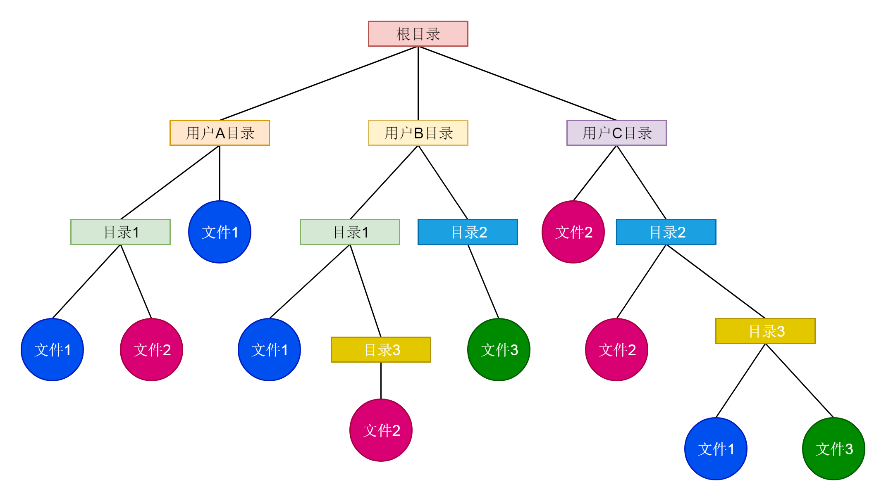

# 3.1 概述

内存中的数据在进程结束时，或者机器掉电时会丢失，如果想要永久保存这些数据，就需要将数据持久化，也就是写入文件。操作系统的文件系统就是这样一个存放数据的档案库，负责管理外部存储设备上的数据。常见的外部存储设备有硬盘，u盘等。

### 3.1.1 文件系统功能划分

为了管理文件，文件系统应该考虑到以下几点：

1. 文件系统要有严格的组织形式，使得文件能够以块为单位进行存储。

2. 文件系统要有索引区，用来方便查找一个文件分成的多个块的存储位置。如下图所示，

   

3. 文件系统应该有缓存层，用来存储那些近期经常被读取和写入的热点文件。

4. 文件系统应该用文件夹的形式组织起来，方便管理和查询。使用文件夹还可以通过将同名文件放在不同文件夹下，来避免重名冲突。

   

5. 内核要在自己内存里维护一套数据结构，来保存哪些文件被哪些进程打开和使用。

### 3.1.2 文件系统相关命令行

```c
fdisk -l 						 // 查看硬盘分区情况
mkfs.ext3或mkfs.ext4 // 对分区进行格式化
mount 							 // 将硬盘挂载在某个目录下
unmount							 // 卸载某个硬盘
ls -l 							 // 查看当前目录下所有文件的信息
```

在Linux里，一切都是文件，通过ls -l结果的第一位可以看出

- \- 表示普通文件
- d 表示文件夹
- c 表示字符设备文件
- b 表示块设备文件
- s 表示套接字socket文件
- l 表示符号链接

### 3.1.3 相关系统调用

- open，打开一个文件，并返回一个文件描述符fd。

  ```c
  fd=open("./test", O_RDWR|O_CREATE|O_TRUNC)
  O_CREATE代表不存在时，创建一个新文件。
  O_RDWR表示以读写方式打开
  O_TRUNC表示打开文件后，将文件长度截断为0
  ```

- write，写入数据，第一个参数是文件描述符，第二个参数是要写入的数据的存放位置，第三个参数表示希望写入的字节数。返回值是成功写入文件的字节数。

- lseek，重新定位读写的位置。

- read，读取数据。第一个参数是文件描述符，第二个参数是读取来的数据存放的空间，第三个参数是希望读取的字节数。返回值是成功读取的字节数。

- close，关闭一个文件。

- stat，通过文件名查询状态信息。lstat可以处理软连接。fstat，通过文件描述符查询文件信息。

- opendir 打开一个目录, 生成一个目录流 DIR

- readdir 读取目录流的一个条目, 自动指向下一个条目

- closedir 关闭目录流


文件系统总体如下


