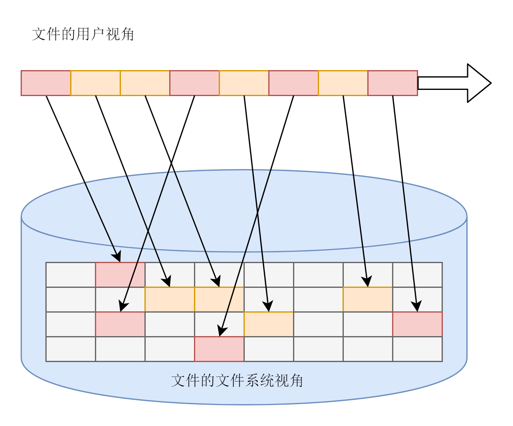
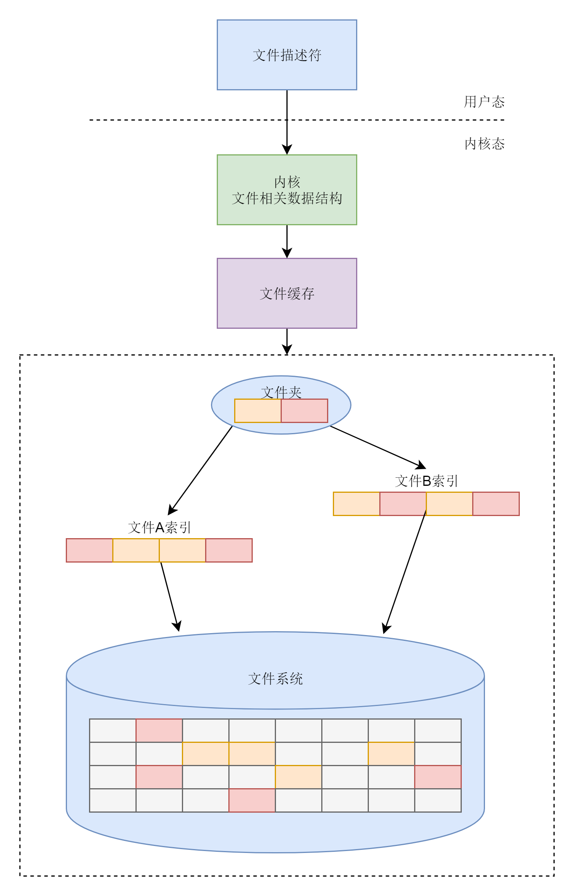
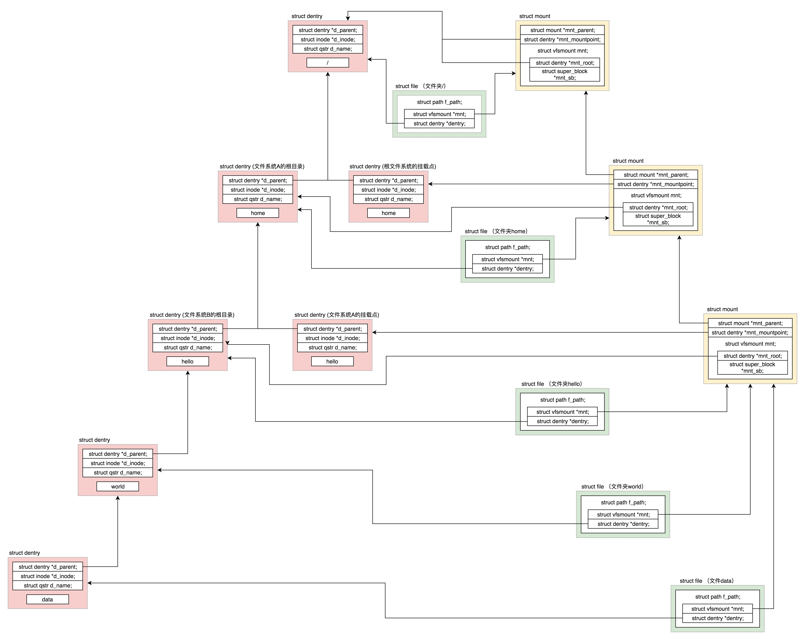
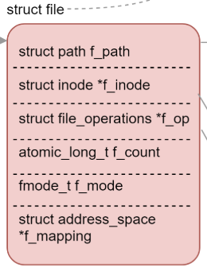

#3. 文件系统

##3.1 概述

内存中的数据在进程结束时，或者机器掉电时会丢失，如果想要永久保存这些数据，就需要将数据持久化，也就是写入文件。操作系统的文件系统就是这样一个存放数据的档案库，负责管理外部存储设备上的数据。常见的外部存储设备有硬盘，u盘等。

### 3.1.1 文件系统功能划分

为了管理文件，文件系统应该考虑到以下几点：

1. 文件系统要有严格的组织形式，使得文件能够以块为单位进行存储。

2. 文件系统要有索引区，用来方便查找一个文件分成的多个块的存储位置。如下图所示，

   

3. 文件系统应该有缓存层，用来存储那些近期经常被读取和写入的热点文件。

4. 文件系统应该用文件夹的形式组织起来，方便管理和查询。使用文件夹还可以通过将同名文件放在不同文件夹下，来避免重名冲突。

   

5. 内核要在自己内存里维护一套数据结构，来保存哪些文件被哪些进程打开和使用。

### 3.1.2 文件系统相关命令行

```c
fdisk -l 						 // 查看硬盘分区情况
mkfs.ext3或mkfs.ext4 // 对分区进行格式化
mount 							 // 将硬盘挂载在某个目录下
unmount							 // 卸载某个硬盘
ls -l 							 // 查看当前目录下所有文件的信息
```

在Linux里，一切都是文件，通过ls -l结果的第一位可以看出

- \- 表示普通文件
- d 表示文件夹
- c 表示字符设备文件
- b 表示块设备文件
- s 表示套接字socket文件
- l 表示符号链接

### 3.1.3 相关系统调用

- open，打开一个文件，并返回一个文件描述符fd。

  ```c
  fd=open("./test", O_RDWR|O_CREATE|O_TRUNC)
  O_CREATE代表不存在时，创建一个新文件。
  O_RDWR表示以读写方式打开
  O_TRUNC表示打开文件后，将文件长度截断为0
  ```

- write，写入数据，第一个参数是文件描述符，第二个参数是要写入的数据的存放位置，第三个参数表示希望写入的字节数。返回值是成功写入文件的字节数。

- lseek，重新定位读写的位置。

- read，读取数据。第一个参数是文件描述符，第二个参数是读取来的数据存放的空间，第三个参数是希望读取的字节数。返回值是成功读取的字节数。

- close，关闭一个文件。

- stat，通过文件名查询状态信息。lstat可以处理软连接。fstat，通过文件描述符查询文件信息。

- opendir 打开一个目录, 生成一个目录流 DIR

- readdir 读取目录流的一个条目, 自动指向下一个条目

- closedir 关闭目录流


文件系统总体如下



## 3.2 硬盘文件系统

这一节主要讲Linux下最主流的文件系统格式——ext系列文件系统格式。以下以传统机械硬盘为例。

### 3.2.1 inode与块的存储

硬盘分成相同大小的单元，称为块(block)，一个块的大小是扇区大小的整数倍，默认是4k。这个值可以在格式化的时候设定。文件可以存放在不连续的块中，不一定要分配连续的空间，这样比较灵活。

但是文件存放在哪些block中，需要记录下来，还需要建立索引快速查找。这个时候就需要一个结构体inode来存放。inode里还存放有文件的元数据如名字，权限等。inode中的i是index的意思，inode定义如下

```c
struct ext4_inode {
	__le16	i_mode;		/* File mode */
	__le16	i_uid;		/* Low 16 bits of Owner Uid */
	__le32	i_size_lo;	/* Size in bytes */
	__le32	i_atime;	/* Access time */
	__le32	i_ctime;	/* Inode Change time */
	__le32	i_mtime;	/* Modification time */
	__le32	i_dtime;	/* Deletion Time */
	__le16	i_gid;		/* Low 16 bits of Group Id */
	__le16	i_links_count;	/* Links count */
	__le32	i_blocks_lo;	/* Blocks count */
	__le32	i_flags;	/* File flags */
......
	__le32	i_block[EXT4_N_BLOCKS];/* Pointers to blocks */
	__le32	i_generation;	/* File version (for NFS) */
	__le32	i_file_acl_lo;	/* File ACL */
	__le32	i_size_high;
......
};
```

里面指定了文件的读写权限，属于哪个用户，哪个组，大小，占用多少块，跟时间相关的信息。当我们执行ls命令的时候，就是从这里取出信息的。

i_block这个变量里，存放了文件被分成了哪些块，每一块在哪里的信息。


如上图所示，在ext3中，前12项直接存放块地址，如果块太多就会在12-14项存放间接块，像树的结果那样存放大量的块信息。这样的缺点就是当块太多是，需要多次读盘，速度太慢。

为了解决这个问题，ext4引入了新的概念Extents，可以把最大128M的数据放到一个Extents里面，对大文件的读写性能提高了，文件碎片页减少了。

### 3.2.2 inode位图和块位图

当需要新建文件的时候，需要找到一个未使用的inode，然后分配未使用的块。为了找到未使用的inode和块，在文件系统里，专门用一个块，也就是4k来存储inode位图，0表示未使用，1代表已使用。同样的，也有一个块用来保存块的位图。需要inode就去位图里找，需要块就去块位图里找。

### 3.2.3 文件系统格式

我们把一个块的位图+一系列的块，外加一个块的inode位图+一系列的inode的结构称为一个块组，可以表示128M的数据，有N多的块组，可以表示N大的文件，如下图：


一个个块组构成了文件系统。块组描述符保存了当前块组的inode位图，块位图等信息。

块组描述符表是所有的块组描述符组成的列表，超级块描述了整个文件系统，如一共有多少个块，每个块组有多少个inode等信息，这些信息都是全局信息。

因为这些信息很重要，如果这些数据丢失，整个文件系统都打不开了。于是这些数据都要备份到其他多个块组中，这样一来就产生了两个问题：

- 浪费空间
- 块组描述符表的大小，限制了整个文件系统的大小。

于是，引入了Meta Block Groups特性。

块组描述符表不会保存所有块组的描述符了，而是将块组分为多个组，称为元块组。如图：


每个元块组包含64个块组，块组描述符也是64项，备份三份，在元块组的第1，2和最后一块的开始处。

ext4采用48位块寻址，高达1EB的空间。

### 3.2.4 目录的存储格式

目录本身也是一个文件，也有inode，只是在数据块里存储的数据，和普通文件不一样，为了加快目录下文件的查找速度，将文件按hash值分到不同的块中。如下图所示：


- 首先出现的是两个文件名为“.”和“..”的目录文件，分别指向当前目录和上级目录。
- 当我们要查找文件夹下某个文件时，先计算其hash值，再到对应的块里面去查，这样可以加快查找速度。

###3.2.5 软链接和硬链接的存储格式

使用`ln [参数][源文件或目录][目标文件或目录]` 来创建链接。ln -s是创建软链接，不加-s是硬链接。他们的区别如下：

- 硬链接和原始文件共用一个inode，但是inode是不跨文件系统的，因此硬链接没法跨文件系统。
- 软链接相当于重新创建了一个文件，这个的内容是指向另一个文件的路径。可以跨文件系统，甚至目标文件被删除了，链接文件还是在的。


##3.3 虚拟文件系统

上一节讲的是ext格式的文件系统，实际上，Linux支持十种文件系统如ext3，ext4，ntfs等。它们的实现各不相同，因此Linux内核向用户空间提供了虚拟文件系统这个统一的接口，来对文件系统进行操作。它提供了场景的文件系统对象模型，如inode，directory entry，mount等，以及操作这些对象的方法。

在文件读写的流程中，需要多个组件一起合作，虚拟文件系统VFS的位置如下：


- 在用户态，通过系统调用如sys_open，sys_read来对文件进行操作。
- 在内核，每个进程都要为打开的文件，维护一定的数据结构(task_struct->*files)。
- 在内核，还要维护系统打开的文件的数据结构struct file。
- 虚拟文件系统提供统一的文件操作接口。
- 然后是真正对接的文件系统，如ext4，ext3，ntfs。
- 为了加快块设备的读写效率，还有一个缓存层。
- 为了读写文件系统，要通过块设备IO层。这是文件系统层和块设备驱动层的接口。
- 最下层是块设备驱动程序

通过mount和open系统调用来了解整个系统的架构。

### 3.3.1 挂载文件系统

挂载文件操作，在虚拟机与宿主机共享文件夹时有用到过，挂载文件目录到docker容器里用到过，还在新建磁盘分区时用到过。想要操作文件系统，第一件事就是挂载文件系统。

内核是不是支持某种文件系统，需要向内核进行注册才知道。

挂载文件系统是调用mount系统调用，其调用链为do_mount->do_new_mount->vfs_kern_mount。

vfs_kern_mount定义如下

```c
struct vfsmount *
vfs_kern_mount(struct file_system_type *type, int flags, const char *name, void *data)
{
......
	mnt = alloc_vfsmnt(name);
......
	root = mount_fs(type, flags, name, data);
......
	mnt->mnt.mnt_root = root;
	mnt->mnt.mnt_sb = root->d_sb;
	mnt->mnt_mountpoint = mnt->mnt.mnt_root;
	mnt->mnt_parent = mnt;
	list_add_tail(&mnt->mnt_instance, &root->d_sb->s_mounts);
	return &mnt->mnt;
}

```

先创建了一个struct mount 结构，每个挂载的文件系统都对应这样一个结构。

```c
struct mount {
	struct hlist_node mnt_hash;
	struct mount *mnt_parent;
	struct dentry *mnt_mountpoint;
	struct vfsmount mnt;
	union {
		struct rcu_head mnt_rcu;
		struct llist_node mnt_llist;
	};
	struct list_head mnt_mounts;	/* list of children, anchored here */
	struct list_head mnt_child;	/* and going through their mnt_child */
	struct list_head mnt_instance;	/* mount instance on sb->s_mounts */
	const char *mnt_devname;	/* Name of device e.g. /dev/dsk/hda1 */
	struct list_head mnt_list;
......
} __randomize_layout;


struct vfsmount {
	struct dentry *mnt_root;	/* root of the mounted tree */
	struct super_block *mnt_sb;	/* pointer to superblock */
	int mnt_flags;
} __randomize_layout;
```

- mnt_parent是挂载点所在的父文件系统。
- mnt_mountpoint是挂载点在父文件系统中的dentry，dentry表示目录。
- mnt_root是当前文件系统根目录的dentry。
- mnt_sb是指向超级块的指针。

调用mount_fs挂载文件系统

```c
struct dentry *
mount_fs(struct file_system_type *type, int flags, const char *name, void *data)
{
	struct dentry *root;
	struct super_block *sb;
......
	root = type->mount(type, flags, name, data);
......
	sb = root->d_sb;
......
}
```

调用type->mount对于ext4来说就是调用ext4_mount。从文件系统里面读取超级块。当所有的数据结构都读到内存里面，内核就可以通过操作这些数据结构，来操作文件系统了。

假设，在根目录下挂载了根文件系统，在/home下挂载了文件系统A，在/home/hello下挂载了文件系统B，还有/home/hello/world和/home/hello/world/data两个文件夹。它们之间就有如下的关系:



### 3.3.2 打开文件

打开文件对应的是open系统调用，最终对应到内核的系统调用实现sys_open，过程如下：

首先调用get_unused_fd_flags，找到一个未使用的文件描述符fd。如何找？

在每个进程的task_struct中有一个指针*files，指向进程打开的文件描述符列表(数组)

```c
struct files_struct		*files;

struct files_struct {
......
	struct file __rcu * fd_array[NR_OPEN_DEFAULT];
};

```

每打开一个文件，就会在这个列表中分配一项，这一项的下标就是文件描述符，所以fd其实就是一个整数。对于任何一个进程，默认情况下，文件描述符0表示标准输入stdin，1表示标准输出stdout，2表示标准错误输出stderr。

拿到分配的fd后，需要创建一个struct file结构，然后将fd和这个file关联起来。



创建过程如下：

1. 调用get_empty_filp生成一个struct file结构
2. 初始化nameidata里面的path变量，准备开始节点路径查找。
3. 调用link_path_walk对路径名逐层进行节点路径查找，一直找到最后一级的父目录，例如'/root/hello/world/data'，找到/root/hello/world为止。
4. 最后一部分调用do_last获取文件对应的inode对象，并初始化file对象。

do_last先查找文件路径最后一部分对应的dentry，如何查找?

- 先去cache里面查找，也就是lookup_fast。
- 如果没找到，就要去文件系统里查找。先新建一个dentry，并且调用上一级目录inode的inode_operations的lookup函数去找该文件的inode，对于ext4来说，调用的是ext4_lookup，得到inode指针放到新dentry里。最后将新的dentry赋给file->path->dentry变量。

找到dentry的目的就是，里面有指向该文件inode的指针，文件关闭之后entry会放到cache中，因而可以长期维持内存中的文件和硬盘上的文件的关系。最后调用vfs_open真正打开文件。里面最重要的事是调用f_op->open，然后将打开文件的所有信息填写到struct file这个结构里。

虚拟文件系统整体数据结构如下:


