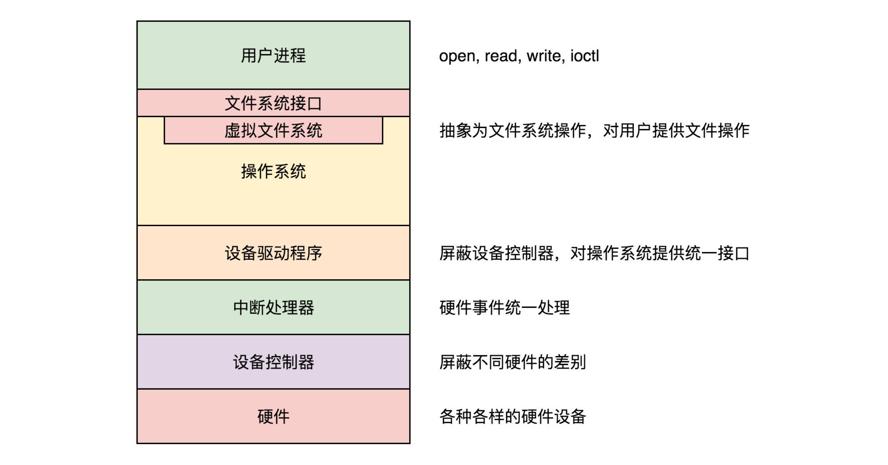
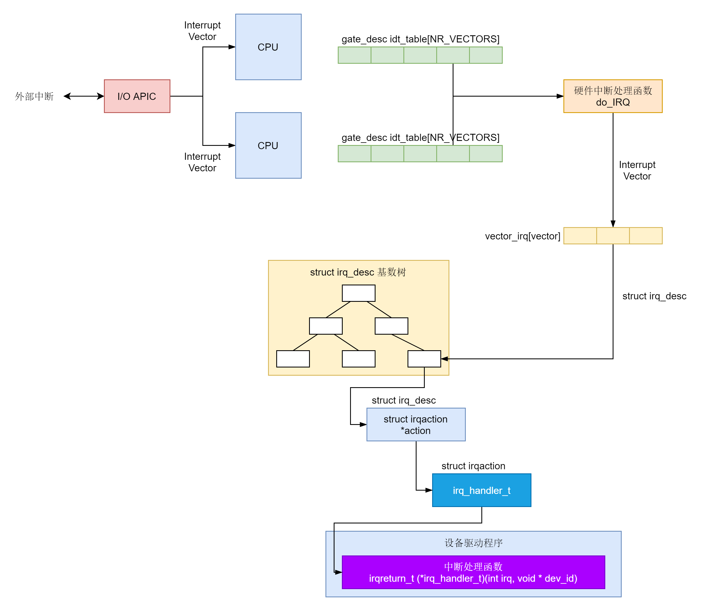

# 4. 输入输出系统

## 4.1 概述

计算机的输入输出设备有键盘、鼠标、显示器、网卡、打印机、CD等等，操作系统需要一种统一的方法来管理各种各样的设备。下图就是操作系统提供的方案，从下往上讲。



### 4.1.1 用设备控制器屏蔽设备差异

每种设备都有自己的设备控制器，例如磁盘控制器，USB控制器，显示器控制器。控制器是由设备自带的。

设备控制器就像一个小电脑一样，有自己的芯片可以执行逻辑，有自己的寄存器，CPU通过写这些寄存器，对控制器下指令。通过读这些寄存器，查看控制器对设备的操作状态。

输入输出设备大致可以分为两类：

- 块设备：将信息存储在固定大小的块中，每个块都有自己的地址，例如硬盘。
- 字符设备，发送和接收的都是字节流，不用考虑任何块结构，无法寻址，例如鼠标。

对于块设备的读写，因为数据量比较大，控制器会有缓冲区。需要攒够一定的数据才读出或写入。

CPU如何与控制器的寄存器以及数据缓冲区通信？

- 给每个控制寄存器分配一个I/O端口，通过特殊得汇编指令操作这些寄存器。
- 通过内存映射，分配一段内存空间给数据缓冲区，就可以向读写内存一样读写数据缓冲区，内存空间的ioremap就是做这个的。

CPU给设备控制器下达命令后就可以去干自己的事了，当设备控制器做完之后，会利用中断处理器发送一个中断，通知CPU任务已经完成，CPU需要停下当前的任务来处理中断。

由中断处理器发出的中断叫做硬件中断，通过系统调用产生的叫做软中断。

对于磁盘来说，有一个DMA芯片来协助读取数据，CPU发送读请求给DMA，告诉它去哪里取，取多少数据。DMA发送指令给磁盘控制器，去磁盘上读出数据后放到指定内存区域，然后发送中断告诉CPU数据准备好了。

### 4.1.2 用驱动程序屏蔽设备控制器差异

由于各种设备控制器的寄存器，缓冲区，指令都不同，对于操作系统来说，还需要一种途径来屏蔽这个差异。设备驱动程序就是起到这个作用的。

设备控制器不是操作系统的一部分，设备驱动程序属于操作系统，内核可以像调用本地代码一样调用驱动程序的代码，驱动程序的代码需要发出特殊的面向设备控制器的指令，才能操作设备控制器。

驱动程序有统一的接口供操作系统调用，这样操作系统就能以统一方式，无视设备的区别，调用设备驱动程序。

中断处理的逻辑也是写在设备驱动程序里的。当一个设备驱动程序初始化时，要先注册一个该设备的中断处理函数，中断返回的时候，是切换进程的时机，这个时候就可以找到设备驱动程序注册的中断处理函数Handler，然后执行它进行中断处理。

对于块设备来说，在驱动程序之上，文件系统之下，有一层通用块设备层，将与块设备相关的通用逻辑放在这一层，维护与设备无关的块的大小，然后通用块层下面对接各种各样的驱动程序。

### 4.1.3 用文件系统接口屏蔽驱动程序的差异

从硬件设备到设备控制器，到驱动程序，到通用块层，到文件系统，层层屏蔽不同的设备的差别，最终到这里涉及对用户使用接口，也要统一。

用户操作设备都是基于文件系统的接口，也有统一的标准。

首先是有统一的设备名称，所有的设备都在/dev/文件下创建一个特殊的设备文件。这个设备文件也有inode，但是不关联到硬盘或任何其他存储介质上的数据，而是建立了与某个设备驱动程序的连接。

在/dev下执行ls -l会有如下结果：

```c
# ls -l
crw------- 1 root root      5,   1 Dec 14 19:53 console
crw-r----- 1 root kmem      1,   1 Dec 14 19:53 mem
crw-rw-rw- 1 root root      1,   3 Dec 14 19:53 null
crw-r----- 1 root kmem      1,   4 Dec 14 19:53 port
crw-rw-rw- 1 root root      1,   8 Dec 14 19:53 random
crw--w---- 1 root tty       4,   0 Dec 14 19:53 tty0
crw--w---- 1 root tty       4,   1 Dec 14 19:53 tty1
crw-rw-rw- 1 root root      1,   9 Dec 14 19:53 urandom
brw-rw---- 1 root disk    253,   0 Dec 31 19:18 vda
brw-rw---- 1 root disk    253,   1 Dec 31 19:19 vda1
brw-rw---- 1 root disk    253,  16 Dec 14 19:53 vdb
brw-rw---- 1 root disk    253,  32 Jan  2 11:24 vdc
crw-rw-rw- 1 root root      1,   5 Dec 14 19:53 zero
```

第一位是c表示这是一个字符设备，b代表这是一个块设备。后面两个数字代表主设备号，和次设备号。主设备号定位设备驱动程序，次设备号表示使用这个驱动程序的设备。

当Linux操作系统新添加了一个设备，就会加载相应的驱动程序，相当于加载一个内核模块。通过insmod安装内核模块，内核模块的后缀一般是ko。

有了驱动之后，就可以用mknod在/dev文加下创建设备文件。以上是手动加载一个设备的过程。

自动管理新连接设备的流程如下，在/sys下有一个sysfs文件系统，这个文件系统是当前系统上实际设备数的真实反映。

- /sys/devices是内核对系统中所有设备的分层次表示
- /sys/dev下一个char文件夹，一个block文件夹，分别维护一个按字符设备和块设备的主次号码链接到真实设备(/sys/devices下)的符号链接文件。
- /sys/block是所有的块设备
- /sys/module是所有模块的信息。

有一个守护进程udev，当新设备插入是，内核会检测到这个设备，并创建一个内核对象kobject。向用户空间发送一个热插拔消息。udevd会监听这些消息，在/dev中创建对应的文件。

有了文件系统接口之后，就能像读写文件一样操作设备了，除了read, write还有ioctl接口用于特殊的控制。

## 4.2 字符设备

这里通过字符设备的驱动来了解驱动程序的架构。以鼠标和打印机为例。

### 4.2.1 字符设备驱动程序

罗技鼠标的驱动程序logibm.c

```c
/*
 * Logitech Bus Mouse Driver for Linux
 */
module_init(logibm_init);
module_exit(logibm_exit);
```

惠普打印机的驱动程序lp.c

```c
/*
 * Generic parallel printer driver
 */
module_init(lp_init_module);
module_exit(lp_cleanup_module);
```

作为一个驱动程序，也是一个内核模块，应该具有以下部分：

- 头文件部分，一般内核模块都需要引用以下头文件：

  ```c
  #include <linux/module.h>
  #include <linux/init.h>
  ```

- 定义处理内核模块主要逻辑的函数，例如打开、关闭、读取、写入以及中断处理函数等。

- 定义一个file_operations，这样就可以通过文件系统的接口对设备进行访问。

- 定义整个模块的初始化和退出函数，用于加载和卸载这个ko的时候使用。

- 调用module_init和module_exit，分别指向初始化和退出函数。

- 声明一下lisense。

### 4.2.2 打开字符设备

第一次打开字符设备的步骤如下：

1. 调用module_init初始化函数，来加载这个设备驱动程序。最重要的事是注册这个字符设备，为其注册主次设备号和名称，然后分配一个struct cdev，cdev的ops成员变量指向这个模块声明的file_operations。将cdev添加到cdev_map结构中，用来统一管理所有字符设备。
2. 调用mknod在/dev下创建一个设备文件。这个文件是个特殊文件，对应的inode也是特殊的。
3. 调用open打开这个特殊的inode，找到其cdev，将里面定义的file_operations交付给struct file里面的file_operations，这样以后操作文件描述符，就是直接操作设备了。
4. 最后调用设备驱动程序的file_operations的open函数，真正打开设备。

### 4.2.3 写入字符设备

写入字符设备，就是用文件系统标准接口write，参数为文件描述符。找到fd对应的struct file，调用其file_operations的write函数，最终就是调用驱动程序的file_operations的write。

### 4.2.4 使用IOCTL控制设备

ioctl是一个系统调用，参数为fd和命令cmd，cmd是驱动程序约定好的。对于设备驱动文件，会调用vfs_ioctl，就会调用到设备驱动程序的file_operations的unlocked_ioctl函数，去执行相关命令。

### 4.2.5 中断处理

中断处理函数写在了设备驱动程序之中，在使用之前还需要调用requrest_irq注册该中断处理函数。

```c
static inline int __must_check
request_irq(unsigned int irq, irq_handler_t handler, unsigned long flags, const char *name, void *dev)
{
	return request_threaded_irq(irq, handler, NULL, flags, name, dev);
}
```

- irq，是一个整数，代表中断信号。
- handler，是中断处理函数。

注册的流程是：

- 根据irq这个整数，在一颗基数树上，找到对应的struct irq_desc结构。irq_desc结构里面有一个的struct irqaction链表。每个irqaction里面保存了hander中断处理函数，以及中断信号。
- 分配一个struct irqaction，并初始化它，写入要注册的中断处理函数，中断信号等信息。
- 将新建的irqaction结构加到irqaction链表的尾部。

中断发生以及处理流程如下：

- 外部设备给中断控制器发送物理中断信号(不是irq那个整数)
- 中断控制器将物理中断信号转换成中断向量interrupt vector，发给各个cpu。
- 每个CPU都有一个中断向量表，根据interrupt vector，调用一个do_IRQ处理函数。
- 在IRQ处理函数中，将interrupt vector转为为中断信号irq，根据irq去查找对应的irq_desc里面的handler处理函数，并调用。


**中断向量**

中断向量定义如下：

```c
/*
 * Linux IRQ vector layout.
 *
 * There are 256 IDT entries (per CPU - each entry is 8 bytes) which can
 * be defined by Linux. They are used as a jump table by the CPU when a
 * given vector is triggered - by a CPU-external, CPU-internal or
 * software-triggered event.
 *
 * Linux sets the kernel code address each entry jumps to early during
 * bootup, and never changes them. This is the general layout of the
 * IDT entries:
 *
 *  Vectors   0 ...  31 : system traps and exceptions - hardcoded events
 *  Vectors  32 ... 127 : device interrupts
 *  Vector  128         : legacy int80 syscall interface
 *  Vectors 129 ... INVALIDATE_TLB_VECTOR_START-1 except 204 : device interrupts
 *  Vectors INVALIDATE_TLB_VECTOR_START ... 255 : special interrupts
 *
 * 64-bit x86 has per CPU IDT tables, 32-bit has one shared IDT table.
 *
 * This file enumerates the exact layout of them:
 */
#define FIRST_EXTERNAL_VECTOR		0x20
#define IA32_SYSCALL_VECTOR		0x80
#define NR_VECTORS			 256
#define FIRST_SYSTEM_VECTOR		NR_VECTORS
```

每个CPU都有一个中断向量表，有256项，也就是总共能处理256个中断，前0-31的32个为系统陷入或者系统异常，这些中断一定要处理，无法屏蔽。其余的都是处理设备中断的。表中的每一项都是中断处理函数，最终都会去调用do_IRQ。

do_IRQ的目标就是将中断向量转化为irq。在Per CPU变量里，有一个记录着vector到irq的映射关联的变量vector_irq，这个变量是在系统初始化时，调用__assign_irq_vector，将中断信号irq分配到某个CPU上的中断向量。

找到irq，就能找到其irq_desc，然后调用里面的handler中断处理函数，如果返回值是IRQ_HANDLED，就说明处理完毕；如果返回值是IRQ_NONE，表示不是当前处理函数该处理的中断。返回值IRQ_WAKE_THREAD表示有一个进程正在等待这个中断，中断处理完了，应该唤醒它。

整个流程如下图所示：



## 4.3 块设备

这一节讲块设备的mknod、打开流程，以及文件系统和下层硬盘设备的读写流程。

### 4.3.1 mknode、打开块设备

mknod会在/dev下面创建一个设备文件，这个文件在devtemfs文件系统里，然后为其分配一个特殊的inode，inode->dev_t为设备的设备号。

打开块设备一般是通过mount这个块设备到一个文件夹下。对于ext4文件系统，mount操作会调用到ext4_mount，然后调用mount_bdev。

mount_bdev主要做两件事：

1. 调用blkdev_get_by_path根据/dev/xxx这个名字，找到相应的设备block_device并打开它。

   查找的流程为：

   - 根据路径pathname在devtmpfs文件系统中找到对应的dentry，并获得其inode，里面有设备号dev_t。
   - 通过dev_t在伪文件系统bdev中找到对应的bdev_inode。
   - 根据bdev_inode找到对应的block_device。

   block_device的定义：

   ```c
   struct block_device {
   	dev_t			bd_dev;  /* not a kdev_t - it's a search key */
   	int			bd_openers;
   	struct super_block *	bd_super;
   ......
   	struct block_device *	bd_contains;
   	unsigned		bd_block_size;
   	struct hd_struct *	bd_part;
   	unsigned		bd_part_count;
   	int			bd_invalidated;
   	struct gendisk *	bd_disk;
   	struct request_queue *  bd_queue;
   	struct backing_dev_info *bd_bdi;
   	struct list_head	bd_list;
   ......
   } ;
   ```

   gendisk是描述整个设备的，它的定义如下

   ```c
   struct gendisk {
   	int major;			/* major number of driver */
   	int first_minor;
   	int minors;                     /* maximum number of minors, =1 for disks that can't be partitioned. */
   	char disk_name[DISK_NAME_LEN];	/* name of major driver */
   	char *(*devnode)(struct gendisk *gd, umode_t *mode);
   ......
   	struct disk_part_tbl __rcu *part_tbl;
   	struct hd_struct part0;
   	const struct block_device_operations *fops;
   	struct request_queue *queue;
   	void *private_data;
   	int flags;
   	struct kobject *slave_dir;
   ......
   };
   ```

   major是主设备号，minors表示分区的数目，disk_name给出了磁盘设备块的名称。struct disk_part_tbl是一个struct hd_struct数组，用于表示各个分区。block_device_operations表示对于这个块的操作，request_queue表示在这个块设备上的请求队列。

   hd_struct是用来表示某个分区的，记录该分区从磁盘哪个扇区开始，到哪个扇区结束。

   

   找到block_device之后，就是打开它：

   - 根据block_device获取gendisk，此时block_device里的gendisk还没有赋值
     - 如果block_device指向整个磁盘设备，就根据dev_t，在bdev_map中将对应的gendisk拿出来。每个块设备驱动初始化时，会将自己的dev_t和gendisk关联信息保存在bdev_map中。
     - 如果block_device指向某个分区，就先得到hd_struct再找到对应的整个设备的gendisk，并把partno设置为分区号。

   - 如果获取的gendisk的partno为0，也就是打开整个设备而不是分区，就调用block_device_operations里面的open函数打开设备。

     如果partno不为0，也就是打开的是分区，就获取整个设备的block_device，打开整个设备。

   - 至此，block_device该填上的变量都填上了。

2. 调用sget根据打开的设备文件，先读取ext4文件系统的super_block，再将block_device填充进这个super_block里。有了ext4文件系统的super_block之后，就可以对其进行读写了。

###4.3.2 写入

I/O分为两种：

- 直接I/O，调用generic_file_direc_write，对于ext4文件系统，实际调用ext4_direct_IO，往设备层写入数据。
- 缓存I/O，会将数据从应用程序拷贝到内存缓存中，这时并不执行真正的I/O操作，只将页面标记为脏，到了一定时机才往硬盘写入。最终是调用ext4_writepages，往设备层写入数据。

**直接I/O访问设备**

struct dio用于描述将要发生的写入请求，是将数据传给块设备的通用传输对象。对于直接I/O，写入数据到用户内存空间的页中，将这个页包装成一个dio结构，调动submit_bio向设备层提交数据。但是此时要让相应的内核缓存页失效，因为缓存页中的数据将与硬盘上不一致。

```c
/**
 * submit_bio - submit a bio to the block device layer for I/O
 * @bio: The &struct bio which describes the I/O
 */
blk_qc_t submit_bio(struct bio *bio)
{
......
  return generic_make_request(bio);
}
```

**缓存I/O访问设备**

缓存I/O调用ext4_writepages，首先也是要构建一个bio对象，里面的数据就是缓存页。初始化之后，调用ext_io_submit，最终还是调用submit_bio。

```c
void ext4_io_submit(struct ext4_io_submit *io)
{
	struct bio *bio = io->io_bio;


	if (bio) {
		int io_op_flags = io->io_wbc->sync_mode == WB_SYNC_ALL ?
				  REQ_SYNC : 0;
		io->io_bio->bi_write_hint = io->io_end->inode->i_write_hint;
		bio_set_op_attrs(io->io_bio, REQ_OP_WRITE, io_op_flags);
		submit_bio(io->io_bio);
	}
	io->io_bio = NULL;
}

```

**如何向块设备层提交请求**

submit_bio会调用generic_make_request，先获得这个块设备的请求队列request_queue，然后调用这个队列的make_requrest_fn添加一个请求。

**请求队列**

每个块的驱动设备初始化时，会生成一个请求队列。在请求队列request_queue上，首先有一个list_head保存请求request，每个request包括一个struct bio链表，都是要写入磁盘的数据。

请求队列有一个很重要的调度算法，电梯算法，之所以叫电梯算法，是因为尽量让一个电梯坐满人再走也就是尽量合并request。共有三种类型的电梯算法：

1. FIFO，先来后到处理请求。
2. deanline算法，保证每个I/O在一定时间内一定被服务到。算法引入两个队列，一个队列用红黑树进行组织，按照请求的起始扇区号进行排序，按照此顺序传输性能会较高。另一个队列按照请求生成时间排序，每个请求都有一个期限值。
3. 完全公平算法，所有请求会在多个队列中进行处理，每个队列分得相同多的时间片。

**请求提交**

make_request_fn用来生成一个请求，它会尝试着将要写入的bio对象，与之前存在的request进行合并。如果实在合并不了，就创建新的request，里面放入bio，将新建的request加入到requrest_queue里。

**请求的处理**

设备驱动程序调用request_fn来读取request_queue里面的request，然后封装更加底层的指令，给设备控制器下指令，实施真正的I/O操作。

