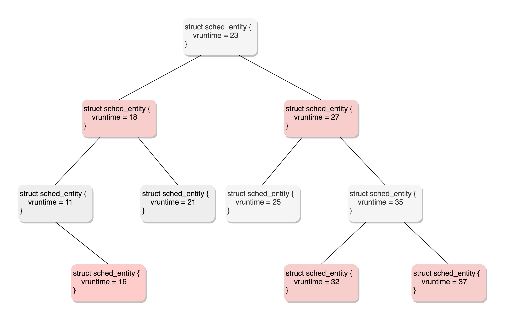
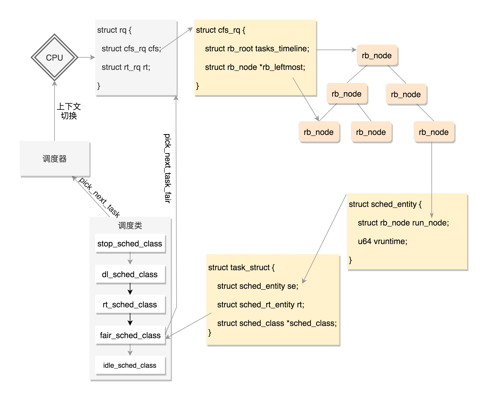
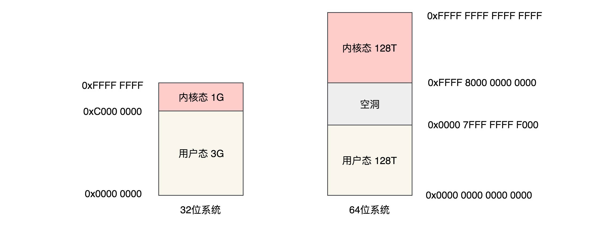
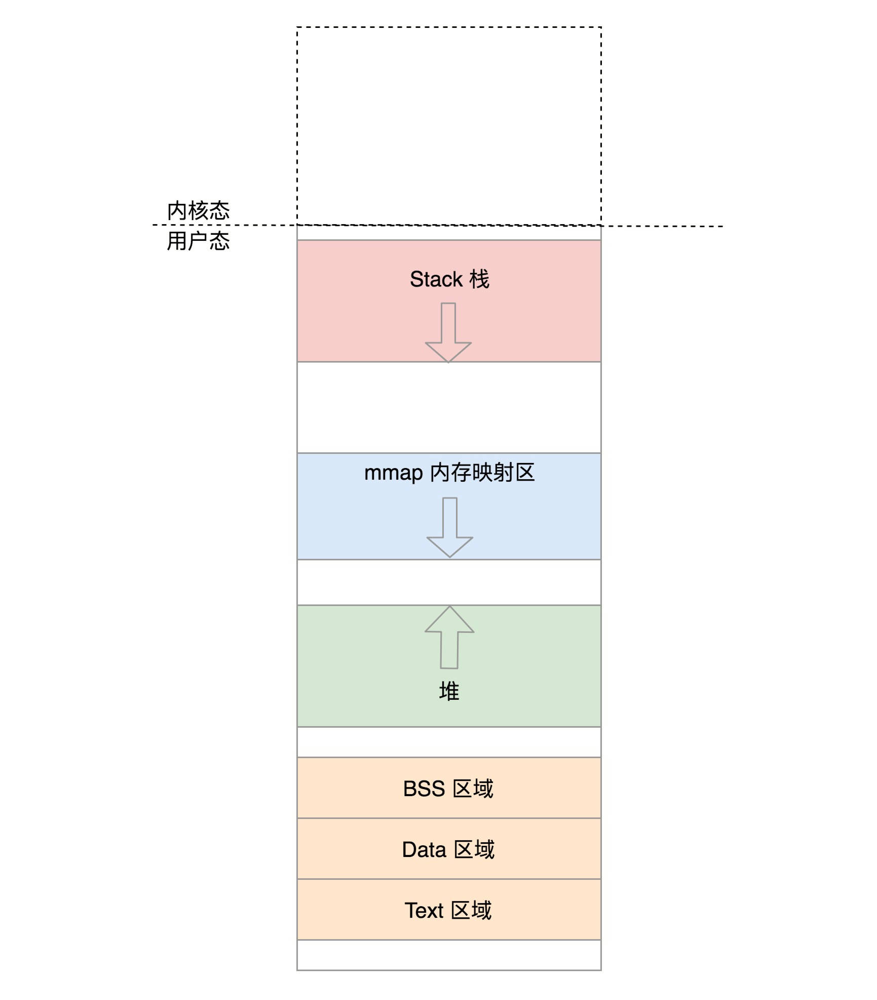
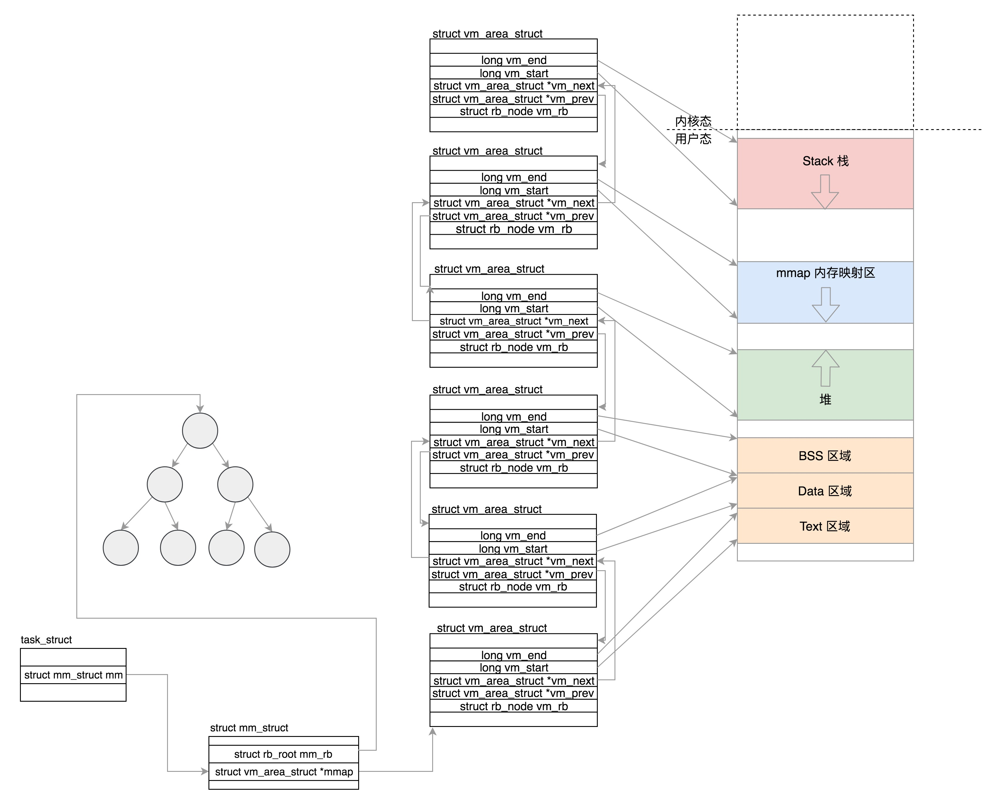
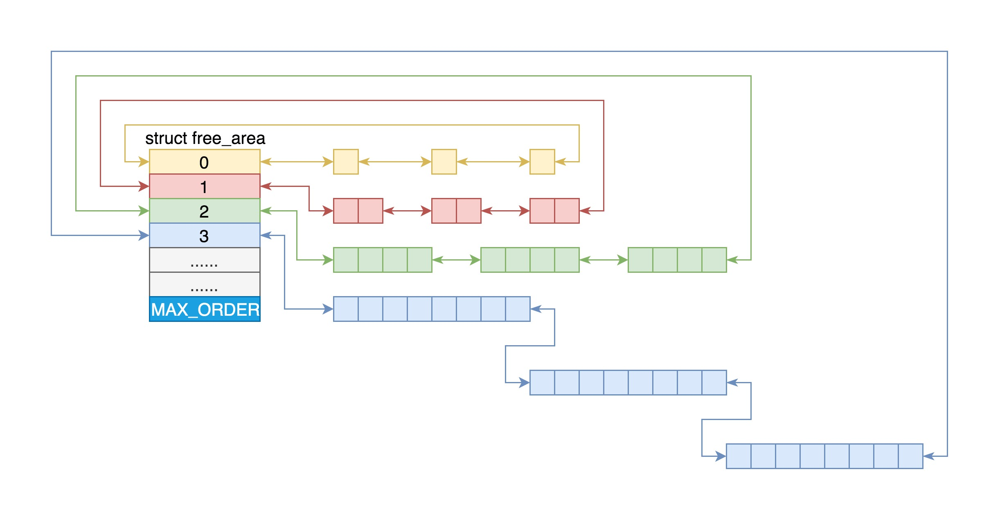
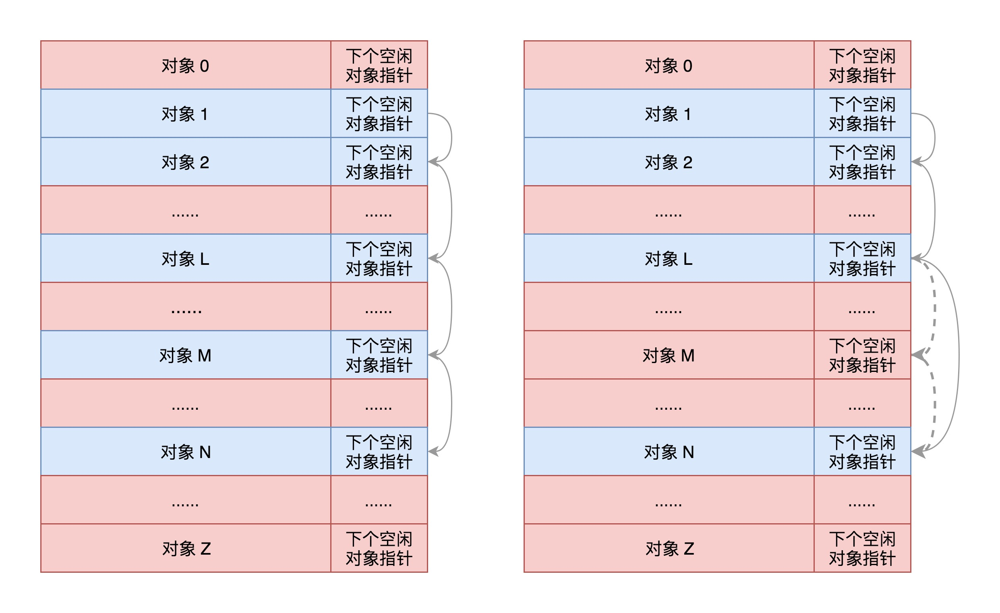

# 1. 进程

进程是程序的运行实例。当一段程序被同时运行多次时，就会创建多个进程。进程在Linux内核里也叫做task。

## 1.1 进程描述符

进程描述符(process descriptor)，结构类型是task_struct。用来记录进程的状态，存储线程的数据。


###1.1.1 任务ID

- pid，新建一个进程时，会在前一个进程的ID上加1，赋予新的进程，用来唯一标识这个进程。pid上限是32767，当到达上限时，会重用已经回收的进程的PID。
- tgid，标识该进程所属的线程组，如果某个task的pid等于tgid，则表明该task是线程组的主线程，由这个主线程创建的子线程，其tgid等于主线程的tgid也等于主线程的pid，每个线程都有自己独立的pid，也就是说线程数量不可能超过32767。
- group leader，指向线程组的主线程。

###1.1.2 亲缘关系

- *parent，指向其父进程，父进程是创建它的进程。
- \*real_parent，通常与\*parent一致，在debug的时候，会出现不一致。
- children，子进程链表的头结点，顺着头结点可以访问每一个子进程。
- sibling，该进程的兄弟进程。

###1.1.3 任务状态

- state，表示进程当前状态。
- exit_state，表示当前进程处于哪种退出状态。
- flags，是一个bitmap，表示线程的状态。从下面可以看出如何设置这个bitmap。

```c
/* Used in tsk->state: */
#define TASK_RUNNING                    0
#define TASK_INTERRUPTIBLE              1
#define TASK_UNINTERRUPTIBLE            2
#define __TASK_STOPPED                  4
#define __TASK_TRACED                   8
/* Used in tsk->exit_state: */
#define EXIT_DEAD                       16
#define EXIT_ZOMBIE                     32
#define EXIT_TRACE                      (EXIT_ZOMBIE | EXIT_DEAD)
/* Used in tsk->state again: */
#define TASK_DEAD                       64
#define TASK_WAKEKILL                   128
#define TASK_WAKING                     256
#define TASK_PARKED                     512
#define TASK_NOLOAD                     1024
#define TASK_NEW                        2048
#define TASK_STATE_MAX                  4096
```


TASK_RUNNING表示进程处于可运行状态，不一定获得了CPU时间片，也就是不一定正在执行。

Linux中，有两种睡眠（挂起）状态，

1. TASK_INTERRUPTIBLE，可中断睡眠，当一个信号到来，进程可以被唤醒，醒来之后处理这个信号。处理完之后，继续睡眠或者退出睡眠。只有当真正等待的条件满足时，才醒来继续往下执行。
2. TASK_UNINTERRUPTIBLE，不可中断的睡眠。不可以被信号唤醒，只能等待满足条件之后才醒来。kill信号都不行，kill本身也是一个信号，也就是说，除了重启电脑，没有别的方法。

TASK_KILLABLE是一种可以终止的新睡眠状态，运行原理和TASK_UNINTERRUPTIBLE类似，只不过可以响应致命信号。

TASK_STOPPED是进程在收到SIGSTOP，SIGTSTP或者SIGTTOU信号之后进入的状态。

一个进程刚结束时，进入EXIT_ZOMBIE状态，此时仅保持进程的描述符，其余的都释放掉。只有等待父进程调用wait()类方法后，才彻底删除这个进程。之后进程的状态为EXIT_DEAD。

还有一些状态，我们称为标志。放在flags字段中，这些字段被定义为宏，以PF开头。例如

```c
#define PF_EXITING			0x00000004
#define PF_VCPU					0x00000010
#define PF_FORKNOEXEC		0x00000040
```

PF_EXITING表示正在退出。PF_VCPU表示运行在虚拟CPU上，PF_FORKNOEXEC表示fork完了，还没有exec。

### 1.1.4 权限

\*real_cred表示谁能操作当前进程，\*cred表示当前进程能操作谁。

cred结构定义如下，cap_xxx表示拥有的能力。xxid都是用户和用户组的信息。

```c
struct cred {
......
        kuid_t          uid;            /* real UID of the task */
        kgid_t          gid;            /* real GID of the task */
        kuid_t          suid;           /* saved UID of the task */
        kgid_t          sgid;           /* saved GID of the task */
        kuid_t          euid;           /* effective UID of the task */
        kgid_t          egid;           /* effective GID of the task */
        kuid_t          fsuid;          /* UID for VFS ops */
        kgid_t          fsgid;          /* GID for VFS ops */
......
        kernel_cap_t    cap_inheritable; /* caps our children can inherit */
        kernel_cap_t    cap_permitted;  /* caps we're permitted */
        kernel_cap_t    cap_effective;  /* caps we can actually use */
        kernel_cap_t    cap_bset;       /* capability bounding set */
        kernel_cap_t    cap_ambient;    /* Ambient capability set */
......
} __randomize_layout;

```

chmod u+s 命令，如果一个文件被设置这样的权限的话，任何进程在执行这个文件时，会获得该文件拥有者的权限，就可以像文件拥有者一样去执行这个文件。

需要了解setuid(uid)函数的原理。


### 1.1.5 运行统计信息

这些字段用来记录该进程运行的时间信息

```c
u64								utime;// 用户态消耗的 CPU 时间
u64								stime;// 内核态消耗的 CPU 时间
unsigned long			nvcsw;// 自愿 (voluntary) 上下文切换计数
unsigned long			nivcsw;// 非自愿 (involuntary) 上下文切换计数
u64								start_time;// 进程启动时间，不包含睡眠时间
u64								real_start_time;// 进程启动时间，包含睡眠时间
```

### 1.1.6 进程调度

详解见进程调度章节

### 1.1.7 信号处理

task_struct里面的信号处理字段如下，

```c
/* Signal handlers: */
struct signal_struct		*signal;
struct sighand_struct		*sighand;
sigset_t								blocked;
sigset_t								real_blocked;
sigset_t								saved_sigmask;
struct sigpending				pending;
unsigned long						sas_ss_sp;
size_t									sas_ss_size;
unsigned int						sas_ss_flags;
```

blocked这个集合表示哪些信号暂不处理，pending表示哪些信号暂待处理，sighand表示正在被处理的信号。详解见信号处理章节。

### 1.1.8 内存管理

每个进程都有自己独立的虚拟内存空间，用mm_struct来表示。详解见内存管理章节。

```c
struct mm_struct                *mm;
struct mm_struct                *active_mm;
```

详见内存管理章节。

### 1.1.9 文件与文件系统

每个进程都有一个文件系统的数据结构，还有一个数据结构用来记录已打开文件。详解见文件系统章节。

```c
/* Filesystem information: */
struct fs_struct                *fs;
/* Open file information: */
struct files_struct             *files;
```

### 1.1.10 内核栈

进程一旦涉及到用户态和内核态切换，就会用到以下两个变量

```c
struct thread_info		thread_info;
void  *stack;
```

stack表示内核栈，进程在内核运行时，需要切换到内核栈。

我们以系统调用为例，


在用户态的时候，将用户态的代码段，数据段，CPU上下文都保存到task_struct->stack的pt_regs寄存器里。


然后，将系统调用名转为系统调用号，去系统调用表里，根据系统调用号找到对应的函数进行调用。从系统调用返回的时候，需要恢复寄存器的值，也就是读取stack里的pt_regs写入CPU寄存器，系统调用的返回值在pt_regs的ax寄存器里。

## 1.2 创建进程

###1.2.1 fork

在linux中，怎么创建进程呢？是使用fork()系统调用。内部的调用过程为fork -> sys_fork -> _do_fork，sys_fork的定义如下：

```c
SYSCALL_DEFINE0(fork)
{
......
	return _do_fork(SIGCHLD, 0, 0, NULL, NULL, 0);
}
```

sys_fork又会去调用_do_fork，

```c
long _do_fork(unsigned long clone_flags,
	      unsigned long stack_start,
	      unsigned long stack_size,
	      int __user *parent_tidptr,
	      int __user *child_tidptr,
	      unsigned long tls)
{
	struct task_struct *p;
	int trace = 0;
	long nr;


......
	p = copy_process(clone_flags, stack_start, stack_size,
			 child_tidptr, NULL, trace, tls, NUMA_NO_NODE);
......
	if (!IS_ERR(p)) {
		struct pid *pid;
		pid = get_task_pid(p, PIDTYPE_PID);
		nr = pid_vnr(pid);


		if (clone_flags & CLONE_PARENT_SETTID)
			put_user(nr, parent_tidptr);


......
		wake_up_new_task(p);
......
		put_pid(pid);
	} 
......
```

这里主要做了两件事，`copy_process`复制结构和`wake_up_new_task`唤醒线程。

### 1.2.2 copy_process

复制父进程就是复制它的进程描述符task_struct，按照下图逐一解释复制过程。


- 整体

  - 先调用alloc_task_struct_node，分配一个task_struct结构。
  - 调用memcpy将父进程的task_struct进程复制。
  - 此时所有的成员变量都指向父进程对应的值，也就是共用父进程的数据，之后一步步地创建自己的数据，与父进程彻底隔绝。

- 内核栈

  - 调用alloc_thread_stack_node，分配内存空间并创建一个栈赋值给task_struct的 void *stack成员变量。
  - 调用setup_thread_stack设置thread_info。

- 权限

  - 调用prepare_creds，在内存中分配一个新的struct cred结构，然后调用memcpy复制一份父进程的cred。
  - 将新进程的read_cred和cred都指向这个新创建的cred。

- 运行统计

  初始化变量值。

  ```c
  p->utime = p->stime = p->gtime = 0;
  p->start_time = ktime_get_ns();
  p->real_start_time = ktime_get_boot_ns();
  ```

- 调度相关

  - 调用__sched_fork，将on_rq设为0，初始化shed_entity，shed_entity的定义如下

    ```c
    struct sched_entity {
    	struct load_weight		load;
    	struct rb_node			run_node;
    	struct list_head		group_node;
    	unsigned int			on_rq;
    	u64				exec_start;
    	u64				sum_exec_runtime;
    	u64				vruntime;
    	u64				prev_sum_exec_runtime;
    	u64				nr_migrations;
    	struct sched_statistics		statistics;
    ......
    };
    ```

    初始化shed_entity就是把exec_start，sum_exec_runtime等涉及进程运行时间置零。

  - 设置进程的状态p->state设置为TASK_NEW。

  - 初始化优先级

  - 设置调度类，如果是普通进程，则设置sched_class = &fair_sched_class，公平调度。

  - 调用调度类的task_fork函数，将子进程和父进程的vruntime设为一样，这样就能防止父进程通过不断新建子进程来占用cpu。如果设置了让子进程先行，调用resched_curr，标记当前运行的进程TIF_NEED_RESCHED，这样下次调度的时候，父进程会被子进程抢占。

- 文件与文件系统

  ```c
  retval = copy_files(clone_flags, p);
  retval = copy_fs(clone_flags, p);
  ```

  copy_files是复制父进程打开的文件信息，这些信息存在一个结构files_struct中，每个打开的文件都有一个文件描述符。这里创建一个新的files_struct，然后将所有的文件描述符数组fdtable拷贝一份。

  copy_fs用于复制一个进程的目录信息，这些目录信息包括进程自己的根目录，根文件系统root，也有当前目录pwd，和当前目录的文件系统。

- 信号相关

  ```c
  init_sigpending(&p->pending);
  retval = copy_sighand(clone_flags, p);
  retval = copy_signal(clone_flags, p);
  ```

  copy_sighand会分配一个新的sighand_struct，主要是维护信号处理函数。然后调用memcpy将信号处理函数从父进程复制到子进程。

  copy_singal用于复制和维护发给这个进程的信号的数据结构。

- 内存空间

  ```c
  retval = copy_mm(clone_flags, p);
  ```

  进程都有自己的内存空间，用mm_struct结构来表示。copy_mm函数中调用dup_mm分配一个新的mm_struct结构。

- 任务ID

  - 分配pid，设置tid，group_leader。
  - 建立进程直接的亲缘关系。

至此，copy_process就结束了。

### 1.2.3 wake_up_new_task

新创建的进程，需要做些工作，才可能去抢占CPU。wake_up_new_task定义如下，

```c
void wake_up_new_task(struct task_struct *p)
{
	struct rq_flags rf;
	struct rq *rq;
......
	p->state = TASK_RUNNING;
......
	activate_task(rq, p, ENQUEUE_NOCLOCK);
	p->on_rq = TASK_ON_RQ_QUEUED;
	trace_sched_wakeup_new(p);
	check_preempt_curr(rq, p, WF_FORK);
......
}
```

1. 将state设置为TASK_RUNNING。
2. activate_task函数会调用enqueue_task，将进程放到运行队列里面，每个CPU有自己的多个运行队列，一个进程只能同时在一个队列里排队。如果是CFS的调度类，也就是公平调度，就会将进程放到cfs_rq，然后调用date_curr更新运行的统计量，将进程的sched_entity加入到红黑树（cfs_rq的实现是红黑树）里，设置se->on_rq = 1。
3. 调用check_preempt_curr，看能否抢占当前进程。如果前面设置了让子进程先运行，则直接返回。如果没有设置，就让父子进程PK一下，看是否要抢占，如果是，则标记父进程为TIF_NEED_RESCHED。抢占的时机为，fork系统调用返回的时候，因为进程抢占可以发生在系统调用返回的时候。

##1.3 创建线程

线程和进程的创建过程有很多相似的地方，因此接着讲线程的创建。


如上图所示，左边是创建进程，右边是创建线程，它们最大的区别有2点，首先是线程的创建有一部分工作是在用户态完成的，也就是`pthread_create`函数，这个函数来自Glibc，不是系统调用。第二点不同是在下面复制数据的时候，子线程是直接引用了parent的数据，也就是说，这部分数据被所有的子线程共享。

### 1.3.1 用户态工作pthread_create

首先说说pthread是什么，我们知道在无论是线程还是进程内核里都用task_struct来表示，而线程在用户态是用pthread这个结构来维护。因此首先就是创建这么一个pthread结构，怎么创建呢？

```c
struct pthread *pd = NULL;
int err = ALLOCATE_STACK (iattr, &pd);
```

看起来有点奇怪，创建一个pthread是调用ALLOCATE_STACK去创建一个stack，但是经过这么一个调用后确实创建了一个新的pthread，接下来来看具体里面做了什么。ALLOCATE_STACK的定义如下

```c
1   # define ALLOCATE_STACK(attr, pd) allocate_stack (attr, pd, &stackaddr)
2   
3   static int
4   allocate_stack (const struct pthread_attr *attr, struct pthread **pdp,
5                   ALLOCATE_STACK_PARMS)
6   {
7     struct pthread *pd;
8     size_t size;
9     size_t pagesize_m1 = __getpagesize () - 1;
10  ......
11    size = attr->stacksize;
12  ......
13    /* Allocate some anonymous memory.  If possible use the cache.  */
14    size_t guardsize;
15    void *mem;
16    const int prot = (PROT_READ | PROT_WRITE
17                     | ((GL(dl_stack_flags) & PF_X) ? PROT_EXEC : 0));
18    /* Adjust the stack size for alignment.  */
19    size &= ~__static_tls_align_m1;
20    /* Make sure the size of the stack is enough for the guard and
21    eventually the thread descriptor.  */
22    guardsize = (attr->guardsize + pagesize_m1) & ~pagesize_m1;
23    size += guardsize;
24    pd = get_cached_stack (&size, &mem);
25    if (pd == NULL)
26    {
27      /* If a guard page is required, avoid committing memory by first
28      allocate with PROT_NONE and then reserve with required permission
29      excluding the guard page.  */
30  	mem = __mmap (NULL, size, (guardsize == 0) ? prot : PROT_NONE,
31  			MAP_PRIVATE | MAP_ANONYMOUS | MAP_STACK, -1, 0);
32      /* Place the thread descriptor at the end of the stack.  */
33  #if TLS_TCB_AT_TP
34      pd = (struct pthread *) ((char *) mem + size) - 1;
35  #elif TLS_DTV_AT_TP
36      pd = (struct pthread *) ((((uintptr_t) mem + size - __static_tls_size) & ~__static_tls_align_m1) - TLS_PRE_TCB_SIZE);
37  #endif
38      /* Now mprotect the required region excluding the guard area. */
39      char *guard = guard_position (mem, size, guardsize, pd, pagesize_m1);
40      setup_stack_prot (mem, size, guard, guardsize, prot);
41      pd->stackblock = mem;
42      pd->stackblock_size = size;
43      pd->guardsize = guardsize;
44      pd->specific[0] = pd->specific_1stblock;
45      /* And add to the list of stacks in use.  */
46      stack_list_add (&pd->list, &stack_used);
47    }
48    
49    *pdp = pd;
50    void *stacktop;
51  # if TLS_TCB_AT_TP
52    /* The stack begins before the TCB and the static TLS block.  */
53    stacktop = ((char *) (pd + 1) - __static_tls_size);
54  # elif TLS_DTV_AT_TP
55    stacktop = (char *) (pd - 1);
56  # endif
57    *stack = stacktop;
58  ...... 
59  }
```

`allocate_stack`具体做了一下工作：

1. 11行，如果你设置了stack的size，就把这个值取出来，之后要用来设置stack的大小。
2. 22行，为了防止栈的越界访问，在栈的尾部会有一块儿空间guardsize，一旦访问这里就错误了。
3. 24行，接下来就是真正创建pthread的地方了，会调用`get_cached_stack`去缓存中获取一个栈，因为所有线程的栈都是在进程的堆里面创建的，创建删除十分频繁，所以需要把这些分配的内存缓存起来。
4. 如果从缓存中获取栈失败，则进入26-47行
   1. 30行，调用`__mmap`分配一块新的栈内存。
   2. 接下来将栈底这块空间分配给pthread，也就是说pthread是放在栈里面的。至此，我们得到了pthread。
   3. 39行，计算出guard内存的位置，40行调用`setup_stack_prot`来设置这一块内存是受保护的。
   4. 41-44行，填充pthread这个结构里的stackblock（刚才分配的栈内存块），stackblock_size（栈内存大小），guardsize（内存保护区），specific（存放的是线程的全局变量）。
   5. 将新建的这个线程栈放入到stack_used链表中，之后用完了会缓存到stack_cache中。
5. 49行，将新建的pthread赋值给目标。

到这里，pthread就创建好了，现在我们就能理解了为什么用allocate_stack来创建pthread，因为要先创建线程栈，再指定一块栈内存用来创建pthread。现在我们知道了，在用户态中，创建线程需要做的工作就是创建了新线程所需的栈。接下来要把这个栈交给内核态去完成后续的创建工作。

在交给create_thread去进行内核态工作之前，我们还需要为新建的pthread设置start_routine，也就是线程需要执行的函数，以及arg，传给这个函数的参数，以及调度策略。

```c
pd->start_routine = start_routine;
pd->arg = arg;
pd->schedpolicy = self->schedpolicy;
pd->schedparam = self->schedparam;
/* Pass the descriptor to the caller.  */
*newthread = (pthread_t) pd;
atomic_increment (&__nptl_nthreads);
retval = create_thread (pd, iattr, &stopped_start, STACK_VARIABLES_ARGS, &thread_ran);
```

###1.3.2 内核态工作create_thread

create_thread是内核态工作的入口，还没有正式进入内核态，因为我们知道要进行系统调用才算进入内核态。其定义如下：

```c
static int
create_thread (struct pthread *pd, const struct pthread_attr *attr,
bool *stopped_start, STACK_VARIABLES_PARMS, bool *thread_ran)
{
  const int clone_flags = (CLONE_VM | CLONE_FS | CLONE_FILES | CLONE_SYSVSEM | CLONE_SIGHAND | CLONE_THREAD | CLONE_SETTLS | CLONE_PARENT_SETTID | CLONE_CHILD_CLEARTID | 0);
  ARCH_CLONE (&start_thread, STACK_VARIABLES_ARGS, clone_flags, pd, &pd->tid, tp, &pd->tid)；
  /* It's started now, so if we fail below, we'll have to cancel it
and let it clean itself up.  */
  *thread_ran = true;
}
```

clone_flags定义了一些标志，指明了要复制的数据是哪些。需要特别关注。

ARCH_CLONE宏，其实就是调用__clone，定义如下，这里正式进入系统调用了。

```c
SYSCALL_DEFINE5(clone, unsigned long, clone_flags, unsigned long, newsp,
		 int __user *, parent_tidptr,
		 int __user *, child_tidptr,
		 unsigned long, tls)
{
	return _do_fork(clone_flags, newsp, 0, parent_tidptr, child_tidptr, tls);
}
```

看到了熟悉的_do_fork，也就是和进程的复制步骤一样了。

_do_fork前面讲过了，现在重点关心一下创建进程和创建线程在这个地方的区别。

1. 之前我们设置了clone_flags，其影响了以下几方面。

   首先是copy_files，创建进程时，是复制一个files_struct，而这里因为有CLONE_FILES标志，只是将files_struct引用计数加一。

   ```c
   static int copy_files(unsigned long clone_flags, struct task_struct *tsk)
   {
   	struct files_struct *oldf, *newf;
   	oldf = current->files;
   	if (clone_flags & CLONE_FILES) {
   		atomic_inc(&oldf->count);
   		goto out;
   	}
   	newf = dup_fd(oldf, &error);
   	tsk->files = newf;
   out:
   	return error;
   }
   ```

   对于copy_fs，原来是复制一个fs_struct，因为CLONE_FS标志的存在，将原来的fs_struct用户数加一。

   ```c
   static int copy_fs(unsigned long clone_flags, struct task_struct *tsk)
   {
   	struct fs_struct *fs = current->fs;
   	if (clone_flags & CLONE_FS) {
   		fs->users++;
   		return 0;
   	}
   	tsk->fs = copy_fs_struct(fs);
   	return 0;
   }
   ```

   同理，对于copy_sighand，copy_signal，copy_mm都从以前的复制一个新的，到现在的共享一个老的。

2. 对于亲缘关系的影响，因为在clone_flags里设置了CLONE_THREAD，就表明现在是在创建一个线程。

   - 如果是创建新进程，设置新进程的group_leader是他自己，tgid是它自己的pid。如果是创建新线程，group_leader是当前进程的group_leader，tgid是当前进程的tgid，也就是说，这个新线程是当前进程的线程组的一员。
   - 如果是创建新进程，那么新进程的real_parent就是当前进程，进程树上又会多一层。如果是创建新线程，线程的real_parent是当前进程的real_parent，就是一辈的。

3. 对信号处理的不同在于，对于新建进程，会在copy_signal的时候，初始化signal_struct里面的shard_pending，也就是说不同的进程有自己的信号处理。而新建线程的时候，共享了父进程的signal_struct，也就是线程组中的所有线程共享一个share_pending，这是一个信号列表。因此发给父进程的信号所有的子线程都能收到。kill掉一个进程，也就会Kill掉所有子线程。

至此，clone在内核的调用完毕，要退出系统调用，返回用户态。

### 1.3.3 用户态执行线程

回到用户态后，根据__clone的第一个参数，不是马上执行我们指定的那个函数，而是执行一个通用的start\_thread，这是所有线程再用户态的统一入口。

```c
1   #define START_THREAD_DEFN \
2     static int __attribute__ ((noreturn)) start_thread (void *arg)
3   
4   
5   START_THREAD_DEFN
6   {
7       struct pthread *pd = START_THREAD_SELF;
8       /* Run the code the user provided.  */
9       THREAD_SETMEM (pd, result, pd->start_routine (pd->arg));
10      /* Call destructors for the thread_local TLS variables.  */
11      /* Run the destructor for the thread-local data.  */
12      __nptl_deallocate_tsd ();
13      if (__glibc_unlikely (atomic_decrement_and_test (&__nptl_nthreads)))
14          /* This was the last thread.  */
15          exit (0);
16      __free_tcb (pd);
17      __exit_thread ();
18  }
```

- 在第9行，真正执行调用用户提供的函数
- 12-17行是在用户的函数执行完毕之后，释放这个线程相关的数据。
  - 13行，线程数目减一，如果是进程中最后一个线程了，就退出进程。
  - 16行，__free\_tcb用于释放pthread。\_\_free\_tcb会调用\_\_deallocate_stack来释放整个栈，把这个栈从stack\_used中拿下来，放到stack\_cache中。

总结一下，创建进程的系统调用是fork，在copy_process里面讲五大结构都复制一遍，从此父子进程各用个的。而创建线程的话，先创建线程的栈，然后调用系统调用clone，在copy_process的时候，仅仅将五大结构的引用计数加一，也就是共享进程的数据结构。

##1.4 退出进程

进程结束了自己的任务之后，就应该做一些善后的工作。这些工作包括，通知父进程自己已经结束，以及释放占用的资源。

进程的退出分为正常退出和非正常退出：

- 正常退出：在main中return，调用exit()，调用_exit()。
- 异常退出：调用abort函数，收到终止信号，或者产生了一个不可恢复的CPU异常。

Linux中有两个终止用户态应用的系统调用，exit_group()和exit()。

###1.4.1 exit_group()和exit()

exit_group()用来终止整个线程组，即整个基于多线程的应用。具体调用的内核实现函数式do_group_exit()。do_exit_group()接受进程终止代号作为参数，这个代号可以是正常结束，也可以是内核提供的一个错误代号。该函数做以下操作：

1. 检查已退出线程的SIGNAL_GROUP_EXIT标志是否为0，如果不为0，说明内核已经开始执行退出线程组。则调到第4步。
2. 否则。设置进程的SIGNAL_GROUP_EXIT标志，并把终止代号存放到current->signal_group_exit_code字段。
3. 调用zap_other_threads()杀死当前线程组里的其他线程（除了自己），也就是找到tgid对应的线程组，对线程组的每个不同于当前进程的线程发送SIGKILL信号。结果就是每个线程都会执行do_exit()，从而被杀死。
4. 调用do_exit()，把终止代号传给它，结束自己。


exit()系统调用用来终止某一个进程（或线程）。do_exit()是实现这个系统调用的主要内核函数。所有进程的终止都是用do_exit()来处理，这个函数从终止进程的内核数据结构(task_struct)中删除大部分引用。它接受一个终止代码作为参数并执行以下操作：

1. 把进程描述符的flag字段设置为PF_EXITING标志，以表示进程正在被删除。
2. 分别调用exit_mm()，exit_sem()，\_\_exit_files()，\_\_exit\_fs()，exit\_namespace()和exit\_thread()函数从进程描述符中分离出与分页，信号量，文件系统，打开文件描述符，命名空间以及I/O权限位图相关的数据结构。如果没有其他进程共享这些数据结构，就会被删除。
3. 将进程描述符的exit_code字段设置成进程的终止代号。
4. 调用exit_notify()函数执行下面的操作：
   1. 更新父进程与子进程的亲属关系，如果被终止的进程所在的线程组中，还有别的线程，则把终止进程创建的所有子进程都过继给自己的兄弟，也就是线程组中的某一个线程，因为线程组中的线程都是终止进程的兄弟。否则，也就是当线程组里没有别的线程了，就把终止进程创建的子进程过继给init进程。
   2. 如果终止进程是线程组里最后一个成员，则向父进程发送SIGCHLD信号，通知父进程子进程死亡。如果线程组还有其他进程，且终止进程正在被追踪，就向调试进程发送一个SIGCHLD信号，通知自己已经死亡。
   3. 如果进程没有被跟踪，就把进程描述符的exit_state字段设置为EXIT_DEAD，然后调用release_task()回收进程的其他数据结构占用的内存，但不会释放进程描述符本身。如果进程被追踪，就把exit_state字段设置为EXIT_ZOMBIE。
   4. 把进程描述符的flag字段设置为PF_DEAD。
5. 调用schedule()选择一个新进程运行，选择的时候会忽略那些EXIT_ZOMBIE状态的进程。

### 1.4.2 进程删除

想象一下这个场景，父进程在fork出子进程之后就接着往下执行了，如果父进程想知道子进程的执行结果，怎么办呢？当然是在某个地方等着了。wait()类系统调用就是提供这样的功能，wait()可以设置无限等待子线程，直到返回一个终止代号，告诉父进程是执行成功还是失败。也可以设置timeout，等多久，要是等不到就不等了，父进程接着往下执行。

对于子进程来说，事情做完了也要保留进程描述符，因为父进程可能会用到。但是如果父进程根本没有等子进程，也就是没有调用wait()，或者父进程比子进程先结束，子进程的进程描述符就一直得不到释放，而子进程也就变成了僵尸进程。如果这些僵尸进程得不到处理，就会白白浪费资源，因此僵尸进程都会过继给init进程，init进程会调用wait()来处理这些进程。

release_task()用来回收进程描述符所占用的内存空间。执行步骤如下：

1. 递减终止进程拥有者的进程个数。
2. 如果进程正在被跟踪，把它从调试程序的ptrace_children链表中删除，并让该进程重新属于初始的父进程。
3. 删除所有挂起的信号并释放singal_struct描述符。
4. 删除信号处理函数。
5. 从进程描述符链表中删除该进程描述符。将nr_threads减一。
6. 递减进程描述符的使用计数器，如果为0，就释放进程描述符以及thread_info描述符和内核栈所占用的空间。

## 1.5 进程调度

一颗4核CPU，加上超线程技术也就8线程，也就是说，任意一时刻可以执行8个进程，而操作系统里同时运行着成千上万的进程，因此需要一个进程调度机制，让进程们有条不紊地使用CPU，这是一个非常复杂需要平衡的事情。先来看看跟调度有关的数据结构。

### 1.5.1 数据结构

#### 1.5.1.1 调度策略与调度类

在Linux中，进程可以被分为两类

1. 实时进程，它们有很强的调度需求，需要很短的响应时间，不能被低优先级进程阻塞，例如音视频程序。
2. 普通进程，大部分进程都是普通进程。

不同的进程，我们需要不同的调度策略，这个策略设置在task_struct中，这个成员变量叫调度策略

```c
unsigned int policy;
```

它有以下几种定义，

```c
#define SCHED_NORMAL		0
#define SCHED_FIFO		1
#define SCHED_RR		2
#define SCHED_BATCH		3
#define SCHED_IDLE		5
#define SCHED_DEADLINE		6
```

- 实时调度策略：针对实时进程的调度策略，有以下三种
  - SCHED_FIFO：对于相同的优先级，先来先服务，高优先级可以抢占低优先级。
  - SCHED_RR：对于相同优先级，采用时间片轮流调度法，用完时间片的进程就放到队列后面。高优先级可以抢占低优先级。
  - SCHED_DEADLINE：按照任务的deadline进行调度，总是先选择离deadline最近的那个任务执行。
- 普通调度策略：
  - SCHED_NORMAL：普通进程。
  - SCHED_BATCH：后台线程，不需要和前端交互，在后台默默执行，可以降低其优先级。
  - SCHED_IDLE：只有在空闲状态下，才执行的线程。

配合调度策略的，还有优先级，也在task_struct中

```c
int prio, static_prio, normal_prio;
unsigned int rt_priority;
```

优先级是一个数值，对于实时进程，优先级范围是0~99；对于普通进程，优先级范围是100~139。数值越小优先级越高。

上面的优先级，调度策略只是定义了该怎么做，具体实现这些调度策略的，是调度类sched_class，有以下几种实现：

- stop_sched_class，优先级最高的任务会使用这种策略，可以中断别人，自己不会被打断。
- dl_sched_class，对应上面的deadline调度策略。
- rt_sched_class对应RR算法或者FIFO算法的调度策略，具体有task_struct->policy指定。
- fair_sched_class就是普通进程的调度策略。
- idle_sched_class就是空闲进程的调度策略。

因为我们平时用到的绝大多数都是普通进程，所以重点分析fair_sched_class，对于普通进程来说，公平是最重要的。

#### 1.5.1.2 完全公平调度算法

完全公平调度算法，简称CFS，在进程运行的时候，CPU会提供一个时钟，过一段时间就会触发一个时钟中断。每个进程都有一个变量vruntime用来记录进程运行时长，每当一个时钟中断到来的时候，就将vruntime增加，但是因为每个进程的优先级不同，增加vruntime的计算方式也不同。

```
vruntime += 实际运行时间 * NICE_0_LOAD/权重
```

我们知道优先级高的进程NICE_0_LOAD越低，权重越大。导致vruntime不会增加实际运行那么多时间。而对于优先级低的进程，vruntime增加的值会比实际运行的值要大。

现在，每个进程都有自己的vruntime了，CFS要做的就是保证所有进程的vruntime都大致相等，谁运行久了就停下来，谁运行少了就多跑一会儿。

#### 1.5.1.3 调度队列与调度实体

调度队列是存放进程的地方，也根据不同的调度策略将进程排序。对CFS来说，需要一个队列使得每次取出的进程的vruntime都是最小的，插入新的进程之后还要快速地调整排序。出于对查询速度和更新速度的考虑，选择红黑树作为这个队列的实现。

现在我们有了这个队列，那么还需要一个实体来代表一个进程进入到队列中，这样的实体叫做调度实体sched_entity。调度实体有sched_dl_entity也就是Deadline调度实体，sched_rt_entity实时调度实体，以及完全公平算法调度实体sched_entity。

普通进程的sched_entity定义如下：

```c
struct sched_entity {
	struct load_weight		load;
	struct rb_node			run_node;
	struct list_head		group_node;
	unsigned int			on_rq;
	u64				exec_start;
	u64				sum_exec_runtime;
	u64				vruntime;
	u64				prev_sum_exec_runtime;
	u64				nr_migrations;
	struct sched_statistics		statistics;
......
};
```

记录了vruntime以及权重，还有对运行时间的统计。

然后把sched_entity挂到红黑树上，就像这样



每次都取最左叶子节点作为下一个获得CPU的任务。

再回到调度队列上来，每个CPU都有自己的struct rq结构，用来描述在这个CPU上运行的所有进程，定义如下：

```c
struct rq {
	/* runqueue lock: */
	raw_spinlock_t lock;
	unsigned int nr_running;
	unsigned long cpu_load[CPU_LOAD_IDX_MAX];
......
	struct load_weight load;
	unsigned long nr_load_updates;
	u64 nr_switches;


	struct cfs_rq cfs;
	struct rt_rq rt;
	struct dl_rq dl;
......
	struct task_struct *curr, *idle, *stop;
......
};
```

里面有几个任务队列，这里列出了cfs_rq，rt_rq，dl_rq。

cfs_rq的定义如下：

```c
/* CFS-related fields in a runqueue */
struct cfs_rq {
	struct load_weight load;
	unsigned int nr_running, h_nr_running;


	u64 exec_clock;
	u64 min_vruntime;
#ifndef CONFIG_64BIT
	u64 min_vruntime_copy;
#endif
	struct rb_root tasks_timeline;
	struct rb_node *rb_leftmost;


	struct sched_entity *curr, *next, *last, *skip;
......
};
```

rb_root指向的是红黑树的根节点，rb_leftmost指向的是最左面的节点。

我们来看看所有数据结构的关系：


#### 1.5.1.4 调度类工作流程

首先来看调度类的定义：

```c
struct sched_class {
	const struct sched_class *next;


	void (*enqueue_task) (struct rq *rq, struct task_struct *p, int flags);
	void (*dequeue_task) (struct rq *rq, struct task_struct *p, int flags);
	void (*yield_task) (struct rq *rq);
	bool (*yield_to_task) (struct rq *rq, struct task_struct *p, bool preempt);


	void (*check_preempt_curr) (struct rq *rq, struct task_struct *p, int flags);


	struct task_struct * (*pick_next_task) (struct rq *rq,
						struct task_struct *prev,
						struct rq_flags *rf);
	void (*put_prev_task) (struct rq *rq, struct task_struct *p);


	void (*set_curr_task) (struct rq *rq);
	void (*task_tick) (struct rq *rq, struct task_struct *p, int queued);
	void (*task_fork) (struct task_struct *p);
	void (*task_dead) (struct task_struct *p);


	void (*switched_from) (struct rq *this_rq, struct task_struct *task);
	void (*switched_to) (struct rq *this_rq, struct task_struct *task);
	void (*prio_changed) (struct rq *this_rq, struct task_struct *task, int oldprio);
	unsigned int (*get_rr_interval) (struct rq *rq,
					 struct task_struct *task);
	void (*update_curr) (struct rq *rq)
```

定义了很多方法，最主要的是将进程入队，pick_next_task，取出下一个将被执行的进程。

我们知道调度类有以下几种

```c
extern const struct sched_class stop_sched_class;
extern const struct sched_class dl_sched_class;
extern const struct sched_class rt_sched_class;
extern const struct sched_class fair_sched_class;
extern const struct sched_class idle_sched_class;
```

他们是被放到一个链表上以此调用的，当我们需要选一个进程到CPU上去执行时，执行以下函数：

```c
/*
 * Pick up the highest-prio task:
 */
static inline struct task_struct *
pick_next_task(struct rq *rq, struct task_struct *prev, struct rq_flags *rf)
{
	const struct sched_class *class;
	struct task_struct *p;
......
	for_each_class(class) {
		p = class->pick_next_task(rq, prev, rf);
		if (p) {
			if (unlikely(p == RETRY_TASK))
				goto again;
			return p;
		}
	}
}
```

这里的for_each_class循环会依次调用stop_sched_class->dl_sched_class->...->idle_sched_class，在这个过程中某一个1调度类找到了需要执行的进程，就开始执行这个进程，然后下次又从stop_sched_class开始找，这样保证了优先级高的队列里的进程总是会被优先执行。

下图描述了进程调度的数据结构，以及流程



### 1.5.2 主动调度

进程切换分两种，主动切换和被动切换。主动切换发生在需要等待某些事情完成，例如IO，在此期间是不需要用到CPU的，就应该主动让出使用权。被动切换发生在，高优先级进程抢占，或者运行时间过长，需要切换到其他进程了。

来看一个例子，从Tap网络设备等待一个读取，

```c
static ssize_t tap_do_read(struct tap_queue *q,
			   struct iov_iter *to,
			   int noblock, struct sk_buff *skb)
{
......
	while (1) {
		if (!noblock)
			prepare_to_wait(sk_sleep(&q->sk), &wait,
					TASK_INTERRUPTIBLE);
......
		/* Nothing to read, let's sleep */
		schedule();
	}
......
}
```

当数据没有来的时候，它需要等待，所以应该把CPU让给其他进程。调用schedule()函数开始进程的切换。

schedule()函数定义如下：

```c
asmlinkage __visible void __sched schedule(void)
{
	struct task_struct *tsk = current;


	sched_submit_work(tsk);
	do {
		preempt_disable();
		__schedule(false);
		sched_preempt_enable_no_resched();
	} while (need_resched());
}
```

其中主要逻辑是在__schedule中完成的，

```c
static void __sched notrace __schedule(bool preempt)
{
	struct task_struct *prev, *next;
	unsigned long *switch_count;
	struct rq_flags rf;
	struct rq *rq;
	int cpu;


	cpu = smp_processor_id();
	rq = cpu_rq(cpu);
	prev = rq->curr;
......
```

首先找到当前CPU，从里面取出任务队列，再把当前运行的进程存放到prev变量里，因为它马上就要变成前任了。接下来

```c
next = pick_next_task(rq, prev, &rf);
clear_tsk_need_resched(prev);
clear_preempt_need_resched();
```

这里会依次调用调度类，去获取接下来要执行的进程。

####1.5.2.1 进程上下文切换

现在我们已经确定要切换的那个进程了，接下来就是切换上下文。主要做两件事情，一是切换进程空间；二是切换寄存器和CPU上下文。

上下文切换的函数context_switch的实现如下：

```c
/*
 * context_switch - switch to the new MM and the new thread's register state.
 */
static __always_inline struct rq *
context_switch(struct rq *rq, struct task_struct *prev,
	       struct task_struct *next, struct rq_flags *rf)
{
	struct mm_struct *mm, *oldmm;
......
	mm = next->mm;
	oldmm = prev->active_mm;
......
	switch_mm_irqs_off(oldmm, mm, next);
......
	/* Here we just switch the register state and the stack. */
	switch_to(prev, next, prev);
	barrier();
	return finish_task_switch(prev);
}
```

首先就是内存空间的切换。

接下来就是switch_to()函数，它要做的事情就是寄存器和栈的切换。

对于栈的切换，是调用了__switch_to_asm，对于32位操作系统，切换的是栈顶指针esp，对于64位操作系统来说，是切换栈顶指针rsp。以下是64位操作系统的定义，

```c
/*
 * %rdi: prev task
 * %rsi: next task
 */
ENTRY(__switch_to_asm)
......
	/* switch stack */
	movq	%rsp, TASK_threadsp(%rdi)
	movq	TASK_threadsp(%rsi), %rsp
......
	jmp	__switch_to
END(__switch_to_asm)
```

最后jmp 到了_switch_to，这个函数用来实现寄存器的切换，

```c
__visible __notrace_funcgraph struct task_struct *
__switch_to(struct task_struct *prev_p, struct task_struct *next_p)
{
......
	int cpu = smp_processor_id();
	struct tss_struct *tss = &per_cpu(cpu_tss, cpu);
......
	load_TLS(next, cpu);
......
	this_cpu_write(current_task, next_p);


	/* Reload esp0 and ss1.  This changes current_thread_info(). */
	load_sp0(tss, next);
......
	return prev_p;
}
```

每个CPU的TR寄存器都指向了一个TSS结构，里面存储的是CPU所有寄存器的值。

在进程中的task_struct里，有一个成员变量thread，里面保存了切换进程时需要修改的寄存器。

```c
/* CPU-specific state of this task: */
	struct thread_struct		thread;
```

因此切换进程过程中的寄存器切换，就是将进程的thread变量里的值，写入到CPU的TR指向的tss_struct，就相当于完成了切换。例如上面的`load_sp0(tss, next);`就是将新进程的sp0值，加载到tss_struct里。

#### 1.5.2.2 指令指针的保存与恢复

用户栈在内存切换的时候就切换了，内核栈在__switch_to里面切换了，也就是指向了新进程task_struct的stack指针，也就是当前的内核栈。而用户栈的栈顶指针，是要从内核栈顶的pt_regs结构里面拿，也就是当从内核态返回时，栈顶指针会指向之前保存的栈顶指针，指令指针也保存在这个pt_regs里面。这样新进程就可以恢复执行了。

switch_to()函数定义如下：

```c
#define switch_to(prev, next, last)					\
do {									\
	prepare_switch_to(prev, next);					\
									\
	((last) = __switch_to_asm((prev), (next)));			\
} while (0)
```

prev代表的是上一个进程，next代表的是即将要执行的进程，而这个last，会告诉你，当前线程是由谁切换回来的。

比如，当前是A，要切换到B，那么A进程在执行完__switch_to_asm后，还没等到函数返回，CPU就跳去执行B进程了，确切的说，也是B进程的相同的这一行代码，对于B进程来说，返回值last是A，B就知道了，我是由A切换过来的。之后，B切换到了C，C由切换回A，这个时候A进程继续从这一行开始执行，它得到了一个返回值last C，告诉A，是由C切换回来的。


进程主动切换流程总结：


### 1.5.3 抢占式调度

除了进程主动让出CPU，还会有被动让出CPU的情况，我们称这种情况为抢占式调度。

#### 1.5.3.1 抢占场景

最常见的一个场景就是进程运行的时间太长了，是时候切换别的进程了。操作系统怎么衡量一个进程是否允许太久了呢？计算机里有一个时钟，每隔一段时间就会触发时钟中断，告诉操作系统，又过了一个时钟周期，操作系统就会调用scheduler_tick()来处理这个时钟中断，判断是否需要抢占当前进程。

scheduler_tick()定义如下：

```c
void scheduler_tick(void)
{
	int cpu = smp_processor_id();
	struct rq *rq = cpu_rq(cpu);
	struct task_struct *curr = rq->curr;
......
	curr->sched_class->task_tick(rq, curr, 0);
	cpu_load_update_active(rq);
	calc_global_load_tick(rq);
......
}
```

先拿到当前CPU任务队列里正在运行的进程，然后调用它的调度类sched_class的task_tick()方法。

如果我们运行的是普通进程，调度类为fair_sched_class，调用的处理时钟的函数为task_tick_fair，定义如下

```c
static void task_tick_fair(struct rq *rq, struct task_struct *curr, int queued)
{
	struct cfs_rq *cfs_rq;
	struct sched_entity *se = &curr->se;


	for_each_sched_entity(se) {
		cfs_rq = cfs_rq_of(se);
		entity_tick(cfs_rq, se, queued);
	}
......
}
```

根据当前进程的task_struct，找到对应的sched_entity和cfs_rq队列，调用entity_tick。

```c
static void
entity_tick(struct cfs_rq *cfs_rq, struct sched_entity *curr, int queued)
{
	update_curr(cfs_rq);
	update_load_avg(curr, UPDATE_TG);
	update_cfs_shares(curr);
.....
	if (cfs_rq->nr_running > 1)
		check_preempt_tick(cfs_rq, curr);
}
```

终于来到了最重要的地方，这里的update_curr函数，就是更新当前进程的vruntime，然后调用check_preempt_tick来检查运行时间是不是太长了，是否需要被抢占了。

check_preempt_tick先计算出一个ideal_runtime，这个值是一个进程应该运行的时间。然后计算出本次获得CPU后实际的运行时间，如果大于了ideal_runtime，就应该被抢占了。

还有一个判断条件就是，当前进程的vruntime比红黑树上最小的vruntime大于了ideal_runtime，也该被抢占。

判定当前进程应该被抢占之后，并不是马上踢走这个进程，因为进程的切换必须让这个进程自己执行__schedule。那你可能会想，进程要是不愿意执行\_\_schedule()怎么办呢？就可以一直占着CPU？我们继续往下看。判定为应该被抢占之后，会给进程打上一个标签TIF_NEED_RESCHED。

```c
static inline void set_tsk_need_resched(struct task_struct *tsk)
{
	set_tsk_thread_flag(tsk,TIF_NEED_RESCHED);
}
```

另外一个可能抢占的场景就是进程被唤醒的时候，比如，当一个进程在等待IO的时候，会让出CPU，IO完成后会唤醒这个进程，这个时候会判断一下该进程的优先级是否高于正在运行的进程，如果是，就将当前进程标记为应该抢占。

#### 1.5.3.2 抢占的时机

前面我们已经标记了抢占标志，那么什么时刻可以让当前进程取执行以下__schedule()呢？这个时机分用户态和内核态。

**用户态的抢占时机**

对用户态来说，从系统调用返回的那一刻是一个合适的抢占时机。64位操作系统的系统调用路径如下：do_syscall_64->syscall_return_slowpath->prepare_exit_to_usermode->exit_tousermode_loop。exit_tousermode_loop的定义如下：

```c
static void exit_to_usermode_loop(struct pt_regs *regs, u32 cached_flags)
{
	while (true) {
		/* We have work to do. */
		local_irq_enable();


		if (cached_flags & _TIF_NEED_RESCHED)
			schedule();
......
	}
}
```

这里会检查一下抢占标志位，如果被标记过，说明需要被抢占，因此调用schedule()完成进程切换。

**内核态的抢占时机**

内核态的抢占时机一般发生在preempt_enable()中。在内核态的执行过程中，有的操作时不能够被中断的，所以在这些操作前，都要调用preempt_disable()关闭抢占，执行完成之后，就会调用preempt_enable()开启抢占，这是一个进程切换的时机。

有些内核线程也会被中断，中断返回的时候，也是一个可抢占时机。

**进程的调度总结**


# 2. 内存管理

应用程序在运行的时候需要用到内存来存储数据， 而提供内存的硬件当然就是内存条了。应用程序必须通过操作系统来使用内存，因此内存管理是操作系统需要做的十分重要的事情。

内存管理需要做的事情主要分为以下三类：

1. 物理内存的管理
2. 虚拟内存的管理
3. 虚拟地址和物理地址如何映射

程序在运行时需要保存在内存中的数据如下：

- 用户态
  - 代码
  - 全局变量
  - 字符串常量
  - 函数栈，包含了局部变量，传入参数等
  - 堆，也就是使用malloc分配的内存
  - 涉及对glibc的调用的话，内存中要存放glibc对应的so文件

- 内核态
  - 内核代码
  - 内核全局变量
  - 每个进程对应的task_struct
  - 内核栈
  - 动态分配的内存

## 2.1 虚拟内存布局

操作系统作为应用程序和硬件沟通的桥梁，为应用程序提供的是虚拟内存地址，使用物理内存地址来描述物理内存。

**为什么分配虚拟内存地址给应用程序，而不是直接分配物理地址？**首先，对于上层的应用程序，应该屏蔽硬件的细节，这样应用程序才是可移植的，跨平台的，能够兼容各种内存硬件的。其次，为进程分配地址空间时，应当分配一段连续的内存空间，这样很容易管理。但是物理内存可能存在碎片，使用虚拟地址就可以克服这个问题，因为连续的虚拟内存可以映射到不连续的物理。

**虚拟内存空间的划分，可以按段划分，也可以按页划分**。

- 按段划分，虚拟地址由段和偏移量组成。通过计算得到物理内存地址。

  

  在Linux里，所有段的起始地址都是0，因此Linux并没有用到全部的分段功能，只是使用了分段的权限审核功能，例如用户态DPL是3，内核态DPL是0。当用户态进程试图访问内核态地址时，就会报错。

- 按页划分，在32位系统中，虚拟地址的范围从0x00000000到0xffffffff，由页号和页内偏移量组成。虚拟地址最终映射为物理地址。

  

  操作系统将物理内存划分为一个一个的页，通常是4KB一个页。虚拟内存中的一个页对应物理内存中的一个页。物理内存可以在内存不足时，将物理页换到硬盘上，需要用的时候又换回到内存中。下面这个图展示了虚拟内存中的页如何映射到物理内存中的页。

  

使用映射表来保存虚拟内存页和物理内存页的映射关系，表中的项称为页表项。在32位环境下，一共4G内存，一个页4K，就需要1M个页，每个页表项需要4个字节存储。那么一共需要4MB来存储映射表，每个进程需要4MB，100个进程需要400MB内存，这个开销太大了。但是每个进程并不会用到所有内存，因此不需要保留多余的页表项。于是就有了以下的寻址方式，下图是64位操作系统对虚拟地址的划分，


一个虚拟地址被分为了3个目录项，内部的实现就是一颗树，查找的时候，先查全局页目录，找到对应的上层页目录，然后找到中间页目录，最后找到页表，根据偏移量访问内存地址。这样能够极大地减少用于保存页表项的内存。

虚拟内存空间分为两部分，一部分用来存储内核的东西，称为内核空间，一部分用来存储用户的东西，称为用户空间。


如上图所示，前半部分是用户态使用的内存空间。后半部分是内核空间。

- Text Setment存放的是二进制可执行代码。
- Data Segment存放的是静态常量。
- BSS Segment存放的是静态变量。
- 堆是用来动态分配内存的区域，malloc就是在这里面分配的。
- Memory Mapping Segment用来把文件映射进内存的，就是先将虚拟内存映射到一块物理内存上，将文件写入这块物理内存中。
- 栈是在调用函数时用到的。

对于用户态进程来说，它们看到的整个虚拟空间都是它自己独占的，没有其他进程的存在。但是进入内核空间了之后，所有的进程看到的都是同一个内核空间，看到的都是同一个进程列表，虽然内核栈还是各用各的。


## 2.2 虚拟内存管理

每个进程都有自己相应的数据结构，用来管理进程的虚拟内存空间。就是task_struct结构中的mm_struct。

```c
struct mm_struct		*mm;
```

###2.2.1 用户态和内核态划分

在这个mm_struct里，有一个成员变量

```c
unsigned long task_size;		/* size of task vm space */
```

task_size用来确定用户态地址空间和内核态地址空间的分界线。在32位系统中，task_size=0xC0000000，也就是0x00000000-0xC0000000为用户态地址空间，0xC0000000-0xffffffff为内核态地址空间。

对于64位操作系统，虚拟地址只使用了其中48位，其中用户地址以0x0开头，总计128T，内核态地址以0xF开头，总计128T。




### 2.2.2 用户态布局

用户态虚拟空间有以下几类数据，如代码，全局变量，堆，栈，内存映射区等。这些区域的描述信息，保存在mm_struct以下字段中

```c
unsigned long mmap_base;	/* base of mmap area */
unsigned long total_vm;		/* Total pages mapped */
unsigned long locked_vm;	/* Pages that have PG_mlocked set */
unsigned long pinned_vm;	/* Refcount permanently increased */
unsigned long data_vm;		/* VM_WRITE & ~VM_SHARED & ~VM_STACK */
unsigned long exec_vm;		/* VM_EXEC & ~VM_WRITE & ~VM_STACK */
unsigned long stack_vm;		/* VM_STACK */
unsigned long start_code, end_code, start_data, end_data;
unsigned long start_brk, brk, start_stack;
unsigned long arg_start, arg_end, env_start, env_end;
```

- total_vm，总共映射的页数数目，这么大的虚拟内存地址不可能都有物理页与其一一对应。物理内存页在吃紧的时候，会换到硬盘上，但重要的页不能被移出，使用locked_vm来锁定不能移出的页，pinned_vm表示的页不能换出也不能移动。
- data_vm是存放数据页的数目，exec_vm是存放可执行文件的页的数目，stack_vm是栈所占页的数目。
- start_code和end_code是可执行代码的开始和结束位置，start_data和end_data表示已经初始化数据的开始位置和结束位置。
- start_brk是堆的起始位置，brk是堆当前的结束位置，使用malloc申请到内存后，移动brk的位置。
- arg_start和arg_end就是参数列表的其实位置，env_start和env_end是环境变量的位置，它们都位于栈最高的地方。
- mmap_base表示内存映射的起始位置，使用malloc分配一大块内存的时候，就是通过mmap映射一块区域到物理内存。加载so文件，也是映射一块区域到物理内存，再把so文件写入该物理内存。



上面的信息都描述的是位置信息，除了位置信息，mm_struct里面还有一个结构vm_area_struct，来描述这些区域的属性。

```c
struct vm_area_struct *mmap;		/* list of VMAs */
struct rb_root mm_rb;
```

*mmap是一个vm_area_struct链表，用于将这些区域串起来。还使用了红黑树来查找修改这些内存区域，rb_root是红黑树根节点。

vm_area_struct结构如下：

```c
struct vm_area_struct {
	/* The first cache line has the info for VMA tree walking. */
	unsigned long vm_start;		/* Our start address within vm_mm. */
	unsigned long vm_end;		/* The first byte after our end address within vm_mm. */
	/* linked list of VM areas per task, sorted by address */
	struct vm_area_struct *vm_next, *vm_prev;
	struct rb_node vm_rb;
	struct mm_struct *vm_mm;	/* The address space we belong to. */
	struct list_head anon_vma_chain; /* Serialized by mmap_sem &
					  * page_table_lock */
	struct anon_vma *anon_vma;	/* Serialized by page_table_lock */
	/* Function pointers to deal with this struct. */
	const struct vm_operations_struct *vm_ops;
	struct file * vm_file;		/* File we map to (can be NULL). */
	void * vm_private_data;		/* was vm_pte (shared mem) */
} __randomize_layout;
```

- vm_start和vm_end指定了该区域在用户空间的起始和结束位置。vm_next和vm_prev用于连接前一个和后一个区域。vm_rb将这个区域放到红黑树上，vm_ops是对这个内存区域可以做的操作。
- 虚拟内存区域可以映射到物理内存也可以映射到文件，映射到物理内存称为匿名映射，保存在anon_vma里，vm_file表示映射到文件的虚拟内存。

每块区域对应的vm_struct的创建时机，是在load_elf_binary里。也就是当执行exec运行一个二进制程序时，除了要解析ELF格式之外，还要做的另一件重要的事，就是建立内存映射，步骤如下：

```c
static int load_elf_binary(struct linux_binprm *bprm)
{
......
  setup_new_exec(bprm);
......
  retval = setup_arg_pages(bprm, randomize_stack_top(STACK_TOP),
				 executable_stack);
......
  error = elf_map(bprm->file, load_bias + vaddr, elf_ppnt,
				elf_prot, elf_flags, total_size);
......
  retval = set_brk(elf_bss, elf_brk, bss_prot);
......
  elf_entry = load_elf_interp(&loc->interp_elf_ex,
					    interpreter,
					    &interp_map_addr,
					    load_bias, interp_elf_phdata);
......
  current->mm->end_code = end_code;
  current->mm->start_code = start_code;
  current->mm->start_data = start_data;
  current->mm->end_data = end_data;
  current->mm->start_stack = bprm->p;
......
}
```

- 调用setup_new_exec，设置内存映射区mmap_base。
- 调用setup_arg_pages，设置栈的vm_area_struct。
- elf_map会将ELF文件中的代码映射到内存中来。
- set_brk设置堆的vm_area_struct。
- load_elf_interp将依赖的so映射到内存中的内存映射区域。

最终形成以下内存映射图



映射完成后，以下情况会修改内存区域

- 第一种情况是函数调用，涉及函数栈的改变，会改变栈顶指针。
- 第二种情况是通过malloc申请一个堆的空间，底层会执行brk或者mmap来分配。

brk系统调用的入口是sys_brk函数

```c
SYSCALL_DEFINE1(brk, unsigned long, brk)
{
	unsigned long retval;
	unsigned long newbrk, oldbrk;
	struct mm_struct *mm = current->mm;
	struct vm_area_struct *next;
......
	newbrk = PAGE_ALIGN(brk);
	oldbrk = PAGE_ALIGN(mm->brk);
	if (oldbrk == newbrk)
		goto set_brk;


	/* Always allow shrinking brk. */
	if (brk <= mm->brk) {
		if (!do_munmap(mm, newbrk, oldbrk-newbrk, &uf))
			goto set_brk;
		goto out;
	}


	/* Check against existing mmap mappings. */
	next = find_vma(mm, oldbrk);
	if (next && newbrk + PAGE_SIZE > vm_start_gap(next))
		goto out;


	/* Ok, looks good - let it rip. */
	if (do_brk(oldbrk, newbrk-oldbrk, &uf) < 0)
		goto out;


set_brk:
	mm->brk = brk;
......
	return brk;
out:
	retval = mm->brk;
	return retval
```

sys_brk接收的参数是新的堆顶位置，当前mm->brk是原来堆顶的位置。

如果这次增加的内存不多，不需要另外分配页，就直接跳到set_brk，设置mm->brk为新的brk就可以了。

如果新旧堆顶不在一个页里，且新堆顶小于旧堆顶，说明释放了内存，就调用do_munmap将释放的内存映射去掉。

如果要扩大内存，就调动find_vma，回去查看红黑树上原堆顶所在的vm_area_struct的下一个vm_area_struct，看能否分配一个完整的页，如果不能就直接返回，内存空间被占满了。

如果还有空间，就调用do_brk进一步分配空间。在do_brk中，调用find_vma_links找到将来的vm_area_struct在红黑树中的位置，接下来调用vm_merge，看这个新节点能否和现有树中的节点合并。如果地址是连着的，且权限是相同的，能够合并，不用创建新的vm_area_struct了。如果不能合并，则创建新的vm_area_struct，既加到anon_vma_chain链表中，也加到红黑树中。

### 2.2.3 内核态布局

64位的内存布局图如下


- 从0xffff80000000000开始是内核的部分，有8T的空档区域。
- 直接映射区有64T，虚拟地址和物理地址之间的映射大部分还是通过建立页表的方式进行映射。
- vmalloc区域占32T。
- 从__START_KERNEL_map开始的512M用于存放内核代码段，全局变量，BSS等。

64位系统的内存结构如下：


## 2.3 物理内存管理

下图描述了物理内存是怎样组织和管理的，


- 首先整个内存被分为多个节点，每个CPU对应一个节点，节点存储在pglist_data数组里。
- 每个节点里面，又分为多个ZONE(区域)，每个ZONE表示的内存区域有不同的用处。
- 每个区域里，才是物理页，物理页由伙伴系统管理。

我们从上到下讲

###2.3.1 物理内存组织方式

物理内存有两种组织方式

- 平坦内存模型，最经典简单直白的内存模型，所有的物理地址是连续的，每个页也是一样大的，所有的CPU通过总线访问内存，对于CPU来说，访问任意一块儿内存的速度是一样的，如下图

  

  

  这种结构称为对称多处理器。这样的结构最大的问题就是系统总线容易成为瓶颈，因为所有数据都要走它。

- NUMA，Non-uniform memory access，非一致内存访问。这种模式下，每个CPU都有自己的本地内存，当自己的内存不够时，才去别的节点申请内存。

  

  这时候CPU访问内存就不用走总线，因而速度会快很多，但是如果要访问的内存分配在别的节点里，访问延迟就会相对长一点。

### 2.3.2 节点

节点是NUMA模式下的概念，内存被分为多个节点，每个CPU分配一个节点。节点用数据结构pglist_data表示，定义如下：

```c
typedef struct pglist_data {
	struct zone node_zones[MAX_NR_ZONES];
	struct zonelist node_zonelists[MAX_ZONELISTS];
	int nr_zones;
	struct page *node_mem_map;
	unsigned long node_start_pfn;
	unsigned long node_present_pages; /* total number of physical pages */
	unsigned long node_spanned_pages; /* total size of physical page range, including holes */
	int node_id;
......
} pg_data_t;
```

- node_id表示节点id
- node_mem_map，页数组，用于描述这个节点里所有的页。
- node_start_pfn是这个节点的起始页号。
- node_spanned_pages是这个节点包含不连续的物理内存地址的页面数。
- node_present_pages是真正可用的物理页面数量。

### 2.3.3 区域

每个节点又分成一个个的区域zone，放在node_zones里，zone的类型有：

```c
enum zone_type {
#ifdef CONFIG_ZONE_DMA
	ZONE_DMA,
#endif
#ifdef CONFIG_ZONE_DMA32
	ZONE_DMA32,
#endif
	ZONE_NORMAL,
#ifdef CONFIG_HIGHMEM
	ZONE_HIGHMEM,
#endif
	ZONE_MOVABLE,
	__MAX_NR_ZONES
};
```

- ZONE_DMA表示可以用作DMA（Direct Memory Access）的内存，DMA用于与输出设备的IO。
- ZONE_NORMAL是直接映射区，也就是从物理内存到虚拟内存的内核区域，通过加上一个常量直接映射。
- ZONE_HIGHMEM是高端内存，64位系统内存没有这块。
- ZONE_MOVABLE是可移动区域，移动数据页以减少碎片。

zone的定义如下:

```c
struct zone {
......
	struct pglist_data	*zone_pgdat;
	struct per_cpu_pageset __percpu *pageset;


	unsigned long		zone_start_pfn;


	/*
	 * spanned_pages is the total pages spanned by the zone, including
	 * holes, which is calculated as:
	 * 	spanned_pages = zone_end_pfn - zone_start_pfn;
	 *
	 * present_pages is physical pages existing within the zone, which
	 * is calculated as:
	 *	present_pages = spanned_pages - absent_pages(pages in holes);
	 *
	 * managed_pages is present pages managed by the buddy system, which
	 * is calculated as (reserved_pages includes pages allocated by the
	 * bootmem allocator):
	 *	managed_pages = present_pages - reserved_pages;
	 *
	 */
	unsigned long		managed_pages;
	unsigned long		spanned_pages;
	unsigned long		present_pages;


	const char		*name;
......
	/* free areas of different sizes */
	struct free_area	free_area[MAX_ORDER];


	/* zone flags, see below */
	unsigned long		flags;


	/* Primarily protects free_area */
	spinlock_t		lock;
......
} ____cacheline_internodealigned_in_
```

- present_pages是指这个zone中真实存在的所有page数目。
- managed_pages是这个zone被伙伴系统管理的所有的page数目。
- per_cpu_pageset *pageset用来区分冷热页。保存在CPU高速缓存里的页称为热页。

###2.3.4 页

页有两种使用方式

1. 要用就用一整页，用于和虚拟空间建立映射关系的页称为匿名页。用于关联一个文件，再建立与虚拟地址映射关系的，称为内存映射文件。
2. 仅分配一小块内存。例如只需要分配一个task_struct的内存，只需要一小块内存去存储这个对象。Linux采用了一种叫slab allocator的技术，来实现小块内存的分配。它的基本原理，是将一整页分成很多小块，用复杂的队列来维护这些小块的状态。slub allocator是一种不使用队列的分配器。

### 2.3.5 页的分配-伙伴系统

需要进行页级的内存分配时，采用伙伴系统进行分配。伙伴系统组织页的方式如下：



- free_area是一个数组，长度为11，里面每个元素都是一个页块链表。
- 在第0个链表上，每个元素都有1个页。第1个链表上，每个元素由2个连续物理页组成，第n个链表上，每个元素有2的n次方个页。n最大为11，因此最后一个链表上，1024个连续的物理页，对应4M大小的组成一个元素。
- 当向内核请求分配(2^(i-1), 2^i]数目的页块时，按照2^i页块请求处理。例如，需要500个页，就去元素长度为512个页的链表上找
  - 如果有，就返回这512个页。
  - 如果没有，就去1024个页的链表上找，找到之后，将1024个页分为512，512。一个分配给需要的请求方，一个存放到512的链表上。这就是伙伴一词的来历，根据需求将一大块内存分成若干小份的内存。

### 2.3.6 小内存分配

对于整页的分配，Linux使用伙伴系统分配。分配小内存时，使用slub allocator。例如要分配一个task_struct，一个mm_struct这样的小内存。

slub allocator从伙伴系统中申请若干个页，组成一大块内存，这块内存叫做kmem_cache，内部又分为若干个小对象，像下图这样:



红色对象是已经使用了的对象，蓝色是未使用。在从kmem_cache中取内存时，有两种路径，一个叫做快速通道，一个叫做普通通道。每次先去快速通道里取，取不到再去普通通道取。下图的kmem_cache_cpu对应的就是快速通道，kmem_cache_node就是普通通道。


要是在普通通道里仍旧没能分配到内存，说明原来分配的页里面都放满了，就会再去向伙伴系统申请内存页。

### 2.3.7 页面换出

以下两种情况会导致页面换出：

1. 申请内存的时候，发现内存满了，就会试图回收以下，将某些页换到硬盘上。
2. 内核线程kswapd会一直循环地监视内存使用情况，如果内存紧张了，就回去检查一下内存，看是否需要换出一些页。

换页的规则是使用LRU列表，将所有页面放在LRU列表里，根据活跃程度来决定换出谁。

内存页分两类，一是匿名页，二是内存映射。每一类都有两个列表：active和inactive，代表着活跃页和非活跃页，如果要换出内存就从不活跃列表里找出最不活跃的。

将匿名页换出时，要为其分配swap，将内存页写入文件系统。对于内存映射关联了文件的，要将在内存中对于文件的修改写回到文件中。

**总结**

整个物理内存管理如下图所示：

