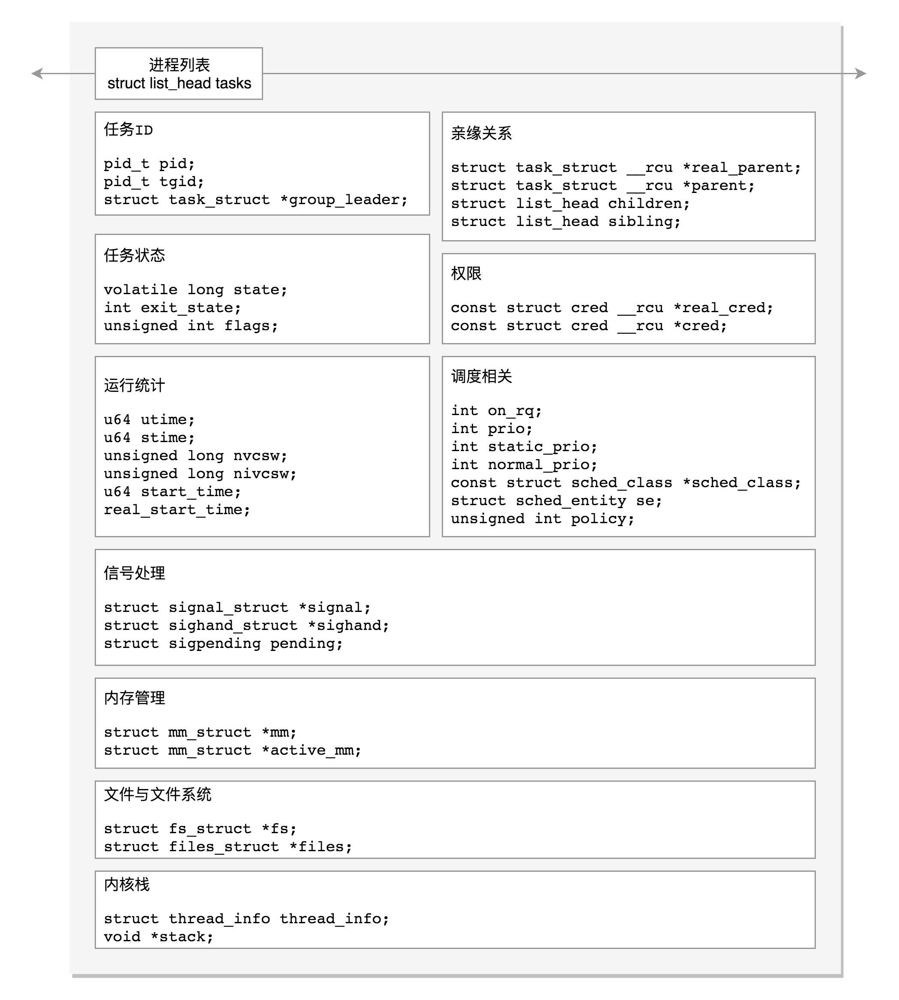

# 1. 进程

进程是程序的运行实例。当一段程序被同时运行多次时，就会创建多个进程。进程在Linux里也叫做task。

## 1.1 进程描述符

进程描述符(process descriptor)，结构类型是task_struct。用来记录进程的状态，存储线程的数据。



###1.1.1 任务ID

- pid，新建一个进程时，会在前一个进程的ID上加1，赋予新的进程，用来唯一标识这个进程。pid上限是32767，当到达上限时，会重用已经回收的进程的PID。
- tgid，标识该进程所属的线程组，如果某个task的pid等于tgid，则表明该task是线程组的主线程，由这个主线程创建的子线程，其tgid等于主线程的tgid也等于主线程的pid，每个线程都有自己独立的pid，也就是说线程数量不可能超过32767。
- group leader，指向线程组的主线程。

###1.1.2 亲缘关系

- *parent，指向其父进程，父进程是创建它的进程。
- \*real_parent，通常与\*parent一致，在debug的时候，会出现不一致。
- children，子进程链表的头结点，顺着头结点可以访问每一个子进程。
- sibling，该进程的兄弟进程。

###1.1.3 任务状态

- state，表示进程当前状态。
- exit_state，表示当前进程处于哪种退出状态。
- flags，是一个bitmap，表示线程的状态。从下面可以看出如何设置这个bitmap。

```
/* Used in tsk->state: */
#define TASK_RUNNING                    0
#define TASK_INTERRUPTIBLE              1
#define TASK_UNINTERRUPTIBLE            2
#define __TASK_STOPPED                  4
#define __TASK_TRACED                   8
/* Used in tsk->exit_state: */
#define EXIT_DEAD                       16
#define EXIT_ZOMBIE                     32
#define EXIT_TRACE                      (EXIT_ZOMBIE | EXIT_DEAD)
/* Used in tsk->state again: */
#define TASK_DEAD                       64
#define TASK_WAKEKILL                   128
#define TASK_WAKING                     256
#define TASK_PARKED                     512
#define TASK_NOLOAD                     1024
#define TASK_NEW                        2048
#define TASK_STATE_MAX                  4096
```


TASK_RUNNING表示进程处于可运行状态，不一定获得了CPU时间片，也就是不一定正在执行。

Linux中，有两种睡眠（挂起）状态，

1. TASK_INTERRUPTIBLE，可中断睡眠，当一个信号到来，进程可以被唤醒，醒来之后处理这个信号。处理完之后，继续睡眠或者退出睡眠。只有当真正等待的条件满足时，才醒来继续往下执行。
2. TASK_UNINTERRUPTIBLE，不可中断的睡眠。不可以被信号唤醒，只能等待满足条件之后才醒来。kill信号都不行，kill本身也是一个信号，也就是说，除了重启电脑，没有别的方法。

TASK_KILLABLE是一种可以终止的新睡眠状态，运行原理和TASK_UNINTERRUPTIBLE类似，只不过可以响应致命信号。

TASK_STOPPED是进程在收到SIGSTOP，SIGTSTP或者SIGTTOU信号之后进入的状态。

一个进程刚结束时，进入EXIT_ZOMBIE状态，此时仅保持进程的描述符，其余的都释放掉。只有等待父进程调用wait()类方法后，才彻底删除这个进程。之后进程的状态为EXIT_DEAD。

还有一些状态，我们称为标志。放在flags字段中，这些字段被定义为宏，以PF开头。例如

```
#define PF_EXITING		0x00000004
#define PF_VCPU			0x00000010
#define PF_FORKNOEXEC		0x00000040
```

PF_EXITING表示正在退出。PF_VCPU表示运行在虚拟CPU上，PF_FORKNOEXEC表示fork完了，还没有exec。

### 1.1.4 权限

\*real_cred表示谁能操作当前进程，\*cred表示当前进程能操作谁。

cred结构定义如下，cap_xxx表示拥有的能力。xxid都是用户和用户组的信息。

```
struct cred {
......
        kuid_t          uid;            /* real UID of the task */
        kgid_t          gid;            /* real GID of the task */
        kuid_t          suid;           /* saved UID of the task */
        kgid_t          sgid;           /* saved GID of the task */
        kuid_t          euid;           /* effective UID of the task */
        kgid_t          egid;           /* effective GID of the task */
        kuid_t          fsuid;          /* UID for VFS ops */
        kgid_t          fsgid;          /* GID for VFS ops */
......
        kernel_cap_t    cap_inheritable; /* caps our children can inherit */
        kernel_cap_t    cap_permitted;  /* caps we're permitted */
        kernel_cap_t    cap_effective;  /* caps we can actually use */
        kernel_cap_t    cap_bset;       /* capability bounding set */
        kernel_cap_t    cap_ambient;    /* Ambient capability set */
......
} __randomize_layout;

```

chmod u+s 命令，如果一个文件被设置这样的权限的话，任何进程在执行这个文件时，会获得该文件拥有者的权限，就可以像文件拥有者一样去执行这个文件。

需要了解setuid(uid)函数的原理。

