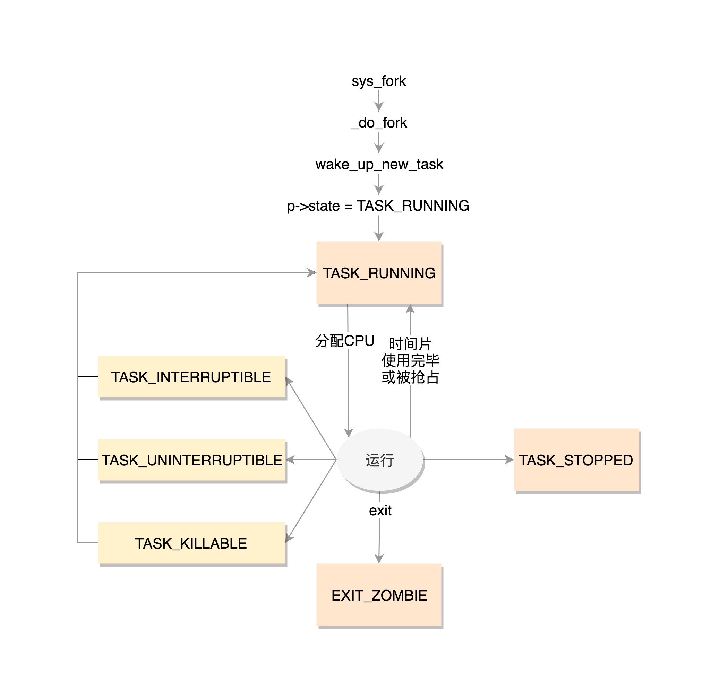

# 1. 进程

进程是程序的运行实例。当一段程序被同时运行多次时，就会创建多个进程。进程在Linux里也叫做task。

## 1.1 进程描述符

进程描述符(process descriptor)，结构类型是task_struct。用来记录进程的状态，存储线程的数据。


###1.1.1 任务ID

- pid，新建一个进程时，会在前一个进程的ID上加1，赋予新的进程，用来唯一标识这个进程。pid上限是32767，当到达上限时，会重用已经回收的进程的PID。
- tgid，标识该进程所属的线程组，如果某个task的pid等于tgid，则表明该task是线程组的主线程，由这个主线程创建的子线程，其tgid等于主线程的tgid也等于主线程的pid，每个线程都有自己独立的pid，也就是说线程数量不可能超过32767。
- group leader，指向线程组的主线程。

###1.1.2 亲缘关系

- *parent，指向其父进程，父进程是创建它的进程。
- \*real_parent，通常与\*parent一致，在debug的时候，会出现不一致。
- children，子进程链表的头结点，顺着头结点可以访问每一个子进程。
- sibling，该进程的兄弟进程。

###1.1.3 任务状态

- state，表示进程当前状态。
- exit_state，表示当前进程处于哪种退出状态。
- flags，是一个bitmap，表示线程的状态。从下面可以看出如何设置这个bitmap。

```c
/* Used in tsk->state: */
#define TASK_RUNNING                    0
#define TASK_INTERRUPTIBLE              1
#define TASK_UNINTERRUPTIBLE            2
#define __TASK_STOPPED                  4
#define __TASK_TRACED                   8
/* Used in tsk->exit_state: */
#define EXIT_DEAD                       16
#define EXIT_ZOMBIE                     32
#define EXIT_TRACE                      (EXIT_ZOMBIE | EXIT_DEAD)
/* Used in tsk->state again: */
#define TASK_DEAD                       64
#define TASK_WAKEKILL                   128
#define TASK_WAKING                     256
#define TASK_PARKED                     512
#define TASK_NOLOAD                     1024
#define TASK_NEW                        2048
#define TASK_STATE_MAX                  4096
```



TASK_RUNNING表示进程处于可运行状态，不一定获得了CPU时间片，也就是不一定正在执行。

Linux中，有两种睡眠（挂起）状态，

1. TASK_INTERRUPTIBLE，可中断睡眠，当一个信号到来，进程可以被唤醒，醒来之后处理这个信号。处理完之后，继续睡眠或者退出睡眠。只有当真正等待的条件满足时，才醒来继续往下执行。
2. TASK_UNINTERRUPTIBLE，不可中断的睡眠。不可以被信号唤醒，只能等待满足条件之后才醒来。kill信号都不行，kill本身也是一个信号，也就是说，除了重启电脑，没有别的方法。

TASK_KILLABLE是一种可以终止的新睡眠状态，运行原理和TASK_UNINTERRUPTIBLE类似，只不过可以响应致命信号。

TASK_STOPPED是进程在收到SIGSTOP，SIGTSTP或者SIGTTOU信号之后进入的状态。

一个进程刚结束时，进入EXIT_ZOMBIE状态，此时仅保持进程的描述符，其余的都释放掉。只有等待父进程调用wait()类方法后，才彻底删除这个进程。之后进程的状态为EXIT_DEAD。

还有一些状态，我们称为标志。放在flags字段中，这些字段被定义为宏，以PF开头。例如

```c
#define PF_EXITING			0x00000004
#define PF_VCPU					0x00000010
#define PF_FORKNOEXEC		0x00000040
```

PF_EXITING表示正在退出。PF_VCPU表示运行在虚拟CPU上，PF_FORKNOEXEC表示fork完了，还没有exec。

### 1.1.4 权限

\*real_cred表示谁能操作当前进程，\*cred表示当前进程能操作谁。

cred结构定义如下，cap_xxx表示拥有的能力。xxid都是用户和用户组的信息。

```c
struct cred {
......
        kuid_t          uid;            /* real UID of the task */
        kgid_t          gid;            /* real GID of the task */
        kuid_t          suid;           /* saved UID of the task */
        kgid_t          sgid;           /* saved GID of the task */
        kuid_t          euid;           /* effective UID of the task */
        kgid_t          egid;           /* effective GID of the task */
        kuid_t          fsuid;          /* UID for VFS ops */
        kgid_t          fsgid;          /* GID for VFS ops */
......
        kernel_cap_t    cap_inheritable; /* caps our children can inherit */
        kernel_cap_t    cap_permitted;  /* caps we're permitted */
        kernel_cap_t    cap_effective;  /* caps we can actually use */
        kernel_cap_t    cap_bset;       /* capability bounding set */
        kernel_cap_t    cap_ambient;    /* Ambient capability set */
......
} __randomize_layout;

```

chmod u+s 命令，如果一个文件被设置这样的权限的话，任何进程在执行这个文件时，会获得该文件拥有者的权限，就可以像文件拥有者一样去执行这个文件。

需要了解setuid(uid)函数的原理。


### 1.1.5 运行统计信息

这些字段用来记录该进程运行的时间信息

```c
u64								utime;// 用户态消耗的 CPU 时间
u64								stime;// 内核态消耗的 CPU 时间
unsigned long			nvcsw;// 自愿 (voluntary) 上下文切换计数
unsigned long			nivcsw;// 非自愿 (involuntary) 上下文切换计数
u64								start_time;// 进程启动时间，不包含睡眠时间
u64								real_start_time;// 进程启动时间，包含睡眠时间
```

### 1.1.6 进程调度

详解见进程调度章节

### 1.1.7 信号处理

task_struct里面的信号处理字段如下，

```c
/* Signal handlers: */
struct signal_struct		*signal;
struct sighand_struct		*sighand;
sigset_t								blocked;
sigset_t								real_blocked;
sigset_t								saved_sigmask;
struct sigpending				pending;
unsigned long						sas_ss_sp;
size_t									sas_ss_size;
unsigned int						sas_ss_flags;
```

blocked这个集合表示哪些信号暂不处理，pending表示哪些信号暂待处理，sighand表示正在被处理的信号。详解见信号处理章节。

### 1.1.8 内存管理

每个进程都有自己独立的虚拟内存空间，用mm_struct来表示。详解见内存管理章节。

```c
struct mm_struct                *mm;
struct mm_struct                *active_mm;
```

详见内存管理章节。

### 1.1.9 文件与文件系统

每个进程都有一个文件系统的数据结构，还有一个数据结构用来记录已打开文件。详解见文件系统章节。

```c
/* Filesystem information: */
struct fs_struct                *fs;
/* Open file information: */
struct files_struct             *files;
```

### 1.1.10 内核栈

进程一旦涉及到用户态和内核态切换，就会用到以下两个变量

```c
struct thread_info		thread_info;
void  *stack;
```

stack表示内核栈，进程在内核运行时，需要切换到内核栈。thread_info用来存储CPU上下文切换的信息。详见进程切换章节。

## 1.2 创建进程

###1.2.1 fork

在linux中，怎么创建进程呢？是使用fork()系统调用。内部的调用过程为fork -> sys_fork -> _do_fork，sys_fork的定义如下：

```c
SYSCALL_DEFINE0(fork)
{
......
	return _do_fork(SIGCHLD, 0, 0, NULL, NULL, 0);
}
```

sys_fork又会去调用_do_fork，

```c
long _do_fork(unsigned long clone_flags,
	      unsigned long stack_start,
	      unsigned long stack_size,
	      int __user *parent_tidptr,
	      int __user *child_tidptr,
	      unsigned long tls)
{
	struct task_struct *p;
	int trace = 0;
	long nr;


......
	p = copy_process(clone_flags, stack_start, stack_size,
			 child_tidptr, NULL, trace, tls, NUMA_NO_NODE);
......
	if (!IS_ERR(p)) {
		struct pid *pid;
		pid = get_task_pid(p, PIDTYPE_PID);
		nr = pid_vnr(pid);


		if (clone_flags & CLONE_PARENT_SETTID)
			put_user(nr, parent_tidptr);


......
		wake_up_new_task(p);
......
		put_pid(pid);
	} 
......
```

这里主要做了两件事，`copy_process`复制结构和`wake_up_new_task`唤醒线程。

### 1.2.2 copy_process

复制父进程就是复制它的进程描述符task_struct，按照下图逐一解释复制过程。


- 整体

  - 先调用alloc_task_struct_node，分配一个task_struct结构。
  - 调用memcpy将父进程的task_struct进程复制。
  - 此时所有的成员变量都指向父进程对应的值，也就是共用父进程的数据，之后一步步地创建自己的数据，与父进程彻底隔绝。

- 内核栈

  - 调用alloc_thread_stack_node，分配内存空间并创建一个栈赋值给task_struct的 void *stack成员变量。
  - 调用setup_thread_stack设置thread_info。

- 权限

  - 调用prepare_creds，在内存中分配一个新的struct cred结构，然后调用memcpy复制一份父进程的cred。
  - 将新进程的read_cred和cred都指向这个新创建的cred。

- 运行统计

  初始化变量值。

  ```c
  p->utime = p->stime = p->gtime = 0;
  p->start_time = ktime_get_ns();
  p->real_start_time = ktime_get_boot_ns();
  ```

- 调度相关

  - 调用__sched_fork，将on_rq设为0，初始化shed_entity，shed_entity的定义如下

    ```c
    struct sched_entity {
    	struct load_weight		load;
    	struct rb_node			run_node;
    	struct list_head		group_node;
    	unsigned int			on_rq;
    	u64				exec_start;
    	u64				sum_exec_runtime;
    	u64				vruntime;
    	u64				prev_sum_exec_runtime;
    	u64				nr_migrations;
    	struct sched_statistics		statistics;
    ......
    };
    ```

    初始化shed_entity就是把exec_start，sum_exec_runtime等涉及进程运行时间置零。

  - 设置进程的状态p->state设置为TASK_NEW。

  - 初始化优先级

  - 设置调度类，如果是普通进程，则设置sched_class = &fair_sched_class，公平调度。

  - 调用调度类的task_fork函数，将子进程和父进程的vruntime设为一样，这样就能防止父进程通过不断新建子进程来占用cpu。如果设置了让子进程先行，调用resched_curr，标记当前运行的进程TIF_NEED_RESCHED，这样下次调度的时候，父进程会被子进程抢占。

- 文件与文件系统

  ```c
  retval = copy_files(clone_flags, p);
  retval = copy_fs(clone_flags, p);
  ```

  copy_files是复制父进程打开的文件信息，这些信息存在一个结构files_struct中，每个打开的文件都有一个文件描述符。这里创建一个新的files_struct，然后将所有的文件描述符数组fdtable拷贝一份。

  copy_fs用于复制一个进程的目录信息，这些目录信息包括进程自己的根目录，根文件系统root，也有当前目录pwd，和当前目录的文件系统。

- 信号相关

  ```c
  init_sigpending(&p->pending);
  retval = copy_sighand(clone_flags, p);
  retval = copy_signal(clone_flags, p);
  ```

  copy_sighand会分配一个新的sighand_struct，主要是维护信号处理函数。然后调用memcpy将信号处理函数从父进程复制到子进程。

  copy_singal用于复制和维护发给这个进程的信号的数据结构。

- 内存空间

  ```c
  retval = copy_mm(clone_flags, p);
  ```

  进程都有自己的内存空间，用mm_struct结构来表示。copy_mm函数中调用dup_mm分配一个新的mm_struct结构。

- 任务ID

  - 分配pid，设置tid，group_leader。
  - 建立进程直接的亲缘关系。

至此，copy_process就结束了。

### 1.2.3 wake_up_new_task

新创建的进程，需要做些工作，才可能去抢占CPU。wake_up_new_task定义如下，

```c
void wake_up_new_task(struct task_struct *p)
{
	struct rq_flags rf;
	struct rq *rq;
......
	p->state = TASK_RUNNING;
......
	activate_task(rq, p, ENQUEUE_NOCLOCK);
	p->on_rq = TASK_ON_RQ_QUEUED;
	trace_sched_wakeup_new(p);
	check_preempt_curr(rq, p, WF_FORK);
......
}
```

1. 将state设置为TASK_RUNNING。
2. activate_task函数会调用enqueue_task，将进程放到运行队列里面，每个CPU有自己的多个运行队列，一个进程只能同时在一个队列里排队。如果是CFS的调度类，也就是公平调度，就会将进程放到cfs_rq，然后调用date_curr更新运行的统计量，将进程的sched_entity加入到红黑树（cfs_rq的实现是红黑树）里，设置se->on_rq = 1。
3. 调用check_preempt_curr，看能否抢占当前进程。如果前面设置了让子进程先运行，则直接返回。如果没有设置，就让父子进程PK一下，看是否要抢占，如果是，则标记父进程为TIF_NEED_RESCHED。抢占的时机为，fork系统调用返回的时候，因为进程抢占可以发生在系统调用返回的时候。