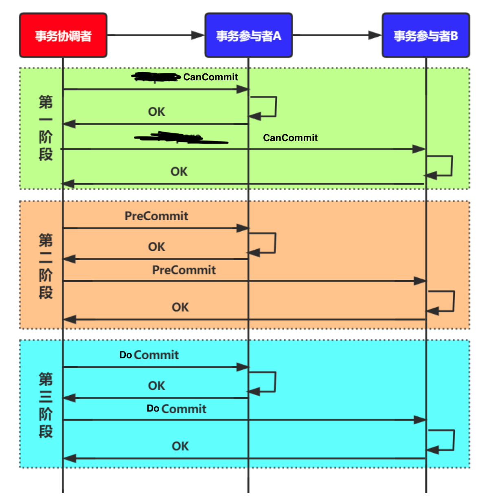

### 如何保障可靠性？

### 如何保障可用性？

### 负载均衡

### RocketMQ事务消息

### RocketMQ延时消息

### 基于XA的两阶段提交

XA 是一个分布式事务协议，规定了事务管理器和资源管理器接口。因此，XA 协议可以分为两部分，即事务管理器和本地资源管理器。

#### 2PC

两阶段提交协议的执行过程，分为投票（voting）和提交（commit）两个阶段。投票为第一阶段，协调者（Coordinator，即事务管理器）会向事务的参与者（Cohort，即本地资源管理器）发起执行操作的 CanCommit 请求，并等待参与者的响应。参与者接收到请求后，会执行请求中的事务操作，记录日志信息但不提交，待参与者执行成功，则向协调者发送“Yes”消息，表示同意操作；若不成功，则发送“No”消息，表示终止操作。

当所有的参与者都返回了操作结果（Yes 或 No 消息）后，系统进入了提交阶段。在提交阶段，协调者会根据所有参与者返回的信息向参与者发送 DoCommit 或 DoAbort 指令：

- 若协调者收到的都是“Yes”消息，则向参与者发送“DoCommit”消息，参与者会完成剩余的操作并释放资源，然后向协调者返回“HaveCommitted”消息；
- 如果协调者收到的消息中包含“No”消息，则向所有参与者发送“DoAbort”消息，此时发送“Yes”的参与者则会根据之前执行操作时的回滚日志对操作进行回滚，然后所有参与者会向协调者发送“HaveCommitted”消息；
- 协调者接收到“HaveCommitted”消息，就意味着整个事务结束了。

不足之处：

同步阻塞问题：二阶段提交算法在执行过程中，所有参与节点都是事务阻塞型的。也就是说，当本地资源管理器占有临界资源时，其他资源管理器如果要访问同一临界资源，会处于阻塞状态。

单点故障问题：基于 XA 的二阶段提交算法类似于集中式算法，一旦事务管理器发生故障，整个系统都处于停滞状态。尤其是在提交阶段，一旦事务管理器发生故障，资源管理器会由于等待管理器的消息，而一直锁定事务资源，导致整个系统被阻塞。

数据不一致问题：在提交阶段，当协调者向参与者发送 DoCommit 请求之后，如果发生了局部网络异常，或者在发送提交请求的过程中协调者发生了故障，就会导致只有一部分参与者接收到了提交请求并执行提交操作，但其他未接到提交请求的那部分参与者则无法执行事务提交。于是整个分布式系统便出现了数据不一致的问题。

#### 3PC

三阶段提交方法:

三阶段提交协议（Three-phase commit protocol，3PC），是对二阶段提交（2PC）的改进。为了解决两阶段提交的同步阻塞和单点故障问题，三阶段提交引入了超时机制和PreCommit阶段。

同时在协调者和参与者中引入超时机制。如果协调者或参与者在规定的时间内没有接收到来自其他节点的响应，就会根据当前的状态选择提交或者终止整个事务。在第一阶段和第二阶段中间引入了一个准备阶段，也就是在提交阶段之前，加入了一个预提交阶段。在预提交阶段排除一些不一致的情况，保证在最后提交之前各参与节点的状态是一致的。

### TCC(Try-Confirm-Cancel)

柔性事务方案之一，保证最终一致，步骤如下：

- 尝试执行业务，预留资源；

- 确认执行业务，使用Try阶段资源；

- 取消执行业务，释放Try阶段预留的资源；

#### 缺点

对业务有侵入，需要将业务接口改造为Try，Confirm，Cancel模式

#### TCC设计

1. 允许空回滚

   空回滚：Try未执行，Cancel执行了

   Cancel 接口设计时需要允许空回滚。在 Try 接口因为丢包时没有收到（或者执行超时），事务管理器会触发回滚，这时会触发 Cancel 接口，这时 Cancel 执行时发现没有对应的事务 xid 或主键时，需要返回回滚成功。让事务服务管理器认为已回滚，否则会不断重试，而 Cancel 又没有对应的业务数据可以进行回滚。

2. 防悬挂控制

   悬挂：由于网络拥堵，Try 请求超时，事务管理器生成回滚，执行了Cannel操作，但是最后收到了 Try 请求并执行了，但是事务管理器以为已经回滚成功，不会发出Confirm指令，于是该事务永远处于悬挂状态。

   解决方法：Cancel 空回滚返回成功之前先记录该条事务 xid 或业务主键，标识这条记录已经回滚过，Try 接口先检查这条事务xid或业务主键如果已经标记为回滚成功过，则不执行 Try 的业务操作。

3. 幂等控制

   Try, Cancel, Confirm均需要实现幂等。可以用事务 xid 或业务主键判重来控制。

### SAGA模型

另一种柔性事务方案，

- 每个Saga由一系列sub-transaction Ti 组成
- 每个Ti 都有对应的补偿动作Ci，补偿动作用于撤销Ti造成的结果

可以看到，和TCC相比，Saga没有“预留”动作，它的Ti就是直接提交到库。

**Saga的执行顺序有两种：**

- T1, T2, T3, ..., Tn
- T1, T2, ..., Tj, Cj,..., C2, C1，其中0 < j < n

**和TCC对比**

Saga相比TCC的缺点是缺少预留动作，导致补偿动作不一定能弥补之前的行为。

Saga优点：

- 有些业务很简单，套用TCC需要修改原来的业务逻辑，而Saga只需要添加一个补偿动作就行了。
- TCC最少通信次数为2n，而Saga为n（n=sub-transaction的数量）。
- 有些第三方服务没有Try接口，TCC模式实现起来就比较tricky了，而Saga则很简单。
- 不必担心预留资源释放的问题。

