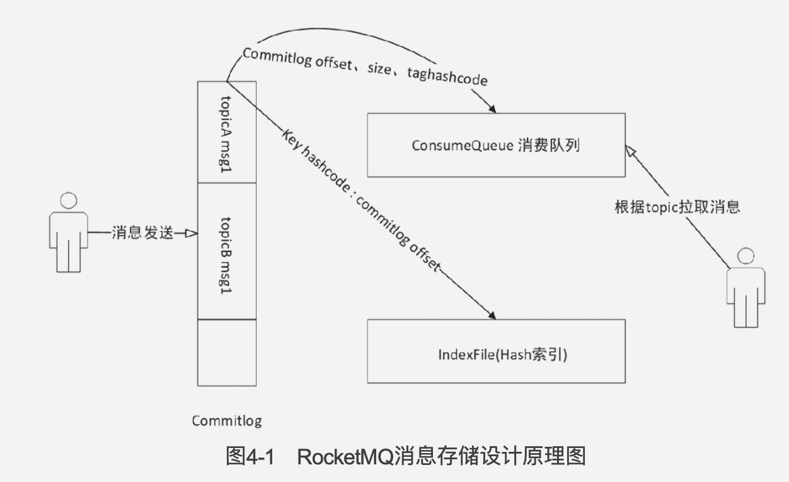
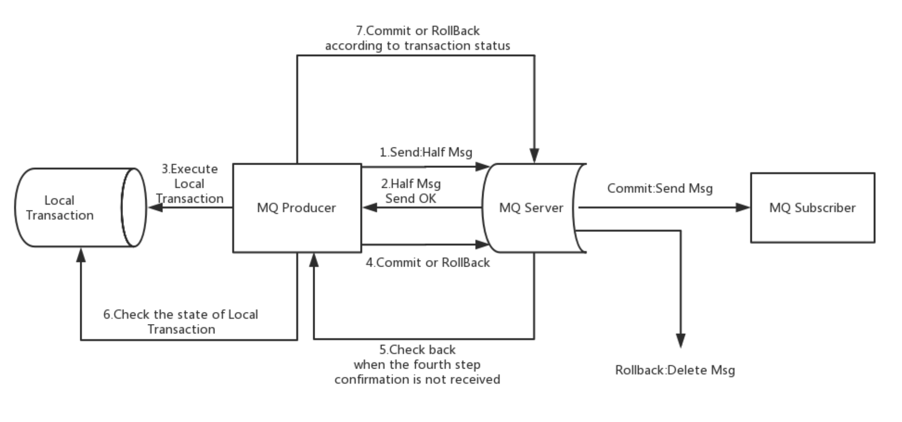

### 如何保障可靠性？

### 如何保障可用性？

### 消息存储

RocketMQ的存储文件包括Commitlog文件，ConsumeQueue文件，IndexFile文件，checkpoint文件，abort文件。

- Commitlog文件，所有的消息都顺序写入Commitlog中，存放在${ROCKET_HOME}/store/commitlog下，每个文件默认1G ，写满后新建一个。
- ConsumeQueue文件，存储消息消费队列，以Topic为目录存放。消息写入Commitlog文件后，将有线程异步将消息转发写入ConsumeQueue文件供消费者消费。
- IndexFile，存储消息的key与偏移量的对应关系，用于快速检索特定key的消息。
- checkpoint文件，记录了Commitlog文件，ConsumeQueue文件，IndexFile文件的上次刷盘时间点。
- Abort文件，Broker启动时创建${ROCKET_HOME}/store/abort文件，注册JVM退出钩子函数删除abort，如果Broker启动时，发现abort文件存在，说明上次退出是异常退出，需要修复数据。

#### 消息发送存储流程

1. 获取当前可写入的Commitlog文件，也就是获取该Commitlog对应的MappedFile对象。
2. 申请putMessageLock，申请成功才能写入Commitlog，因此Commitlog的写是串行的。
3. 如果MappedFile为空说明commitlog目录下不存在任何文件，说明是第一次收到消息，因此创建第一个Commitlog文件。
4. 设置消息存储时间，将消息追加到MappedFile中，通过对比当前写指针与文件大小来判断文件是否写满。
5. 创建全局唯一消息ID，消息ID=4字节IP + 4字节端口号 + 8字节消息偏移量。
6. 根据消息体长度，主题长度，属性长度计算消息总长度。
7. 如果消息总长度大于Commitlog文件剩余空间，会新创建一个Commitlog来存储该消息。
8. 将消息内容存到ByteBuffer中，等待刷盘。
9. 更新消息队列逻辑偏移量。
10. 释放putMessageLock。
11. 根据同步/异步刷盘将内存中的数据持久化到磁盘。

### RocketMQ消息发送

#### 消息结构

其中扩展属性包括：

- tag：用于过滤消息
- keys: Message索引键，可以根据这些Key快速检索到消息
- waitStoreMsgOk：发送消息时，是否等到消息存储完成再返回。
- delayTimeLevel：消息延迟级别

#### 消息发送过程

1. 消息验证，主题名称，消息体不能为空，消息长度不能超过4M。

2. 查找路由主题信息

   如果本地没有缓存topic的路由信息，则向NamerServer查询，最终得到TopicPublishInfo，（生产者每隔30s从NamerServer更新路由表）

   

3. 选择消息队列

   选择消息队列有两种方式，启用/不启用Broker故障延迟机制。默认为不启用。

   选择消息队列时，将TopicPublishInfo中的sendWhichQueue自增再获取值，与当前消息队列个数取模，返回该位置的MessageQueue。如果该队列发送失败，会继续尝试往下一个队列发送，这时存在一个问题，上一次发送失败大概率是由于Broker宕机导致，而随后选择的队列大概率还是在该Broker上，因此还是很有可能失败，于是引入Broker故障延迟机制，将该Broker暂时排除在选择范围之外。

4. 消息发送

   1. 根据MessageQueue获取Broker的网络地址
   2. 为消息分配全局唯一id，如果消息体超过4k则启用压缩
   3. 执行消息发送钩子函数（如果注册有）
   4. 构建消息发送包，包括生产者组，主题，该主题在单个Broker默认队列数，队列id，消息发送时间，消息扩展属性，消息重试次数。
   5. 根据消息发送方式，同步异步单向方式进行网络传输
   6. 执行消息发送钩子函数after逻辑。

### RocketMQ消息消费

#### 消息队列负载与重新分布

消息消费模式分为集群模式与广播模式，

集群模式：简单来说，Group内竞争，Group之间广播。具体一点，Topic中的一条消息只能被同一个Group中的一个消费者消费。

广播模式：Topic中的一条消息将被Group内所有消费者消费一次。 

Rebalance：集群模式下，由于消费者节点变动（新加入或移除）需要重新为每个消费者分配队列。步骤如下

1. 客户端中的RebalanceService**每隔20S**进行一次队列负载
2. 从主题定义信息缓存表中获取主题的**队列信息**；询问任意Broker，获取消费者组内的**全部消费者**。
3. **重新计算**每个消费者应该分配到的队列集合，计算方法推荐平均分配和平均轮询分配。
4. 每个消费者，**比较**新分配的队列集合和旧队列集合。停止消费不在新队列集合中的队列，对于新分配到的队列，创建该队列的PullRequest对象，加入到pullRequestQueue中。

#### 消息拉取机制

RocketMQ没有实现真正的推模式，它的推模式是客户端不断循环向服务端发送拉请求实现的。

当客户端发送拉取消息请求，而消息队列中没有可消费的消息时：

- 不启用长轮询机制，客户端请求会等待shortPollingTimeMills时候后被挂起，再去判断有无可消费消息，没有就返回PULL_NOT_FOUND。

#### 消息消费过程

消费者将消息从远端拉取之后存入ProcessQueue中，使用线程池来消费消息，分为两种消费模式，并发消费以及顺序消费。以下是并发消费的过程，调用ConsumeMessageConcurrentlyService#submitConsumeRequest：

1. 从ProcessQueue中批量获取消息并创建ConsumeRequest对象，ConsumeRequest只不过默认最多为32条消息，提交到消费线程池中进行消费。如果有多于32条消息，则创建多个ConsumeRequest对象。
2. 检查ProcessQueue的dropped标识，如果为true，说明该队列被分配给别的消费者了，于是停止该队列的消费。
3. 执行消费消息钩子函数consumeMessageBefore
4. 检查该消息的delayTimeLevel是否大于0，如果大于0说明要等待delayTimeLevel后再重试，设置该消息的主题名称为SCHEDULE_TOPIC，以便时间到后重新参与消费。PS：定时消息最初走的也是通过常规消息投递路径。
5. 执行具体的消息消费，并返回最终结果CONSUME_SUCCESS（消费成功）或者RECONSUME_LATER（需要重新消费）。
6. 执行消费消息钩子函数consumeMessageAfter。
7. 再次检查ProcessQueue的isDropped状态值，如果为true，则不对返回结果做任何处理，也就意味着该消息会在被别的消费者重复消费。
8. 如果消费结果RECONSUME_LATER，则执行sendMessageBack，发送给服务端进行重试。
9. 从ProcessQueue中移除这批消息，返回给服务端移除该批消息后最小的偏移量，然后用该偏移量更新消费进度，防止消费者重启重复消费消息。

消息重试：如果消息监听器返回消费结果为RECONSUME_LATER，则需要将这些消息发给Broker延迟消息进行重试。

1. 获取消费组的订阅配置信息，如果重试队列数量小于1，说明该消费组不支持重试。
2. 创建重试主题，重试主题名称：%RETRY%+消费组名称，并从重试队列中随机选择一个队列。
3. 消息重试次数加一，如果消息已重试超过最大次数限制，则将该消息放入DLQ（私信队列），RokcetMQ不再调度消费该消息了，需要人工干预。
4. 根据原先的消息创建一个新的消息对象，主题为重试主题，该消息拥有自己唯一消息id，并存入commitlog文件中，将原先的主题，消息ID存入消息的属性中，其他与原先消息保持相同。
5. 如果delayTimeLevel等于0（表示该消息要被立即再次消费），则放入之前选择的重试队列中。消费者组是默认订阅这个重试主题的，因此会自动消费这个主题的消息。
6. 如果delayTimeLevel>0，将该消息的主题更改为SCHEDULE_TOPIC_XXX，队列id为延迟级别-1，依托RocketMQ定时消息机制在延迟消息到期之后再次将消息拉取消费。

消息消费进度：在广播模式下，消息消费进度保存在消费者。在集群模式下，消息消费进度保存在服务端。

集群模式下更新消费进度的方式：

1. 消费者线程在处理完一个消息消费任务后，会从ProcessQueue中移除本批消息，并返回ProcessQueue中最小的偏移量，用该偏移量更新服务端的消费进度。其实当前消费任务跟这个偏移量并没有必然的联系，例如现在有task1(10, 20)，task2(20,40), task(50,70)，由于task1未完成，即使task2,taks3完成了，最小偏移量仍然是10。这就出现了消费进度无法推进的情况，于是RocketMQ引入了一种机制，当最大偏移量和最小偏移量差距太大，将停止拉取消息。
2. 进行消息负载时，如果消息消费队列被分配给其他消费者，此时ProcessQueue状态将被设置为droped，持久化该消息队列的消费进度，并从内存中移除。？？？

#### 顺序消息消费

RocketMQ支持局部消息顺序消费，可以确保同一个消息消费队列中的消息被顺序消费。如果要做到全局顺序消费，可以将主题配置成一个队列。

RocketMQ从以下两方面保证消息的顺序消费：

1. 消息队列负载：经过消息队列重新负载之后，分配到新的队列时，需要尝试向Broker发起锁定该消息队列的请求，如果加锁成功则创建该队列的拉取任务。如果失败则要等到下次重新负载时再尝试加锁。因此顺序消费和并发消费的一个关键区别是，顺序消费在创建消息队列拉取任务时，要请求Broker锁定该消息队列。
2. 消息消费阶段：消费者线程池中的线程将争抢ProcessQueue的锁，只有抢到锁的线程才能消费ProcessQueue中的消息，也就是一个消息消费队列同一时刻只会被线程池中一个线程消费。

### RocketMQ事务消息

RocketMQ事务消息基于两阶段提交和事务状态回查机制来实现。两阶段提交即先发送prepare消息，待事务提交或回滚再发送commit/rollback指令。结合定时任务，RocketMQ使用专门的线程池以特定的频率对RocketMQ服务器上的prepare信息进行处理，向消息发送者查询事务状态来决定是否回滚或者提交消息。

### RocketMQ定时消息

RocketMQ支持18个级别的延时等级，默认值为“1s 5s 10s 30s 1m 2m 3m 4m 5m 6m 7m 8m 9m 10m

20m 30m 1h 2h”，生产者发消息时通过设置delayLevel选择。

为什么不支持任意时间精度的调度，是因为需要对消息进行排序，造成巨大的性能损耗。

创建定时消息流程如下：

1. 客户端发送消息，如果发送的消息delayLevel大于0，则改变消息主题为SCHEDULE_TOPIC_XXXX，消息队列为delayLevel-1。
2. 定时任务根据delayLevel间隔时长，定期从延时队列中拉取所有消息。
3. 根据消息的物理偏移量与消息大小从CommitLog中拉取消息
4. 根据消息属性重建消息，并回复原主题，原队列ID，清除delayLevel属性，存入commitlog文件。
5. 转发到原主题的消息消费队列，供消费者消费。

### 基于XA的两阶段提交

XA 是一个分布式事务协议，规定了事务管理器和资源管理器接口。因此，XA 协议可以分为两部分，即事务管理器和本地资源管理器。

#### 2PC

两阶段提交协议的执行过程，分为投票（voting）和提交（commit）两个阶段。投票为第一阶段，协调者（Coordinator，即事务管理器）会向事务的参与者（Cohort，即本地资源管理器）发起执行操作的 CanCommit 请求，并等待参与者的响应。参与者接收到请求后，会执行请求中的事务操作，记录日志信息但不提交，待参与者执行成功，则向协调者发送“Yes”消息，表示同意操作；若不成功，则发送“No”消息，表示终止操作。

当所有的参与者都返回了操作结果（Yes 或 No 消息）后，系统进入了提交阶段。在提交阶段，协调者会根据所有参与者返回的信息向参与者发送 DoCommit 或 DoAbort 指令：

- 若协调者收到的都是“Yes”消息，则向参与者发送“DoCommit”消息，参与者会完成剩余的操作并释放资源，然后向协调者返回“HaveCommitted”消息；
- 如果协调者收到的消息中包含“No”消息，则向所有参与者发送“DoAbort”消息，此时发送“Yes”的参与者则会根据之前执行操作时的回滚日志对操作进行回滚，然后所有参与者会向协调者发送“HaveCommitted”消息；
- 协调者接收到“HaveCommitted”消息，就意味着整个事务结束了。

不足之处：

同步阻塞问题：二阶段提交算法在执行过程中，所有参与节点都是事务阻塞型的。也就是说，当本地资源管理器占有临界资源时，其他资源管理器如果要访问同一临界资源，会处于阻塞状态。

单点故障问题：基于 XA 的二阶段提交算法类似于集中式算法，一旦事务管理器发生故障，整个系统都处于停滞状态。尤其是在提交阶段，一旦事务管理器发生故障，资源管理器会由于等待管理器的消息，而一直锁定事务资源，导致整个系统被阻塞。

数据不一致问题：在提交阶段，当协调者向参与者发送 DoCommit 请求之后，如果发生了局部网络异常，或者在发送提交请求的过程中协调者发生了故障，就会导致只有一部分参与者接收到了提交请求并执行提交操作，但其他未接到提交请求的那部分参与者则无法执行事务提交。于是整个分布式系统便出现了数据不一致的问题。

#### 3PC

三阶段提交方法:

三阶段提交协议（Three-phase commit protocol，3PC），是对二阶段提交（2PC）的改进。为了解决两阶段提交的同步阻塞和单点故障问题，三阶段提交引入了超时机制和PreCommit阶段。

同时在协调者和参与者中引入超时机制。如果协调者或参与者在规定的时间内没有接收到来自其他节点的响应，就会根据当前的状态选择提交或者终止整个事务。在第一阶段和第二阶段中间引入了一个准备阶段，也就是在提交阶段之前，加入了一个预提交阶段。在预提交阶段排除一些不一致的情况，保证在最后提交之前各参与节点的状态是一致的。

### TCC(Try-Confirm-Cancel)

柔性事务方案之一，保证最终一致，步骤如下：

- 尝试执行业务，预留资源；

- 确认执行业务，使用Try阶段资源；

- 取消执行业务，释放Try阶段预留的资源；

#### 缺点

对业务有侵入，需要将业务接口改造为Try，Confirm，Cancel模式

#### TCC设计

1. 允许空回滚

   空回滚：Try未执行，Cancel执行了

   Cancel 接口设计时需要允许空回滚。在 Try 接口因为丢包时没有收到（或者执行超时），事务管理器会触发回滚，这时会触发 Cancel 接口，这时 Cancel 执行时发现没有对应的事务 xid 或主键时，需要返回回滚成功。让事务服务管理器认为已回滚，否则会不断重试，而 Cancel 又没有对应的业务数据可以进行回滚。

2. 防悬挂控制

   悬挂：由于网络拥堵，Try 请求超时，事务管理器生成回滚，执行了Cannel操作，但是最后收到了 Try 请求并执行了，但是事务管理器以为已经回滚成功，不会发出Confirm指令，于是该事务永远处于悬挂状态。

   解决方法：Cancel 空回滚返回成功之前先记录该条事务 xid 或业务主键，标识这条记录已经回滚过，Try 接口先检查这条事务xid或业务主键如果已经标记为回滚成功过，则不执行 Try 的业务操作。

3. 幂等控制

   Try, Cancel, Confirm均需要实现幂等。可以用事务 xid 或业务主键判重来控制。

### SAGA模型

另一种柔性事务方案，

- 每个Saga由一系列sub-transaction Ti 组成
- 每个Ti 都有对应的补偿动作Ci，补偿动作用于撤销Ti造成的结果

可以看到，和TCC相比，Saga没有“预留”动作，它的Ti就是直接提交到库。

**Saga的执行顺序有两种：**

- T1, T2, T3, ..., Tn
- T1, T2, ..., Tj, Cj,..., C2, C1，其中0 < j < n

**和TCC对比**

Saga相比TCC的缺点是缺少预留动作，导致补偿动作不一定能弥补之前的行为。

Saga优点：

- 有些业务很简单，套用TCC需要修改原来的业务逻辑，而Saga只需要添加一个补偿动作就行了。
- TCC最少通信次数为2n，而Saga为n（n=sub-transaction的数量）。
- 有些第三方服务没有Try接口，TCC模式实现起来就比较tricky了，而Saga则很简单。
- 不必担心预留资源释放的问题。

