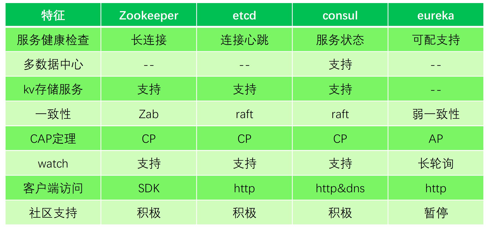
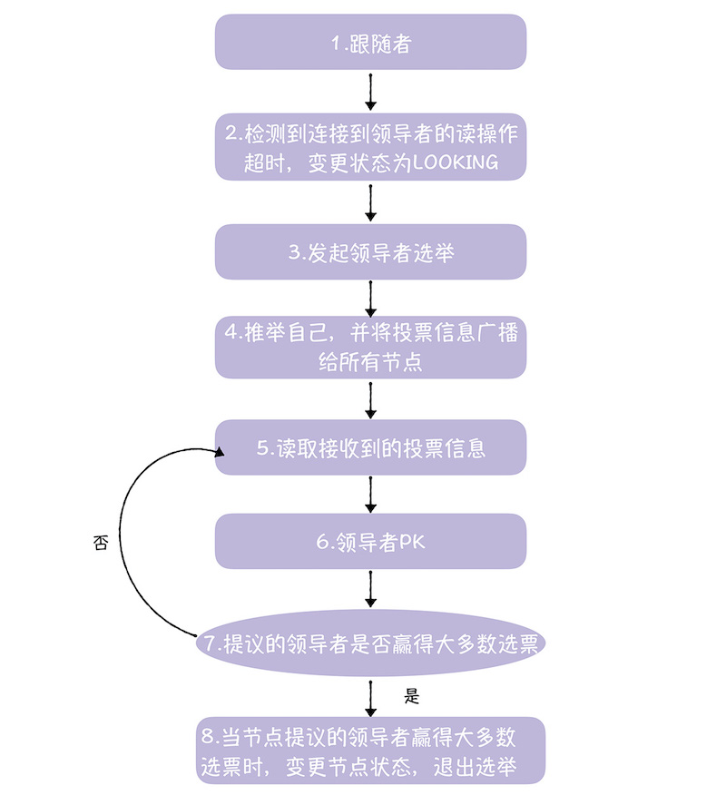
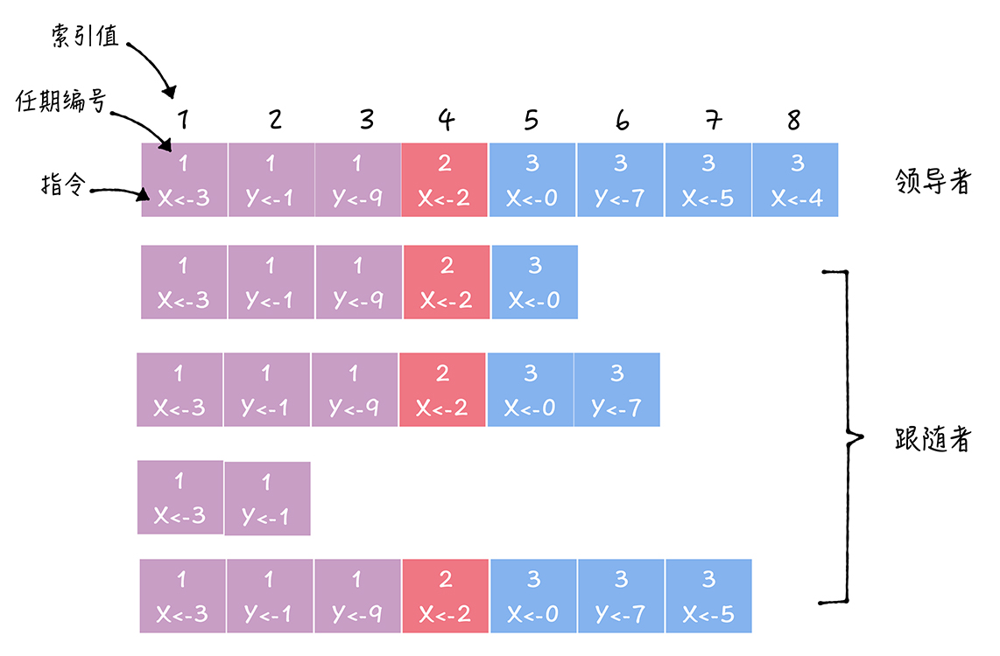
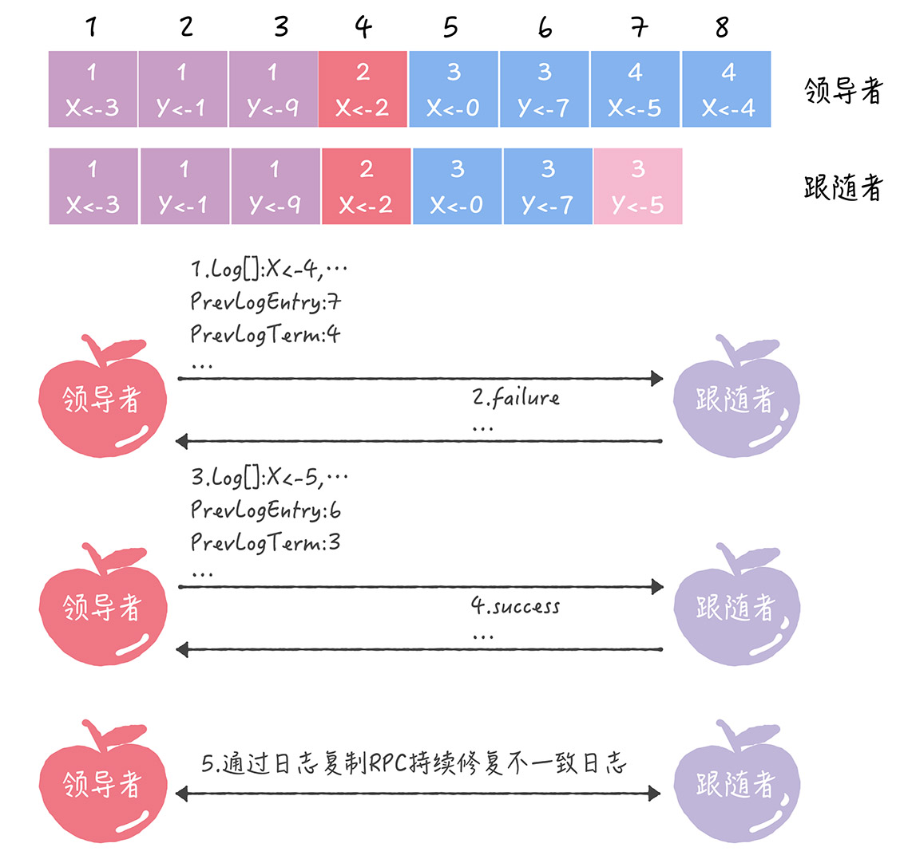

## 注册中心作用及设计分析

### 什么是注册中心？

用来实现微服务实例的自动注册与发现，是分布式系统中的核心基础服务

### 主要功能

- 服务注册

  服务提供方将自身路由信息，服务信息发布到注册中心，供消费方获取用于与提供方建立连接并发起调用。

  （路由信息： 节点IP，端口，服务信息：序列化协议，路由规则，节点权重）

- 服务发现

  服务消费方通过访问注册中心获取服务提供方节点路由信息。

  - 服务消费方启动后，从注册中心拉取服务提供方节点列表，建立连接，进行RPC调用。

  - 接受注册中心变更通知，重新获取数据，更新节点列表。
  - 服务消费方运行过程中定时拉取服务提供节点列表，更新本地数据。

- 健康检查

  确保已注册节点健康度，能够及时准确剔除失效节点，保证服务发现正确性

- 变更通知

  当服务提供方节点发生变更时，注册中心应该能够第一时间把变更事件或变更后的数据推送到服务订阅方。

- 服务治理相关

  服务扩/缩容，机器迁移，权重，灰度流量

### 设计实现

- 数据存储，需要存储的数据有

  - 每个服务节点的信息
  - 每种服务的集群信息
  - 每个节点订阅者的信息

- 超时处理

  当注册中心在超时时长内未收到服务节点的心跳，需要移除该节点信息。以下提供一种超时扫描方法

  

  1. 服务节点向注册中心发起首次心跳时，带上参数expireTime(当前时间加上超时时长)，注册中心收到后，利用expireTime%BUCKET_SIZE算出，应该将这个节点放到哪个桶中。
  2. 服务节点在下一次心跳时，带上两个参数， oldexpireTime上一次心跳发送的expireTime，newexpireTime新的过期时间，注册中心根据oldexpireTime%BUCKET_SIZE找到对应的桶，将该节点从中移除（如果该节点不发心跳了，该节点就会一直留在那个桶中）。根据newexpireTime%BUCKET_SIZE找到新的桶，将该节点放到新的桶中。
  3. 注册中心每隔一秒访问一个桶，留在桶中的节点都是心跳超时的节点，不健康的节点，因此会被注册中心移除出节点列表。

  上述算法的优点是，不需要每次都遍历所有节点来判断是否过期。但是节点数少的时候，例如1000以内，每次都遍历所有节点其实也能接受。

- 实现思路

  1. 自带存储，保证数据一致性
  2. 逻辑+配套存储(Redis)

一个注册中心节点发生变更，怎么将变更通知到其他节点？Gossip协议

Gossip 过程是由种子节点发起，当一个种子节点有状态需要更新到网络中的其他节点时，它会随机的选择周围几个节点散播消息，收到消息的节点也会重复该过程，直至最终网络中所有的节点都收到了消息。这个过程可能需要一定的时间，由于不能保证某个时刻所有节点都收到消息，但是理论上最终所有节点都会收到消息，因此它是一个最终一致性协议。

- 六度分离理论
- 周期性散播消息
- 随机选择N个节点散播
- 散播不重复(不是严格不重复)不回传

Gossip缺陷： 1. 消息延迟 2. 消息冗余，可能消息会重复发到同一个节点

### 注册中心选型对比



ZK是顺序一致性。

## Nacos分析

### 健康检查

对于临时节点（随时可能下线节点）采用心跳注册，临时实例使用心跳上报方式维持活性，5秒上报，15秒标记不健康，30秒剔除。对于持久化节点，采用tcp/http探测。

### 数据模型

- 数据存储

  

- 数据隔离

  四层数据隔离 1. 账号 2. 命名空间指定集群 3.分组 4.服务名标识服务   

- 数据一致性

  Raft CP一致性， Distro AP一致性

  Distro协议，每个节点维护注册在自己这里节点的心跳，通过广播的形式同步到其他节点。

## Zookeeper，Zab分析

Zab协议（Zookeeper Atomic Broadcast）

### 实现操作顺序性

如何实现？

- 将每个操作设定为一个提案，并赋予一个自增的ZXID
- Leader节点通过TPC协议保障提案有序地发送到Follwer节点？？？
- 按照ZXID，顺序提交提案，前一个提案未提交之前不能提交下一个

### 选主逻辑

节点角色：

server节点组成的一个集群，在集群中存在一个唯一的leader节点负责响应写入请求，其他节点只负责接收

转发Client请求。

Leader：响应写入请求，发起提案，超过半数Follower同意写入，写入成功；

Follower：响应查询，将写入请求发给Leader，参与选举和写入投票

ObServer：响应查询，将写入请求发给Leader，不参与投票，只接收写入结果

节点状态：

- LOOKING：选举状态，该状态下的节点认为当前集群中没有领导者，会发起领导者选举。
- FOLLOWING ：跟随者状态，意味着当前节点是跟随者。
- LEADING ：领导者状态，意味着当前节点是领导者。
- OBSERVING： 观察者状态，意味着当前节点是观察者。

获得过半投票数为新主，投票数据<proposedLeader, proposedEpoch, ZXID, node>

- proposedLeader，节点提议的，领导者的集群 ID，也就是在集群配置（比如 myid 配置文件）时指定的 ID。
- proposedEpoch，节点提议的，领导者的任期编号。
- proposedLastZxid，事务标识符，越大表示数据越新。
- node，投票的节点，比如节点 B。

比较策略：proposedEpoch大的胜出，proposedEpoch相同比较proposedLastZxid大的胜出，proposedLastZxid相同比较proposedLeader大的胜出。

选主流程：



- 领导者选举的目标，是选举出大多数节点中数据最完整的节点，也就是大多数节点中事务标识符值最大的节点。
- 逻辑时钟（logicclock）（也就是选举的轮次），会影响选票的有效性，具体来说，逻辑时钟大的节点不会接收来自值小的节点的投票信息。
- 在领导者选举的实现中，事务标识符采用的是 dataTree.lastProcessedZxid 的值。需要你特别注意的是，在跟随者节点正常运行时，dataTree.lastProcessedZxid 表示的是已提交提案的事务标识符最大值，但当跟随者检测到异常，退出跟随者状态时（在 follower.shutdown() 函数中），跟随者会将所有未提交提案提交，并使用 lastProcessedZxid 表示节点上提案（包括刚提交的提案）的事务标识符的最大值，在接下来的领导者选举中，使用的也是该值，也就是说，ZAB 的领导者选举，选举出的是大多数节点中数据最完整的节点。

### 故障恢复

ZAB 定义了 4 种状态，来标识节点的运行状态。

- ELECTION（选举状态）：表明节点在进行领导者选举；
- DISCOVERY（成员发现状态）：表明节点在协商沟通领导者的合法性；
- SYNCHRONIZATION（数据同步状态）：表明集群的各节点以领导者的数据为准，修复数据副本的一致性；
- BROADCAST（广播状态）：表明集群各节点在正常处理写请求。

在节点完成了选举，退出ELECTION状态后，进入DISCOVERY状态

1. 成员发现

   成员发现是通过跟随者和领导者交互来完成的，目标是确保大多数节点对领导者的领导关系没有异议，也就是确立领导者的领导地位。

   

   FOLLOWINFO: 节点已接受的领导者任期编号最大值

   LEADINFO: 包含自己事务标识符最大值<新任期值，0>

   Follower接收到来自领导者的 LEADINFO 消息后，跟随者会基于领导者的任期编号，判断领导者是否合法，如果领导者不合法，跟随者发起新的选举，如果领导者合法，响应 ACKEPOCH（里面包含了自己最大的ZXID） 消息给领导者。

   ```java
   // 创建ACKEPOCH消息，包含已提交提案的事务标识符最大值
   QuorumPacket ackNewEpoch = new QuorumPacket(Leader.ACKEPOCH, lastLoggedZxid, epochBytes, null);
   // 响应ACKEPOCH消息给领导者
   writePacket(ackNewEpoch, true);
   ```

   

2. 数据同步

   

   1. 领导者根据跟随者的事务标识符值最大值，判断用哪种方式处理不一致数据，领导者向跟随者同步数据的三种方式（TRUNC、DIFF、SNAP）：

      TRUNC：通知跟随者丢弃超出的那部分提案。

      DIFF： 领导者会同步给跟随者缺失的已提交的提案。

      SNAP：跟随者缺失的提案比较多时，领导者同步快照数据给跟随者，并直接覆盖跟随者本地的数据。

   2. 领导者创建 NEWLEADER 消息，并缓存在发送队列中。

   3. 领导者调用 startSendingPackets() 函数，启动一个新线程，并将缓存的数据发送给跟随者。

   4. 跟随者调用 syncWithLeader() 函数，处理来自领导者的数据同步。

   5. 在 syncWithLeader() 函数，跟随者接收到来自领导者的 NEWLEADER 消息后，返回确认响应给领导者。

      ```java
      writePacket(new QuorumPacket(Leader.ACK, newLeaderZxid, null, null), true);
      ```

   6. 领导者等待来自大多数节点的 NEWLEADER 消息的响应。

   7. 当领导者接收到来自大多数节点的 NEWLEADER 消息的响应时，在 Leader.lead() 函数中，领导者设置 ZAB 状态为广播状态。并发送 UPTODATE 消息给所有跟随者，通知它们数据同步已完成了。

   8. 当跟随者接收到 UPTODATE 消息时，就知道自己修复完数据不一致了，可以处理写请求了，就设置 ZAB 状态为广播。

   

### 读写操作

Zookeeper的读请求可以在所有节点上，而写请求只能在主节点上，因此写请求的性能约等于单机。

写操作过程：


## Raft算法

Raft中有三种成员身份

- 跟随者：就相当于普通群众，默默地接收和处理来自领导者的消息，当等待领导者心跳信息超时的时候，就主动站出来，推荐自己当候选人。
- 候选人：候选人将向其他节点发送请求投票（RequestVote）RPC 消息，通知其他节点来投票，如果赢得了大多数选票，就晋升当领导者。
- 领导者：蛮不讲理的霸道总裁，一切以我为准，平常的主要工作内容就是 3 部分，处理写请求、管理日志复制和不断地发送心跳信息，通知其他节点“我是领导者，我还活着，你们现在不要发起新的选举，找个新领导者来替代我。”

### 选主过程

- 首先，在初始状态下，集群中所有的节点ABC都是跟随者的状态。每个节点等待领导者节点心跳信息的超时时间间隔是随机的(150ms~300ms)
- 由于现在还没有领导者，假设A节点最先发生超时，它将自己的任期Term+1（之前0，现在1），然后向其他节点发送请求投票 RPC 消息，请它们选举自己为领导者。
- 其他节点B，C接收到候选人 A 的请求投票 RPC 消息，在编号为 1 的这届任期内，也还没有进行过投票，按照投票规则，它决定将把选票投给节点 A，并增加自己的任期编号。（具体投票规则在下面）
- 如果候选人A在选举超时时间（随机设定超时时间）内赢得了大多数选票，那么A就会成为本届任期内新的领导者。
- 节点 A 当选领导者后，他将周期性地发送心跳消息，通知BC我是领导者，阻止跟随者发起新的选举，篡权。

投票规则：

1. 在一次选举中，每一个服务器节点最多会对一个任期编号投出一张选票，并且按照“先来先服务”的原则进行投票。

2. 不会投票给任期小于自己当前任期的节点。

3. 日志完整性高的跟随者（也就是最后一条日志项对应的任期编号值更大，索引号更大），拒绝投票给日志完整性低的候选人。比如节点 B 的任期编号为 3，节点 C 的任期编号是 4，节点 B 的最后一条日志项对应的任期编号为 3，而节点 C 为 2，那么当节点 C 请求节点 B 投票给自己时，节点 B 将拒绝投票。（因此不是说任期小的一定投给任期大的）

   

   

节点间如何通讯：

1. 请求投票（RequestVote）RPC，是由候选人在选举期间发起，通知各节点进行投票；
2. 日志复制（AppendEntries）RPC，是由领导者发起，用来复制日志和提供心跳消息。

任期：

- 跟随者在等待领导者心跳信息超时后，推举自己为候选人时，会增加自己的任期号，比如节点 A 的当前任期编号为 0，那么在推举自己为候选人时，会将自己的任期编号增加为 1。
- 如果一个服务器节点，发现自己的任期编号比其他节点小，那么它会更新自己的编号到较大的编号值。比如节点 B 的任期编号是 0，当收到来自节点 A 的请求投票 RPC 消息时，因为消息中包含了节点 A 的任期编号，且编号为 1，那么节点 B 将把自己的任期编号更新为 1。
- 在 Raft 算法中约定，如果一个候选人或者领导者，发现自己的任期编号比其他节点小，那么它会立即恢复成跟随者状态。比如分区错误恢复后，任期编号为 3 的领导者节点 B，收到来自新领导者的，包含任期编号为 4 的心跳消息，那么节点 B 将立即恢复成跟随者状态。
- 还约定如果一个节点接收到一个包含较小的任期编号值的请求，那么它会直接拒绝这个请求。比如节点 C 的任期编号为 4，收到包含任期编号为 3 的请求投票 RPC 消息，那么它将拒绝这个消息。再比如一个节点收到来自上一任领导者的写请求，将会拒绝该请求。

如何理解随机超时时间：

Raft 算法巧妙地使用随机选举超时时间的方法，把超时时间都分散开来，在大多数情况下只有一个服务器节点先发起选举，而不是同时发起选举，这样就能减少因选票瓜分导致选举失败的情况。

跟随者等待领导者心跳信息超时的时间间隔，是随机的；  

如果候选人在一个随机时间间隔内，没有赢得过半票数，那么选举无效了，然后候选人发起新一轮的选举，也就是说，等待选举超时的时间间隔，是随机的。   

### 复制日志

副本数据是以日志的形式存在的，日志是由日志项组成，日志项包括指令（Command），索引值（Log index）、任期编号（Term）。



1. 接收到客户端请求后，领导者基于客户端请求中的指令，创建一个新日志项，并附加到本地日志中。
2. 领导者通过日志复制 RPC，将新的日志项复制到其他的服务器。
3. 当领导者将日志项，成功复制到大多数的服务器上的时候，领导者会将这条日志项应用到它的状态机中。
4. 领导者将执行的结果返回给客户端。
5. 当跟随者接收到心跳信息，或者新的日志复制 RPC 消息后，如果跟随者发现领导者已经提交了某条日志项，而它还没应用，那么跟随者就将这条日志项应用到本地的状态机中。

实现日志一致

在 Raft 算法中，领导者通过强制跟随者直接复制自己的日志项，处理不一致日志。也就是说，Raft 是通过以领导者的日志为准，来实现各节点日志的一致的。具体有 2 个步骤。

- 首先，领导者通过日志复制 RPC 的一致性检查，找到跟随者节点上，与自己相同日志项的最大索引值。也就是说，这个索引值之前的日志，领导者和跟随者是一致的，之后的日志是不一致的了。
- 然后，领导者强制跟随者更新覆盖的不一致日志项，实现日志的一致。

详细过程如下：

PrevLogEntry：表示当前要复制的日志项，前面一条日志项的索引值。比如在图中，如果领导者将索引值为 8 的日志项发送给跟随者，那么此时 PrevLogEntry 值为 7。

PrevLogTerm：表示当前要复制的日志项，前面一条日志项的任期编号，比如在图中，如果领导者将索引值为 8 的日志项发送给跟随者，那么此时 PrevLogTerm 值为 4。



1. 领导者通过日志复制 RPC 消息，发送当前最新日志项到跟随者（为了演示方便，假设当前需要复制的日志项是最新的），这个消息的 PrevLogEntry 值为 7，PrevLogTerm 值为 4。
2. 如果跟随者在它的日志中，找不到与 PrevLogEntry 值为 7、PrevLogTerm 值为 4 的日志项，也就是说它的日志和领导者的不一致了，那么跟随者就会拒绝接收新的日志项，并返回失败信息给领导者。
3. 这时，领导者会递减要复制的日志项的索引值，并发送新的日志项到跟随者，这个消息的 PrevLogEntry 值为 6，PrevLogTerm 值为 3。
4. 如果跟随者在它的日志中，找到了 PrevLogEntry 值为 6、PrevLogTerm 值为 3 的日志项，那么日志复制 RPC 返回成功，这样一来，领导者就知道在 PrevLogEntry 值为 6、PrevLogTerm 值为 3 的位置，跟随者的日志项与自己相同。
5. 领导者通过日志复制 RPC，复制并更新覆盖该索引值之后的日志项（也就是不一致的日志项），最终实现了集群各节点日志的一致。

### 节点变更问题

当集群加入新机器的时候，如果此时老机器中一台机器与其余老机器形成孤岛，他发起选举获得了所有新机器的投票，而所有新机器占了“大多数”，选举就会成功。那么将存在两个领导者，一个是老机器们原来的领导者，一个是新选举的领导者。

为了解决这个问题，成员变更将一个节点一个节点进行，而不是批量进行。

