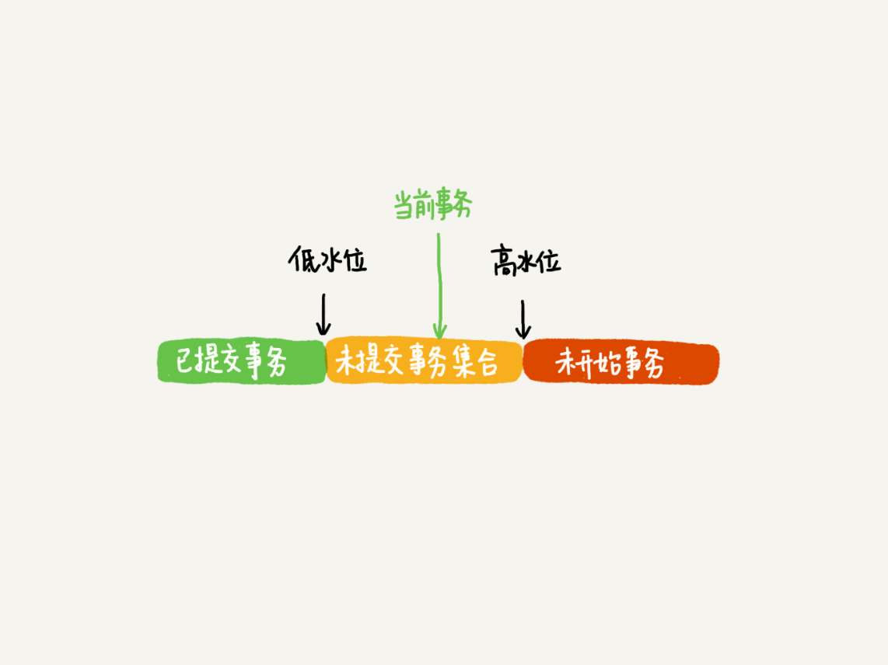

# 2. 日志系统

##一条SQL更新语句是如何执行的？

```sql
mysql> create table T(ID int primary key, c int);
mysql> update T set c=c+1 where ID=2;
```


## 两阶段提交

更新完内存中的数据之后，写入redo log，并处于prepare阶段，但并事务没有提交，即使此时

刷盘，之后被读出来依然是未提交数据。等到binlog写入完成，将事务正式提交，处于commit状态。

两阶段提交的目的是为了保证数据库的状态和用它的日志恢复出来的库的状态一致，如果没有两阶段提交，无论先写binlog还是先写redo log，在系统崩溃的情况下，都会出错。


如果在写入redo log之后，在写binlog之前，发生宕机，重启之后，因为redo log没有提交，binlog还没有写，因此这个事务会回滚。

在写入binlog之后，提交事务之前宕机，重启之后：

1. 如果redo log里面的事务是完整的，也就是有了commit标识，则直接提交。
2. 如果redo log里的事务只有完整的prepare，则判断对应事务的binlog是否存在并完整
   - 如果是，则提交事务。
   - 否则，回滚事务。

**如何知道一个事务binlog是完整的？**

statement格式的binlog，末尾会有一个COMMIT。row 格式的binlog，最后会有一个XID event。还有binlog-checksum参数来验证其正确性。

**redo log和binlog怎么关联起来?**

他们有一个共同的数据字段，叫做XID。

**只用binlog能否支持崩溃恢复？**

不能，MySQL以前的默认引擎是MyISAM引擎，没有redo log，而binlog是一直都有的，但是不支持崩溃恢复。binlog没有能力恢复数据页，因为宕机之后，不知道哪些binlog需要重做。

**只用redo log，不用binlog行不行？**

不行，binlog才能实现归档功能，但redo log因为是循环写，历史日志无法保留，因此起不到归档的作用。

# 3. 事务隔离

## 视图

读已提交和可重复读的实现方式是创建视图，然后通过MVCC控制事务能够访问的数据。在“可重复读”的隔离模式下，视图是在事务启动的时候创建的，整个事务存在期间都用这个视图。

在“读已提交”的隔离模式下，视图是在每个SQL语句开始执行的时候创建的。


# 6. 全局锁和表锁

## 全局锁

对整个数据库加锁，使用`flush tables with read lock`命令。

使用场景：做全库逻辑备份

对于支持事务的表，使用mysqldump -single-transaction 来做备份会更好，因为不会导致数据库在备份期间不可写。

## 表级锁

表级锁分两种，一种是表锁，一种是元数据锁(mete data lock, MDL)

- 表锁的语法是`lock table .. read/write`
- MDL不需要显示使用，在对表增删改查时，加MDL读锁，对表做结构变更操作时，加MDL写锁。

# 7.行锁

## 两阶段锁

行锁是在写SQL语句真正被执行的时候加的，在事务结束后才释放，因此尽量把加锁语句放到事务的后面。

## 死锁

对于死锁，有两种解决办法，一是超时回滚，二是主动死锁检测。死锁检测的计算量很大，而超时回滚不好控制超时时间的设置。

# 8. 事务

可重复读实现—视图。在事务启动时，创建一个视图，实际上就是一个事务数组，这个数组里面记录了此时活跃的所有事务id。

事务数组里面事务ID最小值记为低水位，当前系统里已经创建过的事务ID最大值称为高水位。

这个视图数组把所有的row trx_id分为了一下情况。



对于当前事务来说，一个数据版本的row trx_id，有以下几种情况

- 落在绿色区域，表示这个版本是已提交或者当前事务自己生成的，可见。
- 落在红色部分，表示这个版本是由将来启动的事务生成的，肯定是不可见的。
- 落在黄色区域
  - 如果row trx_id在事务数组中，表示是未提交事务生成的，不可见。
  - 如果row trx_id不在事务数组中，表示是已经提交的事务生成的，可见。

对于读已提交，视图是在每条SQL执行的时候生成。

# 9. 普通索引和唯一索引，怎么选择？

无论是普通索引还是唯一索引，读的性能都差不多，无非是普通索引可能会多读至多一个数据页。有区别的地方就在于写，因为对普通索引上的写不用判断唯一性，因此无论是更新还是插入，都不需要立即去读盘，就可以使用change buffer这个机制来提高性能。而对于唯一索引，在写的时候，必须去读盘判断其唯一性是否满足，因此无法使用change buffer来提高性能。

## Change Buffer

当对数据进行修改的时候，如果数据页刚好在内存中，则直接修改。如果不在内存中，将修改操作（对数据的修改，对索引的修改）写到Change Buffer里面，当该数据页下次被读出来的时候，进行Merge操作，将新数据正式写到数据页中。当从磁盘读出一个页到内存中时，怎么知道它是不是最新数据，需不需要和change buffer进行merge呢？检测Insert Buffer Bitmap页，里面记录了哪些页有更新操作保存在了change buffer里面。

merge操作会在后台线程中定期执行，也会在数据库关闭时，执行merge操作。

什么情况下能使用change buffer？只能是普通索引，不能是唯一索引。如果写操作之后需要马上读，则change buffer完全没有作用，甚至拖累性能。最佳使用场景是账单类，日志类的系统这种写多读少的系统。

比较change buffer和redo log在对更新操作性能方面的收益，change buffer主要减少随机读的IO消耗，redo log减少随机写的IO消耗（将随机写变为顺序写）。

# 10. MySQL为什么会选错索引?

在一条SQL被执行的过程中，当可能会用到多个索引的时候，优化器会选出它认为最优的索引来执行，判断的条件有扫描行数，时候需要临时表，是否要排序等。但是有时候会选错索引，导致SQL性能差。

解决方法：

- 使用force index，强制指定。
- 使用analyze table，重新对表信息进行统计。

# 11. 为什么数据库会抖一下

有可能是数据库在刷新脏页到磁盘。

### 什么是脏页？

指的是某个页从磁盘上加载到内存中后，数据发生了变动，从而与磁盘上的数据不一致。

### 什么情况下会将脏页刷盘？

- 脏页数量占缓存池总量的比例太大。
- 清理 redo log时，要将对应的脏页刷盘，然后将checkpoint往前推。
- 脏页被淘汰出LRU列表时，也就是要移出内存时。这种情况刷新脏页并不会对redo log做任何操作，以后在清理redo log时，发现redo log中对应的页不在内存中（被淘汰出了内存，但是已经刷盘），就跳过这个页。
- 数据库认为此时较闲，会主动多刷一点脏页。

### 怎么知道一个页是不是脏页?

每个页都有对应的LSN，表示该页最后刷新时LSN的大小。将这个页和redo log的checkpoint进行对比，如果比checkpoint小，那么一定是干净页，如果大，可能是脏页，也可能是干净页（一个脏页因为被淘汰出内存，然后刷新到磁盘，之后又被读了进来，虽然它的LSN比checkpoint大，但是是干净页）

# 13. 为什么表数据删掉一半，表文件大小不变？

因为一行数据被删除之后，不会真正地删掉该数据，只是标记为可复用，当一个页中所有数据都标记为删除时，整个页都会被标记为可重用。

## 解决方法？

开启`innodb_file_per_table`，然后使用`alter table A engine=InnoDB 命令来重建表`，5.6之后支持Online DDL来重建表。Online的意思是在重建表的过程中，增删改查请求还是可以进行。


Online DDL的步骤如下：

1. 建一个临时文件，扫描表A主键的所有数据页。
2. 用数据页中表A的记录生成B+树，存到临时文件中。
3. 在生成临时文件的过程中，将所有对A的操作记录在一个日志文件（row log）中，对应图中state2。
4. 临时文件生成后，将日志文件中的操作应用到临时文件，得到一个逻辑数据上与表A相同的数据文件，对应图中state3状态。
5. 用临时文件替换表A的数据文件。

# 20. 幻读

## 当前读和快照读

1. 快照读：在事务中，简单的select操作。通过MVCC和undo log页来实现的。
2. 当前读：总是读取最新的。
   - select ... lock in share mode，加读锁，在RR下加next-key锁。
   - select ... for update，加写锁，加next-key锁。某些场景下，比lock in share mode加锁范围还大，比如lock in share mode只需要在普通索引上加锁，for update会在主键索引上也加上锁。
   - insert
   - update
   - delete

不在事务中的select，是读已提交。

## 幻读

在一个隔离级别为RR的事务中，前后两次同样的查询，查出不同的数据，而且这个数据是新插入的这种才算幻读。

**幻读的危害**

数据不一致；主库的数据和通过binlog备份到从库的数据不一致。

# 21. 加锁方式

- 只在索引上加锁
- 只对访问到的对象加锁，比如给记录加读锁，查询只需要辅助索引，那么只会在该索引上加锁。

# 24. 怎么保证主备一致？

binlog是实现主备一致的关键。binglog传输的时机和过程如下：


binlog三种形式之一的mixed：MySQL会判断如果用statement格式会不会在从节点上出现主备不一致，如果会，就采用row格式，如果不会，就用statement格式。