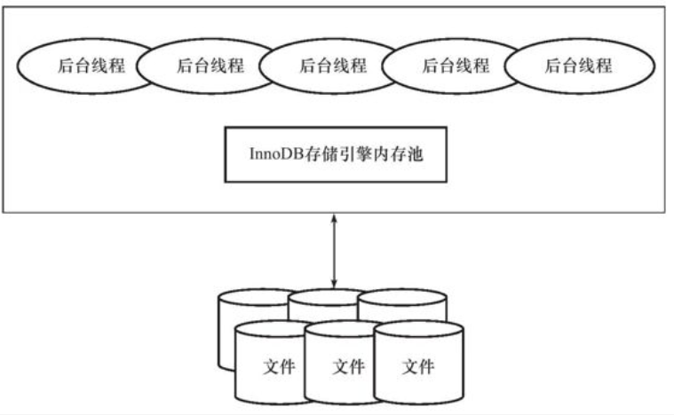

# 2. InnoDB存储引擎

## 2.1 InnoDB体系架构



- InnoDB存储引擎内存池
  - 维护所有进程/线程需要访问的多个内部数据结构。
  - 缓存磁盘上的数据，在对磁盘文件的数据修改之前在这里缓存。
  - 重做日志（redo log）缓冲。
- 后台线程
  - 负责刷新内存池中的数据，保证缓冲池中的缓存是最新数据。
  - 将已修改的数据从内存中写入到磁盘，保证在数据库发生异常的情况下能恢复到正常运行状态。

### 2.1.1 后台线程

1. Master Thread，是一个非常核心的后台线程，负责将缓存池中的数据异步刷新到磁盘，如脏页的刷盘、合并插入缓冲（insert buffer）、UNDO页的回收、Redo log的刷盘。

2. IO Thread，IO Thread的工作主要是负责AIO请求的回调处理，Innodb大量使用了AIO来处理IO请求，从而极大提高了IO性能。

   IO Thread共有四种（innoDB 版本8.0.16），分为write、read、insert buffer、log。write和read默认各有4个线程，insert buffer thread和log thread各有1个线程。

3. Purge Thread，事务在提交之后，undo log可能就不需要了，在1.1版本之后，可以将回收Undo页的操作独立出Master Thread交给Purge Thread，减轻Master Thread压力。

4. Page Cleaner Thread，用于将Master Thread中刷新脏页的操作独立出来，减轻Master Thread压力。

### 2.3.2 内存


1. 缓冲池

   - 缓冲池包括数据页，索引页，插入缓冲，自适应哈希索引，锁信息以及数据字典信息。

   - 数据库查询时先判断该页有没有在缓冲池中，如果则读取并返回。否则读取磁盘，并将页放在缓冲池中。
   - 对数据库的修改，先修改在缓冲池中的页，然后在checkpoint刷新回磁盘。这样能够提高数据库整体性能。
   - 通过`innodb_buffer_pool_size`来设置缓冲池大小。
   - 缓冲池可以有多个实例。

2. LRU List、Free List、 Flush List

   1. LRU List
      - LRU List用来管理缓冲池中的页，页的大小默认为16K。
      - 从磁盘中读取的新的页，是放到LRU的midpoint位置上，默认在LRU列表长度的5/8处。midpoint之后的列表称为old列表，之前的称为new列表。
      - 之所以新的数据插入到midpoint而不是首部，为了防止某个SQL加载了大量新数据，把之前的热点数据全部刷出缓冲池。
      - `innodb_old_blocks_time`参数是用来设置页读取到midpoint位置后需要等待多久才会被加到LRU列表的热端，也就是首部。也是为了防止大量临时数据污染缓冲池。
      - LRU管理的页支持压缩。
   2. Free List
      - 数据库刚启动时，LRU列表为空，此时所有的页都在Free列表中，Free列表中的页是没有数据的，只是为其分配了内存。
      - 当LRU需要分配页时，先看free list中是否有空闲页，有则将其从free list中删除，放入到LRU列表中。如果free list没有可用页了，才根据LRU算法，淘汰LRU尾部的页。
   3. Flush List
      - LRU中的页被修改了之后，就成为了脏页，Flush List即为脏页列表。
      - 脏页既存在约LRU，也存在也LRU List。

3. 重做日志缓冲

   InnoDB先将重做日志信息放入这个缓冲区，然后按照一定频率将其刷新到重做日志中。重做日志缓冲区的大小由`innodb_log_buffer_size`控制，默认为8MB。下列三种情况会将重做日志缓冲区的内容写到磁盘：

   - Master Thread每一秒将重做日志缓冲刷新到重做日志文件。
   - 每个事务提交时会将重做日志写到磁盘。
   - 当重做日志缓冲池剩余空间小于1/2时。

4. 额外的内存池

   在对一些数据结构本身的内存进行分配时，需要从额外的内存池中进行申请，当该区域内存不够时，会从缓冲池中进行申请。例如每个缓冲池中的帧缓冲，还有对应的缓冲控制对象，该对象记录了一些诸如LRU、锁等信息，因此需要从额外内存池中申请内存。

## 2.2 Checkpoint技术

checkpoint技术的目的是解决以下几个问题：

- 缩短数据库的恢复时间。当数据库宕机时，只需要对checkpoint以后的重做日志进行恢复。
- 缓冲池不够用时，将脏页刷新到磁盘。当LRU算法要淘汰最近最少使用的页时，发现该页是脏页，需要强制执行checkpoint，将脏页刷回磁盘。
- 重做日志不可用时，刷新脏页。不可用指的是，因为redolog是循环写入的，当写到尾部时又要跳回头部继续写，若头部的redolog已经刷过盘，则这部分空间可以被覆盖，可重用。但是如果这些redolog还没有刷盘，新的redolog又没地方写，这时候就出现了redolog不可用，此时要强制产生checkpoint，将头部的redolog刷盘以腾出空间给新的redolog。

###2.2.1 两种checkpoint

1. Sharp Checkpoint，发生在数据库关闭时，将所有的脏页刷新回磁盘。

2. Fuzzy Checkpoint，共有四种fuzzy checkpoint:

   - Master Thread Checkpoint，Master Thread差不多以每秒或10秒的速度从缓冲池的脏页列表中刷新一定比例的页到磁盘。该过程是异步的，不会阻塞用户查询线程。

   - FLUSH_LRU_LIST Checkpoint是因为InnoDB存储引擎需要保证LRU列表中需要有一定数量的空闲页可供使用，如果不满足要求，则InnoDB会将LRU列表尾端的页移除。在5.6版本后，这个工作被放到了单独Page Cleaner线程中进行，用户可通过`innodb_lru_scan_depth`控制LRU列表中可用页的数量。

   - Async/Sync Flush Checkpoint，指的是重做日志不可用的情况，这时需要强制刷新一些页回磁盘。

     将已经写入重做日志的LSN记为redo_lsn，将已经刷盘的最新页的LSN记为checkpoint_lsn，则checkpont_age = redo_lsn - checkpoint_lsn，再定义async_water_mark = 0.75 * 总的redolog文件大小，sync_water_mark = 0.9 * 总redolog文件大小。

     - checkpoint_age代表着有多少内容只写入了redolog还没有写入磁盘。

     - 当checkpoint_age < async_water_mark时，不需要刷新任何脏页到磁盘。
     - 当async_water_mark < checkpoint_age < sync_water_mark时，触发Async Flush，从Flush列表中刷新足够多的脏页回磁盘，使得刷新后满足checkpoint_age < async_water_mark。
     - checkpoint_age > sync_water_mark时，触发Sync Flush操作，从Flush列表中刷新足够多的脏页回磁盘，使得刷新后满足checkpoint_age < async_water_mark。
     - 5.6之后，这部分刷新操作放到了单独的Page Cleaner Thread中，因此不会阻塞用户查询线程。

   - Dirty Page too much，即脏页的数量太多，导致InnoDB存储引擎强制进行Checkpoint。可由`innodb_max_dirty_pages_pct`参数控制，默认为75%。

## 2.3 Master Thread工作方式

### 2.3.1 InnoDB 1.0.x之前的Master Thread

Master Thread具有最高优先级别。内部由多个循环组成：主循环，后台循环，刷新循环（flush loop)，暂停循环（suspend loop）。

- 主循环（Loop）：包含两大部分每秒钟的操作和每10秒的操作。

  每一秒一次的操作包括：

  - 日志缓冲刷新到磁盘，即使这个事务还未提交（总是）
  - 合并插入缓冲（可能），InnoDB会判断当前一秒内发生的IO次数是否小于5次，如果小于，则认为当前IO压力小，可以执行合并插入缓冲的操作。
  - 至多刷新100个InnoDB的缓冲池中的脏页到磁盘（可能），引擎会判断当前缓冲池中脏页的比例是否超过了设定的阈值，如果超过了，才将100个脏页写入磁盘。
  - 如果当前没有用户活动，则切换到background loop（可能）

  每十秒钟的操作：

  - 刷新100个脏页到磁盘（可能），判断当前IO压力来确定是否执行。
  - 合并至多5个插入缓冲（总是）
  - 将日志缓冲刷新到磁盘（总是）
  - 删除无用的Undo页（总是），最多尝试回收20个undo页。
  - 刷新100个或者10%的脏页到磁盘（总是），此时是判断脏页的比例是否超过限定。

- background loop，当前没有用户活动，或者数据库关闭们就会切换到这个循环，它会执行以下操作：

  - 删除无用的Undo页（总是）
  - 合并20个插入缓冲（总是）
  - 跳回主循环（总是）
  - 不断刷新100个页直到符合条件（可能，跳转到flush loop中完成）

  如果flush loop中也没事可做，InnoDB引擎就会切换到suspend_loop，将Master Thread挂起，等待事件发生。

### 2.3.2 1.2.x版本之前的Master Thread

由于之前版本中有许多硬编码，而磁盘技术发展很快，导致硬编码的数值不合适。因此在1.0.x的基础上，将硬编码调整成为了动态参数，或者增大了部分数值。

### 2.3.3 1.2.x版本的Master Thread

将刷新脏页的操作从Master Thread中分离出来，交给一个单独的Page Cleaner Thread来做，从而减少了Master Thread的工作，进一步提高了系统的并发性。

## 2.4 InnoDB关键特性

InnoDB存储引擎的关键特性包括：

- 插入缓冲（Insert Buffer）
- 两次写（Double Write）
- 自适应哈希索引（Adaptive Hash Index）
- 异步IO（Async IO）
- 刷新临接页（Flush Neighbor Page）

这些特性带来了更好的性能以及更高的可用性。

### 2.4.1 插入缓冲

1. Insert Buffer

   对于非聚集索引的插入或更新操作，不是每一次直接插入到索引页中，而是先判断插入的非聚集索引页是否在缓冲池中，若在，则直接插入，如不在则先放到一个Insert Buffer对象中。然后再以一定的频率和情况进行Insert Buffer和辅助索引叶子节点的merge操作，因为此时通常能够将多个插入合并到一个操作中，就能大大提高对于非聚集索引插入的性能。

   Insert Buffer的使用需要同时满足以下两个条件：

   - 索引是辅助索引
   - 索引不是唯一的

   使用Insert Buffer带来的弊端是当数据库宕机时，如果有大量的Insert Buffer没有合并到实际的非聚集索引中去，会导致恢复需要很长时间。

2. Change Buffer

   Change Buffer可以看做是Insert Buffer的升级，可以对INSERT、DELETE、UPDATE操作都进行缓冲。

3. Insert Buffer的内部实现

   Insert Buffer的数据结构是一颗B+树，全局只有一颗Insert Buffer B+树，负责所有的表。该树存放在共享表空间，因此要对独立表空间ibd文件恢复表中数据时，往往会出现CECHK TABLE失败，需要进行REPAIR TABLE操作来重建表上的辅助索引。

4. Merge Insert Buffer

   Merge的时机为：

   - 辅助索引页被读取到缓冲池时。在执行select操作时，需要检查Insert Buffer Bitmap页，然后确认该辅助索引页是否有记录存放在Insert Buffer B+树中。如果有，将B+树中该页的记录插入到该辅助索引页中。
   - Insert Buffer Bitmap页追踪到该辅助索引页已无可用空间时。Insert Buffer Bitmap发现辅助索引页的可用空间小于1/32页时，会进行一个强制合并操作。这么做是因为，如果该辅助索引页可用空间较小，就会有页分裂的风险，但是此时B+树里的记录对应的是分裂之前的页，因此要主动地去把B+树里的缓存合并到页里（这样很有可能会导致页分裂）。
   - Master Thread。每隔一秒或者十秒，会进行一次Merge Insert Buffer的操作。

###2.4.2 两次写

两次写为数据库提供了数据页的可靠性。当数据库宕机的时候，可能InnoDB存储引擎正在将脏页写入磁盘，而这个页只写了一部分，之后发生了宕机，这种情况称为部分写失效。因为单纯靠redolog和现在磁盘上的页是无法还原会导致数据丢失。doublewrite指的是，在应用重做日志前，复制脏页的副本并持久化到共享表空间，然后开始把脏页写入磁盘。当写入失效发生时，先通过脏页的副本来还原该页（这里并不是还原到写之前的页，而是还原成脏页，也就是把脏页写到磁盘中，覆盖写入失效的页），再进行重做。

通过`skip_innodb_doublewrite`可以禁止doublewrite功能，可以提高性能。有的文件系统本身就提供了部分写失效的防范机制，如ZFS文件系统，这种情况下，就不要启动doublewrite了。

### 2.4.3 自适应哈希索引

InnoDB存储引擎会监控对表上各索引页的查询。如果观察到建立哈希索引可以带来速度提升，则建立哈希索引，称之为自适应哈希索引（AHI）。AHI是通过缓冲池的B+树页构造而来，因此建立的速度很快。InnoDB会自动根据访问的频率和模式（访问模式如`WHERE a=xxx | WHERE a=xxx and b=xxx`）来自动为某些热点页建立哈希索引。

AHI有如下要求：

- 以该模式访问了100次。
- 页通过该模式访问了N次，其中N=页中记录数*1/16。

AHI只适用于等值查找，不能够使用范围查找。

### 2.4.4 异步IO

AIO可以同时发出多个IO请求，然后等待所有IO操作的完成，当需要做全表扫描这种操作时，需要进行多次IO请求，aio能极大减少时间消耗。AIO的另一个优势是可以进行IO Merge操作，将多个IO请求合并为一个，这样也可以提高IO性能。

InnoDB 1.1.x开始，提供了内核级别AIO的支持，称为Native AIO，但是只有Windows和Linux系统提供了Native AIO，而Mac OSX系统不支持Native AIO。

在InnoDB存储引擎中，read ahead方式的读取都是通过AIO完成，脏页的刷新，即磁盘的写入操作全部由AIO完成。

### 2.4.5 刷新邻接页

InnoDB存储引擎还提供了刷新邻接页的特性，工作原理为，当刷新一个脏页时，InnoDB存储引擎会检测该页所在区的所有页，如果是脏页，那么一起进行刷新。这样的好处就是通过AIO可以将多个IO写入操作合并为一个IO操作，该工作机制在传统机械磁盘下有着显著的优势。但是需要考虑两个问题：

1. 在将不怎么脏的页进行了写入之后不久，该页之后很快变成脏页。
2. 固态硬盘有着较高的随机写性能，是否还需要刷新邻接页这个特性？

innoDB提供了`innodb_flush_neighbors`来控制是否启用该特性。

##2.5 启动、关闭与恢复

`innodb_fast_shutdown`参数影响着表的存储引擎为InnoDB的行为：

- 0表示在关闭数据库时，要完成所有的full purge和merge insert buffer，并且将所有脏页刷新回磁盘。这有可能需要一些时间。
- 1为默认值，表示只刷新一些脏数据回磁盘。
- 2表示不完成full purge和merge insert buffer，也不刷新脏页，而是将日志都写入日志文件。下次启动时会进行恢复操作。

`innodb_force_recovery`影响InnoDB存储引擎恢复的状况。该参数默认为0，即需要恢复时，进行所有的恢复操作。但有时候不需要完整的恢复操作。可以设置6个值

1. 忽略检查到的corrupt页
2. 阻止Master Thread线程的运行，如Master Thread线程需要进行full purge操作，而这会导致crash。
3. 不进行事务的回滚操作。
4. 不进行插入缓冲的合并。
5. 不查看撤销日志（undo log），InnoDB将未提交的事务视为已提交。
6. 不进行前滚操作。

# 6. 锁

锁是区别数据和文件系统的关键区别。不同的数据库，锁的实现就可能不一样。

## 6.1 Lock与Latch

latch一般称为闩锁（轻量级锁），要求锁定的时间必须短。在InnoDB中又分为mutex和rwlock，其目的是用来保证并发线程操作临界资源的正确性，通常没有死锁检测机制。

lock的对象是事务，用来锁定数据库中的对象，如表、页、行。并且一般lock的对象在事务提交或者回滚之后进行释放。大多数数据库都有死锁检测机制的。

## 6.2 InnoDB存储引擎中的锁

### 6.2.1 锁的类型

InnoDB实现了两种标准的行级锁

- 共享锁（S Lock），运行事务读一行数据。
- 排他锁（X Lock），允许事务删除或更新一行数据。

意向锁：InnoDB支持多粒度锁定，这种锁定允许事务在行级上的锁和表级上的锁同时存在。意向锁是将锁定的对象分为多个层次，在更细粒度上进行加锁。


意向锁的上锁过程为，当对某条记录r上X锁，那么需要对该表上意向锁IX，最后对记录r上X锁。如果上意向锁导致等待，那么该操作需要等待意向锁的完成。

InnoDB存储引擎中的意向锁为表级别的锁，支持两种意向锁：

- 意向共享锁（IS Lock），事务想要获得一张表中某几行的共享锁。
- 意向排他锁（IX Lock），事务想要获得一张表中某几行的排它锁。

锁的兼容性如下


为什么需要意向锁呢？

假设现在是同时支持表锁和行锁的，事务A拿到了某一行的X锁，而事务B拿到了该表的X锁，两者就发生了冲突。如果有了意向锁的存在，事务A在申请某一行的写锁的时候，会在表上加一个意向排他锁，而事务B去拿该表的X锁时，就会被阻塞。同理，要是事务B先拿到了该表的X锁，事务A在请求某一行数据的X锁时，会先去请求这张表的IX锁，此时由于表上已经存在X锁，就会被阻塞。

### 6.2.2 一致性非锁定读

一致性的非锁定读是指InnoDB通过多版本控制的方式来读取当前执行数据中行的数据。如果读取的行正在被修改，这时读取操作不需要等待行上锁的释放。相反，回去读取行的一个数据快照。通过undo段来完成。

快照数据就是当前行数据之前的历史版本，每行记录可能有多个版本，一个行记录可能有不止一个快照数据，称这种技术为行多版本技术，由此带来的并发控制，称为多版本并发控制（MVCC）

在事务隔离级别读已提交和可重复读下，InnoDB使用非锁定的一致性读。但是，两种级别下对快照数据的定义不同，读已提交总是读取被锁定行最新的已提交数据快照，而可重复读下，总是读取事务开始时的行数据版本。

### 6.2.3 一致性锁定读

在默认的可重复读模式下，Select操作使用一致性非锁定读，但是当需要显式地对数据库读取操作进行加锁以保证数据逻辑的一致性。InnoDB支持对于select语句两种一致性锁定读操作：

- select … for update，对读取的行加一个X锁。
- select … lock in share mode，对读取的行加一个S锁。

以上两个操作必须在事务中执行，事务提交时，锁被释放。使用场景是，对数据一致性，实时性比较高的情况。

### 6.2.4 自增长与锁

自增长属性的实现是，对于每个含有自增值的表都有一个自增长计数器，执行如下的语句来得到计数器的值

```sql
select max(auto_inc_col) from t for update;
```

谁能得到这个X锁，谁就先获得这个当前最大序号，然后加1赋予自增长列。这个实现方式为AUTO-INC LOCKING。为了提高插入性能，锁不是在一个事务完成后才释放，而是在完成对自增长值插入的SQL语句后立即释放。

InnoDB在5.1.22开始，提供了一种轻量级互斥量的自增长实现机制，大大提高了自增长值插入的性能。如果设置所有的自增长值都是通过该方式获得，需要将复制模式设置为row-base replication，才能保证主从数据一致，如果使用statement-based，从服务器在恢复时，不能保证bulk insert（块插入）中每条数据的自增列的值和主库一致。