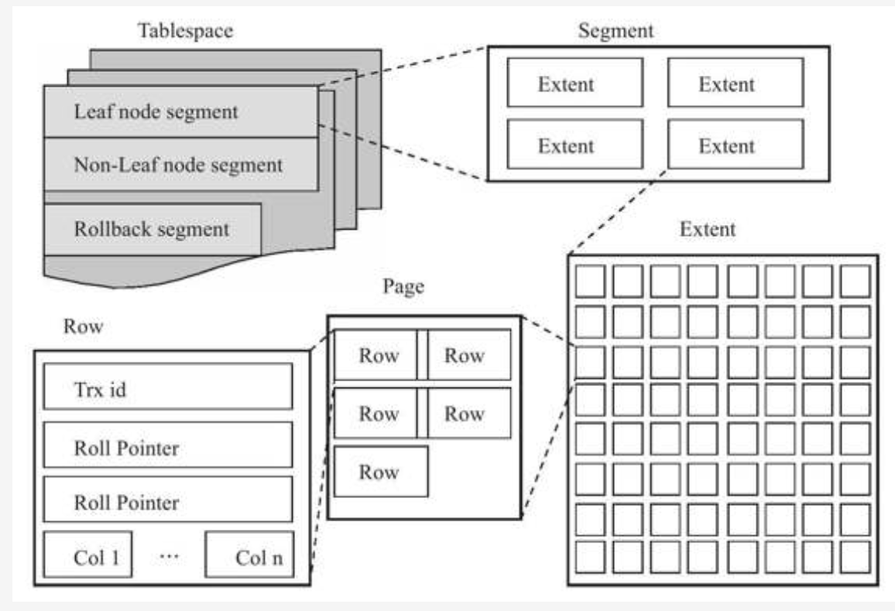
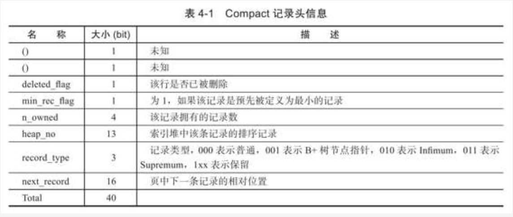
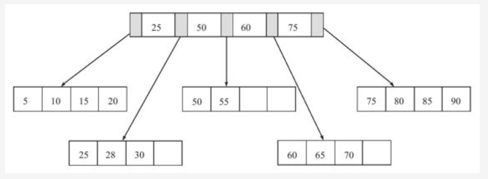
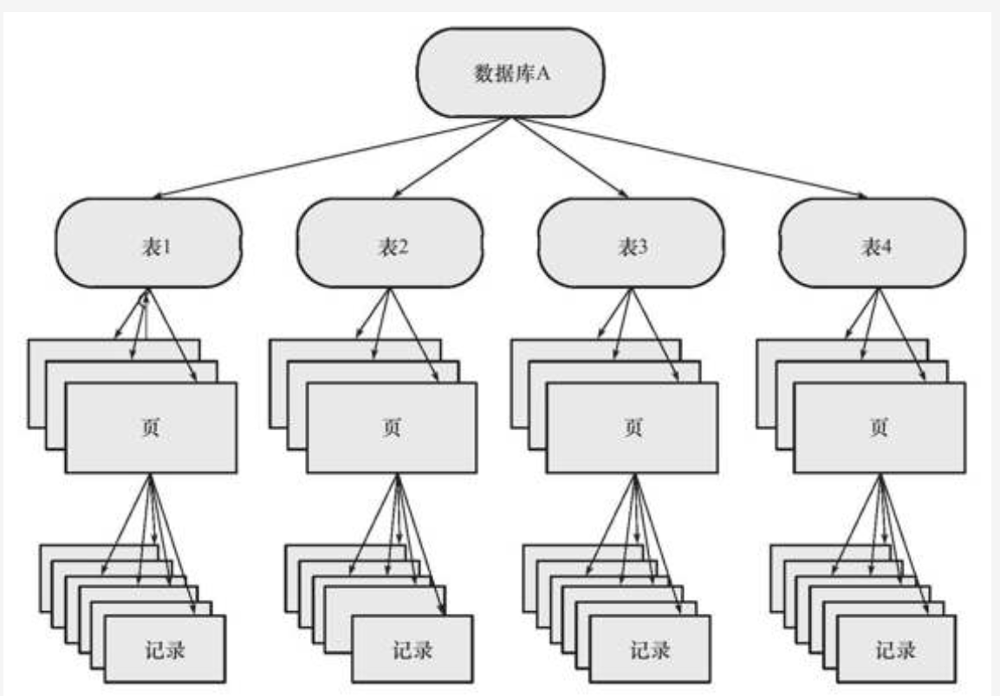
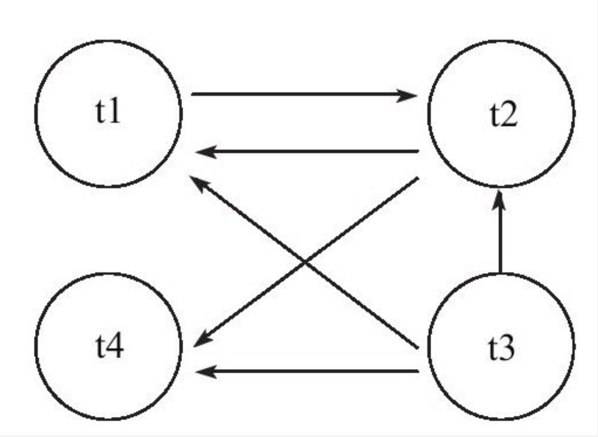
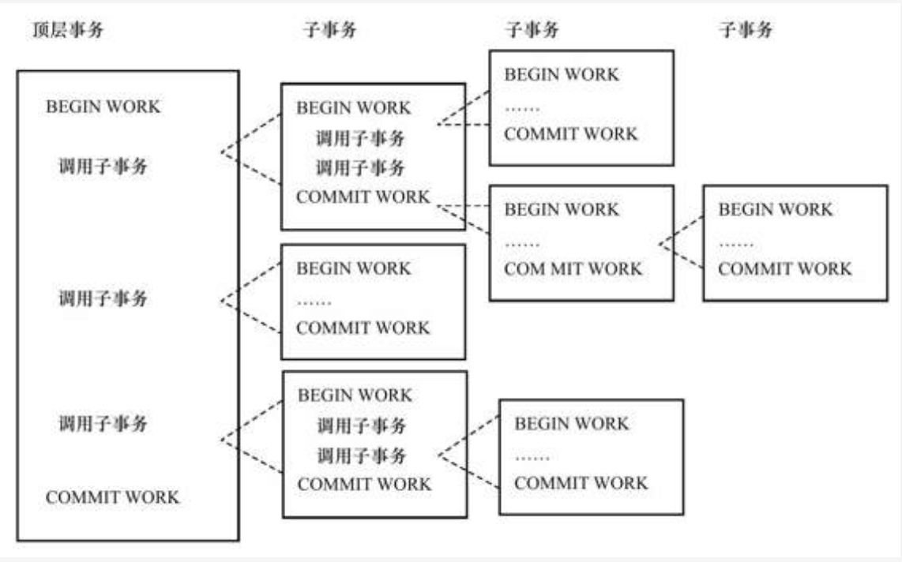
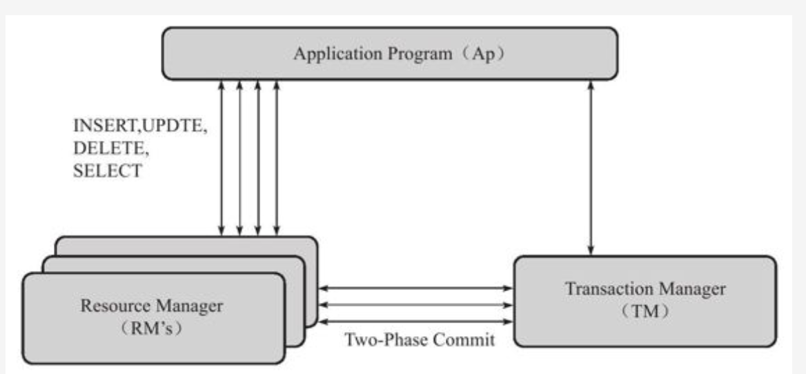
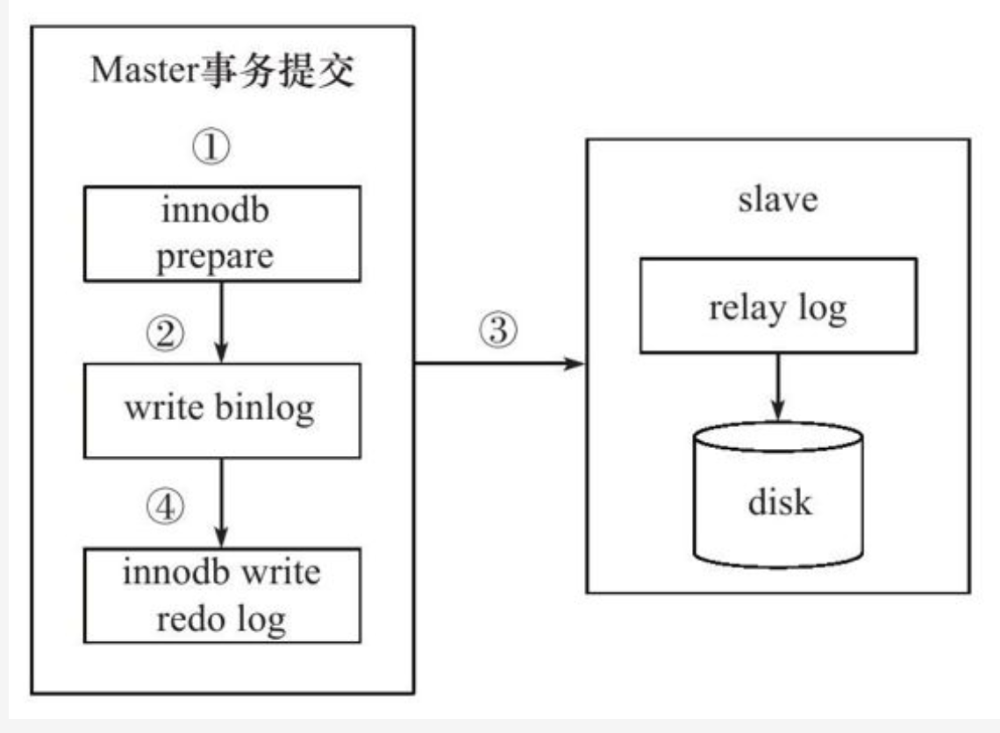

# 2. InnoDB存储引擎

## 2.1 InnoDB体系架构


- InnoDB存储引擎内存池
  - 维护所有进程/线程需要访问的多个内部数据结构。
  - 缓存磁盘上的数据，在对磁盘文件的数据修改之前在这里缓存。
  - 重做日志（redo log）缓冲。
- 后台线程
  - 负责刷新内存池中的数据，保证缓冲池中的缓存是最新数据。
  - 将已修改的数据从内存中写入到磁盘，保证在数据库发生异常的情况下能恢复到正常运行状态。

### 2.1.1 后台线程

1. Master Thread，是一个非常核心的后台线程，负责将缓存池中的数据异步刷新到磁盘，如脏页的刷盘、合并插入缓冲（insert buffer）、UNDO页的回收、Redo log的刷盘。

2. IO Thread，IO Thread的工作主要是负责AIO请求的回调处理，Innodb大量使用了AIO来处理IO请求，从而极大提高了IO性能。

   IO Thread共有四种（innoDB 版本8.0.16），分为write、read、insert buffer、log。write和read默认各有4个线程，insert buffer thread和log thread各有1个线程。

3. Purge Thread，事务在提交之后，undo log可能就不需要了，在1.1版本之后，可以将回收Undo页的操作独立出Master Thread交给Purge Thread，减轻Master Thread压力。

4. Page Cleaner Thread，用于将Master Thread中刷新脏页的操作独立出来，减轻Master Thread压力。

### 2.3.2 内存


1. 缓冲池

   - 缓冲池包括数据页，索引页，插入缓冲，自适应哈希索引，锁信息以及数据字典信息。

   - 数据库查询时先判断该页有没有在缓冲池中，如果在则读取并返回。否则读取磁盘，并将页放在缓冲池中。
   - 对数据库的修改，先修改在缓冲池中的页，然后在checkpoint刷新回磁盘。这样能够提高数据库整体性能。
   - 通过`innodb_buffer_pool_size`来设置缓冲池大小。
   - 缓冲池可以有多个实例。

2. LRU List、Free List、 Flush List

   1. LRU List
      - LRU List用来管理缓冲池中的页，页的大小默认为16K。
      - 从磁盘中读取的新的页，是放到LRU的midpoint位置上，默认在LRU列表长度的5/8处。midpoint之后的列表称为old列表，之前的称为new列表。
      - 之所以新的数据插入到midpoint而不是首部，为了防止某个SQL加载了大量新数据，把之前的热点数据全部刷出缓冲池。
      - `innodb_old_blocks_time`参数是用来设置页读取到midpoint位置后需要等待多久才会被加到LRU列表的热端，也就是首部。也是为了防止大量临时数据污染缓冲池。
      - LRU管理的页支持压缩。
   2. Free List
      - 数据库刚启动时，LRU列表为空，此时所有的页都在Free列表中，Free列表中的页是没有数据的，只是为其分配了内存。
      - 当LRU需要分配页时，先看free list中是否有空闲页，有则将其从free list中删除，放入到LRU列表中。如果free list没有可用页了，才根据LRU算法，淘汰LRU尾部的页。
   3. Flush List
      - LRU中的页被修改了之后，就成为了脏页，Flush List即为脏页列表。
      - 脏页既存在于LRU，也存在也Flush List。

3. 重做日志缓冲

   InnoDB先将重做日志信息放入这个缓冲区，然后按照一定频率将其刷新到重做日志中。重做日志缓冲区的大小由`innodb_log_buffer_size`控制，默认为8MB。下列三种情况会将重做日志缓冲区的内容写到磁盘：

   - Master Thread每一秒将重做日志缓冲刷新到重做日志文件。
   - 每个事务提交时会将重做日志写到磁盘。
   - 当重做日志缓冲池剩余空间小于1/2时。

4. 额外的内存池

   在对一些数据结构本身的内存进行分配时，需要从额外的内存池中进行申请，当该区域内存不够时，会从缓冲池中进行申请。例如每个缓冲池中的帧缓冲，还有对应的缓冲控制对象，该对象记录了一些诸如LRU、锁等信息，因此需要从额外内存池中申请内存。

## 2.2 Checkpoint技术

checkpoint技术的目的是解决以下几个问题：

- 缩短数据库的恢复时间。当数据库宕机时，只需要对checkpoint以后的重做日志进行恢复。
- 缓冲池不够用时，将脏页刷新到磁盘。当LRU算法要淘汰最近最少使用的页时，发现该页是脏页，需要强制执行checkpoint，将脏页刷回磁盘。
- 重做日志不可用时，刷新脏页。不可用指的是，因为redolog是循环写入的，当写到尾部时又要跳回头部继续写，若头部的redolog已经刷过盘，则这部分空间可以被覆盖，可重用。但是如果这些redolog还没有刷盘，新的redolog又没地方写，这时候就出现了redolog不可用，此时要强制产生checkpoint，将头部的redolog刷盘以腾出空间给新的redolog。

###2.2.1 两种checkpoint

1. Sharp Checkpoint，发生在数据库关闭时，将所有的脏页刷新回磁盘。

2. Fuzzy Checkpoint，共有四种fuzzy checkpoint:

   - Master Thread Checkpoint，Master Thread差不多以每秒或10秒的速度从缓冲池的脏页列表中刷新一定比例的页到磁盘。该过程是异步的，不会阻塞用户查询线程。

   - FLUSH_LRU_LIST Checkpoint是因为InnoDB存储引擎需要保证LRU列表中需要有一定数量的空闲页可供使用，如果不满足要求，则InnoDB会将LRU列表尾端的页移除。在5.6版本后，这个工作被放到了单独Page Cleaner线程中进行，用户可通过`innodb_lru_scan_depth`控制LRU列表中可用页的数量。

   - Async/Sync Flush Checkpoint，指的是重做日志不可用的情况，这时需要强制刷新一些页回磁盘。

     将已经写入重做日志的LSN记为redo_lsn，将已经刷盘的最新页的LSN记为checkpoint_lsn，则checkpont_age = redo_lsn - checkpoint_lsn，再定义async_water_mark = 0.75 * 总的redolog文件大小，sync_water_mark = 0.9 * 总redolog文件大小。

     - checkpoint_age代表着有多少内容只写入了redolog还没有写入磁盘。

     - 当checkpoint_age < async_water_mark时，不需要刷新任何脏页到磁盘。
     - 当async_water_mark < checkpoint_age < sync_water_mark时，触发Async Flush，从Flush列表中刷新足够多的脏页回磁盘，使得刷新后满足checkpoint_age < async_water_mark。
     - checkpoint_age > sync_water_mark时，触发Sync Flush操作，从Flush列表中刷新足够多的脏页回磁盘，使得刷新后满足checkpoint_age < async_water_mark。
     - 5.6之后，这部分刷新操作放到了单独的Page Cleaner Thread中，因此不会阻塞用户查询线程。

   - Dirty Page too much，即脏页的数量太多，导致InnoDB存储引擎强制进行Checkpoint。可由`innodb_max_dirty_pages_pct`参数控制，默认为75%。

## 2.3 Master Thread工作方式

### 2.3.1 InnoDB 1.0.x之前的Master Thread

Master Thread具有最高优先级别。内部由多个循环组成：主循环，后台循环，刷新循环（flush loop)，暂停循环（suspend loop）。

- 主循环（Loop）：包含两大部分每秒钟的操作和每10秒的操作。

  每一秒一次的操作包括：

  - 日志缓冲刷新到磁盘，即使这个事务还未提交（总是）
  - 合并插入缓冲（可能），InnoDB会判断当前一秒内发生的IO次数是否小于5次，如果小于，则认为当前IO压力小，可以执行合并插入缓冲的操作。
  - 至多刷新100个InnoDB的缓冲池中的脏页到磁盘（可能），引擎会判断当前缓冲池中脏页的比例是否超过了设定的阈值，如果超过了，才将100个脏页写入磁盘。
  - 如果当前没有用户活动，则切换到background loop（可能）

  每十秒钟的操作：

  - 刷新100个脏页到磁盘（可能），判断当前IO压力来确定是否执行。
  - 合并至多5个插入缓冲（总是）
  - 将日志缓冲刷新到磁盘（总是）
  - 删除无用的Undo页（总是），最多尝试回收20个undo页。
  - 刷新100个或者10%的脏页到磁盘（总是），此时是判断脏页的比例是否超过限定。

- background loop，当前没有用户活动，或者数据库关闭们就会切换到这个循环，它会执行以下操作：

  - 删除无用的Undo页（总是）
  - 合并20个插入缓冲（总是）
  - 跳回主循环（总是）
  - 不断刷新100个页直到符合条件（可能，跳转到flush loop中完成）

  如果flush loop中也没事可做，InnoDB引擎就会切换到suspend_loop，将Master Thread挂起，等待事件发生。

### 2.3.2 1.2.x版本之前的Master Thread

由于之前版本中有许多硬编码，而磁盘技术发展很快，导致硬编码的数值不合适。因此在1.0.x的基础上，将硬编码调整成为了动态参数，或者增大了部分数值。

### 2.3.3 1.2.x版本的Master Thread

将刷新脏页的操作从Master Thread中分离出来，交给一个单独的Page Cleaner Thread来做，从而减少了Master Thread的工作，进一步提高了系统的并发性。

## 2.4 InnoDB关键特性

InnoDB存储引擎的关键特性包括：

- 插入缓冲（Insert Buffer）
- 两次写（Double Write）
- 自适应哈希索引（Adaptive Hash Index）
- 异步IO（Async IO）
- 刷新临接页（Flush Neighbor Page）

这些特性带来了更好的性能以及更高的可用性。

### 2.4.1 插入缓冲

1. Insert Buffer

   对于非聚集索引的插入或更新操作，不是每一次直接插入到索引页中，而是先判断插入的非聚集索引页是否在缓冲池中，若在，则直接插入，如不在则先放到一个Insert Buffer对象中。然后再以一定的频率和情况进行Insert Buffer和辅助索引叶子节点的merge操作，因为此时通常能够将多个插入合并到一个操作中，就能大大提高对于非聚集索引插入的性能。

   Insert Buffer的使用需要同时满足以下两个条件：

   - 索引是辅助索引
   - 索引不是唯一的

   使用Insert Buffer带来的弊端是当数据库宕机时，如果有大量的Insert Buffer没有合并到实际的非聚集索引中去，会导致恢复需要很长时间。

2. Change Buffer

   Change Buffer可以看做是Insert Buffer的升级，可以对INSERT、DELETE、UPDATE操作都进行缓冲。

3. Insert Buffer的内部实现

   Insert Buffer的数据结构是一颗B+树，全局只有一颗Insert Buffer B+树，负责所有的表。该树存放在共享表空间，因此要对独立表空间ibd文件恢复表中数据时，往往会出现CECHK TABLE失败，需要进行REPAIR TABLE操作来重建表上的辅助索引。

4. Merge Insert Buffer

   Merge的时机为：

   - 辅助索引页被读取到缓冲池时。在执行select操作时，需要检查Insert Buffer Bitmap页，然后确认该辅助索引页是否有记录存放在Insert Buffer B+树中。如果有，将B+树中该页的记录插入到该辅助索引页中。
   - Insert Buffer Bitmap页追踪到该辅助索引页已无可用空间时。Insert Buffer Bitmap发现辅助索引页的可用空间小于1/32页时，会进行一个强制合并操作。这么做是因为，如果该辅助索引页可用空间较小，就会有页分裂的风险，但是此时B+树里的记录对应的是分裂之前的页，因此要主动地去把B+树里的缓存合并到页里（这样很有可能会导致页分裂）。
   - Master Thread。每隔一秒或者十秒，会进行一次Merge Insert Buffer的操作。

###2.4.2 两次写

两次写为数据库提供了数据页的可靠性。当数据库宕机的时候，可能InnoDB存储引擎正在将脏页写入磁盘，而这个页只写了一部分，之后发生了宕机，这种情况称为部分写失效。因为单纯靠redolog和现在磁盘上的页是无法还原会导致数据丢失。doublewrite指的是，在应用重做日志前，复制脏页的副本并持久化到共享表空间，然后开始把脏页写入磁盘。当写入失效发生时，先通过脏页的副本来还原该页（这里并不是还原到写之前的页，而是还原成脏页，也就是把脏页写到磁盘中，覆盖写入失效的页），再进行重做。

通过`skip_innodb_doublewrite`可以禁止doublewrite功能，可以提高性能。有的文件系统本身就提供了部分写失效的防范机制，如ZFS文件系统，这种情况下，就不要启动doublewrite了。

### 2.4.3 自适应哈希索引

InnoDB存储引擎会监控对表上各索引页的查询。如果观察到建立哈希索引可以带来速度提升，则建立哈希索引，称之为自适应哈希索引（AHI）。AHI是通过缓冲池的B+树页构造而来，因此建立的速度很快。InnoDB会自动根据访问的频率和模式（访问模式如`WHERE a=xxx | WHERE a=xxx and b=xxx`）来自动为某些热点页建立哈希索引。

AHI有如下要求：

- 以该模式访问了100次。
- 页通过该模式访问了N次，其中N=页中记录数*1/16。

AHI只适用于等值查找，不能够使用范围查找。

### 2.4.4 异步IO

AIO可以同时发出多个IO请求，然后等待所有IO操作的完成，当需要做全表扫描这种操作时，需要进行多次IO请求，aio能极大减少时间消耗。AIO的另一个优势是可以进行IO Merge操作，将多个IO请求合并为一个，这样也可以提高IO性能。

InnoDB 1.1.x开始，提供了内核级别AIO的支持，称为Native AIO，但是只有Windows和Linux系统提供了Native AIO，而Mac OSX系统不支持Native AIO。

在InnoDB存储引擎中，read ahead方式的读取都是通过AIO完成，脏页的刷新，即磁盘的写入操作全部由AIO完成。

### 2.4.5 刷新邻接页

InnoDB存储引擎还提供了刷新邻接页的特性，工作原理为，当刷新一个脏页时，InnoDB存储引擎会检测该页所在区的所有页，如果是脏页，那么一起进行刷新。这样的好处就是通过AIO可以将多个IO写入操作合并为一个IO操作，该工作机制在传统机械磁盘下有着显著的优势。但是需要考虑两个问题：

1. 在将不怎么脏的页进行了写入之后不久，该页之后很快变成脏页。
2. 固态硬盘有着较高的随机写性能，是否还需要刷新邻接页这个特性？

innoDB提供了`innodb_flush_neighbors`来控制是否启用该特性。

##2.5 启动、关闭与恢复

`innodb_fast_shutdown`参数影响着表的存储引擎为InnoDB的行为：

- 0表示在关闭数据库时，要完成所有的full purge和merge insert buffer，并且将所有脏页刷新回磁盘。这有可能需要一些时间。
- 1为默认值，表示只刷新一些脏数据回磁盘。
- 2表示不完成full purge和merge insert buffer，也不刷新脏页，而是将日志都写入日志文件。下次启动时会进行恢复操作。

`innodb_force_recovery`影响InnoDB存储引擎恢复的状况。该参数默认为0，即需要恢复时，进行所有的恢复操作。但有时候不需要完整的恢复操作。可以设置6个值

1. 忽略检查到的corrupt页
2. 阻止Master Thread线程的运行，如Master Thread线程需要进行full purge操作，而这会导致crash。
3. 不进行事务的回滚操作。
4. 不进行插入缓冲的合并。
5. 不查看撤销日志（undo log），InnoDB将未提交的事务视为已提交。
6. 不进行前滚操作。

# 4. 表

## 4.1 索引组织表

在InnoDB中，表中数据都是根据主键顺序组织存放的（逻辑上，非物理上的顺序存放），这种存储方式成为索引组织表。

每张表都有主键，如果在创建的时候没有主键，按照以下方式选择或创建主键：

- 首先判断表中是否有非空的唯一索引，如果有，则该列为主键。
- 如果不符合上述条件，就会自动创建一个6字节大小的指针。

当表中存在多个非空唯一索引时，将选择建表时第一个定义的非空唯一索引为主键。

## 4.2 InnoDB逻辑存储结构

所有的数据都被逻辑地存放在一个空间中，称之为表空间。表空间又由段（segment）、区（extent）、页（page）组成。



### 4.2.1 表空间

默认情况下，InnoDB有一个共享表空间ibdata1，所有数据都放这里。如果用户启用了`innodb_file_per_table`，则每张表内的数据可以单独放到一个表空间。

但是如果启用了单独的表空间，这个表空间里只存放数据，索引和插入缓冲bitmap。其他数据如回滚信息，插入缓冲索引页，系统事务信息等还是放在原来的共享表空间。

### 4.2.2 段

表空间由各个段组成的，常见的段有：

- 数据段，即B+树的叶子节点
- 索引段，即B+树的非索引节点
- 回滚段

### 4.2.3 区

任何情况下，一个区的大小为1MB。为了保证区中的连续性，InnoDB存储引擎一次从磁盘申请4-5个区。一个页默认16K，因此一个区默认有64个连续的页。

一个段刚开始使用时，先使用32个页大小的碎片页来存放数据，使用完之后才是64个连续页的申请（一个区）。这样做是对于小表，或者undo这类的段，可以在开始时节省磁盘容量的开销。

### 4.2.4 页

页是InnoDb磁盘管理的最小单位，默认16K。可用通过参数`innodb_page_size`将页的大小设置为4K，8K，16K。如果修改了，不可再次修改，除非导出数据生成新的库。

常见的页有：

- 数据页
- undo页
- 系统页
- 事务数据页
- 插入缓冲位图页
- 插入缓冲空闲列表页
- 未压缩的二进制大对象页
- 压缩的二进制大对象页

### 4.2.5 行

InnoDB存储引擎是面向行的，每个页存放的行记录数量是有硬性规定的，允许7992行记录。

## 4.3 InnoDB行记录格式

MySQL5.1默认的行存储格式是Compact格式。


- 首部是一个非NULL变长字段长度列表，并且按照列的顺序逆序放置，若列的长度小于255字节，用1字节表示，大于255用2字节表示。

- 第二个是NULL标志位，指示该行是否有NULL值。

- 接下来是记录信息头，固定占5字节（40位）。

  

  最后部分就是实际存储的每个列。除了用户定义的列外，还有两个隐藏列，事务ID列和回滚指针列。如果表没有定义主键，每行还会增加一个6字节的rowid列。

###4.3.1 行溢出数据

InnoDB可以将一条记录存放在真正的数据页之外，例如BLOB这类大对象，这里说的只是可能，不是一定。

VARCHAR类型理论上最大支持65535字节，但是实际上最大65532字节，因为还有别的开销。VARCHAR(N)中的N指的是字符的长度，而不是字节长度。

官方手册定义的65535长度指的是所有VARCHAR列的长度总和，超过这个限制就会创建失败。

对于VARCHAR溢出情况，采用如下的存储方式：


VARCHAR多长的时候会保存在单个数据页，多长会保存在BLOB页？在Compact格式下，当页中只能存放一条记录的时候，就会自动将行数据放到溢出页中。

对于TEXT或BLOB的数据类型，不一定就放在BLOB页中，是放在数据页还是BLOB页中，判定标准是，至少能保证一个页能存放两条记录。

### 4.3.2 Compressed和Dynamic行格式

InnoBD 1.0之后引入了新的文件格式Compressed和Dynamic，他们对于BLOB中的数据采用了完全的行溢出的方式，实际数据都会放在Off Page中。之前的Compact格式会存放768个前缀。


Compressed格式会对存储在行中的数据进行压缩，因此BLOB、TEXT、VARCHAR这类大长度类型的数据能够非常有效地存储。

### 4.3.3 CHAR的行结构存储

对于多字节字符集类型的存储，CHAR类型被明确视为了变长字符类型。CHAR(N)表示占N个字符，也就是至少N个字节，对于未能占满长度的字符还是填充0x20。可以认为在多字节字符集的情况下，CHAR和VARCHAR的实际行存储基本是没有区别的。

# 5. 索引与算法

## 5.1 B+树

B+树插入，删除，分裂演示：


插入28


插入70，原先的leaf page已经满了，但是Index Page还没有满。



插入95，索引页和数据页都要分裂


B+树在删除数据的时候，根据填充因子来决定要不要合并Index节点和叶子节点。

## 5.2 聚集索引

- 数据的存放顺序和索引值的大小一致，该索引叫做聚集索引。打个比方，新华字典按照拼音排序，因此拼音就是新华字典的聚集索引。
- 叶子节点保存着完整的一行数据。
- 相邻叶子节点用双向列表连接。
- 聚集索引的存储并不是物理上连续的，而是逻辑上连续的。
- 对于主键的排序查找和范围查找速度很快。

## 5.3 辅助索引

也称为非聚集索引，叶子节点不包括全部的行信息，只保存了对应行的主键值。就相当于新华字典的偏旁索引。

## 5.4 Online Schema Change

由Facebook实现的一种在线DDL方式，采用PHP脚本来实现。步骤如下：

1. Init阶段，做一些验证工作，例如表有没有主键，是否存在触发器或者外键。
2. createCopyTable，创建和原始表结构一样的新表。
3. alterCopyTable，对新建的表进行ALTER TABLE操作，如添加索引或者列。
4. createDeltasTable，创建deltas表，该表的作用是为了下一步创建的触发器所使用。之后对原表的DML操作会被记录到deltas表中。
5. createTriggers，对原表创建INSERT, UPDATE, DELETE操作的触发器。触发操作产生的记录被写入到deltas表中。
6. startSnpshotXact，开始OSC操作的事务。
7. 将原表中的数据写到新表。为了减少对原表的锁定时间，通过分片将数据输出到多个外部文件。分片大小默认50万。
8. 删除新表中所有的辅助索引。
9. 将外部文件数据导入到copy表中。
10. 将OSC过程中原表DML操作的记录应用到新表中，这些记录保存在deltas表中。
11. 重新创建辅助索引。
12. 再次进行DML日志的回放，这些日志是在创建辅助日志的过程中产生的。
13. 将原表和新表交换名字，整个操作要锁定2张表，不允许新的数据产生。

## 5.5 Online DDL

5.6版本之后开始支持Online DDL，允许辅助索引创建的同时，还允许其他如INSERT，UPDATE，DELETE这类操作。以下几类DDL都可以在线操作：

- 辅助索引创建与删除
- 改变自增长值
- 添加和删除外键约束
- 列的重命名

InnoDB实现在线DDL的原理是在执行创建或者删除操作的同时，将增删改这类DML操作日志写入到一个缓存中，待完成索引创建后，再将重做应用到表上，以此达到数据的一致性。

## 5.6 Cardinality

cardinality值用来判定索引列的重复度，如果是最大，1，则代表列是唯一无重复的。选择索引的时候，尽量选择区别度大的列，也就是重复值少的列。

统计该值的方式是随机取8个叶子节点进行预估，不是一个精确的值。

## 5.7 联合索引

联合索引是指对表上的多个列进行索引，因为这些列都按照从左到右的顺序排了序的。查找的时候就不用再排序了，提高了性能。

## 5.8 覆盖索引

覆盖索引即从辅助索引中就可得到查询的记录，而不需要回表查询聚集索引中的完整记录。因此可以减少大量的IO操作。

## 5.9 强制选择索引

SQL执行前，InnoDB会选择一个它认为最优的索引进行查询。但是如果发现选择错了索引，可以使用`FORCE INDEX`来强制使用某个索引。

## 5.10 Multi-Range Read优化

MRR的目的是为了减少磁盘的随机访问，通过尽可能转换为较为顺序的数据访问。

- 在查询辅助索引时，首先根据查询到的结果，按照主键进行排序，然后进行排序的顺序进行查找。
- 这样能够减少缓冲池中，页被替换的次数。
- 能够批量处理对键值的查询操作。

## 5.11 Index Condition Pushdown(ICP)优化

在不支持ICP以前，进行索引查找时，首先根据索引来查找记录，再根据where来过滤记录，过滤这件事是由存储引擎的上层完成。有了ICP之后，过滤由存储引擎层来完成，在某些查询下，可以大大减少上层SQL层对记录的索取，从而提高数据库整体性能。

# 6. 锁

锁是区别数据和文件系统的关键区别。不同的数据库，锁的实现就可能不一样。

## 6.1 Lock与Latch

latch一般称为闩锁（轻量级锁），要求锁定的时间必须短。在InnoDB中又分为mutex和rwlock，其目的是用来保证并发线程操作临界资源的正确性，通常没有死锁检测机制。

lock的对象是事务，用来锁定数据库中的对象，如表、页、行。并且一般lock的对象在事务提交或者回滚之后进行释放。大多数数据库都有死锁检测机制的。

## 6.2 InnoDB存储引擎中的锁

### 6.2.1 锁的类型

InnoDB实现了两种标准的行级锁

- 共享锁（S Lock），运行事务读一行数据。
- 排他锁（X Lock），允许事务删除或更新一行数据。

意向锁：InnoDB支持多粒度锁定，这种锁定允许事务在行级上的锁和表级上的锁同时存在。意向锁是将锁定的对象分为多个层次，在更细粒度上进行加锁。



意向锁的上锁过程为，当对某条记录r上X锁，那么需要对该表上意向锁IX，最后对记录r上X锁。如果上意向锁导致等待，那么该操作需要等待意向锁的完成。

InnoDB存储引擎中的意向锁为表级别的锁，支持两种意向锁：

- 意向共享锁（IS Lock），事务想要获得一张表中某几行的共享锁。
- 意向排他锁（IX Lock），事务想要获得一张表中某几行的排它锁。

锁的兼容性如下


为什么需要意向锁呢？

假设现在是同时支持表锁和行锁的，事务A拿到了某一行的X锁，而事务B拿到了该表的X锁，两者就发生了冲突。如果有了意向锁的存在，事务A在申请某一行的写锁的时候，会在表上加一个意向排他锁，而事务B去拿该表的X锁时，就会被阻塞。同理，要是事务B先拿到了该表的X锁，事务A在请求某一行数据的X锁时，会先去请求这张表的IX锁，此时由于表上已经存在X锁，就会被阻塞。

### 6.2.2 一致性非锁定读

一致性的非锁定读是指InnoDB通过多版本控制的方式来读取当前执行数据中行的数据。如果读取的行正在被修改，这时读取操作不需要等待行上锁的释放。相反，回去读取行的一个数据快照。通过undo段来完成。

快照数据就是当前行数据之前的历史版本，每行记录可能有多个版本，一个行记录可能有不止一个快照数据，称这种技术为行多版本技术，由此带来的并发控制，称为多版本并发控制（MVCC）

在事务隔离级别读已提交和可重复读下，InnoDB使用非锁定的一致性读。但是，两种级别下对快照数据的定义不同，读已提交总是读取被锁定行最新的已提交数据快照，而可重复读下，总是读取事务开始时的行数据版本。

### 6.2.3 一致性锁定读

在默认的可重复读模式下，Select操作使用一致性非锁定读，但是当需要显式地对数据库读取操作进行加锁以保证数据逻辑的一致性。InnoDB支持对于select语句两种一致性锁定读操作：

- select … for update，对读取的行加一个X锁。
- select … lock in share mode，对读取的行加一个S锁。

以上两个操作必须在事务中执行，事务提交时，锁被释放。使用场景是，对数据一致性，实时性比较高的情况。

举个场景，对外键的插入，必须使用一致性锁定读，如果采用可重复读，你插入外键的时候，去检查父表中是否有这个外键，当时查是有的，但是不能保证事务期间没被修改或删除，所以不能保证数据的完整性约束，因此一定要给父表加一个S锁，再进行检查。

### 6.2.4 自增长与锁

自增长属性的实现是，对于每个含有自增值的表都有一个自增长计数器，执行如下的语句来得到计数器的值

```sql
select max(auto_inc_col) from t for update;
```

谁能得到这个表级X锁，谁就先获得这个当前最大序号，然后加1赋予自增长列。这个实现方式为AUTO-INC LOCKING。为了提高插入性能，锁不是在一个事务完成后才释放，而是在完成对自增长值插入的SQL语句后立即释放。

InnoDB在5.1.22开始，提供了一种轻量级互斥量的自增长实现机制，大大提高了自增长值插入的性能。如果设置所有的自增长值都是通过该方式获得，需要将复制模式设置为row-base replication，才能保证主从数据一致，如果使用statement-based，从服务器在恢复时，不能保证bulk insert（块插入）中每条数据的自增列的值和主库一致。**为什么不一致？**因为如果有并发插入的存在，bulk insert申请到的自增长键在主从服务器上执行的结果不一样。（因为在从库上要么bulk insert先，要么别的并发插入先，两者都与主库上的情况不一致，主库上是bulk insert的中途被别的插入操作隔断了）

因为并发插入的存在，bulk insert如果使用互斥量来获取自增主键，会导致自增长键的值不连续，**为什么不连续？**因为并发插入，别的insert操作可能会在中途抢走一个或多个自增值，导致bulk insert的自增长值不连续。

### 6.2.5 外键和锁

InnoDB支持外键，对于外键值的插入或更新，首先需要查询父表来完成完整性约束检查，这时需要使用一致性锁定读，在父表上加一个S锁，如果父表上已加X锁，子表的操作会阻塞。

## 6.3 锁的算法

### 6.3.1 行锁的三种算法

InnoDB存储引擎有三种行锁算法：

- Record Lock：单个行记录上的锁。Record Lock总是会去锁住索引，如果建表的时候没有设置任何一个索引，那么这时InnoDB会使用隐式的主键来进行锁定。
- Gap Lock：间隙锁，锁定一个范围，但不包含记录本身。
- Next-Key Lock: Gap Lock+Record Lock，锁定一个范围以及锁定记录本身。


进行等值查询时，当查询的索引含有唯一属性，并且存在查询条件的行，InnoDB引擎会对Next-Key Lock进行优化，将其降级为Record Lock，即仅锁住记录本身，而不是范围。如果不存在符合查询条件的行，就会锁住范围。


问题：如果执行当前读（一致性锁定读）时，查询条件中的列没有建立索引，而我们知道锁是加在索引上的，怎么加锁？

对没有索引的列查询时，会锁住全表。


可以通过以下方式来显示地关闭Gap Lock：

- 将事务隔离级别设置为READ COMMITTED。
- 将参数innodb_locks_unsafe_for_binlog设置为1。

在上述配置下，除了外键约束和唯一性检查依然需要Gap Lock，其余情况仅适用Record Lock进行锁定。

### 6.3.2 解决Phantom Problem

 在默认的事务隔离（RR）级别下，InnoDB采用Next-Key Locking机制来避免幻读问题。幻读仅指的是在事务执行期间读到了**新插入**的数据。

## 6.4 锁问题

### 6.4.1 脏读

脏读指的是，一个事务读到了另一个事务还未提交的数据。发生在读未提交这个事务隔离级别下。

### 6.4.2 不可重复读

指的是，事务在执行期间，可以读到别的已提交事务修改的数据，导致前后读到的结果不一致，也称为幻读。发生在读已提交这个事务隔离级别下。

### 6.4.3 丢失更新

指的是user1，user2同时对数据更新，user2后提交，user2的修改会覆盖user1的修改。例如账户里有1000元，一个用户打开两个终端，同时转账，使用先select得到当前余额，再update余额的方式。第一笔转账900元，就是将账户余额改成100。第二笔是转出1元，剩下999。要是这两笔操作同时进行，第二笔后完成，相当于总共转出了901，但是账户上还剩999元。解决方法是，在更新数据之前，使用select…for update语句来取得当前余额并加上读锁，再update数据。就会防止上述问题的发生。

## 6.5 阻塞

不同事务在抢占锁的时候，会发生阻塞的情况。可以使用`innodb_lock_wait_timeout`来控制等待的时间（默认50秒）。还可以设置`innodb_rollback_on_timeout`来设定是否在等待超时时对进行中的事务进行回滚操作，这个参数不可在数据库运行时更改，默认是不回滚，用户需要自己决定后续操作。

## 6.6 死锁

### 6.6.1 死锁的概念

- 死锁是指两个或以上的事务在执行过程中，因争夺资源而造成互相等待的现象。

- 解决死锁最简单的方式就是超时回滚。两个互相等待的事务，超时时，其中一个事务回滚，另一个继续执行。在InnnoDB中，设置`innodb_lock_wait_timeout`来设置超时时间。缺点是，无法知道哪个事务回滚的成本更高。

- 当前数据库普遍采用等待图（wait-for-graph）的方式来进行死锁检测。如果图中出现了回路，则判定为出现了死锁。图中包含了两种信息：锁的信息链表，事务等待链表。

  

- 当通过等待图发现死锁时，选择回滚undo量最小的事务。

## 6.7 锁升级

InnoDB不存在锁升级问题。根据每个事务访问的每个页对锁进行管理，采用位图的方式，因此无论一个事务锁住页中一个记录还是多个记录，其开销通常是一致的。

# 7. 事务

##7.1 认识事务

事务是数据库区别于文件系统的重要特性之一。事务会把数据库从一种一致状态转换为另一种一致状态，在数据库提交工作时，可以确保要么所有修改都已经保存，要么所有修改都不保存。

InnoDB存储引擎中的事务完全符合ACID特性：

- 原子性（atomicity）
- 一致性（consistency）：在事务开始结束前后，数据库的完整性约束并没有被破坏。
- 隔离性（isolation）
- 持久性（durability）

### 7.1.1 分类

事务可以分为以下几类：

- 扁平事务：最简单但最频繁使用的事务类型，所有的操作处于同一层次，期间的操作都是原子的，要么都执行要么都回滚。主要限制是不能提交或回滚事务的某一部分，或分几个步骤提交。

- 带有保存点的扁平事务：允许事务执行过程中回滚到同一事务中较早的一个状态。

- 链事务：是带保存点模式的一种变种。带保存点的扁平事务在发生系统崩溃时，所有的保存点都将消失，这意味着当进行恢复时，事务需要从开始处重新执行，而不能从最近的一个保存点继续执行。链事务将提交事务和开始下一个事务操作合并为一个原子操作，因此下一个事务将看到上一个事务的结果，就好像在一个事务中进行一样。

  链事务的回滚仅限于当前事务，不能像带有保存点的扁平事务能回滚到任意正确的保存点。

- 嵌套事务：是一个层次结构框架，由一个顶层事务控制着各个层次的事务。顶层事务之下嵌套的事务被称为子事务。子事务的提交要等到父事务提交之后才生效。任意一个事务回滚会引起它的所有子事务一同回滚，因此子事务仅具有ACI特性，不具有持久化特性。InnoDB不支持原生嵌套事务，可以通过带保存点的事务来模拟串行的嵌套事务。

  

- 分布式事务：在分布式环境下运行的扁平事务，需要根据数据所在位置访问网络中的不同节点。同样需要支持ACID，InnoDB原生支持分布式事务。

## 7.2 事务的实现

事务的隔离性由锁来实现（MVCC是一种行锁的实现方式，MVCC实现了读已提交和可重复读两个级别）。redo log用来保证事务的原子性和持久性。undo log用来保证事务的一致性。

### 7.2.1 redo

重做日志用来实现事务的持久性，由两部分组成：一是内存中的重做日志缓冲（redo log buffer），是易失的；二是重做日志文件（redo log file）是持久的。

redo log写入磁盘的过程如下，先写入日志缓冲，再写入文件系统缓存，再调用fsync操作完成最终写入磁盘。`innodb_flush_log_at_trx_commit`参数用来控制重做日志刷新到磁盘的策略。

- 1，默认值，表示事务提交时必须调用一次fsync操作。
- 0，表示事务提交时不进行写入重做日志操作，仅写入日志缓冲，这在master thread中每隔1秒会将日志缓冲写到文件缓冲并调用fsync写入磁盘。如果发生任何宕机，这个1秒内的redo log将丢失。
- 2，表示事务提交时将重做日志写入重做日志文件，但仅写入文件系统缓存，不进行fsync操作，在这个设置下，当MySQL数据库发生宕机而操作系统没有宕机时，并不会导致事务的丢失。而操作系统也宕机时，会丢失在文件系统缓存中的重做日志。


redo log和binlog有很大不同：

- 重做日志是由InnoDB存储引擎层产生的，binlog是在MySQL数据库的上层产生的，数据库中任何存储引擎对数据库的更改都会产生二进制日志。

- 两种日志的内容形式不同。binlog是一种逻辑日志，对应的是SQL语句。redo log是物理格式日志，记录的是对每个页的修改。

- 两种日志写入磁盘的时间点不同。binlog只在事务提交完成后进行一次写入，而redo log在事务进行中不断地被写入。

  

  因为事务的重做日志写入是并发的，所以在文件中记录的顺序并非是事务开始的顺序。


redo log格式：


- redo_log_type：重做日志的类型。
- space：表空间的ID。
- page_no：页的偏移量。


LSN，Log Sequence Number，代表日志序列号。占用8字节，并且单调递增。表示的含义有：

- 重做日志写入的总量。
- checkpoint的位置。
- 页的版本。

LSN表示事务写入重做日志的字节总量，例如当前重做日志的LSN为1000，事务T1写入了100字节的重做日志，那么LSN就变成了1100，可见LSN的单位是字节。

LSN不仅记录在重做日志中，也存在于每个页中。在每个页的头部有一个值，FIL_PAGE_LSN，记录了该页的LSN，表示该页最后刷新时LSN的大小。因为重做日志记录的是每个页的日志，因此页中的LSN用来判断页是否需要进行恢复操作。

InnoDB在启动时，不管上次数据库是否正常关闭，都会尝试进行恢复操作。由于checkpoint表示已刷新到磁盘上的LSN，因此在恢复过程中仅需恢复checkpoint开始的日志部分。

### 7.2.2 undo

- undo log用于将数据回滚到修改之前的样子。
- undo存放在数据库内一个特殊段中，称为undo段，其位于共享表空间内。
- undo是逻辑日志，并非物理日志，与redo log不同。对于每个insert操作，undo log里就是一个delete操作。对于每个delete操作，对应一个insert操作。对于每个update，undo会执行一个相反的update，将修改的行放回去。
- 除了回滚，undo另一个作用是MVCC，当用户读取一行记录时，可以通过undo读取该行之前的数据版本，以此实现非锁定读取。
- 写入undo log的过程同样需要写入重做日志。


undo存储管理

- InnoDB有rollback segment，每个当中记录了1024个undo log segment，在每个undo log segment段中进行undo页的申请。

- `innodb_undo_directory`用于设置rollback segment文件所在路径。可以将rollback segment放在共享表空间以外的位置。
- `innodb_undo_logs`用来设置rollback segment的个数，默认为128个。
- `innodb_undo_tablespaces`用来设置构成rollback segment文件的数量，这样回滚段可以较为平均地分布在多个文件中。

当事务提交时，InnoDB存储引擎会做以下两件事情：

- 将undo log放入一个链表中，以供之后的purge操作。不能在事务提交后立即删除undo log，因为可能还有其他事务需要通过undo log来得到该记录之前的版本。
- 判断undo log所在页是否可以重用，若可以分配给下个事务。为了节省空间，需要对undo log重用。首先将undo log放入链表中，然后判断undo页的使用空间是否小于3/4，如果是，则该页可以被重用，之后新的undo log记录在当前undo log之后，所以同一个undo页可能存放不同事务的undo log。


undo log格式

undo log分为：

- insert undo log，指的是在insert操作中产生的undo log，因为insert操作的记录只对事务本身可见，对其他事务不可见，因此这种undo log在事务提交后直接删除。不需要进行purge操作。
- update undo log，记录delete和update操作产生的undo log。该undo log可能需要提供MVCC机制，因此不能在事务提交时就进行删除。提交时放入undo log链表，等待purge线程进行最后的删除。


delete操作并不直接删除记录，而是将记录标记为已删除，也就是将delete flag设置为1。而记录的最终删除是在purge操作中完成的。

对于update操作，如果是对非主键的更新，就直接更新。而对于主键的更新，先标记该记录为删除，再插入新的数据。

### 7.2.3 purge

- purge用于最终完成delete和update操作。之所以不在事务提交时删除undo log，而是在purge阶段，是因为要支持MVCC。

- InnoDB中有一个history列表，根据事务提交的顺序，将undo log进行链接。

- 在执行purge的过程中，先从history中找到第一个需要被清理的记录，这里为trx1，清理之后在当前undo页继续寻找是否存在可以被清理的记录，如果有，继续清理，如果没有，则回到history列表继续寻找。当一个undo页中的页都被清理了，该undo 页可以被重用。

- 之所以这样设计清理顺序，是为了避免大量的随机读取操作，从而提高purge的效率。
- `innodb_purge_batch_size`用来设置每次purge操作需要清理的undo page数量，1.2之后，默认为300，设置得越大，每次回收的undo page也就越多。但是设置过大，会增加IO压力，使性能下降。
- 当存储引擎压力特别大时，history的长度会越来越长，`innodb_max_purge_lag`用来控制history list的长度，如果长度大于该参数，会延缓DML的操作。

### 7.2.4 group commit

对于非只读事务，每次事务提交时需要进行一次fsync操作，以此保证重做日志都已写入磁盘。但是fsync性能是有限的，为了提高磁盘fsync的效率，数据库提供了group commit功能，即一次fsync可以确保多个事务日志被写入磁盘。

为了保障存储引擎层中的事务和二进制日志的一致性，二者之间使用了两阶段事务，步骤如下：

1. 当事务提交时InnoDB存储引擎进行prepare操作。

2. MySQL数据库上层写入二进制日志。

3. InnoDB存储引擎层将日志写入重做日志文件。

   a) 修改内存中事务对应的信息，写就是写脏页，并且将日志写入重做日志缓冲。

   b) 调用fsync将确保日志都从重做日志缓冲写入磁盘。

一旦步骤2中的操作完成，就确保了事务的提交，即使在执行步骤3时数据库发生了宕机。需要注意，每个步骤都需要进行一次fsync操作才能保证上下两层数据的一致性。步骤2的fsync由参数`sync_binlog`控制，步骤3的fsync由参数`innodb_flush_log_at_trx_commit`控制。

为了保证MySQL数据库上层二进制日志的写入顺序和InnoDB层的事务提交顺序一致，使用了`prepare_commit_mutex`这个锁。但是在启用这个锁以后，步骤3中的步骤a就不可以在其他事务执行步骤b时进行，从而导致group commit失效。

为什么二进制日志的写入要和事务提交顺序一致，是为了备份及恢复的需要。


MySQL 5.6采用了新的实现方式，Binart Log Group Commit(BLGC)，让二进制日志写入是group commit的，innoDB存储引擎层也是group commit的，还移除了之前的prepare_commit_mutex，从而大大提高了数据库整体性能。

BLGC实现方式是将事务提交的过程分为几个步骤来完成


在数据库上层进行提交时首先按顺序放入一个队里中，队列中的第一个事务称为leader，其他事务称为follower，leader控制着follower的行为。BLGC分为以下三个步骤：

- Flush阶段，将每个事务的二进制日志写入内存。
- Sync阶段，将内存中的二进制日志刷新到磁盘，如果队列中有多个事务，那么仅一次fsync就完成了二进制日志的写入。
- Commit阶段，leader根据顺序调用存储引擎层事务的提交，InnoDB本就支持group commit，因此修复了原先锁导致的group commit失效的问题。

当有一组事务在进行Commit阶段时，其他新事务可以进行Flush阶段，从而使group commit不断生效。`binlog_max_flush_queue_time`用来控制Flush阶段中等待的实际，即使之前的一组事务完成提交，当前一组的事务也不马上进入Sync阶段，而是至少等待一段时间。这样做好处是group commit的事务数量更多，坏处是使事务的响应时间变慢。默认值是0，推荐也是0，除非有大量的连接不断进行事务的写入或更新操作。

## 7.3 事务控制语句

默认下，事务都自动提交，即执行完SQL语句后马上执行COMMIT操作。要显式地开启一个事务需要使用命令BEGIN，START TRANSACTION或者SET AUTOCOMMIT=0，禁用自动提交。

- BEGIN，START TRANSACTION：显式地开启一个事务。在存储过程中，不能使用BEGIN来开启事务，会被当做BEGIN…END。
- COMMIT和COMMIT WORK几乎是等价的，提交事务，并使得对数据库的修改成为永久性的。当completion_type为1时，COMMIT WORK表示提交并开启一个相同隔离级别的事务。completion_type为2时，提交事务的后关闭连接。
- ROLLBACK，ROLLBACK WORK：回滚事务，撤销未提交的修改。
- SAVEPOINT id：在事务中创建一个保存点。
- RELEASE SAVEPOINT id：删除一个事务的保存点。
- ROLLBACK TO [SAVEPOINT] id：把事务回滚到保存点。
- SET TRANSACTION：设置事务的隔离级别，默认可重复读。

## 7.4 隐式提交的SQL

以下的SQL语句会产生一个隐式的提交操作，即执行完后，会有一个隐式的COMMIT操作。

- DDL语句：ALTER DATABASE…，ALTER TABLE，TRUNCATE TABLE。
- 创建用户，删除用户，设置密码。
- 管理语句：CACHE INDEX，CHECK TABLE，REPAIR TABLE。

## 7.5 对于事务操作的统计

在考虑每秒请求数QPS的同时，也应该关注每秒事务处理TPS的能力。

计算TPS的方法是`(com_commit+com_rollback)/time`。但是利用这种方法计算的前提是，所有的事务都是显式提交的。

## 7.6 事务的隔离级别

在读已提交的事务隔离级别下，除了唯一性的约束检查以及外键约束的检查需要gap lock，InnoDB不会使用gap lock的锁算法。

## 7.7 分布式事务

### 7.7.1 MySQL数据库分布式事务

InnoDB提供了对XA事务的支持，并通过XA事务来支持分布式事务的实现。分布式事务指的是允许多个独立的事务资源参与到一个全局的事务中。全局事务要求在其中的所有参与的事务要么都提交，要么都回滚。

在使用分布式事务时，InnoDB存储引擎的事务隔离级别必须设置为SERIALIZABLE。

XA事务允许不同数据库之间的分布式事务，如一台服务器是MySQL，一台是Oracle，还可能有一台是SQL Server。只要参与全局事务中的每个节点都支持XA事务。分布式事务在银行系统的转账中比较常见。

XA事务的组成：

- 多个资源管理器：提供访问事务资源的方法。通常一个数据库就是一个资源管理器。
- 事务管理器：协调参与全局事务中的各个事务。需要和参与全局事务的所有资源管理器进行通信。
- 应用程序：定义事务的边界，指定全局事务中的操作。



分布式事务使用两段式提交（two-phase commit）的方式。

1. 在第一阶段，所有参与全局事务的节点都开始准备（PREPARE），告诉事务管理器他们准备好提交了。
2. 在第二阶段，事务管理器告诉资源管理器执行ROLLBACK还是COMMIT。如果任何一个节点显示不能提交，则所有节点都被告知需要回滚。

与本地事务不同的是，分布式事务需要多一次的PREPARE操作，待收到所有节点的同意信息后，再进行COMMIT或ROLLBACK操作。

JAVA的JTA可以很好地支持MySQL的分布式事务，需要使用分布式事务应该认真参考其API。

### 7.7.2 内部XA事务

最常见的内部XA事务存在于binlog和InnoDB存储引擎之间。在事务提交时，先写二进制日志，再写InnoDB存储引擎的重做日志。对于上述两个操作的要求也是原子的，即二进制日志和重做日志必须同时写入。

如果二进制日志写入了，而redolog没有写入，那么slave可能会接收到master传过去的二进制日志并执行，最终导致主从不一致。



当事务提交时：

1. InnoDB引擎先做一个PREPARE操作，将事务的xid写入，接着写二进制日志。
2. 如果在写redo log前，MySQL宕机了，那么数据库重启后会先检查准备的UXID事务是否已经提交，若没有，则在存储引擎层再进行一次提交操作。

