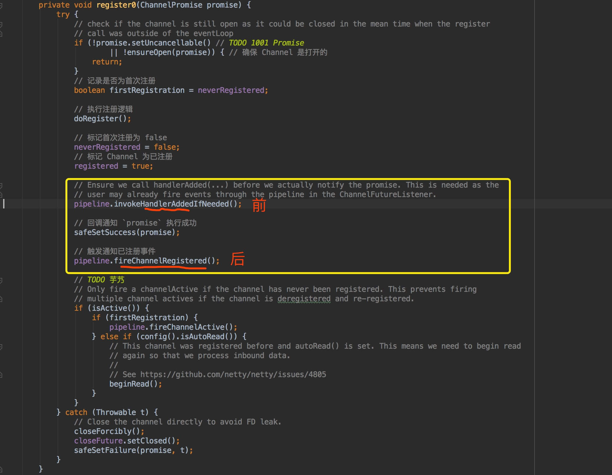

ChannelHandler（二）之 ChannelInitializer

## 1. 概述

本文，我们来分享 **ChannelInitializer** 。它是一个**特殊**的ChannelInboundHandler 实现类，用于 Channel 注册到 EventLoop 后，**执行自定义的初始化操作**。一般情况下，初始化自定义的 ChannelHandler 到 Channel 中。例如：

- ServerBootstrap 初始化时，通过 ChannelInitializer 初始化了用于接受( accept )新连接的 ServerBootstrapAcceptor 。
- 在有新连接接入时，服务端通过 ChannelInitializer 初始化，为客户端的 Channel 添加自定义的 ChannelHandler ，用于处理该 Channel 的读写( read/write ) 事件。

OK，让我们看看具体的代码实现落。

## 2. ChannelInitializer

`io.netty.channel.ChannelInitializer` ，继承 ChannelInboundHandlerAdapter 类，Channel Initializer **抽象类**。代码如下：

```java
@Sharable
public abstract class ChannelInitializer<C extends Channel> extends ChannelInboundHandlerAdapter {
```

- 通过 `@Sharable` 注解，支持共享。

### 2.1 initChannel

`#initChannel(ChannelHandlerContext ctx)` 方法，执行行自定义的初始化操作。代码如下：

```java
// We use a ConcurrentMap as a ChannelInitializer is usually shared between all Channels in a Bootstrap /
// ServerBootstrap. This way we can reduce the memory usage compared to use Attributes.
/**
 * 由于 ChannelInitializer 可以在 Bootstrap/ServerBootstrap 的所有通道中共享，所以我们用一个 ConcurrentMap 作为初始化器。
 * 这种方式，相对于使用 {@link io.netty.util.Attribute} 方式，减少了内存的使用。
 */
private final ConcurrentMap<ChannelHandlerContext, Boolean> initMap = PlatformDependent.newConcurrentHashMap();

  1: private boolean initChannel(ChannelHandlerContext ctx) throws Exception {
  2:     if (initMap.putIfAbsent(ctx, Boolean.TRUE) == null) { // Guard against re-entrance. 解决并发问题
  3:         try {
  4:             // 初始化通道
  5:             initChannel((C) ctx.channel());
  6:         } catch (Throwable cause) {
  7:             // 发生异常时，执行异常处理
  8:             // Explicitly call exceptionCaught(...) as we removed the handler before calling initChannel(...).
  9:             // We do so to prevent multiple calls to initChannel(...).
 10:             exceptionCaught(ctx, cause);
 11:         } finally {
 12:             // 从 pipeline 移除 ChannelInitializer
 13:             remove(ctx);
 14:         }
 15:         return true; // 初始化成功
 16:     }
 17:     return false; // 初始化失败
 18: }
```

- 第 2 行：通过 `initMap` 属性，解决并发问题。

- 第 5 行：调用 `#initChannel(C ch)` **抽象**方法，执行行自定义的初始化操作。代码如下：

  ```java
  /**
   * This method will be called once the {@link Channel} was registered. After the method returns this instance
   * will be removed from the {@link ChannelPipeline} of the {@link Channel}.
   *
   * @param ch            the {@link Channel} which was registered.
   * @throws Exception    is thrown if an error occurs. In that case it will be handled by
   *                      {@link #exceptionCaught(ChannelHandlerContext, Throwable)} which will by default close
   *                      the {@link Channel}.
   */
  protected abstract void initChannel(C ch) throws Exception;
  ```

  - 子类继承 ChannelInitializer 抽象类后，实现该方法，自定义 Channel 的初始化逻辑。

- 第 6 至 10 行：调用 `#exceptionCaught(ChannelHandlerContext ctx, Throwable cause)` 方法，发生异常时，执行异常处理。代码如下：

  ```java
  /**
   * Handle the {@link Throwable} by logging and closing the {@link Channel}. Sub-classes may override this.
   */
  @Override
  public void exceptionCaught(ChannelHandlerContext ctx, Throwable cause) throws Exception {
      if (logger.isWarnEnabled()) {
          logger.warn("Failed to initialize a channel. Closing: " + ctx.channel(), cause);
      }
      ctx.close();
  }
  ```

  - 打印**告警**日志。
  - **关闭** Channel 通道。因为，初始化 Channel 通道发生异常，意味着很大可能，无法正常处理该 Channel 后续的读写事件。
  - 😈 当然，`#exceptionCaught(...)` 方法，并非使用 `final` 修饰。所以也可以在子类覆写该方法。当然，笔者在实际使用并未这么做过。

- 第 11 至 14 行：最终，调用 `#remove(ChannelHandlerContext ctx)` 方法，从 pipeline 移除 ChannelInitializer。代码如下：

  ```java
  private void remove(ChannelHandlerContext ctx) {
      try {
          // 从 pipeline 移除 ChannelInitializer
          ChannelPipeline pipeline = ctx.pipeline();
          if (pipeline.context(this) != null) {
              pipeline.remove(this);
          }
      } finally {
          initMap.remove(ctx); // 从 initMap 移除
      }
  }
  ```

  - 从 pipeline 移除 ChannelInitializer 后，避免重新初始化的问题。

- 第 15 行：返回 `true` ，表示**有**执行初始化。
- 第 17 行：返回 `false` ，表示**未**执行初始化。

### 2.2 channelRegistered

在 Channel 注册到 EventLoop 上后，会触发 Channel Registered 事件。那么 `ChannelInitializer` 的 `#channelRegistered(ChannelHandlerContext ctx)` 方法，就会处理该事件。而 ChannelInitializer 对该事件的处理逻辑是，初始化 Channel 。代码如下：

```java
@Override
@SuppressWarnings("unchecked")
public final void channelRegistered(ChannelHandlerContext ctx) throws Exception {
    // Normally this method will never be called as handlerAdded(...) should call initChannel(...) and remove
    // the handler.
    // <1> 初始化 Channel
    if (initChannel(ctx)) {
        // we called initChannel(...) so we need to call now pipeline.fireChannelRegistered() to ensure we not
        // miss an event.
        // <2.1> 重新触发 Channel Registered 事件
        ctx.pipeline().fireChannelRegistered();
    } else {
        // <2.2> 继续向下一个节点的 Channel Registered 事件
        // Called initChannel(...) before which is the expected behavior, so just forward the event.
        ctx.fireChannelRegistered();
    }
}
```

- `<1>` 处，调用 `#initChannel(ChannelHandlerContext ctx)` 方法，初始化 Channel 。
- `<2.1>` 处，若有初始化，**重新触发** Channel Registered 事件。因为，很有可能添加了新的 ChannelHandler 到 pipeline 中。
- `<2.2>` 处，若无初始化，**继续向下一个节点**的 Channel Registered 事件。

### 2.3 handlerAdded

`ChannelInitializer#handlerAdded(ChannelHandlerContext ctx)` 方法，代码如下：

```java
@Override
public void handlerAdded(ChannelHandlerContext ctx) throws Exception {
    if (ctx.channel().isRegistered()) { // 已注册
        // This should always be true with our current DefaultChannelPipeline implementation.
        // The good thing about calling initChannel(...) in handlerAdded(...) is that there will be no ordering
        // surprises if a ChannelInitializer will add another ChannelInitializer. This is as all handlers
        // will be added in the expected order.
        initChannel(ctx);
    }
}
```

- 诶？怎么这里又调用了 `#initChannel(ChannelHandlerContext ctx)` 方法，初始化 Channel 呢？实际上，绝绝绝大多数情况下，因为 Channel Registered 事件触发在 Added **之后**，如果说在 `#handlerAdded(ChannelHandlerContext ctx)` 方法中，初始化 Channel 完成，那么 ChannelInitializer 便会从 pipeline 中移除。也就说，不会执行 `#channelRegistered(ChannelHandlerContext ctx)` 方法。

- ↑↑↑ 上面这段话听起来非常绕噢。简单来说，ChannelInitializer 调用 `#initChannel(ChannelHandlerContext ctx)` 方法，初始化 Channel 的调用来源，是来自 `#handlerAdded(...)` 方法，而不是 `#channelRegistered(...)` 方法。

- 还是不理解？在 `#handlerAdded(ChannelHandlerContext ctx)` 方法上打上“**断点**”，并调试启动 `io.netty.example.echo.EchoServer` ，就能触发这种情况。原因是什么呢？如下图所示：

  

  至于说，什么时候使用 ChannelInitializer 调用 `#initChannel(ChannelHandlerContext ctx)` 方法，初始化 Channel 的调用来源，是来自 `#channelRegistered(...)` 方法，笔者暂未发现。