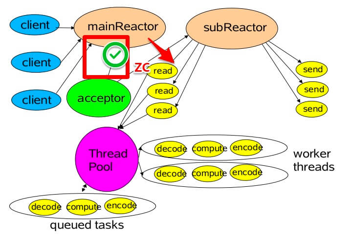
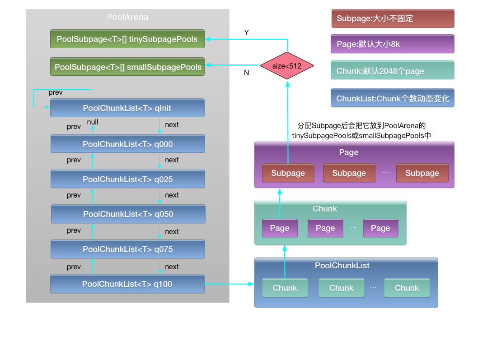

# 面试题

### Reactor 模型

什么是Reactor及三种版本？

Reactor 的线程模型有三种:

- 单线程模型

  

  ```java
  EventLoopGroup bossGroup = new NioEventLoopGroup(1);
  ServerBootstrap b = new ServerBootstrap();
  b.group(bossGroup)
   .channel(NioServerSocketChannel.class)
   ...
  ```

- 多线程模型

  

  ```java
  EventLoopGroup bossGroup = new NioEventLoopGroup();
  EventLoopGroup workerGroup = new NioEventLoopGroup();
  ServerBootstrap b = new ServerBootstrap();
  b.group(bossGroup, workerGroup)
   .channel(NioServerSocketChannel.class)
   ...
  ```

  

- 主从多线程模型（Netty不支持）

  

  

[《Netty 源码分析之 三 我就是大名鼎鼎的 EventLoop(一)》](https://segmentfault.com/a/1190000007403873)


**Netty采用多 Reactor 多线程模型**



1. mainReactor 负责监听 ServerSocketChannel ，用来处理客户端新连接的建立，并将建立的客户端的 SocketChannel 指定注册给 subReactor 。
2. subReactor 维护自己的 Selector ，基于 mainReactor 建立的客户端的 SocketChannel 多路分离 IO 读写事件，读写网络数据。对于业务处理的功能，另外扔给 worker 线程池来完成。

### TCP 粘包 / 拆包的原因？应该这么解决？

- **概念**

  **UDP无粘包问题**

  UDP不存在粘包问题，是由于UDP发送的时候，没有经过Negal算法优化，不会将多个小包合并一次发送出去。另外，UDP协议有消息保护边界，接收端采用了链式结构来记录每一个到达的UDP包，这样接收端应用程序一次recv只能从socket接收缓冲区中读出一个数据包。也就是说，发送端send了几次，接收端必须recv几次（无论recv时指定了多大的缓冲区）。

  

  TCP是流式协议，消息无边界。UDP是面向消息的，有消息边界。

  TCP 是以流的方式来处理数据，所以会导致粘包 / 拆包。

  - 拆包：一个完整的包可能会被 TCP 拆分成多个包进行发送。
  - 粘包：也可能把小的封装成一个大的数据包发送。

- **原因**

  - 应用程序写入的字节大小大于套接字发送缓冲区的大小，会发生**拆包**现象。
  - 发送的数据大于协议的MTU(Max Transmission Unit，最大传输单元)时，
    - 传输层，待发送数据大于 MSS（最大报文长度），TCP 在传输前将进行**拆包**。
    - 数据链路层，数据以太网帧的 payload（净荷）大于 MTU（默认为 1500 字节）进行**拆包**。
  - 应用程序写入数据小于套接字缓冲区大小，网卡将应用多次写入的数据发送到网络上，这将会发生**粘包**现象。接收数据端的应用层没有及时读取接收缓冲区中的数据，将发生**粘包**。

- **解决**

  在 Netty 中，提供了多个 Decoder 解析类，如下：

  - ① FixedLengthFrameDecoder ，基于**固定长度**消息进行粘包拆包处理的。
  - ② LengthFieldBasedFrameDecoder ，基于**消息头指定消息长度**进行粘包拆包处理的。
  - ③ LineBasedFrameDecoder ，基于**换行**来进行消息粘包拆包处理的。
  - ④ DelimiterBasedFrameDecoder ，基于**指定消息边界方式**进行粘包拆包处理的。

  实际上，上述四个 FrameDecoder 实现可以进行规整：

  - ① 是 ② 的特例，**固定长度**是**消息头指定消息长度**的一种形式。
  - ③ 是 ④ 的特例，**换行**是于**指定消息边界方式**的一种形式。

### 了解哪几种序列化协议？

1. 【重点】Java 默认提供的序列化
   - 无法跨语言；序列化后的字节大小太大；序列化的性能差。
2. 【重点】XML 。
   - 优点：人机可读性好，可指定元素或特性的名称。
   - 缺点：序列化数据只包含数据本身以及类的结构，不包括类型标识和程序集信息；只能序列化公共属性和字段；不能序列化方法；文件庞大，文件格式复杂，传输占带宽。
   - 适用场景：当做配置文件存储数据，实时数据转换。
3. 【重点】JSON ，是一种轻量级的数据交换格式。
   - 优点：兼容性高、数据格式比较简单，易于读写、序列化后数据较小，可扩展性好，兼容性好。与 XML 相比，其协议比较简单，解析速度比较快。
   - 缺点：数据的描述性比 XML 差、不适合性能要求为 ms 级别的情况、额外空间开销比较大。
   - 适用场景（可替代 XML ）：跨防火墙访问、可调式性要求高、基于Restful API 请求、传输数据量相对小，实时性要求相对低（例如秒级别）的服务。
4. 【了解】Thrift ，不仅是序列化协议，还是一个 RPC 框架。
   - 优点：序列化后的体积小, 速度快、支持多种语言和丰富的数据类型、对于数据字段的增删具有较强的兼容性、支持二进制压缩编码。
   - 缺点：使用者较少、跨防火墙访问时，不安全、不具有可读性，调试代码时相对困难、不能与其他传输层协议共同使用（例如 HTTP）、无法支持向持久层直接读写数据，即不适合做数据持久化序列化协议。
   - 适用场景：分布式系统的 RPC 解决方案。
5. 【了解】Avro ，Hadoop 的一个子项目，解决了JSON的冗长和没有IDL的问题。
   - 优点：支持丰富的数据类型、简单的动态语言结合功能、具有自我描述属性、提高了数据解析速度、快速可压缩的二进制数据形式、可以实现远程过程调用 RPC、支持跨编程语言实现。
   - 缺点：对于习惯于静态类型语言的用户不直观。
   - 适用场景：在 Hadoop 中做 Hive、Pig 和 MapReduce 的持久化数据格式。
6. 【重点】Protobuf ，将数据结构以`.proto` 文件进行描述，通过代码生成工具可以生成对应数据结构的 POJO 对象和 Protobuf 相关的方法和属性。
   - 优点：序列化后码流小，性能高、结构化数据存储格式（XML JSON等）、通过标识字段的顺序，可以实现协议的前向兼容、结构化的文档更容易管理和维护。
   - 缺点：需要依赖于工具生成代码、支持的语言相对较少，官方只支持Java 、C++、python。
   - 适用场景：对性能要求高的 RPC 调用、具有良好的跨防火墙的访问属性、适合应用层对象的持久化。
7. 其它
   - 【重点】Protostuff ，基于 Protobuf 协议，但不需要配置proto 文件，直接导包即可。
     - 目前，微博 RPC 框架 Motan 在使用它。
   - 【了解】Jboss Marshaling ，可以直接序列化 Java 类， 无须实 `java.io.Serializable` 接口。
   - 【了解】Message Pack ，一个高效的二进制序列化格式。
   - 【重点】Hessian，采用二进制协议的轻量级 remoting on http 服务。
     - 目前，阿里 RPC 框架 Dubbo 的**默认**序列化协议。
   - 【重要】kryo ，是一个快速高效的Java对象图形序列化框架，主要特点是性能、高效和易用。该项目用来序列化对象到文件、数据库或者网络。
     - 目前，阿里 RPC 框架 Dubbo 的可选序列化协议。
   - 【重要】FST ，fast-serialization 是重新实现的 Java 快速对象序列化的开发包。序列化速度更快（2-10倍）、体积更小，而且兼容 JDK 原生的序列化。要求 JDK 1.7 支持。
     - 目前，阿里 RPC 框架 Dubbo 的可选序列化协议。

### Keepalive与Idle监测

**为什么需要keepalive?**

及时释放坏掉的，空闲的连接。


**TCP keepalive怎么设计的？**

有三个系统参数控制tcp keepalive，分别是keep alive时长，发送keep alive间隔时长，发送次数。


**为什么需要应用层keepalive?**

- 协议分层，各个层关注点不同
- TCP层keepalive 默认关闭，时间太长
- 修改TCP层keepalive参数会影响同一台服务器别的应用


**如何在Netty中开区TCP keepalive和Idle检测？**

开启TCP keepalive: .option()

Idle检测: 添加Idle检测handler，检测到idle触发事件。添加自定义handler来响应idle事件。


**什么是 Netty 空闲检测？**

在 Netty 中，提供了 IdleStateHandler 类，正如其名，空闲状态处理器，用于检测连接的读写是否处于空闲状态。如果是，则会触发 IdleStateEvent 。

IdleStateHandler 目前提供三种类型的心跳检测，通过构造方法来设置。代码如下：

```
// IdleStateHandler.java

public IdleStateHandler(
        int readerIdleTimeSeconds,
        int writerIdleTimeSeconds,
        int allIdleTimeSeconds) {
    this(readerIdleTimeSeconds, writerIdleTimeSeconds, allIdleTimeSeconds,
         TimeUnit.SECONDS);
}
```

- `readerIdleTimeSeconds` 参数：为读超时时间，即测试端一定时间内未接受到被测试端消息。
- `writerIdleTimeSeconds` 参数：为写超时时间，即测试端一定时间内向被测试端发送消息。
- `allIdleTimeSeconds` 参数：为读或写超时时间。

------

另外，我们会在网络上看到类似《IdleStateHandler 心跳机制》这样标题的文章，实际上空闲检测和心跳机制是**两件事**。

- 只是说，因为我们使用 IdleStateHandler 的目的，就是检测到连接处于空闲，通过心跳判断其是否还是**有效的连接**。
- 虽然说，TCP 协议层提供了 Keeplive 机制，但是该机制默认的心跳时间是 2 小时，依赖操作系统实现不够灵活。因而，我们才在应用层上，自己实现心跳机制。


**Netty 如何实现重连？**

- 客户端，通过 IdleStateHandler 实现定时检测是否空闲，例如说 15 秒。
  - 如果空闲，则向服务端发起心跳。
  - 检测到channel被关闭，则重新发起连接。
- 服务端，通过 IdleStateHandler 实现定时检测客户端是否空闲，例如说 90 秒。
  - 如果检测到空闲，则关闭客户端。


### Netty内存相关

**Netty 的零拷贝实现？**

Netty 的零拷贝实现，是体现在多方面的，主要如下：

1. 【重点】Netty 的接收和发送 ByteBuffer 采用堆外直接内存Direct Buffer。

   - 使用堆外直接内存进行 Socket 读写，不需要进行字节缓冲区的二次拷贝；使用堆内内存会多了一次内存拷贝，JVM 会将堆内存 Buffer 拷贝一份到直接内存中，然后才写入 Socket 中。
   - Netty 创建的 ByteBuffer 类型，由 ChannelConfig 配置。而 ChannelConfig 配置的 ByteBufAllocator 默认创建 Direct Buffer 类型。

2. CompositeByteBuf类，可以将多个 ByteBuf 合并为一个逻辑上的 ByteBuf ，避免了传统通过内存拷贝的方式将几个小 Buffer 合并成一个大的 Buffer 。

   - `#addComponents(...)` 方法，可将 header 与 body 合并为一个逻辑上的 ByteBuf 。这两个 ByteBuf 在CompositeByteBuf 内部都是单独存在的，即 CompositeByteBuf 只是逻辑上是一个整体。

3. 通过FileRegion包装的 FileChannel 。

   - `#tranferTo(...)` 方法，实现文件传输, 可以直接将文件缓冲区的数据发送到目标 Channel ，避免了传统通过循环 write 方式，导致的内存拷贝问题。

4. 通过 **wrap** 方法, 我们可以将 `byte[]` 数组、ByteBuf、ByteBuffer 等包装成一个 Netty ByteBuf 对象, 进而避免了拷贝操作。

   

**Netty 自己实现的 ByteBuf 有什么优点？**

- A01. 它可以被用户自定义的**缓冲区类型**扩展
- A02. **零拷贝**
- A03. 容量可以**按需增长**
- A04. 在读和写这两种模式之间切换不需要调用 `#flip()` 方法
- A05. 读和写使用了**不同的索引**
- A06. 支持方法的**链式**调用
- A07. 支持引用计数
- A08. 支持**池化**
- A09. 支持Direct ByteBuf


**Netty 为什么要实现内存管理？**

- **老艿艿的理解**

在 Netty 中，IO 读写必定是非常频繁的操作，而考虑到更高效的网络传输性能，Direct ByteBuffer 必然是最合适的选择。但是 Direct ByteBuffer 的申请和释放是高成本的操作，那么进行**池化**管理，多次重用是比较有效的方式。但是，不同于一般于我们常见的对象池、连接池等**池化**的案例，ByteBuffer 是有**大小**一说。又但是，申请多大的 Direct ByteBuffer 进行池化又会是一个大问题，太大会浪费内存，太小又会出现频繁的扩容和内存复制！！！所以呢，就需要有一个合适的内存管理算法，解决**高效分配内存**的同时又解决**内存碎片化**的问题。

- **官方的说法**

> FROM [《Netty 学习笔记 —— Pooled buffer》](https://skyao.gitbooks.io/learning-netty/content/buffer/pooled_buffer.html)
>
> Netty 4.x 增加了 Pooled Buffer，实现了高性能的 buffer 池，分配策略则是结合了 buddy allocation 和 slab allocation 的 **jemalloc** 变种，代码在`io.netty.buffer.PoolArena` 中。
>
> 官方说提供了以下优势：
>
> - 频繁分配、释放 buffer 时减少了 GC 压力。
> - 在初始化新 buffer 时减少内存带宽消耗( 初始化时不可避免的要给buffer数组赋初始值 )。
> - 及时的释放 direct buffer 。

- **hushi55 大佬的理解**

> C/C++ 和 java 中有个围城，城里的想出来，城外的想进去！**

这个围城就是自动内存管理！

**Netty 4 buffer 介绍**

Netty4 带来一个与众不同的特点是其 ByteBuf 的实现，相比之下，通过维护两个独立的读写指针， 要比 `io.netty.buffer.ByteBuf` 简单不少，也会更高效一些。不过，Netty 的 ByteBuf 带给我们的最大不同，就是他不再基于传统 JVM 的 GC 模式，相反，它采用了类似于 C++ 中的 malloc/free 的机制，需要开发人员来手动管理回收与释放。从手动内存管理上升到GC，是一个历史的巨大进步， 不过，在20年后，居然有曲线的回归到了手动内存管理模式，正印证了马克思哲学观： **社会总是在螺旋式前进的，没有永远的最好。**

**① GC 内存管理分析**

的确，就内存管理而言，GC带给我们的价值是不言而喻的，不仅大大的降低了程序员的心智包袱， 而且，也极大的减少了内存管理带来的 Crash 困扰，为函数式编程（大量的临时对象）、脚本语言编程带来了春天。 并且，高效的GC算法也让大部分情况下程序可以有更高的执行效率。 不过，也有很多的情况，可能是手工内存管理更为合适的。譬如：

- 对于类似于业务逻辑相对简单，譬如网络路由转发型应用（很多erlang应用其实是这种类型）， 但是 QPS 非常高，比如1M级，在这种情况下，在每次处理中即便产生1K的垃圾，都会导致频繁的GC产生。 在这种模式下，erlang 的按进程回收模式，或者是 C/C++ 的手工回收机制，效率更高。
- Cache 型应用，由于对象的存在周期太长，GC 基本上就变得没有价值。

所以，理论上，尴尬的GC实际上比较适合于处理介于这 2 者之间的情况： 对象分配的频繁程度相比数据处理的时间要少得多的，但又是相对短暂的， 典型的，对于OLTP型的服务，处理能力在 1K QPS 量级，每个请求的对象分配在 10K-50K 量级， 能够在 5-10s 的时间内进行一 次younger GC ，每次GC的时间可以控制在 10ms 水平上， 这类的应用，实在是太适合 GC 行的模式了，而且结合 Java 高效的分代 GC ，简直就是一个理想搭配。

**② 影响**

Netty 4 引入了手工内存的模式，我觉得这是一大创新，这种模式甚至于会延展， 应用到 Cache 应用中。实际上，结合 JVM 的诸多优秀特性，如果用 Java 来实现一个 Redis 型 Cache、 或者 In-memory SQL Engine，或者是一个 Mongo DB，我觉得相比 C/C++ 而言，都要更简单很多。 实际上，JVM 也已经提供了打通这种技术的机制，就是 Direct Memory 和 Unsafe 对象。 基于这个基础，我们可以像 C 语言一样直接操作内存。实际上，Netty4 的 ByteBuf 也是基于这个基础的。


**Netty 如何实现内存管理？**

Netty 内存管理机制，基于 [Jemalloc](http://www.cnhalo.net/2016/06/13/memory-optimize/) 算法。

- 首先会预申请一大块内存 **Arena** ，Arena 由许多 Chunk 组成，而每个 Chunk 默认由2048个page组成。
- **Chunk** 通过 **AVL** 树的形式组织 **Page** ，每个叶子节点表示一个 Page ，而中间节点表示内存区域，节点自己记录它在整个 Arena 中的偏移地址。当区域被分配出去后，中间节点上的标记位会被标记，这样就表示这个中间节点以下的所有节点都已被分配了。大于 8k 的内存分配在 **PoolChunkList** 中，而 **PoolSubpage** 用于分配小于 8k 的内存，它会把一个 page 分割成多段，进行内存分配。




**什么是 Netty 的内存泄露检测？是如何进行实现的？**

推荐阅读如下两篇文章：

- [《Netty 之有效规避内存泄漏》](http://calvin1978.blogcn.com/articles/netty-leak.html) 从原理层面解释。
- 《Buffer 之 ByteBuf（三）内存泄露检测从源码层面解读。

另外，Netty 的内存泄露检测的实现，是对 WeakReference 和 ReferenceQueue 很好的学习。之前很多胖友在看了 [《Java 中的四种引用类型》](http://www.iocoder.cn/Fight/Four-reference-types-in-Java) 之后，是不太理解 Java 的四种引用的具体使用场景，这不就来了么。

检测步骤如下

- 创建ByteBuf的时候，如果被选为需要检测内存泄露。 则调用`ResourceLeakDetector.track(buf)`返回一个ResourceLeakTracker对象（这个对象是个WeakReference对象）。同时这个ResourceLeakTracker会被添加到`ResourceLeakDetector.allLeaks`这个集合中去

- 将该ByteBuf和leak一起封装进`SimpleLeakAwareByteBuf`或者`AdvancedLeakAwareByteBuf`

- 当ByteBuf使用完，正常情况会调用release，这时候会在释放内存的同时，将属于它的ResourceLeakTracker对象从`ResourceLeakDetector.allLeaks`中移除。

- 现在，ByteBuf用完了，被GC了，则属于这个ByteBuf的ResourceLeakTracker对象会加入到一个queue里面(因为它是WeakReference)，我们会在某个时间点去检查这个queue里面的每个ResourceLeakTracker对象。

  对每个ResourceLeakTracker对象调用`allLeks.remove(leak)`，如果返回true，意味着该ResourceLeakTracker对象还存在于`ResourceLeakDetector.allLeaks`集合中，说明了其对应的ByteBuf在被GC前，没有调用release()，没有归还内存空间，证明了内存泄露的存在。返回false才是我们希望看到的。


**内存池/非内存池的默认选择及切换方式？**

除了安卓，默认使用内存池，可通过.childOption()显示指定，或者io.netty.allocator.type去指定。


### 说说 Netty 如何实现高性能？

1. **线程模型** ：更加优雅的 Reactor 模式实现、灵活的线程模型、利用 EventLoop 等创新性的机制，可以非常高效地管理成百上千的 Channel 。
2. **堆外内存** ：TCP 接收和发送缓冲区采用直接内存代替堆内存，避免了内存复制，提升了 I/O 读取和写入性能。
3. **内存池设计** ：支持通过内存池的方式循环利用 ByteBuf，避免了频繁创建和销毁 ByteBuf 带来的性能消耗。
4. **参数配置** ：可配置的 I/O 线程数目和 TCP 参数等，为不同用户提供定制化的调优参数，满足不同的性能场景。
5. **内存泄露检测** ：通过引用计数器及时地释放不再被引用的对象，细粒度的内存管理降低了 GC 的频率，减少频繁 GC 带来的时延增大和 CPU 损耗。
6. Jemallco内存分配算法

### Netty 的高可靠如何体现？

- 链路有效性检测：由于长连接不需要每次发送消息都创建链路，也不需要在消息完成交互时关闭链路，因此相对于短连接性能更高。为了保证长连接的链路有效性，往往需要通过心跳机制周期性地进行链路检测。使用心跳机制的原因是，避免在系统空闲时因网络闪断而断开连接，之后又遇到海量业务冲击导致消息积压无法处理。为了解决这个问题，需要周期性地对链路进行有效性检测，一旦发现问题，可以及时关闭链路，重建 TCP 连接。为了支持心跳，Netty 提供了两种链路空闲检测机制：
  - 读空闲超时机制：连续 T 周期没有消息可读时，发送心跳消息，进行链路检测。如果连续 N 个周期没有读取到心跳消息，可以主动关闭链路，重建连接。
  - 写空闲超时机制：连续 T 周期没有消息需要发送时，发送心跳消息，进行链路检测。如果连续 N 个周期没有读取对方发回的心跳消息，可以主动关闭链路，重建连接。
- 内存保护机制：Netty 提供多种机制对内存进行保护，包括以下几个方面：
  - 通过对象引用计数器对 ByteBuf 进行细粒度的内存申请和释放，及时清理内存。
  - 内存泄露感知，防止内存泄露。
- **优雅停机**：优雅停机功能指的是当系统推出时，JVM 通过注册的 Shutdown Hook 拦截到退出信号量，然后执行退出操作，释放相关模块的资源占用，将缓冲区的消息处理完成或清空，将待刷新的数据持久化到磁盘和数据库中，等到资源回收和缓冲区消息处理完成之后，再退出。

### Netty 的可扩展如何体现？

可定制、易扩展。

- **责任链模式** ：ChannelPipeline 基于责任链模式开发，便于业务逻辑的拦截、定制和扩展。
- **基于接口的开发** ：关键的类库都提供了接口或抽象类，便于用户自定义实现。
- **提供大量的工厂类** ：通过重载这些工厂类，可以按需创建出用户需要的对象。
- **提供大量系统参数** ：供用户按需设置，增强系统的场景定制性。

------

> 实际上，任何的技术的研究，我们都可以去思考，它的高性能是怎么体现的，它的可靠性是怎么体现的，它的可拓展是怎么体现的。
>
> 当然，因为很多时候有近义词，所以：
>
> - 高性能 => 高并发
> - 可靠性 => 高可用
> - 可拓展 => 高拓展

### 简单介绍 Netty 的核心组件？

Netty 有如下六个核心组件：

- Bootstrap & ServerBootstrap
- Channel
- ChannelFuture
- EventLoop & EventLoopGroup
- ChannelHandler
- ChannelPipeline

详细的，请直接阅读 [《精尽 Netty 源码分析 —— Netty 简介（二）之核心组件》](http://svip.iocoder.cn/Netty/intro-2/) 一文。


### 什么是业务线程池？

- **问题**

在 [「什么是 Reactor 模型？」](http://svip.iocoder.cn/Netty/Interview/#) 问题中，无论是那种类型的 Reactor 模型，都需要在 Reactor 所在的线程中，进行读写操作。那么此时就会有一个问题，如果我们读取到数据，需要进行业务逻辑处理，并且这个业务逻辑需要对数据库、缓存等等进行操作，会有什么问题呢？假设这个数据库操作需要 5 ms ，那就意味着这个 Reactor 线程在这 5 ms 无法进行注册在这个 Reactor 的 Channel 进行读写操作。也就是说，多个 Channel 的所有读写操作都变成了串行。势必，这样的效率会非常非常非常的低。

- **解决**

那么怎么解决呢？创建业务线程池，将读取到的数据，提交到业务线程池中进行处理。这样，Reactor 的 Channel 就不会被阻塞，而 Channel 的所有读写操作都变成了并行了。

- **案例**

如果胖友熟悉 Dubbo 框架，就会发现 [《Dubbo 用户指南 —— 线程模型》](http://dubbo.apache.org/zh-cn/docs/user/demos/thread-model.html) 。😈 认真读下，可以跟面试官吹一吹啦。

### select、poll、epoll之间的区别

(1)select==>时间复杂度O(n)

它仅仅知道了，有I/O事件发生了，却并不知道是哪那几个流（可能有一个，多个，甚至全部），我们只能无差别轮询所有流，找出能读出数据，或者写入数据的流，对他们进行操作。所以**select具有O(n)的无差别轮询复杂度**，同时处理的流越多，无差别轮询时间就越长。

(2)poll==>时间复杂度O(n)

poll本质上和select没有区别，它将用户传入的数组拷贝到内核空间，然后查询每个fd对应的设备状态， **但是它没有最大连接数的限制**，原因是它是基于链表来存储的.

(3)epoll==>时间复杂度O(1)

**epoll可以理解为event poll**，不同于忙轮询和无差别轮询，epoll会把哪个流发生了怎样的I/O事件通知我们。所以我们说epoll实际上是**事件驱动（每个事件关联上fd）**的，此时我们对这些流的操作都是有意义的。**（复杂度降低到了O(1)）**

epoll有EPOLLLT和EPOLLET两种触发模式，LT是默认的模式，ET是“高速”模式。LT模式下，只要这个fd还有数据可读，每次 epoll_wait都会返回它的事件，提醒用户程序去操作，而在ET（边缘触发）模式中，它只会提示一次，直到下次再有数据流入之前都不会再提示了，无 论fd中是否还有数据可读。所以在ET模式下，read一个fd的时候一定要把它的buffer读光，也就是说一直读到read的返回值小于请求值，或者 遇到EAGAIN错误。还有一个特点是，epoll使用“事件”的就绪通知方式，通过epoll_ctl注册fd，一旦该fd就绪，内核就会采用类似callback的回调机制来激活该fd，epoll_wait便可以收到通知。

**epoll的优点：**

1、**没有最大并发连接的限制，能打开的FD的上限远大于1024（1G的内存上能监听约10万个端口）**；
**2、效率提升，不是轮询的方式，不会随着FD数目的增加效率下降。只有活跃可用的FD才会调用callback函数；**
**即Epoll最大的优点就在于它只管你“活跃”的连接，而跟连接总数无关，因此在实际的网络环境中，Epoll的效率就会远远高于select和poll。**

3、 内存拷贝，利用mmap()文件映射内存加速与内核空间的消息传递；即epoll使用mmap减少复制开销。


**select、poll、epoll 区别总结：**

1、支持一个进程所能打开的最大连接数

select

单个进程所能打开的最大连接数有FD_SETSIZE宏定义，其大小是32个整数的大小（在32位的机器上，大小就是32*32，同理64位机器上FD_SETSIZE为32*64），当然我们可以对进行修改，然后重新编译内核，但是性能可能会受到影响，这需要进一步的测试。

poll

poll本质上和select没有区别，但是它没有最大连接数的限制，原因是它是基于链表来存储的

epoll

虽然连接数有上限，但是很大，1G内存的机器上可以打开10万左右的连接，2G内存的机器可以打开20万左右的连接

2、FD剧增后带来的IO效率问题

select

因为每次调用时都会对连接进行线性遍历，所以随着FD的增加会造成遍历速度慢的“线性下降性能问题”。

poll

同上

epoll

因为epoll内核中实现是根据每个fd上的callback函数来实现的，只有活跃的socket才会主动调用callback，所以在活跃socket较少的情况下，使用epoll没有前面两者的线性下降的性能问题，但是所有socket都很活跃的情况下，可能会有性能问题。

3、 消息传递方式

select

内核需要将消息传递到用户空间，都需要内核拷贝动作

poll

同上

epoll

epoll通过内核和用户空间共享一块内存来实现的。

**总结：**

**综上，在选择select，poll，epoll时要根据具体的使用场合以及这三种方式的自身特点。**

**1、表面上看epoll的性能最好，但是在连接数少并且连接都十分活跃的情况下，select和poll的性能可能比epoll好，毕竟epoll的通知机制需要很多函数回调。**

**2、select低效是因为每次它都需要轮询。但低效也是相对的，视情况而定，也可通过良好的设计改善**

### 原生的 NIO 存在 Epoll Bug 是什么？Netty 是怎么解决的？

- **Java NIO Epoll BUG**

Java NIO Epoll 会导致 Selector 空轮询，最终导致 CPU 100% 。

官方声称在 JDK 1.6 版本的 update18 修复了该问题，但是直到 JDK 1.7 版本该问题仍旧存在，只不过该 BUG 发生概率降低了一些而已，它并没有得到根本性解决。

- **Netty 解决方案**

对 Selector 的 select 操作周期进行**统计**，每完成一次**空**的 select 操作进行一次计数，若在某个周期（默认1s）内连续发生 N（默认512） 次空轮询，则判断触发了 Epoll 死循环 Bug 。

> 此处**空**的 select 操作的定义是，select 操作执行了 0 毫秒。

此时，Netty **重建** Selector 来解决。将原 SocketChannel 从旧的 Selector 上取消注册，然后重新注册到新的 Selector 上，最后将原来的 Selector 关闭。


### Netty服务器启动流程

启动服务的本质： 

```java
// 1. 在new NioEventLoopGroup()时，创建Selector
Selector selector = sun.nio.ch.SelectorProviderImpl.openSelector() 

// 2.创建SocketChannel
ServerSocketChannel serverSocketChannel = provider.openServerSocketChannel() 

// 3. 将SocketChannel注册到selector上
selectionKey = javaChannel().register(eventLoop().unwrappedSelector(), 0, this); 

// 4. 将SocketChannel与localAddress绑定
javaChannel().bind(localAddress, config.getBacklog()); 

// 5. 监听OP_ACCEPT事件
selectionKey.interestOps(OP_ACCEPT);
```

- Selector 是在 new NioEventLoopGroup()（创建一批 NioEventLoop）时创建。 
- 第一次 Register 并不是监听 OP_ACCEPT，而是 0: selectionKey = javaChannel().register(eventLoop().unwrappedSelector(), 0, this) 。
- 最终监听 OP_ACCEPT 是通过 bind 完成后的 fireChannelActive() 来触发的。
- NioEventLoop 是通过 Register 操作的执行来完成启动的。 
- 类似 ChannelInitializer，一些 Hander 可以设计成一次性的，用完就移除，例如授权。


### Netty创建连接流程

```java
	// 1. 发现 OP_ACCEPT 事件
	selector.select()/selectNow()/select(timeoutMillis) 
  
	// 2. 通过serverSocketChannel创建SocketChannel
  SocketChannel socketChannel = serverSocketChannel.accept()
    
  // 3. 将创建的SocketChannel注册到work EventLoopGroup的selector上
  selectionKey = javaChannel().register(eventLoop().unwrappedSelector(), 0, this);

	// 4. 注册OP_READ事件
	selectionKey.interestOps(OP_READ);
```


### Netty读取数据流程

1. 多路复用器（ Selector ）接收到 OP_READ 事件
2. 处理 OP_READ 事件：NioSocketChannel.NioSocketChannelUnsafe.read()
   1. 分配一个初始 1024 字节的 byte buffer 来接受数据
   2. 从 Channel 接受数据到 byte buffer
   3. 记录实际接受数据大小，调整下次分配 byte buffer 大小
   4. 触发 pipeline.fireChannelRead(byteBuf) 把读取到的数据传播出去
   5. 判断接受 byte buffer 是否满载而归：是，尝试继续读取直到没有数据或满 16 次； 否，结束本轮读取，触发pipeline.fireChannelReadComplete()。等待下次 OP_READ 事件

- 读取数据本质：sun.nio.ch.SocketChannelImpl#read(java.nio.ByteBuffer)
- NioSocketChannel read() 是读数据， NioServerSocketChannel read() 是创建连接
- 为什么最多只尝试读取 16 次？“雨露均沾”


 ### Netty业务处理

业务处理发生在在处理OP_READ过程中，触发pipeline.fireChannelRead(byteBuf)后，

- 本质是数据在pipeline中所有handler的channelRead()执行过程
- Handler要实现ChannelInboundHander#channelRead方法，并且不能加@Skip
- 中途可退出，不保证执行到Tail Handler
- 默认处理线程就是Channel绑定的NioEventLoop线程，也可以设置其他线程池来执行。


### Netty发送数据

写数据要点：

- Netty 写数据，写不进去时，会停止写，然后注册一个 OP_WRITE 事件，来通知什么时候可以写进去了再写。
- Netty 批量写数据时，如果想写的都写进去了，接下来的尝试写更多（调整 maxBytesPerGatheringWrite）。
- Netty 只要有数据要写，且能写的出去，则一直尝试，直到写不出去或者满 16 次（writeSpinCount）。写 16 次还没有写完，就直 接 schedule 一个 task 来继续写，而不是用注册写事件来触发，更简洁有力。
- Netty 待flush数据太多，超过一定的水位线（writeBufferWaterMark.high()），会将可写的标志位改成 false ，让应用端自己做决定要不要发送数据了。


Write - 写数据到buffer:

**ctx.write**：从当前Context开始

**ctx.channel.write**：从TailContext开始执行

**ChannelOutboundBuffer#addMessage**


Flush - 发送buffer里面的数据

**ctx.flush**

**AbstractChannel.AbstractUnsafe#flush**

- 准备数据：ChannelOutboundBuffer#addFlush
- 发送：NioSocketChannel#doWrite