## RPC框架基础功能

### 协议

为什么不使用HTTP协议，而要实现私有的RPC协议？

1. HTTP协议体积大，存在无用信息。
2. HTTP协议是一个请求对应一个返回结果，因此无法一次发出多个请求，而私有RPC协议可以一次网络传输中发送多个请求，并一次接收多个返回结果，从而增大了吞吐量。

设计一个可扩展PRC协议


### 网络通信

RPC框架有高并发性能需求，通常采用多路I/O复用网络模型，具体实现例如Netty。

 Netty 零拷贝

- 使用CompositeByteBuf、slice、wrap 操作来复用ByteBuf，实现零拷贝。
- Netty 的 ByteBuffer 可以采用 Direct Buffers，使用堆外直接内存进行 Socket 的读写操作，从而实现了内核态与用户态内存的零拷贝。

### 序列化/反序列化

RPC框架为什么不使用JSON作为序列化协议？

- JSON进行序列化的空间开销比较大
- JSON没有类型，对于JAVA这类强类型语言来说，需要利用反射来解决，性能不会太好。

选择序列化协议需要考虑的因素？


### 客户端代理类实现

利用Java动态代理技术，代理服务提供方接口，内部实现RPC调用逻辑，对调用方屏蔽RPC调用细节。

```java
public class RpcClientProxy implements InvocationHandler {
    /**
     * 用于发送请求给服务端，对应socket和netty两种实现方式
     */
    private final ClientTransport clientTransport;

    public RpcClientProxy(ClientTransport clientTransport) {
        this.clientTransport = clientTransport;
    }

    /**
     * 通过 Proxy.newProxyInstance() 方法获取某个类的代理对象
     */
    @SuppressWarnings("unchecked")
    public <T> T getProxy(Class<T> clazz) {
        return (T) Proxy.newProxyInstance(clazz.getClassLoader(), new Class<?>[]{clazz}, this);
    }

    /**
     * 当你使用代理对象调用方法的时候实际会调用到这个方法。代理对象就是你通过上面的 getProxy 方法获取到的对象。
     */
    @SneakyThrows
    @SuppressWarnings("unchecked")
    @Override
    public Object invoke(Object proxy, Method method, Object[] args) {
        log.info("invoked method: [{}]", method.getName());
        RpcRequest rpcRequest = RpcRequest.builder().methodName(method.getName())
                .parameters(args)
                .interfaceName(method.getDeclaringClass().getName())
                .paramTypes(method.getParameterTypes())
                .requestId(UUID.randomUUID().toString())
                .build();
        RpcResponse rpcResponse = null;
        if (clientTransport instanceof NettyClientTransport) {
            CompletableFuture<RpcResponse> completableFuture = (CompletableFuture<RpcResponse>) clientTransport.sendRpcRequest(rpcRequest);
            rpcResponse = completableFuture.get();
        }
        if (clientTransport instanceof SocketRpcClient) {
            rpcResponse = (RpcResponse) clientTransport.sendRpcRequest(rpcRequest);
        }
        //校验 RpcResponse 和 RpcRequest
        RpcMessageChecker.check(rpcResponse, rpcRequest);
        return rpcResponse.getData();
    }
}
```

如果不用动态代理，怎么实现RPC调用？

1：使用静态代理实现
2：远程调度的代码和业务处理逻辑写在一块，序列化、编码、网络建连、网络传输、网络断连、以及负载均衡、失败重试等等都需要写出来

## RPC框架客户端核心功能

### 连接管理

保持与服务提供方长连接，用于传输请求数据和接收返回结果。

#### 初始化时机

#### 连接数维护

#### 心跳/重连

### 服务发现

业务量不大的时候，使用ZooKeeper即可。业务量大时，ZooKeeper读写压力剧增，由于其强一致性，性能下降严重，因此在大规模RPC集群中，不宜使用其作为服务注册中心。

在业务量大时，服务注册中心应该满足AP，而不是CP，由此可以提升读写性能。可以采用消息总线的机制实现。

### 负载均衡

RPC的负载均衡和Web负载均衡的差别在于，RPC是自身实现的LB，不依赖外部的负载均衡器，服务调用者是主动选择服务节点，发起调用。

以 Dubbo 为例，常用的负载均衡方法有：
1.基于权重随机算法
2.基于最少活跃调用数算法
3.基于 hash 一致性
4.基于加权轮询算法

设计一个动态负载均衡方法？

搜集服务提供节点的硬件参数，以及请求响应耗时（TP99），节点服务状况（健康，亚健康），计算出一个权重值赋予每个服务节点，配合随机权重的负载均衡算法，实现动态LB。

### 路由策略

RPC中的路由策略也就是从服务提供方集群中，选择调用其中一个服务节点的策略。

为什么需要？

灰度发布，黑白名单等功能的实现依赖于路由策略。

实现方式：

将路由策略配置在注册中心，服务调用方在获取服务提供方节点信息时，也同步路由策略。在路由策略中，根据发送请求的参数，选择调用不同的服务节点。或者根据自身的分组信息，选择调用对应分组的服务节点。

### 超时处理

调用端发起的请求失败时，如果配置了异常重试策略，RPC 框架会捕捉异常，对异常进行判定，符合条件则进行重试，重新发送请求。要注意以下几点：

- 设置合理的重试次数
- 每次重试时应当将超时计时器置零，保证在合理的时间内进行重试
- 请求必须是幂等的
- 通过白名单的形式配置需要重试的异常种类

### 健康检查

作为服务调用方，需要一套健康检查机制来实时感知服务提供方的健康状态。

具体解决方案：

1. TCP连接层面的心跳检测机制，设定一个失败阈值，例如连续失败超过3次，认定为非健康状态。

   问题：

   - 有可能服务提供方调用量实在太大，心跳响应缓慢导致失败，但是业务依然能得到响应，因此仅从心跳检测维度是不够的。
   - 阈值的设定不确定。

2. 从业务调用可用率维度来判断。可用率=一个窗口期内接口调用成功次数的百分比(成功次数/总次数)

### 业务分组

业务分组是以资源隔离的方式，防止某个服务调用方请求暴增，影响其他调用方的正常调用。

每个调用方有自己的分组，向注册中心拉取服务节点信息时，根据分组返回部分服务节点（而不是全部节点）。因此当某个调用方请求突增时，仅对自己分组的服务提供节点造成压力，而不会影响到所有服务提供节点。

为了保证高可用，可以设定每个调用方的主副分组，同时拉取主副两个分组的服务节点，但是只有当主节点都不可用时，才允许调用副分组中的服务节点。

## RPC框架服务端核心功能

### 队列/线程池

### 超时丢弃

快速失败已经超时的请求，缓解队列堆积。

对于每个入队的处理请求，记录其判定为超时的时间点，工作线程在处理每个请求之前，先判定该请求是否超时，如果是则要丢弃，因为请求方已经判定此请求超时，再做已经无意义，还影响后续的请求。

### 优雅启动

应用刚启动时，性能达不到最佳状态，容易大面积超时，因此在到达最佳服务性能之前，要减少被调用的频率或者不被调用。有以下两种思路：

- 服务提供节点向注册中心注册时，记录其注册时间，调用方根据此时间，降低那些刚启动不久的节点的权重值。

- 延迟暴露。在应用启动之后，执行Hook预热程序，再向注册中心注册自己。

  

当大批量重启时，刚启动的节点请求量较少，导致未重启的节点压力增大，可能引发超时，如何处理？

分批次重启

### 优雅关闭

服务提供方下线时，需要妥善处理正在处理的请求，拒绝新来的请求，通知注册中心自己即将下线。

- 对于新来的请求，返回响应告知调用方自己是要下线还是重启，如果是下线调用方不再调用此节点，如果是重启，调用方会启用后台线程轮训服务提供方是否重启完成。
- 如果是下线操作，则主动向注册中心下线自己。
- 设定一个超时时长，在此时间内继续处理已接收请求。

实现方式：

通过监听关闭信号，触发操作流程。

### 过载保护

服务端：采用限流的方式

- 在配置中心向各个节点下发限流配置
- 设立一个专门的限流服务，所有的服务都依赖这个限流服务进行整体的限流

客户端：

- 熔断机制，访问某个服务失败达到一定次数时，触发熔断器开启，不再调用此服务。同时每隔一段时间就允许尝试一次请求，如果请求成功，则关闭熔断器。
- 降级，优先保障核心功能，返回缓存数据。

## 主流RPC框架对比


## RPC高级功能

### 异步PRC

利用CompletableFuture对客户端和服务端进行全异步改造

- 服务调用方发起 RPC 调用，直接拿到返回值 CompletableFuture 对象，之后就不需要任何额外的与 RPC 框架相关的操作了，直接就可以进行异步处理；
- 在服务端的业务逻辑中创建一个返回值 CompletableFuture 对象，之后服务端真正的业务逻辑完全可以在一个线程池中异步处理，业务逻辑完成之后再调用这个 CompletableFuture 对象的 complete 方法，完成异步通知；
- 调用端在收到服务端发送过来的响应之后，RPC 框架再自动地调用调用端拿到的那个返回值 CompletableFuture 对象的 complete 方法，这样一次异步调用就完成了。


## Dubbo 注册中心

### 功能

- 服务动态加入
- 服务动态发现
- 参数动态调整
- 统一配置

### 模块

- Dubbo-registry-api: 注册中心所有API和抽象实现类
- Dubbo-registry-zookeeper，使用Zookeeper作为注册中心的实现
- Dubbo-registry-redis，使用Redis作为注册中心的实现
- Dubbo-registry-default，Dubbo基于内存的默认实现
- Dubbo-registry-multicast，广播模式的服务注册与发现

### 工作流程


- Provider启动时，向注册中心写入自己的元数据信息，订阅配置元数据信息。
- Consumer启动时，会向注册中心写入自己元数据信息，订阅Provider，路由，配置元数据信息。
- 当有Provider离开或加入，注册中心服务提供者目录会发生变化，并通知到Consumer和服务治理中心。
- 当Consumer发起服务调用时，会异步将调用，统计信息等上报给监控中心。

### Zookeeper作为注册中心数据结构

zookeeper的节点类型包括

- 持久节点：服务注册后保证节点不会丢失
- 持久顺序节点：通过节点编号指定节点的顺序
- 临时节点：服务注册后连接丢失或者session超时，注册的节点会自动被移除。
- 临时顺序节点

Dubbo在Zookeeper中存储数据结构如下：

\+ /dubbo

​		+-- /service

​			+-- /providers

​			+-- /consumers

​			+-- /routers

​			+-- /configurators

- 根节点是注册中心分组，由\<dubbo:registry\>中的group属性控制，默认为/dubbo
- providers目录下包含多个服务者URL数据元信息
- consumers目录下包含多个消费者URL数据元信息
- routers下包含用于消费者路由策略URL元数据信息
- confirgurators下包含多个用于服务者动态配置URL配置元数据

通过服务治理平台dubbo-admin更改routers和confirgurators下的数据。

### Redis数据结构

Redis key: /dubbo/com.foo.barService/providers 

Redis value(hash 数据结构): {URL1: 1000(expire), URL2: 1000, URL3: 500}


### 发布订阅

- Zookeeper

  发布：

  发布的实现就是调用zookeeper客户端去创建路径和删除路径

  ```
  zkClient.creat(URL);
  zkClient.delete(URL);
  ```

  订阅：
  provider会订阅configurators，consumer会订阅providers, routers, configurators。

  Zookeeper采用事件通知+客户端拉取的方式，客户端与zookeeper之间采用TCP长连接，并在订阅的节点上注册一个watcher，订阅的节点发生变动时，主动通知客户端，客户端会把对应节点下所有数据都拉取下来。

  通过实现Listener的childChanged(String parentPath, List\<String\> currentChilds)函数，来自定义数据发生变动时的响应。

  如果变化的节点URL是providers，则更新本地Directory管理的Invoker服务列表，如果是routers分类，则订阅方会更新本地路由规则列表。如果是configurators，则会更新本地动态参数列表。

- Redis

  发布：

  添加一个key, expire到hash结构中

  发布事件：

  在通道中发布一条register事件消息

  刷新过期时间：
  发布者周期性地更新key的过期时间

  超时清理：

  服务治理中心dubbo-admin定时获取hash中所有的key进行遍历，删除已经过期的key，并在通道中发起对应key的unregister事件。

  订阅：

  订阅节点的Redis channel，在数据发生变化时，收到事件通知做出相应响应。

### 缓存机制

消费者或者服务治理中心在获取注册信息后，会在内存中保存一份数据，也会持久化到本地磁盘上一个文件中。

服务在启动时的时候就会尝试加载这个本地文件到内存中，如果连接注册中心失败，则会利用从本地文件中加载的数据去加载Invokers。

**缓存的保存与更新：**

当客户端第一次订阅获取全量数据，或者后续更新得到新数据时，会触发更新内存缓存以及本地文件的逻辑。


### 重试机制

Dubbo中的FailbackRegistry抽象类定义了五个集合，分别存储了发起注册失败的URL，取消注册失败的URL，发起订阅失败的监听器，取消订阅失败的监听器，通知失败的URL。

FailbackRegistry还定义了一个ScheduledExecutorService，定时任务线程池，经过固定时间就会调用retry()方法，对五个集合进行遍历和重试。


### 设计模式

- 模板模式

  注册中心的逻辑部分使用了模板模式，其中的FailbackRegistry添加了四个未实现的抽象模板方法，

  ```
  protected abstract void doRegister(URL url);
  protected abstract void doUnregister(URL url);
  protected abstract void doSubscribe(URL url, NotifyLisenter notifyLisenter);
  protected abstract void doUnsubscribe(URL url, NotifyLisenter notifyLisenter);
  ```

  以上方法在FailbackRegistry的实现类ZookeeperRegistry和RedisRegistry中都有具体实现。

- 工厂模式

  所有注册中心实例，都是通过对应的工厂创建的，在RegistryFactory中，有一个方法

  ```java
  @SPI("dubbo")
  public interface RegistryFactory {
  	@Adaptive({"protocol"})
  	Registry getRegistry(URL url);
  }
  ```

  该方法根据protocol的值，来获取RegistryFactory的具体实现类，调用得到注册中心实例。


## Dubbo扩展点加载机制

Dubbo扩展点加载机制是基于Dubbo SPI实现的，让Dubbo框架的接口和具体实现完全解耦，奠定了框架的良好扩展性。

Dubbo SPI基于Java SPI的思想重新实现的，并兼容Java SPI。

#### 改进

相对于Java SPI，dubbo有如下改进：

1. JDK标准SPI会一次性实例化所有扩展点，而不是需要时才实例化，浪费资源。
2. 如果扩展加载失败，无法获得失败信息，导致异常的追踪困难。
3. 增加了对扩展的Ioc和AOP支持。Ioc指的是，扩展点在实例化时需要注入依赖，或者可以通过setter注入属性，Dubbo就会自动完成这些工作。AOP指的是dubbo支持包装扩展类，将被代理类包装起来，在实际调用前后做一些操作。


#### 扩展点分类

首先可以分为两大类

- Class缓存：SPI获取扩展类时，先尝试从缓存中取，没有则加载Class文件，并不会直接实例化。
- 实例缓存：实例化的扩展类对象会被缓存起来


根据不同特性分类：

- 普通扩展类：配置在SPI配置文件中的扩展类实现
- 包装扩展类：一种Wrapper类，没有具体实现，需要在构造器传入一个具体扩展接口的实现。
- 自适应扩展类：使用@Adaptive注解在运行时动态指定扩展接口的具体实现类
- 其他缓存：如扩展类加载器缓存，扩展名缓存


#### 扩展点特性

1. 自动包装

   ExtensionLoader在加载扩展类时，发现这个扩展类的构造函数的参数中包含其他扩展点，则会认为这个扩展类就是Wrapper类。同时会自动传入该扩展点的实例到构造函数中。

2. 自动加载

   ExtensionLoader在加载扩展类时，会自动通过其setter方法注入对应的属性。

3. 自适应

   使用@Adaptive注解在运行时动态指定扩展点的具体实现类。

4. 自动激活

   使用@Activate注解可以标记对应的扩展点默认被激活启用。


#### 扩展点注解

- @SPI，指定接口的默认实现类
- @Adaptive，可以标记在类、接口、枚举类和方法上。在Dubbo，绝大部分场景是标记在方法上。方法级别注解在第一次getExtension时，会自动生成一个动态的Adaptive类，从而达到动态类的效果。该注解放在实现类上，则整个实现类会作为默认实现，就不会生成动态类。@Adaptive注解可以传入多个参数，依次匹配直到匹配成功。
- @Activate，可以标记在类、接口、枚举类和方法上。主要使用在有多个扩展点实现，需要根据不同条件被激活的场景中。可以传入的参数有group，value，before，after，order

#### ExtensionLoader工作原理

ExtensionLoader是整个扩展机制的主要逻辑类，实现了配置的加载，扩展类缓存，自适应对象生成等所有工作。

1. **getExtension原理**

   getExtension(String name) 主要有以下几个步骤

   1. 先检查缓存中是否有现成数据，如果没有则调用createExtension开始创建，有则直接返回。
   2. 检查缓存中是否有配置信息，没有则读取SPI路径下的配置文件，并根据配置加载所有扩展类（不初始化）
      - 通过I/O读取字符流，得到扩展点实现类的全称
      - 通过反射获取扩展实现类并缓存起来，此时并不做初始化。
   3. 根据name找到对应的类，并通过Class.forName方法进行初始化
      - 查找setter方法，并注入实例。
      - 初始化完成后，检查所有的包装类，如果其构造函数参数为该刚初始化扩展类实例，为其注入该实例，并实例化该包装类。
   4. 返回对应的扩展类实例。

2. **getAdaptiveExtension实现原理**

   1. 先加载配置文件
   2. 生成自适应类的代码字符串
   3. 获取类加载器和编译器，并用编译器编译刚才生成的代码字符串
   4. 返回对应的自适应类实例

3. **getActivateExtension实现原理**

   getActivateExtension(URL url, String key, String group) 参数分别是URL，URL中的key（用逗号隔开），分组信息。

   1. 检查缓存，如果没有则初始化所有扩展类实现的集合
   2. 遍历整个@Activate注解集合，根据传入的URL匹配条件得到符合激活条件的扩展类实现。然后根据@Activate中配置的before, after, order进行排序
   3. 根据用户URL配置的顺序，调整扩展点激活顺序。
   4. 返回所有的自动激活类集合。

#### 扩展点动态编译的实现

Dubbo中有三种代码编译器，分别是JDK编译器，Javassist编译器（默认）和AdaptiveCompiler编译器。可以通过

```
<dubbo:application compiler="jdk" />
```

进行配置。


## Dubbo启停原理解析

### 配置解析

1. 基于XML配置解析

   Dubbo利用Spring配置文件扩展出自定义解析方式。

   Spring在解析自定义标签，例如\<dubbo:service>，会查找spring.schemas和spring.handlers文件。spring.schemas中添加了Dubbo配置约束文件dubbo.xsd。spring.handlers中指明了DubboNamespaceHandler，是XML解析逻辑的入口。

   

   DubboNamespaceHandler
   1. registerBeanDefinitionParser约定了在遇到application，module，registry等都会委托给DubboBeanDefinitionParser处理。

   2. DubboBeanDefinitionParser将标签解析成对应的Bean定义并注册到Spring上下文中，同时保证相同id的Bean不会被覆盖。

   3. 最终得到例如ApplicationConfig, ProtocolConfig, RegistryConfig对象

   

2. 基于注解配置解析

   @EnableDubbo用于激活注解驱动的Dubbo配置，它继承了两个注解

   - DubboComponentScan：扫描指定路径下的包，将@DubboService和@Service注解的类生成新的rootBeanDefinition，用于Spring启动后的服务暴露。为@DubboReference和@Reference标注的字段注入实例。
   - EnableDubboConfig：将ApplicationConfig，ProtocolConfig，ProviderConfig，RegistryConfig等配置Bean注册到Spring容器。


### 服务暴露

**配置优先级**

1. -D传递的JVM参数
2. 代码或XML配置
3. dubbo.properties配置文件


**远程暴露机制**

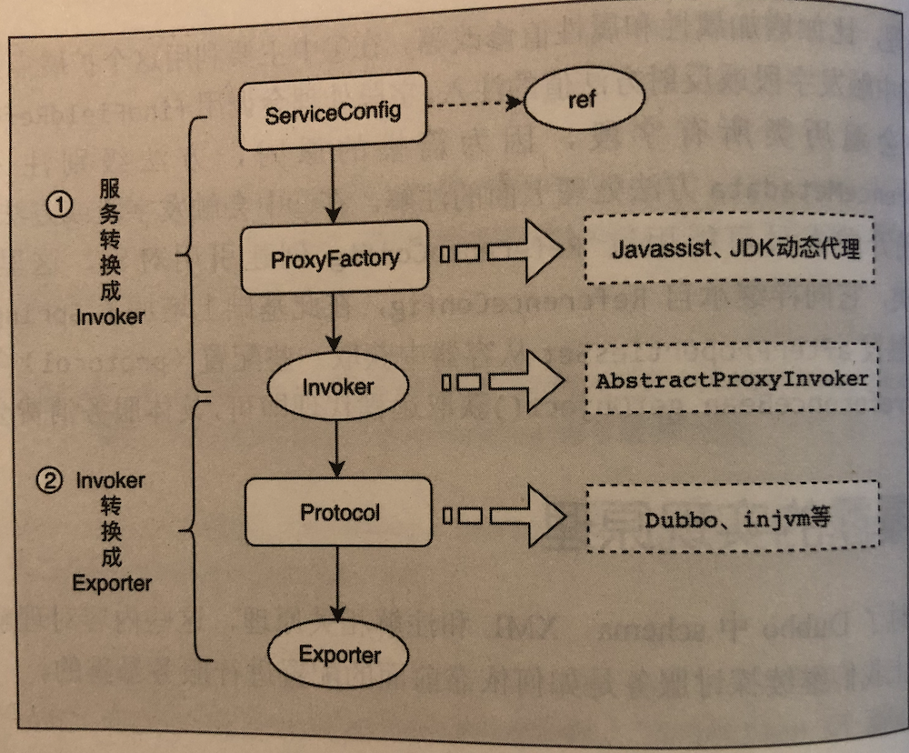

主要有两大步

1. 通过代理，将配置解析阶段生成的服务实例转化为Invoker
   - 构造服务URL
   - 执行监控数据上报（可选）
   - 通过动态代理的方式(JavassistProxyFactory和JdkProxyFactory)生成Invoker对象
2. 把Invoker通过具体的协议（Dubbo, REST）转化成Exporter
   - 委托具体协议进行服务暴露，创建NettyServer监听端口和保存服务实例
   - 创建注册中心对象，与注册中心创建TCP连接
   - 注册服务元数据到注册中心
   - 订阅configurators节点，监听服务动态属性变更事件
   - 服务销毁收尾工作，比如关闭端口，反注册服务信息等。

**本地服务暴露**

Dubbo默认把远程暴露的服务用injvm协议在本地再暴露一份，这样消费方直接消费同一个JVM内部的服务，避免了跨网络远程通信。

### 服务消费

**单注册中心消费原理**

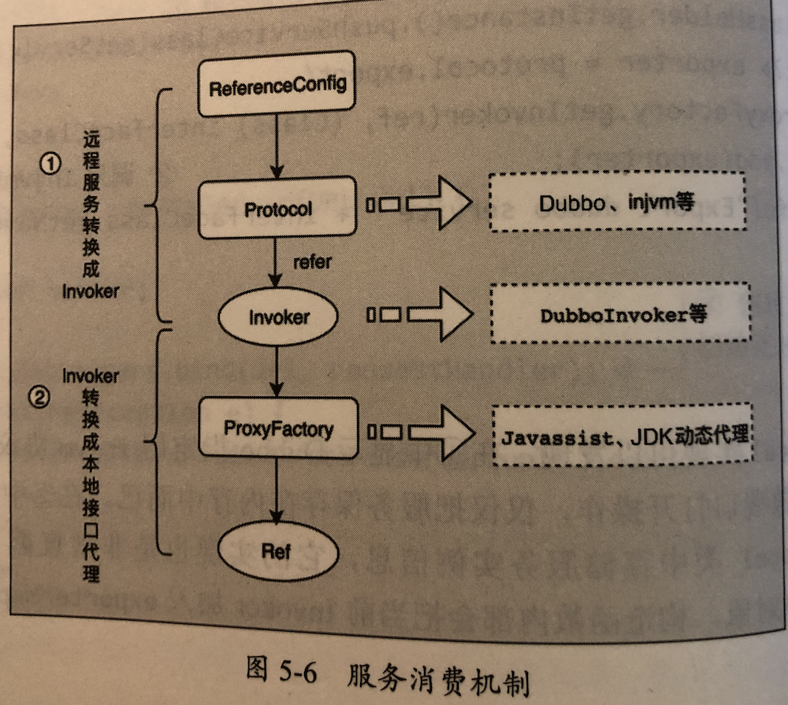

主要有两个步骤：

1. 通过持有远程服务实例生成Invoker，该Invoker在客户端是核心的远程代理对象。
   - 通过injvmProtocol判断服务是否是一个JVM内部服务。
   - 如果是单注册中心，通过referprotocol.refer(interfaceClass, 注册中心url)获取invoker
   - 如果是多注册中心，通过referprotocol.refer获取多个invoker，每个注册中心对应一个Invoker，将所有的invoker保存在一个Diretory中，通过Cluster合并成一个invoker
   - 在referprotocol.refer中，向注册中心订阅服务提供者，路由和动态配置信息。注册消费者信息到注册中心。
   - 当获取providers信息时触发回调，生成Invoker对象。
2. 将Invoker通过动态代理转换成实现用户接口的动态代理引用
   - 使用JDKproxy将invoker对象转换成接口代理。

### 优雅停机解析

Dubbo优雅停机主要包括六个步骤：

1. 收到kill 9进程退出信号，Spring容器会触发容器销毁事件。
2. provider端会取消注册服务元数据信息。
3. consumer会收到最新地址列表（不包含准备停机的地址）
4. Dubbo协议会发送readonly事件报文通知consumer服务不可用。
5. 服务端等待已经执行的任务结束，并拒绝新的请求。

## Dubbo 远程调用

### 核心调用流程

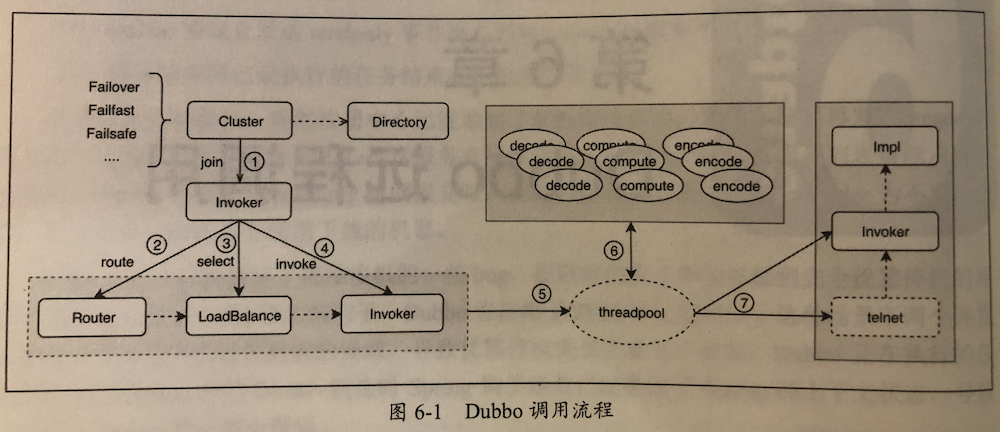

1. 客户端在启动时从注册中心拉取订阅服务列表，Cluster将服务列表信息聚合为一个Invoker
2. 触发路由操作，得到一批服务列表传递给负载均衡。
3. 负载均衡挑出一台机器
4. 进行RPC调用
5. 将请求提交到线程池（线程池分为I/O线程池和业务线程池）
6. 处理读写、序列化和反序列化。

### 协议详解

Dubbo协议

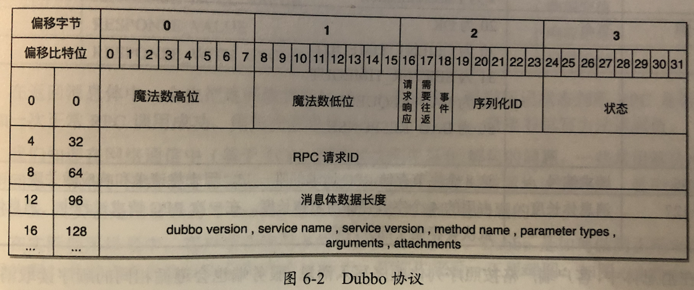


Dubbo协议字段解析

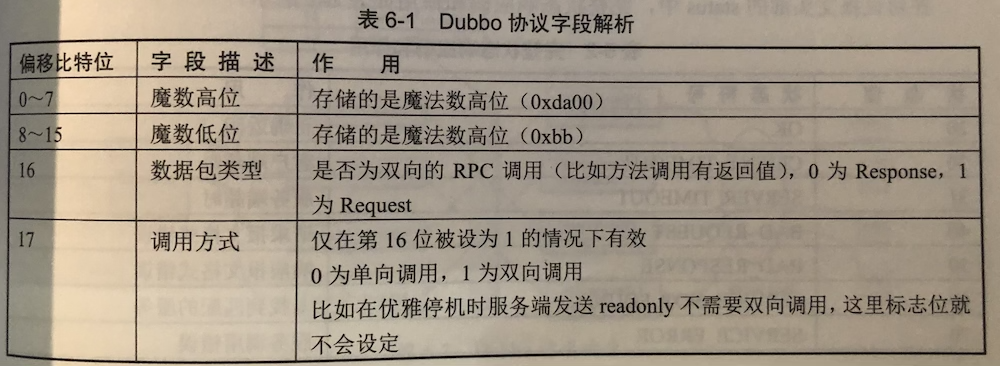

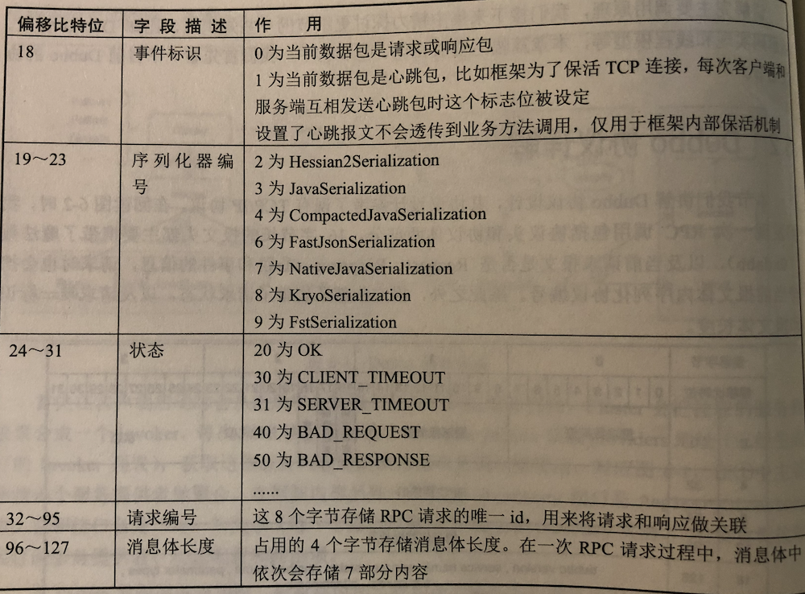

魔法数0xdabb用来处理TCP的网络粘包/拆包问题。

全局请求id标识用来将response和request一一对应，这样客户端就可以使用多线程并发调用服务。

### 编解码器原理

 

### Dubbo线程模型

Dubbo内部使用大量Handler组成类似链表，依次处理具体逻辑，比如编解码，心跳时间戳和方法调用Handler等。Dubbo会将多个handler聚合为一个以减少开销。


Dubbo提供了大量的Handler去承载特性和扩展，常用Handler如下

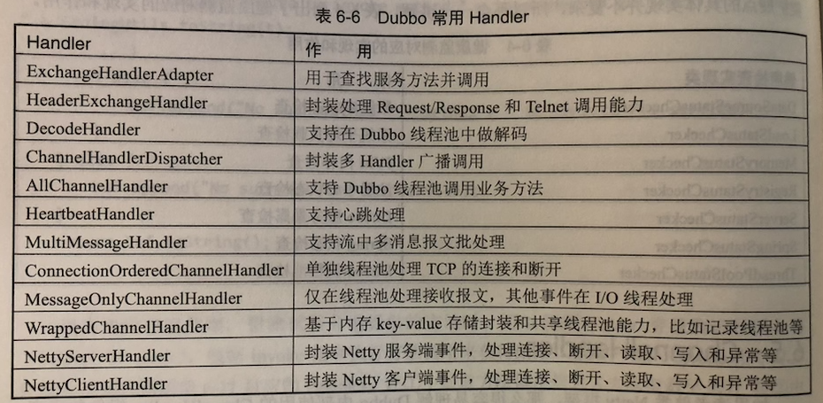


**ExchangeHandlerAdapter**：

1. 获取服务暴露协议的端口
2. 获取调用传递的接口
3. 根据端口、接口名、接口分组、接口版本构造唯一的serviceKey
4. 根据serviceKey从HashMap中获取Exporter，从Exporter中获取Invoker


Dubbo提供了一套可定制的线程模型来适应不同的场景。具体业务方需要根据使用场景启动不同的策略。


**HeaderExchangeHandler**

Dubbo中，所有的方法调用会被抽象为Request/Response，然后交给HeaderExchangeHandler处理：

1. 更新时间时间戳，在Dubbo心跳处理中会使用
2. 处理readonly事件，用于Dubbo优雅停机
3. 如果收到的是Request，处理方法调用并返回给客户端。其中会先判断请求报文是否正确，不正确则将具体异常包装成字符串并返回，防止后续序列化错误。
4. 如果收到的是Response，告知业务调用方。


**Dubbo心跳Handler**

Dubbo默认客户端和服务端都会发送心跳报文来维持TCP长连接状态。服务端发现客户端超时则关闭客户端连接，客户端发现服务端超时则重新连接。默认心跳时间是60s。


## Dubbo集群容错

Cluster是Dubbo的集群容错层，该层中包含了Cluster，Directory，Router，LoadBalance几大核心接口。Cluster接口是容错接口，提供Failover、Failfast等容错策略。

### 容错机制

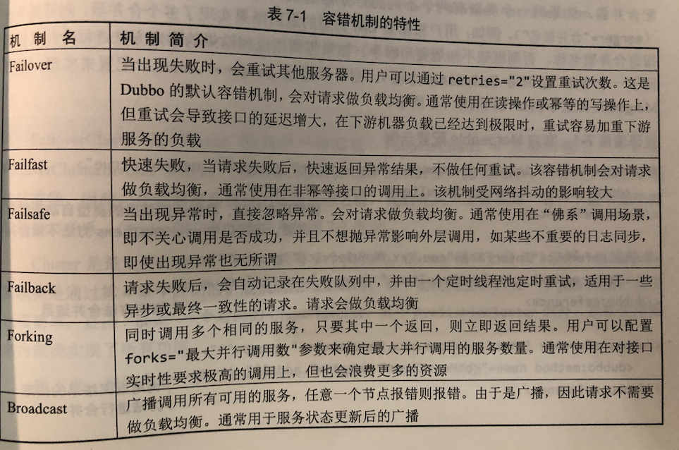


用户可在\<dubbo:service>、\<dubbo:reference>、\<dubbo:provider>标签上通过cluster属性设置。

- **Faileover策略**

  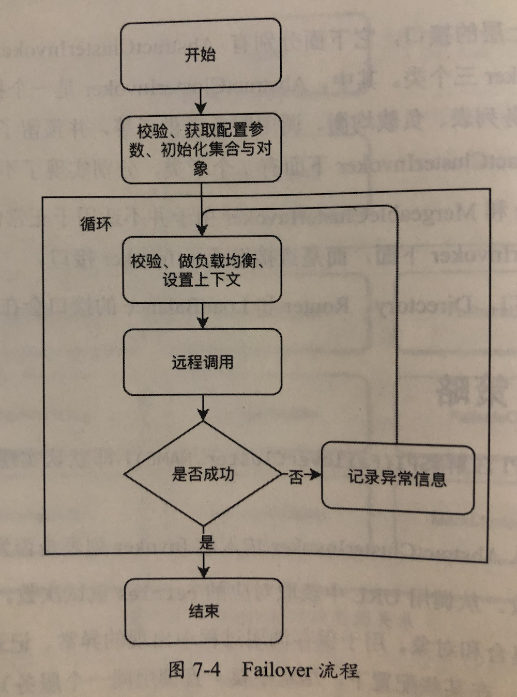

- **Failfast策略**

  Failfast在失败后直接抛出异常并返回

  1. 校验传入的Invoker列表是否为空
  2. 负载均衡
  3. 远程调用，在try代码块中调用invoker#invoker做远程调用，如果捕获异常则直接封装成RpcException抛出。

- **Failsafe策略**

  前面的步骤和Failfast策略完全一样，不同之处在try代码中，catch到任何异常都直接吞掉，返回空的结果。

- **Failback策略**

  和Failover的区别是会一直重试直到成功。

  1. 检验传入参数
  2. 负载均衡
  3. 远程调用，在try代码中调用invoker#invoker，catch到异常后，将invocation保存到重试的map中，并返回空结果集。
  4. 定时线程池会定时把map中的失败请求拿出来重新请求，请求成功则从map中移除。

- **Available策略**

  遍历Invoker列表，如果Invoker是可用的则直接调用并返回，如果遍历整个列表都没找到可用的，则抛出异常。

- **Broadcast策略**

  遍历所有Invoker，直接做RPC调用，任何一个节点调用出错，并不中断广播过程，会先记录异常最后广播完成再抛出。

- **Forking策略**

  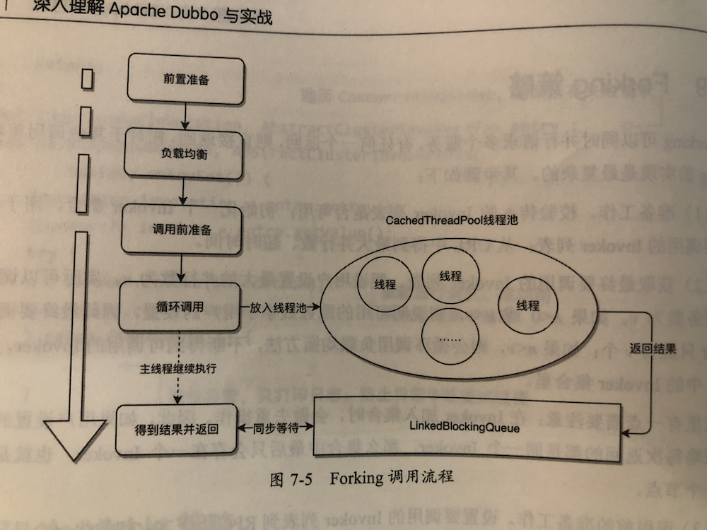

  主线程循环调用Invoker列表，提交到线程池中进行实际调用，返回结果将加入阻塞队列中，然后主线程通过poll方法阻塞等待第一个返回的结果，如果是正常的，则返回结果。如果是异常（只有当所有调用都失败才可能是异常，因为请求异常时会判断失败数是否等于任务总数，是才会将异常加入阻塞队列），Forking才会失败。

### Directory实现

整个容错过程会先调用Directory#list来获取所有的Invoker列表，Directory有两种实现

- RegistryDirectory，动态从注册中心获取Invocker列表
- StaticDirectory，用户自己设置的Invocker列表


### 路由实现

路由分为：

- 条件路由：用户使用Dubbo定义的语法规则去写路由规则
- 文件路由：用户将路由规则写在文件中，由Dubbo读取。
- 脚本路由：使用JDK自身的脚本引擎解析路由规则脚本，默认是JavaScript。


**条件路由参数规则**

条件路由使用condition://协议，URL形式是

```
condition://0.0.0.0/com.foo.BarService?category=router&dynamic=false&rule= + URL.encode("host=10.20.153.10=>host=10.20.153.11")
```

最后的路由规则会用URL.encode进行编码。

参数说明：


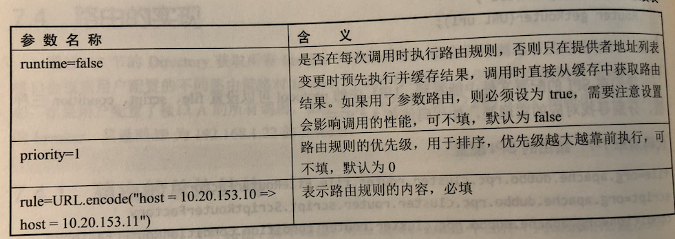


**文件路由实现**

将自定义的脚本规则写在文件中，脚本语言可以是JS，Groovy等。URL中对应的key值填写文件的路径。文件路由先把文件中的路由脚本读出来，然后去匹配对应的脚本路由做解析。

**脚本路由的实现**

脚本路由使用JDK自带的脚本解析器解析并运行，默认使用JS解析器。在脚本中实现一个route方法，输入是invokers列表，输出是过滤后的invokers列表。

### 负载均衡

Dubbo自带四种负载均衡算法，用户可通过SPI进行自行扩展

**Random负载均衡**

按照权重设置随机概率做负载均衡。

1. 遍历所有Invoker计算权重总和，并判断每个Invoker的权重是否一样，如果相同，直接nextInt随机选一个。
2. 如果权重不同，nextInt(权重总和)得到一个偏移量，根据偏移量找到对应的Invoker。


**带权RoundRobin负载均衡**

根据设置的Invoker权重来判断轮询的比例，让能力强的Invoker接受更多请求。但是普通带权轮询很容易让一个节点流量暴增，因此引入了平滑轮询算法。

1. 每次请求负载均衡时，遍历所有可用节点，对于每个Invoker，它的current=current+weight。计算所有Invoker的weight为totalWeight。
2. 遍历结束，current最大的节点就是本次要选择的节点。然后让该节点的current=current - totalWeight。


**LeastActive负载均衡**

框架会记下每个Invoker的活跃数，每次从活跃数最小的Invoker里选一个节点。

1. 进来一个请求该Invoker的活跃计数器+1，完成一个请求计数器-1。
2. 根据活跃数，结合Random负载均衡算法随机选出一个Invoker。


**一致性Hash**

用TreeMap实现。


## Dubbo高级特性

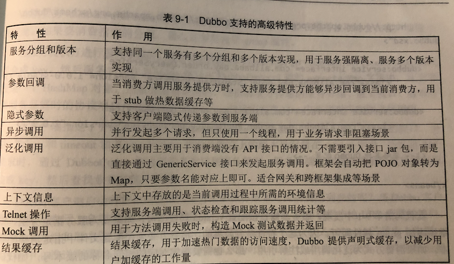

### 服务分组和版本

服务暴露：

```
<dubbo:service interface="" version="1.0.0" group="g1"/>
<dubbo:service interface="" version="2.0.0" group="g2"/>
```

服务消费：

```
<dubbo:reference interface="" version="1.0.0" group="g1"/>
<dubbo:reference interface="" version="2.0.0" group="g2"/>
```

### 参数回调

Dubbo支持异步参数回调，当消费方调用服务端方法时，允许服务端在某个时间点回调客户端的方法。在服务端回调客户端时，会复用已经建立的从客户端到服务端的TCP连接。

### 隐式参数

客户端调用RpcContext#setAttachment设置隐式参数，服务端调用RpcContext#getAttachment获取隐式参数

### 异步调用


客户端异步调用示例

```java
fooService.findFoo(fooId); // 触发异步调用
Future<Foo> fooFuture = RpcContext.getContext().getFuture(); //在发起其他异步RPC之前，先将之前的future对象取出保存，否则会被之后生成的future对象覆盖。
Foo foo = fooFuture.get();
```

### 泛化调用

客户端可以不依赖服务接口API包发起远程调用。适合框架集成和网关类应用开发。

### 上下文信息

通过RpcContext#getContext获取上下文信息，如远程客户端IP，当前服务配置信息。

### Mock调用

Dubbo提供的容错能力，通常用于服务降级。使用示例

```
<dubbo:reference mock="true" />
<dubbo:reference mock="com.foo.BarServiceMock"/>
<dubbo:reference mock="return null"/>
<dubbo:reference mock="throw XXXException"/>
<dubbo:reference mock="return null"/>
```

### 结果缓存

Dubbo提供对服务调用结果的缓存，将请求URL作为Key。

```
<dubbo:reference cache="lru" .../>
```


## Dubbo过滤器


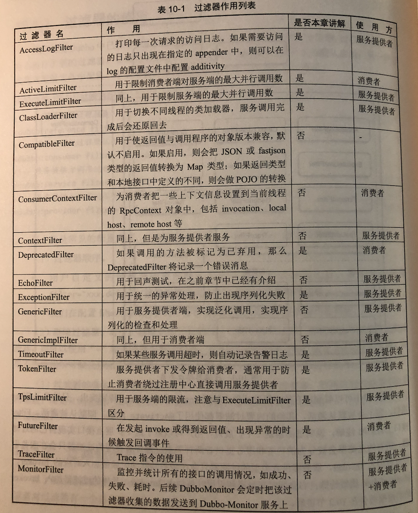


**过滤器链初始化实现原理**

使用装饰器模式将所有过滤器一个接一个地套在Invoker上。


**ClassLoaderFilter**

作用：改变当前运行线程的上下文类加载器，变为Invoker接口的类加载器。调用完成之后又还原回去。

原因：JVM类加载机制，和双亲委派模型。