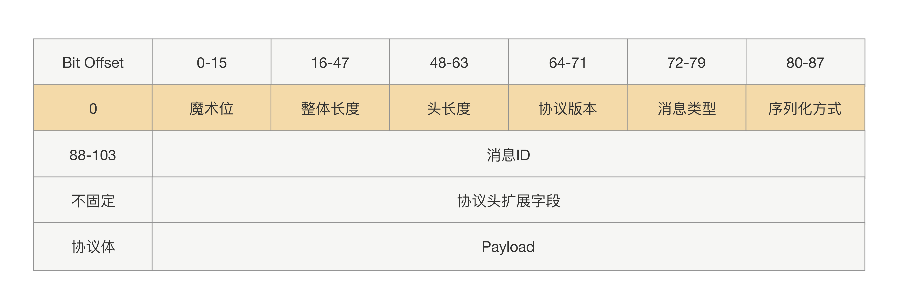
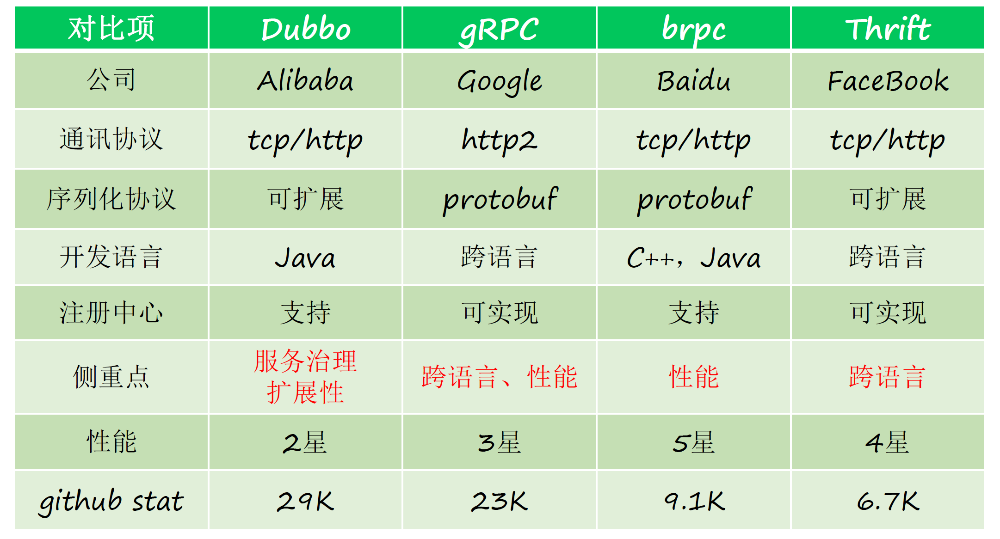

## RPC框架基础功能

### 协议

为什么不使用HTTP协议，而要实现私有的RPC协议？

1. HTTP协议体积大，存在无用信息。
2. HTTP协议是一个请求对应一个返回结果，因此无法一次发出多个请求，而私有RPC协议可以一次网络传输中发送多个请求，并一次接收多个返回结果，从而增大了吞吐量。

设计一个可扩展PRC协议



### 网络通信

RPC框架有高并发性能需求，通常采用多路I/O复用网络模型，具体实现例如Netty。

Netty 零拷贝

- 使用CompositeByteBuf、slice、wrap 操作来复用ByteBuf，实现零拷贝。
- Netty 的 ByteBuffer 可以采用 Direct Buffers，使用堆外直接内存进行 Socket 的读写操作，从而实现了内核态与用户态内存的零拷贝。

### 序列化/反序列化

RPC框架为什么不使用JSON作为序列化协议？

- JSON进行序列化的空间开销比较大
- JSON没有类型，对于JAVA这类强类型语言来说，需要利用反射来解决，性能不会太好。

选择序列化协议需要考虑的因素？


### 客户端代理类实现

利用Java动态代理技术，代理服务提供方接口，内部实现RPC调用逻辑，对调用方屏蔽RPC调用细节。

```java
public class RpcClientProxy implements InvocationHandler {
    /**
     * 用于发送请求给服务端，对应socket和netty两种实现方式
     */
    private final ClientTransport clientTransport;

    public RpcClientProxy(ClientTransport clientTransport) {
        this.clientTransport = clientTransport;
    }

    /**
     * 通过 Proxy.newProxyInstance() 方法获取某个类的代理对象
     */
    @SuppressWarnings("unchecked")
    public <T> T getProxy(Class<T> clazz) {
        return (T) Proxy.newProxyInstance(clazz.getClassLoader(), new Class<?>[]{clazz}, this);
    }

    /**
     * 当你使用代理对象调用方法的时候实际会调用到这个方法。代理对象就是你通过上面的 getProxy 方法获取到的对象。
     */
    @SneakyThrows
    @SuppressWarnings("unchecked")
    @Override
    public Object invoke(Object proxy, Method method, Object[] args) {
        log.info("invoked method: [{}]", method.getName());
        RpcRequest rpcRequest = RpcRequest.builder().methodName(method.getName())
                .parameters(args)
                .interfaceName(method.getDeclaringClass().getName())
                .paramTypes(method.getParameterTypes())
                .requestId(UUID.randomUUID().toString())
                .build();
        RpcResponse rpcResponse = null;
        if (clientTransport instanceof NettyClientTransport) {
            CompletableFuture<RpcResponse> completableFuture = (CompletableFuture<RpcResponse>) clientTransport.sendRpcRequest(rpcRequest);
            rpcResponse = completableFuture.get();
        }
        if (clientTransport instanceof SocketRpcClient) {
            rpcResponse = (RpcResponse) clientTransport.sendRpcRequest(rpcRequest);
        }
        //校验 RpcResponse 和 RpcRequest
        RpcMessageChecker.check(rpcResponse, rpcRequest);
        return rpcResponse.getData();
    }
}
```

如果不用动态代理，怎么实现RPC调用？

1：使用静态代理实现
2：远程调度的代码和业务处理逻辑写在一块，序列化、编码、网络建连、网络传输、网络断连、以及负载均衡、失败重试等等都需要写出来

## RPC框架客户端核心功能

### 连接管理

保持与服务提供方长连接，用于传输请求数据也返回结果

#### 初始化时机

#### 连接数维护

#### 心跳/重连

### 服务发现

业务量不大的时候，使用ZooKeeper即可。业务量大时，ZooKeeper读写压力剧增，由于其强一致性，性能下降严重，因此在大规模RPC集群中，不宜使用其作为服务注册中心。

在业务量大时，服务注册中心应该满足AP，而不是CP，由此可以提升读写性能。可以采用消息总线的机制实现。

### 负载均衡

RPC的负载均衡和Web负载均衡的差别在于，RPC是自身实现的LB，不依赖外部的负载均衡器，服务调用者是主动选择服务节点，发起调用。

以 Dubbo 为例，常用的负载均衡方法有：
1.基于权重随机算法
2.基于最少活跃调用数算法
3.基于 hash 一致性
4.基于加权轮询算法

设计一个动态负载均衡方法？

搜集服务提供节点的硬件参数，以及请求响应耗时（TP99），节点服务状况（健康，亚健康），计算出一个权重值赋予每个服务节点，配合随机权重的负载均衡算法，实现动态LB。

### 路由策略

RPC中的路由策略也就是从服务提供方集群中，选择调用其中一个服务节点的策略。

为什么需要？

灰度发布，黑白名单等功能的实现依赖于路由策略。

实现方式：

将路由策略配置在注册中心，服务调用方在获取服务提供方节点信息时，也同步路由策略。在路由策略中，根据发送请求的参数，选择调用不同的服务节点。

### 超时处理

调用端发起的请求失败时，如果配置了异常重试策略，RPC 框架会捕捉异常，对异常进行判定，符合条件则进行重试，重新发送请求。要注意以下几点：

- 设置合理的重试次数
- 每次重试时应当将超时计时器置零，保证在合理的时间内进行重试
- 请求必须是幂等的
- 通过白名单的形式配置需要重试的异常种类

### 健康检查

作为服务调用方，需要一套健康检查机制来实时感知服务提供方的健康状态。

具体解决方案：

1. TCP连接层面的心跳检测机制，设定一个失败阈值，例如连续失败超过3次，认定为非健康状态。

   问题：

   - 有可能服务提供方调用量实在太大，心跳响应缓慢导致失败，但是业务依然能得到响应，因此仅从心跳检测维度是不够的。
   - 阈值的设定不确定。

2. 从业务调用可用率维度来判断。可用率=一个窗口期内接口调用成功次数的百分比(成功次数/总次数)

### 业务分组

业务分组是以资源隔离的方式，防止某个服务调用方请求暴增，影响其他调用方的正常调用。

每个调用方有自己的分组，向注册中心拉取服务节点信息时，根据分组返回部分服务节点（而不是全部节点）。因此当某个调用方请求突增时，仅对自己分组的服务提供节点造成压力，而不会影响到所有服务提供节点。

为了保证高可用，可以设定每个调用方的主副分组，同时拉取主副两个分组的服务节点，但是只有当主节点都不可用时，才允许调用副分组中的服务节点。

## RPC框架服务端核心功能

### 队列/线程池

### 超时丢弃

快速失败已经超时的请求，缓解队列堆积。

对于每个入队的处理请求，记录其判定为超时的时间点，工作线程在处理每个请求之前，先判定该请求是否超时，如果是则要丢弃，因为请求方已经判定此请求超时，再做已经无意义，还影响后续的请求。

### 优雅启动

应用刚启动时，性能达不到最佳状态，容易大面积超时，因此在到达最佳服务性能之前，要减少被调用的频率或者不被调用。有以下两种思路：

- 服务提供节点向注册中心注册时，记录其注册时间，调用方根据此时间，降低那些刚启动不久的节点的权重值。

- 延迟暴露。在应用启动之后，执行Hook预热程序，再向注册中心注册自己。

  

当大批量重启时，刚启动的节点请求量较少，导致未重启的节点压力增大，可能引发超时，如何处理？

分批次重启

### 优雅关闭

服务提供方下线时，需要妥善处理正在处理的请求，拒绝新来的请求，通知注册中心自己即将下线。

- 对于新来的请求，返回响应告知调用方自己是要下线还是重启，如果是下线调用方不再调用此节点，如果是重启，调用方会启用后台线程轮训服务提供方是否重启完成。
- 如果是下线操作，则主动向注册中心下线自己。
- 设定一个超时时长，在此时间内继续处理已接收请求。

实现方式：

通过监听关闭信号，触发操作流程。

### 过载保护

服务端：采用限流的方式

- 在配置中心向各个节点下发限流配置
- 设立一个专门的限流服务，所有的服务都依赖这个限流服务进行整体的限流

客户端：

- 熔断机制，访问某个服务失败达到一定次数时，触发熔断器开启，不再调用此服务。同时每隔一段时间就允许尝试一次请求，如果请求成功，则关闭熔断器。
- 降级，优先保障核心功能，返回缓存数据。

## 主流RPC框架对比



