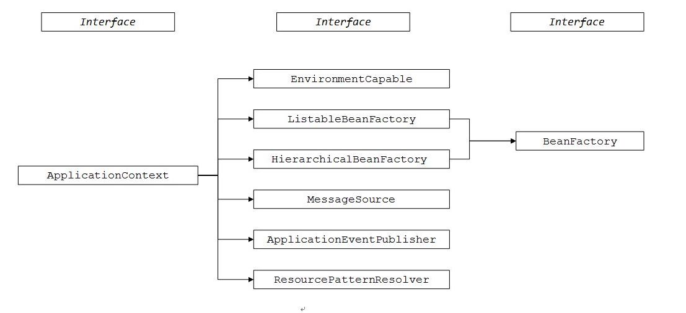
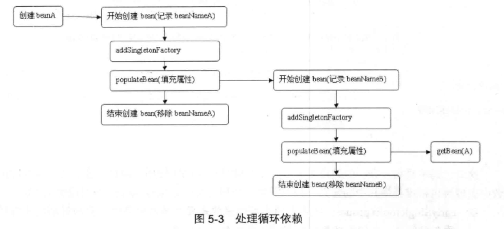
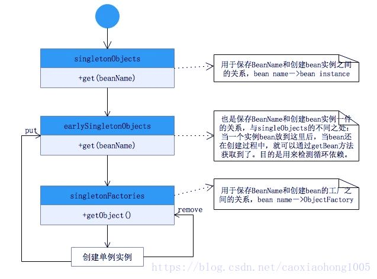

## Spring Framework总览

### 什么是Spring Framework?

Spring是一个企业级JAVA应用开发框架，提供非常全面的基础设施，让开发人员更好的专注于业务开发。

### Spring Framework有哪些核心模块？

spring-core：Spring基础API模块，如资源管理，泛型处理

spring-beans：Spring Bean相关，如依赖注入，依赖查找

spring-aop：如动态代理，AOP字节码提升

spring-context：事件驱动，i18N，注解驱动，模块驱动等

spring-expression：Spring表达式语言模块

### Spring Framework有什么优势和不足？

// **FIX**

优势：

- **DI**
- **面向切面编程(AOP)**
- **集成主流框架**
- **模块化**
- **便捷的测试**
- **事务管理**
- **Web 框架**

不足：开发人员不理解底层原理，出了问题不易调试。

## 反转控制IoC

###什么是IoC？

IoC是反转控制，主要实现有依赖注入和依赖查找。

### 什么是Spring IoC容器

是spring对于IoC的具体实现，也是依赖注入的实现方式。

### Spring 中有多少种 IoC 容器？

Spring 提供了两种IoC 容器，分别是 BeanFactory、ApplicationContext 。

- **BeanFactory**

  BeanFactory 在 `spring-beans` 项目提供。

- **ApplicationContext**

  ApplicationContext 在 `spring-context` 项目提供。

  ApplicationContext 接口扩展了 BeanFactory 接口，它在 BeanFactory 基础上提供了一些额外的功能。

  如下：

  - EnvironmentCapable：系统属性，环境变量初始化及验证。
  - HierarchicalBeanFactory：载入多个有继承关系的上下文

  - MessageSource ：国际化支持。

  - ApplicationEventPublisher：事件机制。

  - ResourcePatternResolver：资源访问，如URL和文件。

  - Lifecycle管理，ApplicationContext在启动和结束时会调用所有实现了Lifecycle接口的bean的start和stop方法。

  - 自动BeanPostProcessor注册

  - 在启动的时候将所有非延迟单例bean进行实例化。

    

### 依赖查找和依赖注入的区别？

依赖查找是一种主动或手动的依赖获取方式，通常需要容器的标准API实现。依赖注入是一种自动获取依赖的方式，无需依赖特定容器和API。

### Spring作为IoC容器的优势？

1. 提供依赖查找和依赖注入两种IoC实现
2. AOP抽象
3. 事务抽象
4. 事件机制
5. 强大的第三方整合
6. 易测试性

### BeanFactory和FactoryBean区别？

BeanFactory是IoC底层容器。

FactoryBean是创建Bean的一种方式，帮助实现复杂的初始化逻辑，通过getBean()去查找FactoryBean不是得到该FactoryBean本身，而是调用其getObject()返回的对象（该对象也会被缓存起来）。如果确实想要FactoryBean本身，在beanName前加上&。

### Spring IoC容器启动时做了哪些准备？

// **FIX**

IoC配置元信息读取与解析，IoC容器生命周期，Spring事件发布，国际化等

### 什么是Spring BeanDefinition？

用来定义Spring Bean，包含了Bean元信息（scope, role, parent, classname, lazy）。

### ObjectFactory和BeanFactory的区别？

ObjectFactory和BeanFactory均提供依赖查找的能力。ObjectFactory仅关注一个或一种类型的Bean依赖查找，并且自身不具备依赖查找的能力，能力由BeanFactory输出。BeanFactory则提供了单一类型，集合类型以及层次性等多种依赖查找。

### BeanFactory.getBean操作是否线程安全？

是线程安全的，操作过程会增加互斥锁。

### Spring依赖查找与注入在来源上的区别？

依赖查找使用getBean的方式获取依赖，来源包括BeanDefinition以及单例对象，依赖注入使用ResolverDependency来获取依赖，来源包括BeanDefinition、单例对象、Resolvable Dependency（BeanFactory, ResourceLoader, ApplicationEventPublisher, ApplicationContext）以及@Value所标注的外部化配置。

### 有多少种依赖注入的方式?

- 构造器注入，用于少依赖，强制依赖场景
- Setter注入，用于多依赖，非强制依赖场景
- 字段注入，开发比较便利
- 方法注入，通常用来做Bean的声明
- 接口回调注入

### 偏好构造器注入还是Setter注入？

两种依赖注入方式均可使用，如果是必须依赖，推荐使用构造器注入，Setter注入用于可选依赖。

### 单例对象能在IoC容器启动后注册吗？

可以的，BeanDefinition会被BeanFactory#freezeConfiguration()方法影响，从而冻结注册，单例对象则没有这个限制。 

### 请介绍下常用的 BeanFactory 容器和ApplicationContext 容器？

BeanFactory 最常用的是 XmlBeanFactory 。它可以根据 XML 文件中定义的内容，创建相应的 Bean。

以下是三种较常见的 ApplicationContext 实现方式：

- 1、ClassPathXmlApplicationContext ：从 ClassPath 的 XML 配置文件中读取上下文，并生成上下文定义。应用程序上下文从程序环境变量中取得。示例代码如下：

  ```
  ApplicationContext context = new ClassPathXmlApplicationContext(“bean.xml”);
  ```

- 2、FileSystemXmlApplicationContext ：由文件系统中的XML配置文件读取上下文。示例代码如下：

  ```
  ApplicationContext context = new FileSystemXmlApplicationContext(“bean.xml”);
  ```

- 3、XmlWebApplicationContext ：由 Web 应用的XML文件读取上下文。例如我们在 Spring MVC 使用的情况。

### 列举一些 IoC 的一些好处？

- 它将最小化应用程序中的代码量。
- 它以最小的影响和最少的侵入机制促进松耦合。
- 它支持即时的实例化和延迟加载 Bean 对象。

### 简述 Spring IoC 的实现机制？

1. 低级容器 加载配置文件，并解析成 BeanDefinition 到低级容器中。
2. 加载成功后，高级容器启动高级功能，例如接口回调，监听器，自动实例化单例，发布事件等等功能。

## Spring Bean

### 如何注册一个Spring Bean？

通过BeanDefinition和外部单体对象来注册。

### Spring 容器怎样管理注册Bean?

// **FIX**

IoC配置元信息读取和解析、依赖查找和注入以及Bean生命周期等。

### Spring 内建Bean作用域有几种？

singleton, prototype, request, session, application

### Singleton Bean是否在一个应用中是唯一的？

否，singleton仅在当前SpringIoC容器中是单例对象。

### application Bean是否被其他方案替代？

可以的，application Bean与singleton Bean没有本质区别。

### Spring Bean 怎么解决循环依赖的问题？

- Spring 在创建 bean 的时候并不是等它完全完成，而是在创建过程中将创建中的 bean 的 ObjectFactory 提前曝光（即加入到 `singletonFactories` 缓存中）。
- 这样，一旦下一个 bean 创建的时候需要依赖之前的bean ，则直接使用提前曝光的该bean的ObjectFactory 的 `#getObject()` 方法来获取。



**getSingleton()过程图**



**Spring只处理单例模式的循环依赖，无法处理原型模式的循环依赖，原因：对于原型模式，spring不缓存原型模式的bean，无法做到提前曝光bean。**

**Spring无法处理构造器循环依赖（可以处理setter循环依赖），原因如下：如果在构造函数注入阶段(createBeanInstance执行阶段)发生循环依赖，由于没有执行到addSingletonFactory，依赖的Bean无法提前曝光，因此无法解决循环依赖，只能抛出异常**

```java
// bean对象实例创建的核心实现方法
protected Object doCreateBean(final String beanName, final RootBeanDefinition mbd, final @Nullable Object[] args)
		throws BeanCreationException {
		// 省略其他代码
	
		// 1. 调用构造函数创建该bean对象，若不存在构造函数注入，顺利通过
		instanceWrapper = createBeanInstance(beanName, mbd, args);
	

		// 2. 在singletonFactories缓存中，放入该bean对象，以便解决循环依赖问题
		addSingletonFactory(beanName, () -> getEarlyBeanReference(beanName, mbd, bean));
	

		// 3. populateBean方法：bean对象的属性赋值
		populateBean(beanName, mbd, instanceWrapper);

		
		// 省略其他代码
	return exposedObject;
}
```


### Spring Bean 在容器的生命周期是什么样的？

- Bean容器启动阶段读取bean的元配置信息，转换为BeanDefinition对象，并注册到beanFactory中，保存在一个concurrentHashMap中。

- 实例化 Bean 对象
  - 使用依赖注入填充所有属性
  - Aware 相关的属性，注入到 Bean 对象
  - 调用相应的方法（BeanPostProcessor, InitializingBean#afterPropertiesSet, init），进一步初始化 Bean 对象
- 容器关闭时调用销毁方法


### BeanPostProcessor的使用场景有哪些？

BeanPostProcessor提供Spring Bean初始化前和初始化后的生命周期回调，分别对应postProcessBeforeInitialization以及postProcessAfterInitialization方法，允许对关心的Bean进行扩展，甚至是替换。 

其中ApplicationContext相关的Aware回调也是基于BeanPostProcessor实现。

### BeanFactoryPostProcessor与BeanPostProcessor的区别？

BeanFactoryPostProcessor是Spring BeanFactory的后置处理器，用于扩展BeanFactory，或通过BeanFactory进行依赖查找和依赖注入。BeanFactoryPostProcessor必须由Spring ApplicationContext执行，BeanFactory无法与其直接交互。而BeanPostProcessor则直接与BeanFactory关联，属于N对1。

### BeanFactory怎样处理Bean生命周期？

BeanFactory的默认实现为DefaultListableBeanFactory，其中Bean生命周期与方法映射如下：

- BeanDefinition注册阶段 - registerBeanDefinition
- BeanDefinition合并阶段 - getMergedBeanDefinition
- Bean实例化前阶段 - resolveBeforeInstantiation
- Bean实例化阶段 - createBeanInstance
- Bean实例化后阶段 - populateBean
- Bean属性赋值前阶段 - populateBean
- Bean属性赋值阶段  - populateBean
- Bean Aware接口回调阶段 - initializeBean
- Bean初始化前阶段 - initializeBean
- Bean初始化阶段 - initializeBean
- Bean初始化后阶段 - initializeBean
- Bean初始化完成阶段 - preInstantiateSingletons
- Bean销毁前阶段 - destroyBean
- Bean销毁阶段 - destoryBean