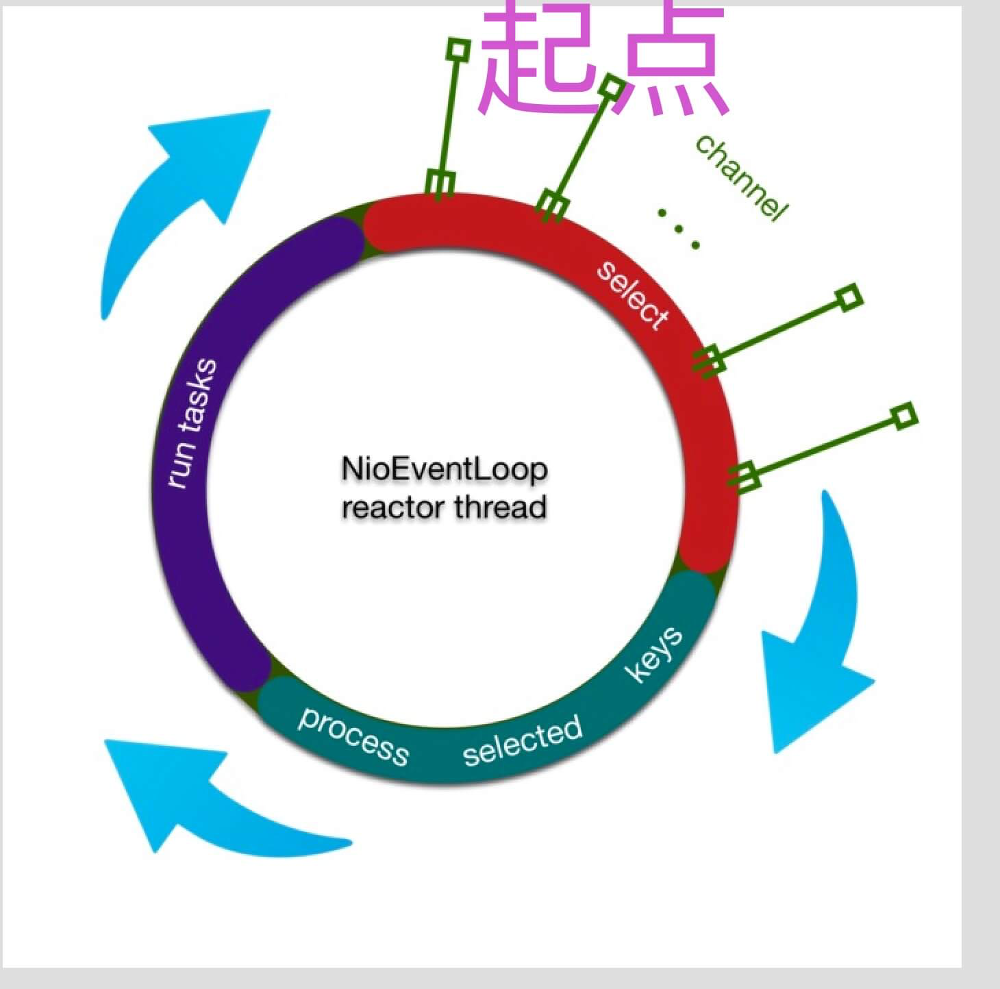

### **1. 概述**

本文我们分享 EventLoop 的**执行任务**相关代码的实现。对应如下图的紫条 **run tasks** 部分：



### 2. runAllTasks 带超时

在 `#run()` 方法中，会调用 `#runAllTasks(long timeoutNanos)` 方法，执行所有任务直到完成所有，或者超过执行时间上限。代码如下：

```java

 1: protected boolean runAllTasks(long timeoutNanos) {
 2:     // 从定时任务获得到时间的任务
 3:     fetchFromScheduledTaskQueue();
 4:     // 获得队头的任务
 5:     Runnable task = pollTask();
 6:     // 获取不到，结束执行
 7:     if (task == null) {
 8:         // 执行所有任务完成的后续方法
 9:         afterRunningAllTasks();
10:         return false;
11:     }
12: 
13:     // 计算执行任务截止时间
14:     final long deadline = ScheduledFutureTask.nanoTime() + timeoutNanos;
15:     long runTasks = 0; // 执行任务计数
16:     long lastExecutionTime;
17:     // 循环执行任务
18:     for (;;) {
19:         // 执行任务
20:         safeExecute(task);
21: 
22:         // 计数 +1
23:         runTasks ++;
24: 
25:         // 每隔 64 个任务检查一次时间，因为 nanoTime() 是相对费时的操作
26:         // 64 这个值当前是硬编码的，无法配置，可能会成为一个问题。
27:         // Check timeout every 64 tasks because nanoTime() is relatively expensive.
28:         // XXX: Hard-coded value - will make it configurable if it is really a problem.
29:         if ((runTasks & 0x3F) == 0) {
30:             // 重新获得时间
31:             lastExecutionTime = ScheduledFutureTask.nanoTime();
32:             // 超过任务截止时间，结束
33:             if (lastExecutionTime >= deadline) {
34:                 break;
35:             }
36:         }
37: 
38:         // 获得队头的任务
39:         task = pollTask();
40:         // 获取不到，结束执行
41:         if (task == null) {
42:             // 重新获得时间
43:             lastExecutionTime = ScheduledFutureTask.nanoTime();
44:             break;
45:         }
46:     }
47: 
48:     // 执行所有任务完成的后续方法
49:     afterRunningAllTasks();
50: 
51:     // 设置最后执行时间
52:     this.lastExecutionTime = lastExecutionTime;
53:     return true;
54: }
```

- 方法的返回值，表示是否执行过任务。因为，任务队列可能为空，那么就会返回 `false` ，表示没有执行过任务。
- 第 3 行：调用 `#fetchFromScheduledTaskQueue()` 方法，将定时任务队列 `scheduledTaskQueue` 到达可执行的任务，添加到任务队列 `taskQueue` 中。通过这样的方式，定时任务得以被执行。
- 第 5 行：**首次**调用 `#pollTask()` 方法，获得队头的任务。
  - 第 6 至 11 行：获取不到任务，结束执行，并返回 `false` 。
  - 第 9 行：调用 `#afterRunningAllTasks()` 方法，执行所有任务完成的**后续**方法。
- 第 14 行：计算执行任务截止时间。其中，`ScheduledFutureTask#nanoTime()` 方法，我们可以暂时理解成，获取当前的时间，单位为**纳秒**。
- 第 17 至 46 行：**循环**执行任务。
  - 第 20 行：【重要】调用 `#safeExecute(Runnable task)` 方法，执行任务。
  - 第 23 行：计算 `runTasks` **加一**。
  - 第 29 至 36 行：每隔 **64** 个任务检查一次时间，因为 `System#nanoTime()` 是**相对费时**的操作。也因此，超过执行时间上限是“**近似的**”，而不是绝对准确。
    - 第 31 行：调用 `ScheduledFutureTask#nanoTime()` 方法，获取当前的时间。
    - 第 32 至 35 行：超过执行时间上限，结束执行。
  - 第 39 行：**再次**调用 `#pollTask()` 方法，获得队头的任务。
    - 第 41 至 45 行：获取不到，结束执行。
    - 第 43 行：调用 `ScheduledFutureTask#nanoTime()` 方法，获取当前的时间，作为**最终**的 `.lastExecutionTime` ，即【第 52 行】的代码。
- 第 49 行：调用 `#afterRunningAllTasks()` 方法，执行所有任务完成的**后续**方法。
- 第 53 行：返回 `true` ，表示有执行任务。

### **3. runAllTasks**

在 `#run()` 方法中，会调用 `#runAllTasks()` 方法，执行所有任务直到完成所有。代码如下：

```java
 1: protected boolean runAllTasks() {
 2:     assert inEventLoop();
 3:     boolean fetchedAll;
 4:     boolean ranAtLeastOne = false; // 是否执行过任务
 5: 
 6:     do {
 7:         // 从定时任务获得到时间的任务
 8:         fetchedAll = fetchFromScheduledTaskQueue();
 9:         // 执行任务队列中的所有任务
10:         if (runAllTasksFrom(taskQueue)) {
11:             // 若有任务执行，则标记为 true
12:             ranAtLeastOne = true;
13:         }
14:     } while (!fetchedAll); // keep on processing until we fetched all scheduled tasks.
15: 
16:     // 如果执行过任务，则设置最后执行时间
17:     if (ranAtLeastOne) {
18:         lastExecutionTime = ScheduledFutureTask.nanoTime();
19:     }
20: 
21:     // 执行所有任务完成的后续方法
22:     afterRunningAllTasks();
23:     return ranAtLeastOne;
24: }
```

- 第 4 行：`ranAtLeastOne` ，标记是否执行过任务。

- 第 6 至 14 行：调用 `#fetchFromScheduledTaskQueue()` 方法，将定时任务队列 `scheduledTaskQueue` 到达可执行的任务，添加到任务队列 `taskQueue` 中。但是实际上，任务队列 `taskQueue` 是有队列大小上限的，因此使用 `while` 循环，直到没有到达可执行的任务为止。

  - 第 10 行：调用 `#runAllTasksFrom(taskQueue)` 方法，执行任务队列中的所有任务。代码如下：

  ```java
  protected final boolean runAllTasksFrom(Queue<Runnable> taskQueue) {
      // 获得队头的任务
      Runnable task = pollTaskFrom(taskQueue);
      // 获取不到，结束执行，返回 false
      if (task == null) {
          return false;
      }
      for (;;) {
          // 执行任务
          safeExecute(task);
          // 获得队头的任务
          task = pollTaskFrom(taskQueue);
          // 获取不到，结束执行，返回 true
          if (task == null) {
              return true;
          }
      }
  }
  ```

  + 代码比较简单，和 `#runAllTasks(long timeoutNanos))` 方法的代码，大体是相似的。
  + 第 12 行：若有任务被执行，则标记 `ranAtLeastOne` 为 `true` 。

- 第 16 至 19 行：如果执行过任务，则设置最后执行时间。

- 第 22 行：调用 `#afterRunningAllTasks()` 方法，执行所有任务完成的**后续**方法。

- 第 23 行：返回是否执行过任务。和 `#runAllTasks(long timeoutNanos))` 方法的返回是**一致**的。

### **4. pollTask**

`#pollTask()` 方法，获得**队头**的任务。代码如下：

```java
protected Runnable pollTask() {
    assert inEventLoop();
    return pollTaskFrom(taskQueue);
}

protected static Runnable pollTaskFrom(Queue<Runnable> taskQueue) {
    for (;;) { // <2>
        // 获得并移除队首元素。如果获得不到，返回 null
        Runnable task = taskQueue.poll(); // <1>
        // 忽略 WAKEUP_TASK 任务，因为是空任务
        if (task == WAKEUP_TASK) {
            continue;
        }
        return task;
    }
}
```

+ `<1>` 处，调用 `Queue#poll()` 方法，获得并移除队首元素。如果获得不到，返回 null 。**注意**，这个操作是**非阻塞**的。
+ `<2>` 处，因为获得的任务可能是 `WAKEUP_TASK` ，所以需要通过循环来跳过。

### 5. afterRunningAllTasks

`#afterRunningAllTasks()` 方法，执行所有任务完成的**后续**方法。代码如下：

```java
// SingleThreadEventLoop.java

protected void afterRunningAllTasks() {
    runAllTasksFrom(tailTasks);
}
```

- 在方法内部，会调用 `#runAllTasksFrom(tailTasks)` 方法，执行任务队列 `tailTasks` 的任务。

- **到底什么样的任务**，适合添加到 `tailTasks` 中呢？

  > 比如批量提交，如此能减少 `pipeline` 的执行次数，同时提升吞吐量。这个模式在低并发场景，并没有什么优势，而在高并发场景下对提升吞吐量有不小的性能提升。